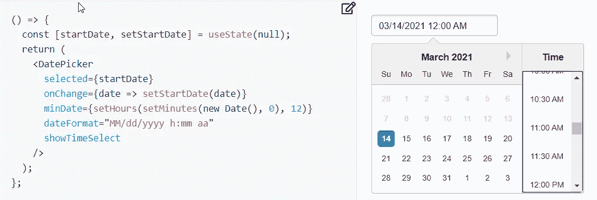
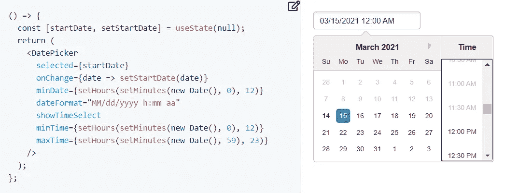

# 日期和时间选取器的最小和最大约束

> 原文：<https://javascript.plainenglish.io/minimum-and-maximum-constraints-for-date-and-time-pickers-9305f12ea745?source=collection_archive---------1----------------------->


函数式 React/JavaScript 中的一个简单练习，举例说明了日期选择器的一个常见用例。

在下文中，我将引用广泛使用的 react-datepicker 组件，尽管我要考虑的问题可以应用于任何提供类似功能的日期选择器。

# 问题是

React-datepicker 组件提供了两个属性来约束日期的选择:minDate 和 maxDate。

设置 minDate 属性时，不能选择前几天，并且禁止浏览前几个月。同样的事情发生在与 maxDate 相反的方向。

如果启用时间选取器部分并指定包含最小时间的 minDate，预期行为将是在时间选取器中也具有相同类型的约束:不应启用对 minDate 时间之前的时间的选择。

事实并非如此:仍然可以选择最小时间之前的时间。



为了约束时间的选择，该组件提供了两个附加属性:minTime 和 maxTime。他们的操作受以下规则的约束:

*   两者都必须设置为生效。例如，要禁用 08:30 AM 之前的时间选择，必须将 minTime 设置为 08:30AM，将 maxTime 设置为 11:59PM
*   指定后，无论选择哪一天，都将应用约束。因此，要正确应用它们，这两个属性必须与当前选定的日期相关。



Static constraint of time does not work because it is applied to all dates

在几种情况下，上述规则是有用的。例如，在设置会议的日期和时间时，选择的时间不能超过工作时间。

该组件提供了启用/禁用时间选择的其他可能性。它们允许实现更复杂的用例，但是下面我将只考虑一个简单的场景，在这个场景中，只有当所选日期等于 minDate 或 maxDate 时，我们才需要约束时间的选择。

# 日平等

我们需要比较两个日期(及其时间),以检查它们是否指的是同一天。

通过检索自参考日期(1970 年 1 月 1 日 00:00:00)以来经过的毫秒数，可以非常快速地检查日期是否相等:

```
date1.getTime() === date2.getTime()
```

对于天数相等，算法变得稍微复杂一些，涉及日期的三个组成部分之间的相等性测试:

```
date1.getFullYear() === date2.getFullYear()
 && date1.getMonth() === date2.getMonth()
 && date1.getDate() === date2.getDate()
```

但是，有一种更好的方法，只需要进行一次比较。

它包括计算自参考日期以来经过的天数:只需将毫秒数除以一天的毫秒数(86400000)并取发言(不是 trunc，我将在后面解释)。

有一个小的复杂问题:getTime 返回 UTC 时区中的毫秒数。要获得日期所在时区的天数，我们需要将时区偏移量(以毫秒为单位)添加到 UTC 毫秒数中。

函数 getTimezoneOffset 返回逆变换(即从日期时区到 UTC)的偏移(以分钟为单位):格林威治以东的时区的偏移为负值。
所以实际上我们要减去偏移乘以 60000。

```
const daysFromRefDate = (date) => 
  date &&
    Math.floor(
      (date.getTime() - date.getTimezoneOffset() * 60000) / 86400000
    )
```

这个相对复杂的函数能比之前的三个比较链更有效吗？确实如此，因为 JavaScript 将日期存储为毫秒，并且前面的每个 get 函数都必须执行类似的计算。
该功能在单个日期运行，可以使用 useMemo 挂钩方便地记忆。

要检查两个日期是否与同一天相关，只需比较经过的天数即可:

```
daysFromRefDate(date1) === daysFromRefDate(date2)
```

## 登月后的日子

为什么 daysFromRefDate 函数使用 floor 而不是 trunc？因为 floor 总是返回最接近的左整数:floor(-0.01) == -1，而 trunc(-0.01)= 0。
当我们处理参考日期(1/1/1970)之前的日期时，这一点很重要:对于它们，getTime 函数返回负值。
这样，函数总是给出正确的结果。

两个日期之间经过的天数始终是自参考日期以来经过的天数的差值。

```
moonLanding = new Date('July 20, 69 00:20:18 GMT+00:00')
daysSinceMoonLanding = daysFromRefDate(new Date()) -
  daysFromRefDate(moonLanding)
```

# 计算约束

在我们的使用案例中，minTime 和 maxTime 对有三种不同的设置(在这些设置中，只有日期的时间部分才有意义):

*   所选日期的日期必须等于 minDate 的日期:minTime 必须设置为 minDate 的时间，而 maxTime 必须等于 11:59 PM

```
minTime = minDate
maxTime = new Date().setHours(23, 59, 0, 0)
```

*   所选日期的日期必须等于最大日期的日期:最大时间必须设置为最大日期的时间，而最小时间必须等于上午 12:00

```
minTime = new Date().setHours(0, 0, 0, 0)
maxTime = maxDate
```

*   所选日期中介于 minDate 和 maxDate 之间的日期:minTime 和 max Time 都应设置为空。

# 撰写日期和时间选取器包装

我们拥有构建日期选取器组件的所有基础，该组件能够正确地约束最小和最大日期的时间。

# filterTime 的替代实现

reaction-date picker 组件还提供了另一种约束时间选择的方法:可以将时间筛选函数传递给该组件。

每次呈现组件时都会调用 filter 函数，因此与以前的解决方案相比效率更低，因为以前的解决方案仅在 selDate 更改时计算 selDays。

这个函数本身很有趣，因为它是一个自定义挂钩的示例:一个在内部使用 React 的挂钩的函数。