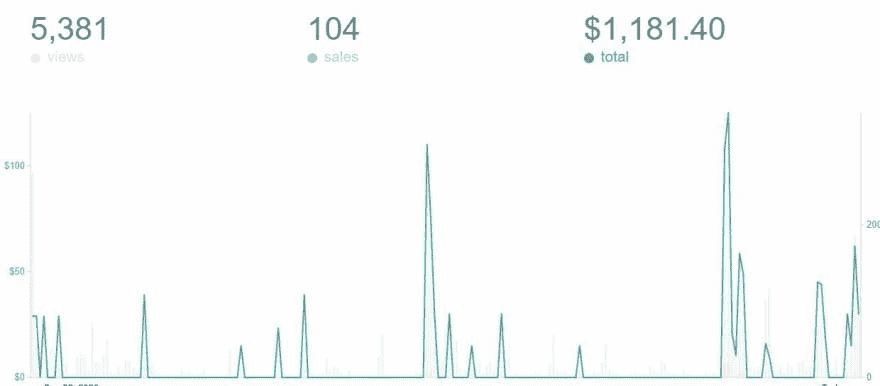

# 我作为软件工程师(开发人员)所犯的错误…

> 原文：<https://javascript.plainenglish.io/mistakes-i-made-as-a-software-engineer-developer-64fab50ba3e2?source=collection_archive---------23----------------------->

> *我作为软件工程师(开发人员)所犯的错误……*
> 
> 【pic.twitter.com/xUiF38vhlU】一根线……[T5](https://t.co/xUiF38vhlU)
> 
> *—安库尔💻🎧💪(@ TheAnkurTyagi)*[*2021 年 5 月 1 日*](https://twitter.com/TheAnkurTyagi/status/1388386562807791616?ref_src=twsrc%5Etfw)

**搞砸**没关系——这就是你学习和成长的方式。但是，一定要从过去的错误中吸取教训。

> 每个软件工程师都有自己的怪癖。

# 我认为不需要文档。

史上最大的错误。

> 为你的项目创建一个 Wiki/Confluence 页面，并写下所有内容。

例如

如果您的项目需要访问数据库，请在 Wiki 页面上写下如何设置。

当一个新的队友加入时，你会非常高兴，你会把他们指向维基页面，把所有的事情都写下来。

# 我放弃得太早了。

我们都是过早放弃的受害者——毕竟，放弃要容易得多。

但是你知道一个开发者通过实践，而不是放弃，完成了许多不可能的事情。

这让我想起了史蒂夫·乔布斯的一句名言。

> “我确信成功的企业家和不成功的企业家之间的一半区别是纯粹的毅力。”——史蒂夫·乔布斯

下次当你遇到一个真正困难的任务时，坐下来，思考，试着把挑战分成更小的部分。

# 我同意临时解决方案。

我倾向于使用这样的技巧来逃避某个特定任务的完全实现或满足截止日期。

> 记住:没有临时代码这种东西。

向应用程序中添加代码时，要考虑到它会永远留在那里。

# 我认为代码审查标准已经足够好了。

在日常的开发过程中，确定代码有多好是一个巨大的挑战。

你支持定期的代码评审吗？或者你只限于它能像预期的那样工作？

# 下次你回顾一份简历时问这些问题。

*   测试结果代码是否足够简单？
*   这段代码可以很好的垂直缩放吗？
*   为某个方法或变量取个名字简单吗？
*   需要重定义多少方法？

# 我认为复杂的算法总会产生更好的解决方案。

**如何避免这种情况:**

我只有一条建议要给你，自从我明白了现实世界和科技是如何运作的，这条建议就一直对我有用。

**开始简单。**

预先把事情复杂化没有意义。

# 我提拔了错误的人。

我假设一个开发人员擅长他们的工作，他们会成为优秀的领导者或管理者。

> 不是所有优秀的开发人员都是伟大的领导者。

管理一个团队并不容易。

成为教练或导师需要适当的训练。

无论你是发展领域的新人，还是只想变得更好。

时代在变，技术可能会过时，但你的学习应该永不停止。

唯一真正的错误是我们从中学不到任何东西的错误。

~约翰·鲍威尔

## 今天就到这里&感谢阅读。

我最近写了一本关于开发者成长的书，分享了我 11 年多的经验。

如果你真的想成为一名开发者。

只需 15 美元即可在周末获得这本书[主要指南](https://gumroad.com/l/nextgendev/grow)

加入已经购买的 100 多名开发者的行列&成长得更好。

*更多内容尽在*[plain English . io](http://plainenglish.io/)