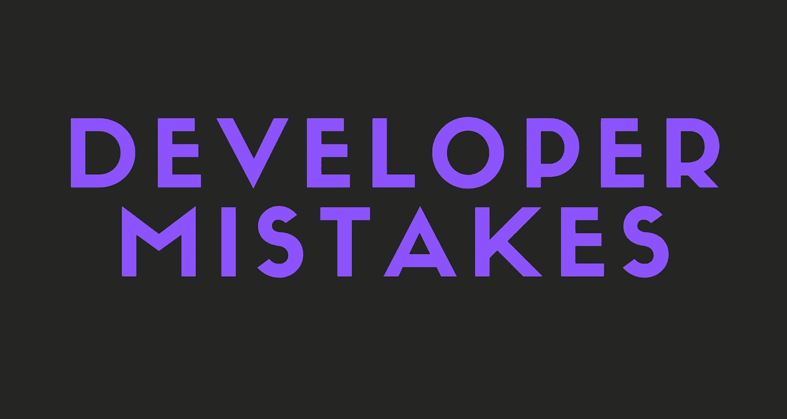

# 作为开发人员必须避免的错误

> 原文：<https://javascript.plainenglish.io/mistakes-to-avoid-as-a-developer-bab93b381286?source=collection_archive---------22----------------------->

避免它们会让你成为一个更好的开发者和普通人。

我列出了许多开发人员正在犯的一些编程错误。如果你犯了下面的任何错误，我建议你尽快停止。相信我，他们正在或将会严重影响你。

开始吧！

# 1.做你不喜欢的事情

我知道，你们有些人没有选择。但如果你这样做，停止。

不，真的，如果你继续做你不喜欢或者讨厌的事情，你可能会对编程失去兴趣。

不相信我？嗯，我知道很多程序员辞职甚至停止编程，因为他们对做自己不喜欢的事情感到厌倦和烦恼。

## 为什么我会失去兴趣？

让我们一步一步地复习一下，好吗？

所以，假设你喜欢做长生不老的工作，并且想做得更好，但是你工作的公司强迫你做 PHP 工作。

将会发生的是，你不会在 PHP 或灵丹妙药方面变得更好。因为你不喜欢你正在做的事情，也没有太多时间去做别的事情。

糟透了，对吧？是的，那会让你对编程失去兴趣。

## 我该怎么办？

别再做你不喜欢的事了。如果你是在给人打工，那就联系你的老板或者团队领导，告诉他们你不能一边做自己不喜欢的事情一边提升自己。

# 2.坚持一种技术或语言

好吧，你们很多人都理解错了。我不是说你不应该在同一件事情上花时间，不。

我想说的是，你应该学习或至少尝试其他语言和技术。

## 我为什么要学习新的语言和技术？

简单，不要过时。

是的，你没听错。作为一名开发人员，变得过时是非常糟糕的。

因为当人们使用更好、更快、更简单的技术时，你将会编写旧的代码，并且会比其他开发人员慢很多。

## 我该怎么办？

开始探索新的技术和语言，尝试它们直到你找到你喜欢的。相信我，这将会很有趣，并且会让你免于成为一个过时的程序员。

# 3.是粉丝还是有偏见

这是一个奇怪但重要的问题。我看到很多人比较 JS 框架或编程语言。

比如有一些 React 粉丝一直在 dissing Angular。请不要这样做。

也有因为有偏见而不想学一门技术的。这也是一件不好的事情。

## 为什么我应该停止成为一个粉丝或者有偏见？

## 成为粉丝

有很多理由让你不要成为粉丝或者有偏见。但在我看来，最重要的原因还是它对新开发者的作用。

假设你是一个新的开发者，试图选择一个 JS 框架。看了那么多关于 Angular 的仇恨帖，我个人是不会选的。

你猜怎么着？我就是这么做的。

初学的时候，因为看到很多视频和故事只是说很烂，所以没有学 Angular。

有一天，我决定尝试一下。现在，我很喜欢它，你一直用它来做我的大型项目。

## 有偏见

我给你讲个小故事吧。

几个月前，我对长生不老药颇有偏见。我以前觉得它被高估了，很难。

又有一天，我决定尝试一下。现在，我正在写关于它的故事，我真的和它融为一体了。

这就是为什么你不应该有偏见。想象一下，如果我早几个月学会了长生不老药。今天我会很专业。

如果你不明白我的意思，基本上我想说的是，你可能会因为你的偏见而错过你可能热爱的东西。

## 我该怎么办？

简单。别再做粉丝或偏见了。

# 最后的想法

在我看来，这些是应该避免的最重要的错误。希望这个故事对你有帮助。

这是我第一次写这样的故事，所以我很想听听你对它的看法。

# 仅此而已。感谢您阅读这个故事！

如果你喜欢这个故事，一定要为它鼓掌！你想问我什么都可以。

在 Twitter 上关注我:

 [## re _ ally 边缘

twitter.com](https://twitter.com/Re_allyedge) 

在 Patreon 上支持我:

 [## 阿里木阿尔斯兰卡亚是创造编程故事和教程。帕特里翁

### 今天就成为阿里木阿尔斯兰卡亚的赞助人:在世界上最大的…

www.patreon.com](https://www.patreon.com/allyedge) 

*更多内容看*[***plain English . io***](http://plainenglish.io/)