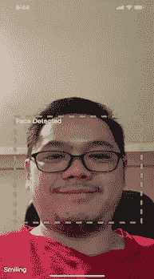

# 使用谷歌 ML 工具包的移动人脸检测

> 原文：<https://javascript.plainenglish.io/mobile-face-detection-with-google-ml-kit-6b6debf13e84?source=collection_archive---------10----------------------->



Face detector

我在本文中的目标是向您展示如何在不到 5 分钟的时间内用 Expo 和 Google ML Kit 构建一个人脸检测器移动应用程序。

Expo 是一个强大的框架，配备了大量现成的组件，允许您轻松构建跨平台移动应用程序。在本文中，我们将使用诸如 expo-camera 这样的组件来访问手机摄像头，并使用一个内置的人脸检测器模块 expo-face-detector 来从图像中检测人脸。世博人脸检测器基于 [Google ML Kit Vision API](https://cloud.google.com/vision) 。

在我们可以使用相机对象之前，我们需要导入 expo-permissions 包，并使用这一行代码访问相机权限。

```
await Permissions.askAsync(Permissions.CAMERA);
```

Expo camera 内置了人脸检测器属性，以便我们配置其属性和回调方法。

```
<Camera
  style={{ flex: 1 }}
  type={this.props.cameraType}
  onFacesDetected={this.handleFacesDetected}
  onFaceDetectionError={this.handleFaceDetectionError}
  faceDetectorSettings={{
    mode: FaceDetector.Constants.Mode.fast,
    detectLandmarks: FaceDetector.Constants.Landmarks.all,
    runClassifications: FaceDetector.Constants.Classifications.all,
  }}
  ref={ref => {
    this.camera = ref;
  }}
>
```

onFacesDetected:设置检测到人脸时处理人脸的方法。在检测人脸时，人脸检测器将以人脸对象数组作为参数调用该方法。我的实现如下。

```
handleFacesDetected = ({ faces }) => {
  if (faces.length === 1){ // detect a face
    this.setState({
      faceDetected: true, // variable state to hold face is detected
      faceBox: faces[0].bounds // variable to hold face location
    });
  } else { // no faces detected
    this.setState({faceDetected: false });
  }
}
```

为了显示面部边界框并突出显示检测到的面部，我们使用带有相应样式的反应视图在面部检测器模型返回的位置绘制一个虚线矩形。

```
<View
  style={{
    position: 'absolute',
    backgroundColor: 'transparent',
    flexDirection: 'row',
    width: this.state.faceBox ? this.state.faceBox.size.width : '100%',
    height: this.state.faceBox ? this.state.faceBox.size.height : '100%',
    top: this.state.faceBox ? this.state.faceBox.origin.y : '0',
    left: this.state.faceBox ? this.state.faceBox.origin.x : '0',
    borderColor: '#33FF33',
    borderWidth: 5,
    borderStyle: 'dashed',
    display: this.state.faceDetected && !this.state.pictureTaken ? 'flex' : 'none',
  }}>
</View>
```

要绘制矩形，请注意我们正在从 faceBox 状态变量中设置左上角的宽度高度，该变量有 origin.x、origin.y 和 size.width、size.height。

下面是 faceDetectorSettings 属性的有趣部分，通过设置 run class:face detector . constants . mode . all，我们不仅可以检测人脸，还可以检测微笑和睁眼的概率。注意如果您只需要人脸检测，请将其设置为 none。请参阅此处的 [API 文档](https://docs.expo.io/versions/latest/sdk/facedetector/)。还有检测界标属性，我们可以检测和返回人脸界标，如眼睛，鼻子，嘴巴。用更多一点的代码，我们可以建立一个应用程序，可以提醒疲惫的司机，当他们无意中闭上眼睛太长时间

世博相机和内置的人脸检测器功能允许我们用几行代码构建一个移动人脸检测应用程序。它简单而强大，但你可能会问，我怎么才能在相机上使用我自己的视觉模型？在我的下一篇文章中，我将向您展示如何使用其他机器学习模型，比如 Google MobileNet 和 TensorFlow.js 平台适配器来进行 react native 框架，我们将看到如何使用 TensorCamera 对象。这个目标加强了[世博会。相机](https://docs.expo.io/versions/latest/sdk/camera/)组件，能够产生代表相机流的张量。请继续关注。

本文的完整源代码可以在这里找到:

请**关注**我如果你觉得这篇文章有用，它将激励我写更多有用的文章并帮助他人学习。谢谢你。