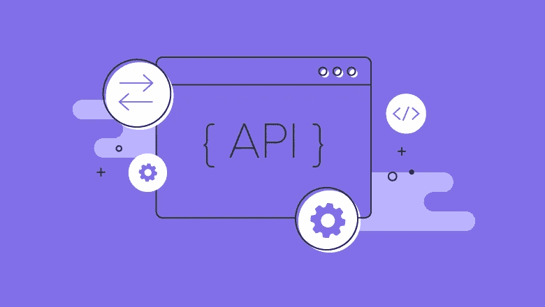
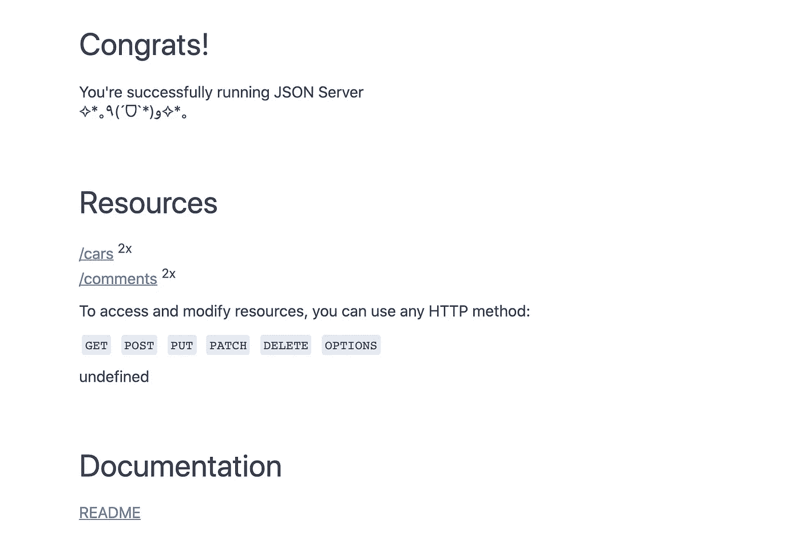
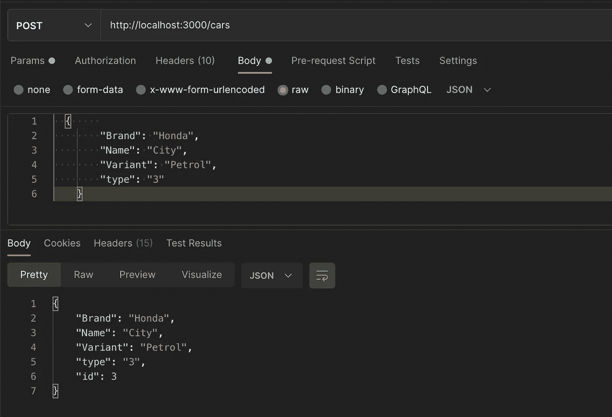
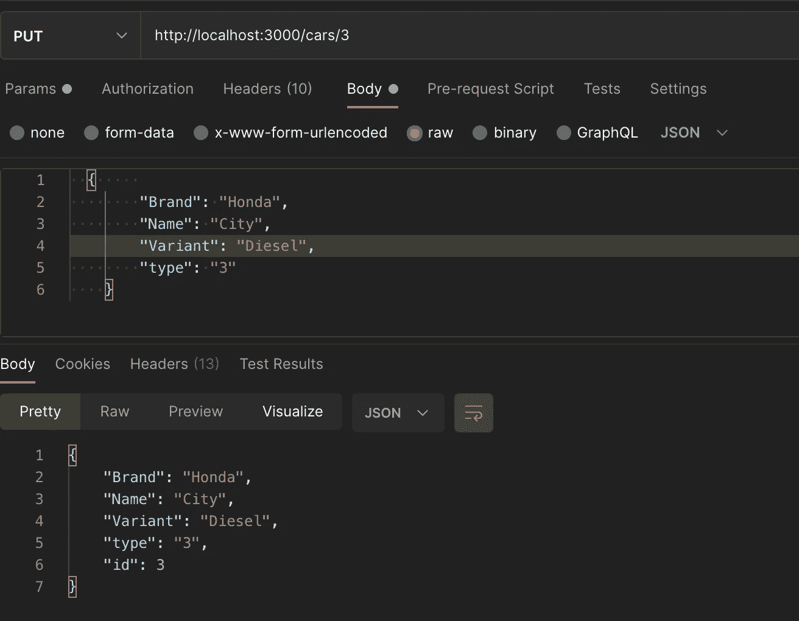
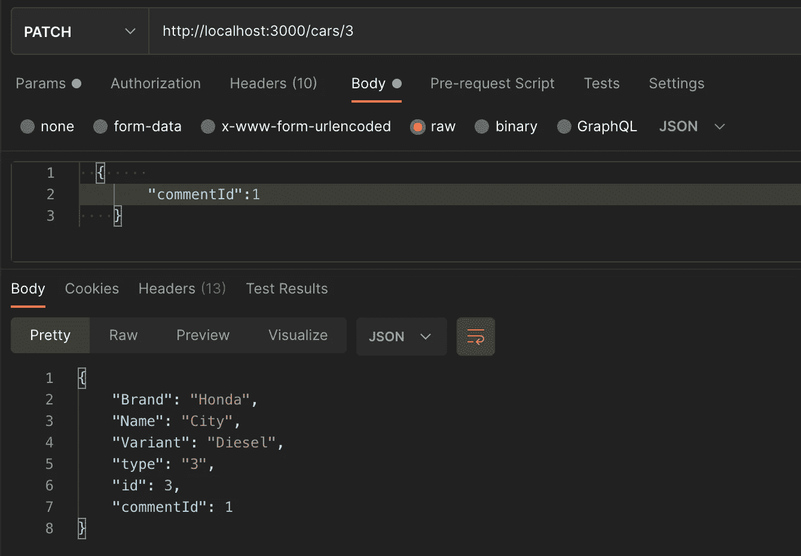
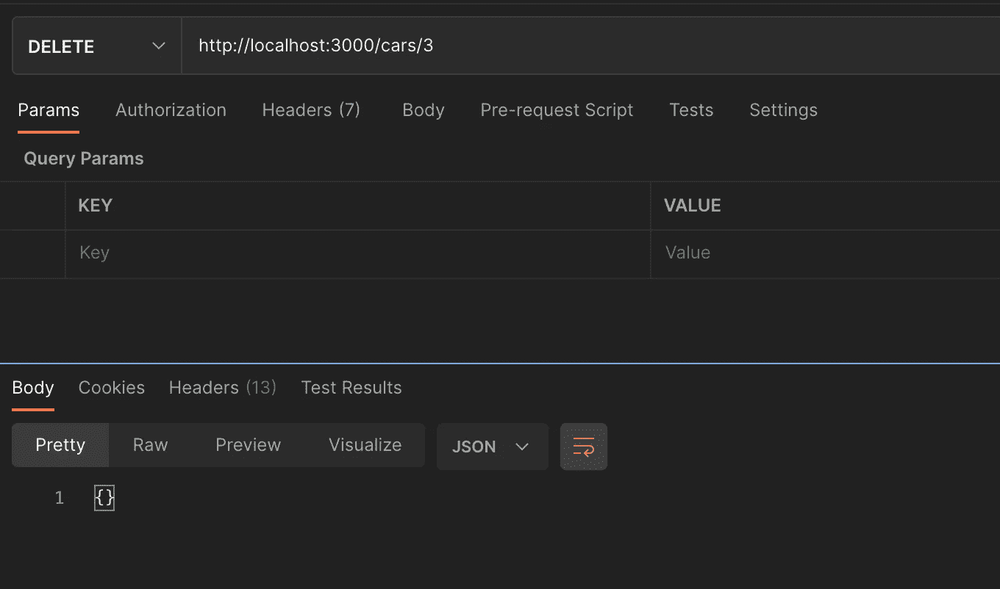
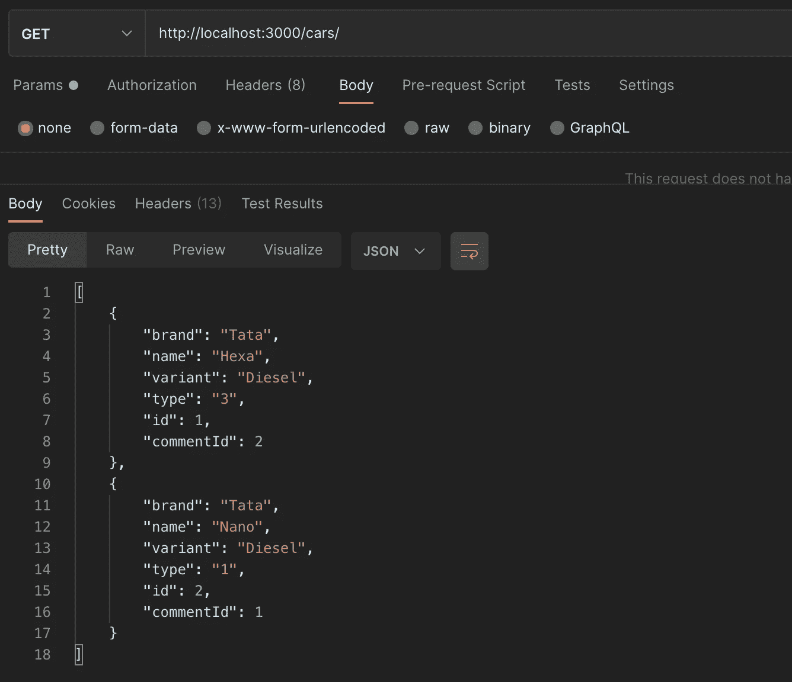

# 用 JSON-Server 模拟 API

> 原文：<https://javascript.plainenglish.io/mocking-apis-with-json-server-4864bcf310ac?source=collection_archive---------8----------------------->



# API 嘲讽是什么？

模拟 API 通过为 API 请求提供真实的响应来模仿真实的 API。这些 API 可以位于您的本地计算机上，也可以位于公共互联网上。它基本上模仿了真实 API 的行为。

# **为什么 API 嘲讽？**

1.  真正的 API 还不可用，但 API 合同是最终的。一旦 API 模拟就绪，前端开发人员就可以开始与后端开发人员并行工作。
2.  改变模拟 API 的响应比改变真实 API 中的确切逻辑更容易。
3.  API 自动化团队可以编写带有基本断言的自动化测试用例，这些断言可以在真正的 API 可用时运行。
4.  如果真正的 API 很慢，模拟 API 可以用于开发目的。
5.  当您离线工作时，模拟 API 会很方便，并且模拟 API 托管在您的本地计算机上。

# 如何使用 JSON-Server 模拟 API

JSON Server 是一个节点模块，我们可以用它来模拟 REST API 服务。这是用最少的配置添加模拟 REST API 的最简单、最快的方法之一。

## **安装 JSON 服务器**

运行以下命令来安装 JSON 服务器。

> `npm install -g json-server`

通过添加选项`-g`,我们可以确保软件包被全局安装在您的系统上。

## 创建 db.json 文件

接下来，我们创建一个名为`db.json`的 JSON 文件。这个文件代表了我们的模拟 API 的数据库。对于 JSON 结构 CRUD 中包含的对象，端点是自动创建的。看看下面的`db.json`文件:

```
{
  "cars": [
    {
      "brand": "Tata",
      "name": "Hexa",
      "variant": "Diesel",
      "type": "3",
      "id": 1,
      "commentId":2
    },
    {
      "brand": "Tata",
      "name": "Nano",
      "variant": "Diesel",
      "type": "1",
      "id": 2,
      "commentId": 1
    }
  ],
  "comments": [
    {
      "id": 1,
      "userComments": "Good Car"
    },
    {
      "id": 2,
      "userComments": "Bad Car"
    }
  ]
}
```

JSON 结构有 3 个对象，即。汽车和物品。

## 运行服务器

让我们通过执行以下命令来启动 JSON 服务器:

> `json-server --watch db.json`

这里，我们用参数`--watch`启动 JSON 服务器，这意味着服务器监视`db.json`中的变化，并相应地更新公开的 API。默认情况下，服务器将在端口 3000 上启动。导航到 http://localhost:3000/查看我们拥有的资源。



## HTTP 端点

当服务器开始监视`db.json`文件时，将默认创建以下端点。

```
GET /cars
GET /comments
GET /cars/{id}
GET /comments/{id}
POST /cars
POST /comments
PUT /cars/{id}
PUT /comments/{id}
DELETE /cars/{id}
DELETE /comments/{id}
PATCH /cars/{id}
PATCH /comments/{id}
```

任何请求(获取/上传/发布/删除/修补等。)将被写入`db.json`文件，并且`db.json`将被相应地更新。我们将使用 POSTMAN 测试其中一些端点。

## **发布请求**

要创建一辆新车，使用`Content-Type`作为`application/json`执行 POST 请求。在发布之后，请求`db.json`将被更新为 cars 对象下的另一个资源。id 将自动递增。



## 上传请求

让我们尝试更新新创建的资源。我们将变型为柴油。



## 补丁请求

让我们使用补丁请求来更新创建的资源。我们将向汽车资源添加一条注释。



## 删除请求

删除请求将删除资源并将其从`db.json`文件中移除



## **得到请求**



根据需要，可以对 GET 请求执行许多操作来重新排列项目。这些是:

## **过滤:**

`*http://localhost:3000/cars/?name=Hexa*` *:* 给出了所有名字为 Hexa 的汽车。

`*http://localhost:3000/cars/?type=1&commentId=1*` *: W* 我将返回 type = 1，commentId = 1 的所有汽车。

## **分页:**

使用`_page`返回 params 中的分页数据，使用`_limit`限制返回的数据。默认情况下，返回 10 个项目。

`*http://localhost:3000/cars/?_page=1*`:返回前 10 项。

`*http://localhost:3000/cars/?_page=1&_limit=6*`:返回前 6 项。

## **排序:**

`*http://localhost:3000/cars/?_sort=id&_order=desc*`:这将根据 id 对 desc 的汽车进行排序。`asc`(升序)顺序是默认的。

## **切片:**

`*http://localhost:3000/cars/?_start=3&_end=6*`:返回 id 为> 3 且 id≤6 的项目

`*http://localhost:3000/cars/?_start=3&_limit=6*`:返回从 id = 4 开始的六个项目。

## **操作员:**

添加`_gte`或`_lte`以获取范围

`*http://localhost:3000/cars/?id_gte=5*`:返回 id ≥ 5 的项目。

`*http://localhost:3000/cars/?id_lte=10*`:返回 id ≤10 的项目。

`*http://localhost:3000/cars/?id_gte=5&id_lte=10*`:返回 id ≥5 且 id≤10 的项目。

添加`_ne`排除一个值

`*http://localhost:3000/cars/?id_ne=3*`:排除 id = 3 的资源。

将`_like`添加到过滤器(支持 RegExp)

`*http://localhost:3000/cars/?name_like=swift*` *:* 过滤名称中包含 swift 的所有资源。

## **关系:**

要包含子资源，请添加`_embed`

`*http://localhost:3000/comments?_embed=cars*`

要包含父资源，请添加`_expand`

`*http://localhost:3000/cars/2/?_expand=comment*`

获取或创建嵌套资源

`*http://localhost:3000/comments/2/cars*` *:* 给出 commentId = 2 的汽车。

## **数据库:**

`*http://localhost:3000/db*` *:* 获取整个`db.json`文件。

# JSON 服务器—缺点

如果您只需要用基本的验证来模拟简单的 CRUD 端点，那么您可以使用 JSON 服务器。

JSON 服务器的一个主要缺点是灵活性较差。例如，非 crud 端点，不能配置不同的查询参数。

而且，`db.json`在您每次对它执行操作时都会被修改。如果有人不小心删除了所有数据，他们可能不得不重新设置测试数据。

*完整项目和更多库可以在我的*[*github*](https://github.com/attrideepak)*上找到。*

*更多内容请看*[***plain English . io***](https://plainenglish.io/)