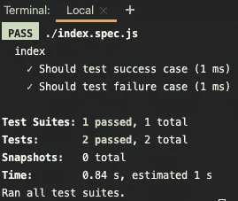

# 用 Jest 模仿 JavaScript 中导入的常量/方法

> 原文：<https://javascript.plainenglish.io/mocking-imported-constants-methods-in-javascript-with-jest-b78f52f7dd84?source=collection_archive---------2----------------------->

一个非常常见的问题是“我想模仿我的 JavaScript 从另一个文件/模块导入的导出常量，我该怎么做？”。这个简短的教程应该展示如何用普通的 JavaScript 来实现这一点。

模仿在 JavaScript 文件中导入的导出常量/方法是一个可能比想象中更频繁出现的用例。一个非常常见的用例是，你有一个抽象出一些逻辑来访问外部服务或数据库的模块。

当您进行单元测试时，您永远不会希望调用外部服务或您的数据库，因此您将这方面的逻辑抽象到一个模块中，然后在所有的单元测试中模拟它。当然，在 Jest 中也有“全局模拟”，你可以为你的所有测试设置一次，但那是另一个故事了。

您可以在 GitHub 的以下资源库中看到以下示例的完整代码库:

[](https://github.com/Abszissex/medium-jest-mock) [## abszisex/medium-jest-mock

### 在 GitHub 上创建一个帐户，为 abszisex/medium-jest-mock 开发做出贡献。

github.com](https://github.com/Abszissex/medium-jest-mock) 

对于我们的例子，假设我们有一些`main()`方法调用一些外部服务并返回其结果。

对于单元测试，在这个`main()`方法中，我们必须模拟通过`callExternalService()`触发的外部服务调用，原因如下:

1.  我们不希望突然看到我们的测试失败，只是因为一些外部服务关闭或有问题。失败的测试可能会阻塞部署管道，并导致不必要的错误调查，即使我们这边没有错误。
2.  每次调用外部服务都会降低测试运行的速度。当然，触发一些 HTTP 调用需要更长的时间，而不是简单地模仿一些方法，返回一些普通的值。
3.  调用真正的服务可能会引入某些状态，这些状态只在第一次运行时有效，但在第二次运行时可能会失败。想象创建一个带有某种标识符的资源。第二次调用它时，它会抛出一个异常，表明资源已经存在。
4.  单元测试应该只测试你正在工作的**单元**。你不想用它来测试另一个服务。您应该期望外部服务的创建者测试他们的代码。

我们示例的文件结构:

```
/
- externalService.js
- index.js
- index.spec.js
- package.json 
- package-lock.json
```

当然，在我们运行 Jest 测试之前，请确保您已经通过`npm i --save-dev jest`安装了它。

我们的示例代码:

在上面的例子中，您可以看到我们测试了来自外部服务的两个不同响应的`main()`方法。因为我们在这里只返回了`true`和`false`，我们可以期望外部服务是一个简单的`doesResourceExists()`端点，返回一些布尔值来指示资源是否存在。

在我们运行我们的测试用例(`npm run test`)之后，一切都是绿色的:



Result after running the “npm run test” command in your console

当然，上面的例子纯粹是为了演示的目的。

## 结论

*   由于开头提到的几个原因，在进行单元测试时，永远不要进行外部调用。反正不再是**单元测试**了。
*   Jest 使得模仿从其他模块/文件导入的常量/方法变得非常容易，只需要几个 LoC。

感谢您花时间阅读我的文章。

## 你想联系吗？

如果你想联系我，请在 LinkedIn 上打电话给我。

另外，请随意查看[我的书籍推荐](https://medium.com/@mr-pascal/my-book-recommendations-4b9f73bf961b)📚。

[](https://mr-pascal.medium.com/my-book-recommendations-4b9f73bf961b) [## 我的书籍推荐

### 在接下来的章节中，你可以找到我对所有日常生活话题的书籍推荐，它们对我帮助很大。

mr-pascal.medium.com](https://mr-pascal.medium.com/my-book-recommendations-4b9f73bf961b) [](https://mr-pascal.medium.com/membership) [## 通过我的推荐链接加入 Medium—Pascal Zwikirsch

### 作为一个媒体会员，你的会员费的一部分会给你阅读的作家，你可以完全接触到每一个故事…

mr-pascal.medium.com](https://mr-pascal.medium.com/membership)