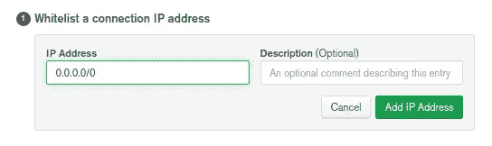
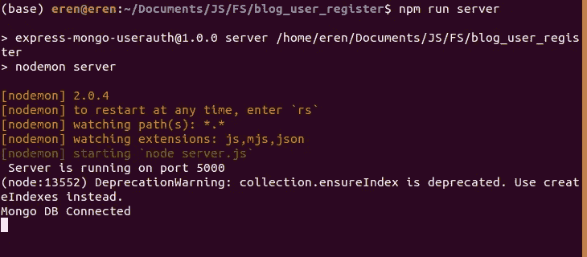

# MongoDB Atlas 设置和快速连接

> 原文：<https://javascript.plainenglish.io/mongodb-atlas-setup-and-express-connection-7dcf87bcc2e?source=collection_archive---------23----------------------->

在这篇文章中，我将解释如何在 MongoDB Atlas 上创建一个在线 MongoDB 数据库，并在 express 中编写一个基本的连接脚本来连接该数据库。

首先，让我们在“[https://www.mongodb.com/](https://www.mongodb.com/)”上创建一个帐户。

然后，您应该创建一个项目，如文档“[https://docs.atlas.mongodb.com/getting-started/](https://docs.atlas.mongodb.com/getting-started/)”中所述，在该部分之后您唯一需要的是接收您的连接字符串，但是为了在设置您的连接凭证时从任何地方访问您的数据库，您可以如下设置 IP 区域，以便允许所有 IP:

项目所需的依赖项将类似于 package.json 文件中的依赖项:

`{ "name": "projectname", "version": "1.0.0", "description": "projectdesc", "main": "server.js", "scripts": { "start": "node server", "server": "nodemon server" }, "author": "Eren Akbulut", "license": "MIT", "dependencies": { "config": "^3.3.1", "express": "^4.17.1", "mongoose": "^5.9.17", }, "devDependencies": { "nodemon": "^2.0.4" } }`

使用 npm install 命令安装节点文件后，您可以在根目录中创建 server.js 文件和 config 文件夹，您应该将 db.js default.json 文件添加到 config 文件夹中。

这些文件准备就绪后，您可以将以下代码添加到这些文件中:

server.js 文件

`const express = require("express"); const connectDB = require("./config/db"); const app = express();` `//Connect to our db finally connectDB();` `const PORT = 5000;`

`app.listen(PORT, () => console.log(` Server is running on port ${PORT}`));`

在本地主机上运行代码:5000。

`const mongoose = require("mongoose"); const config = require("config"); const db = config.get("mongoURI");` `const connectDB = async () => { try { await mongoose.connect(db, { useNewUrlParser: true, useUnifiedTopology: true, useFindAndModify: false, }); console.log("Mongo DB Connected"); } catch (err) { console.error(err.message); process.exit(1); } };`

`module.exports = connectDB;`

db.js 文件包含许多样板文件，这样设置后，您不需要进行额外的更改，下面给出了最后一个必需的文件 package.json 文件，

{ " mongoURI ":" your mongodbatlaskey "，}

设置好一切后，您可以通过运行“npm run server”来运行您的代码。顺便说一句，因为我们将 nodemon 添加为一个开发依赖项，所以您可以保存并查看您的更改，而无需再次运行代码。

你可以在链接上看到该项目的代码:[源代码](https://github.com/eren23/mongo-express-userauth)，但它包含的内容比我们今天解释的要多一点，剩下的部分也将很快发布。

*最初发表于*[T5【https://blog.akbuluteren.com】](https://blog.akbuluteren.com/blog/mongoatlas-express-starter)*。*