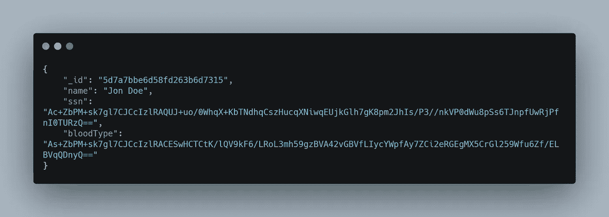

# 面向初学者的 MongoDB 客户端字段级加密(CSFLE)

> 原文：<https://javascript.plainenglish.io/mongodb-client-side-field-level-encryption-csfle-for-beginners-5eed965d4ba3?source=collection_archive---------6----------------------->

## 为您的应用程序增加一层额外的安全性。


Photo By [**Ales Nesetril**](https://unsplash.com/@alesnesetril)

数据安全是当前应用中最关心的问题。为了提高安全性，MongoDB 提供了许多构造。

在这篇博客中，我们将讨论如何在通过网络向服务器传输数据之前加密 MongoDB 文档中的字段，这使得几乎不可能从数据库服务器获取敏感信息。要了解更多信息，请访问 MongoDB 官方文档。

## MongoDB 客户端字段级加密的工作原理

MongoDB 客户端字段级加密(CSFLE)使用一种称为信封加密的加密策略，其中用于加密/解密数据的密钥(称为数据加密密钥)用另一个密钥(称为主密钥)加密。

> 在本例中，我们使用的是不适合生产的本地密钥提供程序。相反，您应该在密钥管理系统(KMS)中配置一个主密钥，该系统可以远程存储和解密您的数据加密密钥。

## 先决任务

要设置和运行此示例，您必须首先完成以下任务:

1.  安装 MongoDB Server 4.2 或更高的企业版。
2.  通过在命令提示符下输入以下命令来安装相应的软件包

```
npm i mongodb-client-encryption uuid-base64 mongodb
```

让我们开始吧。

## 创建主密钥

要生成主密钥，创建一个 Node.js 模块，文件名为 *create-master-key.js* 。确保您已经安装了所需的客户端和软件包。

要运行该示例，请在命令提示符下输入以下内容，这将创建我们的主密钥。

```
node create-master-key.js
```

## 创建数据加密密钥

创建一个 Node.js 模块，文件名为 *create-data-key.js* ，内容如下。

在生成加密密钥的命令提示符下输入以下内容。

```
node create-data-key.js
```

上面代码的输出应该如下所示

```
DataKeyId [UUID]: de4d735a-44789-48bc-bb93-3c84c3g90824 
DataKeyId [base64]: fUV/k/85QiCeB3amaU/9kQ==
```

## 使用 JSON 模式指定加密字段

MongoDB 驱动程序使用 JSON 模式标准的扩展版本来配置集合中文档的特定字段的自动客户端加密和解密。

下面是完整的可运行助手代码。它获取*密钥 Id* 并返回所需的模式。

接下来，创建一个 Node.js 模块，文件名为 *app.js* ，将患者插入到集合中。

若要运行该示例，请在命令提示符下输入以下内容。

```
node app.js
```

此操作将创建一个类似于以下内容的文档:



您可以通过在 *app.js* 中添加以下函数来获取加密的患者数据

干杯！你已经走到这一步了。

有了这些关于 CSFLE 的知识，您应该能够更好地保护应用程序并理解它是如何工作的！

你可以在这里找到完整的代码。

## **有用的链接**

1.  [https://docs . MongoDB . com/drivers/security/client-side-field-level-encryption-guide/](https://docs.mongodb.com/drivers/security/client-side-field-level-encryption-guide/)
2.  【https://github.com/Automattic/mongoose/issues/8167 

# 结论

虽然这篇文章试图涵盖保护 MongoDB 实例安全的最重要的安全方面之一，但是 MongoDB 安全还有更多的内容。

如启用访问控制、配置基于角色的访问控制、加密网络流量、限制网络暴露等。

虽然这篇文章关注的是数据库安全，但是建议您保护 web 和移动应用程序的 JavaScript 源代码。

## 感谢阅读！

[](/12-useful-vs-code-extensions-to-help-make-web-development-easier-6960680c56d4) [## 12 个有用的 VS 代码扩展，帮助简化 Web 开发

### 使用这些 12 VS 代码扩展提高您作为开发人员的生产力

javascript.plainenglish.io](/12-useful-vs-code-extensions-to-help-make-web-development-easier-6960680c56d4) [](/using-ng2-tel-input-in-angular-aa33c3ced92f) [## 使用 ng2-tel-输入角度

### 今天我们将探索 ng2-tel-input 包，并看看如何在 Angular 中使用它。

javascript.plainenglish.io](/using-ng2-tel-input-in-angular-aa33c3ced92f) 

*更多内容请看*[***plain English . io***](http://plainenglish.io/)