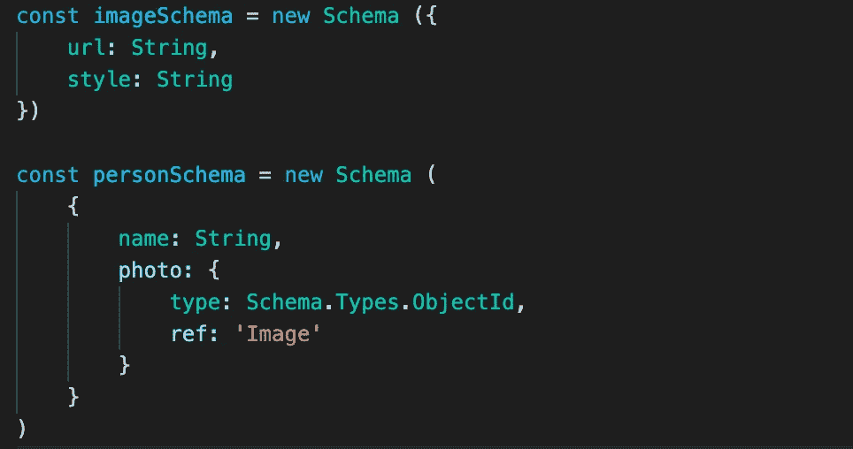
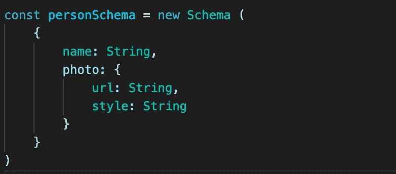

# 3 蒙古数据库/蒙古模式优化技术

> 原文：<https://javascript.plainenglish.io/mongodb-mongoose-schema-optimisation-ed06b3382099?source=collection_archive---------9----------------------->

在本文中，我将介绍在创建猫鼬模式以提高应用程序查询性能时需要考虑的三件事。

# 1.嵌入与参考

决定模式将对应用程序的性能有很大的影响，因为它会影响我们可以进行的查询。就我个人而言，我来自一个 SQL 背景，我已经习惯了对象之间的关系。

例如，一只狗属于一个人，我们可以使用一个外键来建立这个关系。

猫鼬以“参考”的形式提供类似的东西。但是，仅仅因为它在那里并不意味着它应该被使用和滥用。

例如，假设您有一个显示用户详细信息的应用程序。这里有两种表示模式的可能方式:



Option 1: Referencing similar to how it would be with SQL



Option 2: Embedding documents

第二个选项是展示如何嵌入文档。如果您来自 SQL 背景，您可能更熟悉第一种方法，但这需要您每次想查看每个用户的图像细节时都调用`.populate()`。

## 何时嵌入或引用

*   当嵌入的文档不可能单独使用时，嵌入是可预先提供的。例如，如果您的应用程序将有一个显示数据库中所有照片的页面，并且不需要拥有照片的用户的任何信息，那么嵌入将不是最有效的选择。
*   如果您希望嵌入的数据经常更新，嵌入是**而不是**的理想选择。

所以，当你试图用蒙古语表达感情时，请记住这些要点。

# **2 .分度**

Mongo 文档的主索引为`_id`。如果有一个您经常查询的属性，您可以向模型中添加更多的索引。例如，如果我们经常需要按用户名搜索用户，我们可以为其创建一个索引。

```
personSchema.index({ name: 1 })
```

这将为名称属性创建一个索引，文档按升序排序。

如果我们经常被要求通过名字**和**电子邮件查询一个人，我们也可以创建一个复合索引。

```
personSchema.index({ name: 1, email: 1 })
```

## 适度指数

但是，需要注意的是，您不应该为曾经搜索过的每个属性添加索引。

索引确实需要维护(每次有 CRUD 操作)，而且它们会占用空间。因此，添加太多可能会导致开销大于好处。

# 3.虚拟填充

假设人和博客之间存在一对一的关系。一个人可以写很多博客，但是一个博客只能有一个作者。

在这种情况下，我们在 Blog 的模式中引用作者(非常类似于 SQL 中的外键)。

```
const blogSchema = ({
    title: String,
    tags: [{
        type: String
    }],
    author: {
        type: Schema.Types.ObjectId,
        ref: 'Person'
    }
})
```

现在假设我们想找出一个人写的所有博客。实现这一点的一种方法是在 Person 模型中创建一个博客参考列表。

```
const personSchema = ({
    name: String,
    blogs: [{
        type: Schema.Types.ObjectId,
        ref: 'Blog'
    }]
})
```

建模的问题在于博客阵列会变得无限大。相反，我们可以虚拟填充！

```
const personSchema = ({
    name: String
})personSchema.virtual('blogs', {
    ref: 'Blog',
    localField: '_id',
    foreignField: 'author'
})
```

现在来查找由一个叫`personId`的人写的所有博客:

```
const blogs = await Person.findById(personId).populate('blogs')
```

## 结论

这些只是改进你的模型的一些方法。我希望这篇文章对您设计 mongoose 数据模型有所帮助！