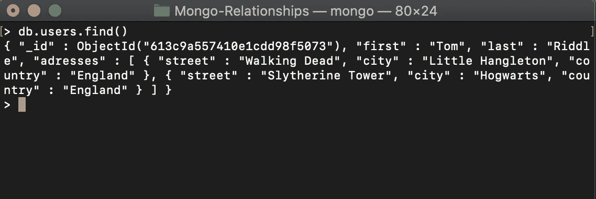
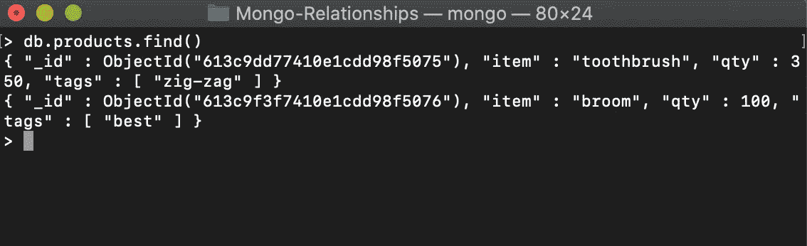
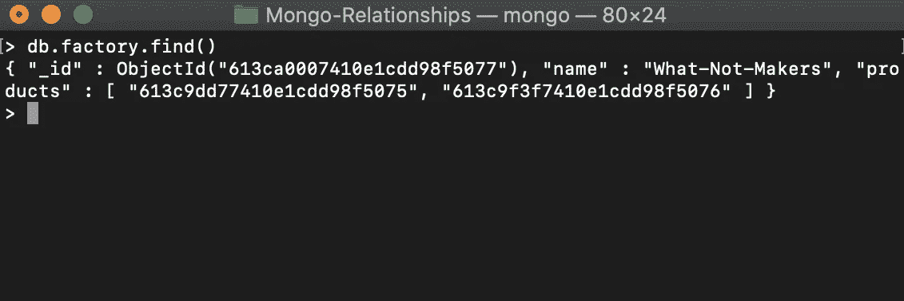
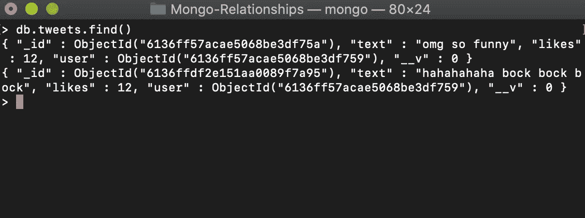

# 什么是 MongoDB 一对 N 关系？

> 原文：<https://javascript.plainenglish.io/mongodb-one-to-n-relationships-an-outline-6cd9e9f9584c?source=collection_archive---------7----------------------->

Photo by [Gilberto Reyes](https://www.pexels.com/@gilberto-reyes-259461?utm_content=attributionCopyText&utm_medium=referral&utm_source=pexels) from [Pexels](https://www.pexels.com/photo/brown-and-white-american-pit-bull-terrier-with-brown-costume-825949/?utm_content=attributionCopyText&utm_medium=referral&utm_source=pexels)

你好世界！今天，我想到了解决您在设计 MongoDB 模式时可能会遇到的许多紧迫问题之一。你们中的一些人可能熟悉 *SQL* 以及其中的关系是如何严格构建的。

在 *SQL* 中，大多数情况下，你有一个通用的方法来消除不同实体之间的关系。但是就 MongoD 而言，它的终极灵活性并不是没有代价的。那就是有很多*方法可以把事情搞砸。他们说自由伴随着责任。让我们看看 MongoDB 模式设计的一些简化的经验法则。*

在本文中，我将说明如何为 Mongo 中的*一对 N 关系*提出*明智的*模式。在 *SQL* 中，这都浓缩在*一对多关系*下。但是对于 Mongo 来说，可以说最终的权力在你身上。所以在开始模式设计之前，你必须彻底思考。

*一对多关系*在 Mongo 中，可以再细分为三个更小的块。

1.  一对几关系。
2.  一对多关系。
3.  一对十亿的关系。

## 一对几关系。

这是*一对多关系*的一个特例。顾名思义，它的意思就是*T21。不多(很多)，不是*方式*太多*而是*少。*

这方面的一个例子是，一个“用户”有*几个*地址。一个“用户”拥有 500 或 10000 个地址是不太可能的，对吗？

因此，最好的方法是，通过为每个“用户”在一个数组中嵌入地址细节来设计您的模式。同样，这不是一成不变的，您可以使用三种方法中的任何一种来绘制数据。但是在这种情况下，如果你采用这种方法，就不会那么累了。

我的意思是:

这种方法的主要障碍是“地址”是*而不是*一个独立的实体。它总是与特定的“用户”相关联。

因此，在执行任何过程之前，必须考虑您的需求，仔细检查您的模式是否符合您的需求。

## 一对多关系

这也算是钉钉子的*中庸之道*。可以这样涉及，如果你在*一对 N 关系*中的‘N’是*不是*太少，但同时*不是*狂大。为了更清楚地形象化这一点，考虑一个工厂。最有可能的是，它会生产出更多的产品。但不是成千上万(至少为了论证起见)。

您可以将您的每件产品分别存储在集合中，并将“参考”添加到工厂数组中的每件产品中。简而言之，您可以将子引用(产品 id)推送到父引用(工厂)中的数组。

让我们考虑下面的例子:

现在，您所要做的就是将产品 id 和相关工厂映射在一起。

每个产品都有自己的文档，同时它们在父集合中被“引用”，在这里是*工厂*。与前面的方法不同，产品*在这里是一个独立的实体。您可以随时查询它们，而不必与工厂打交道。*

## 一对十亿的关系

这是在 MongoDB 中规划数据的最后一种方式，但也是最重要的一种方式。让我们快速看一下它是如何完成的。

想象一下你正在克隆 Twitter。有数以百万计的用户，每个人都有无数条推文(除非他们像我一样)。所以，如果你要给这种关系设定界限，考虑一下下面的方法。

如果在这种情况下使用*一对多*方法，那么每当用户发推文时，你的“用户”数组就会被推文 id 填满。所以解决这个问题的最好方法是在 child 中添加一个 parent 引用。这是将用户 id 作为引用从“用户”集合添加到“Tweets”集合。每个实体当然都是独立的实体。让我告诉你我的意思:

您可以创建一个单独的“用户”集合，并在每次添加新推文时引用“推文”表中的“用户 id”。

*这里要提的一点是，有 ***没有*** 硬性规定说你要遵循这些方法。这些是制作模式的一般方法，非常欢迎您根据需要对它们进行调整。*

*如果你的应用程序不像 Twitter 那么庞大，有那么多数据，你甚至可以考虑'*双向引用'*'，在“Tweets”中存储“User”引用，反之亦然。当您试图从集合中查询出数据时，这会很方便。*

*感谢您的阅读。我希望这对你有意义。一定要在评论里让我知道你的想法。*

**更多内容请看*[***plain English . io***](http://plainenglish.io)*