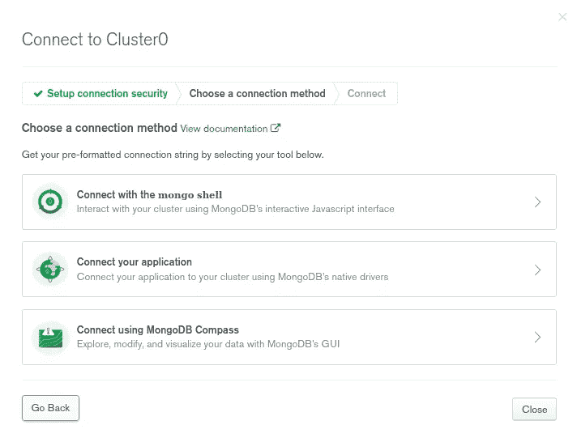

# 一个全面的 MongoDB 初学者教程

> 原文：<https://javascript.plainenglish.io/mongodb-tutorial-76748a5549f8?source=collection_archive---------12----------------------->

## 通过创建 Node.js 应用程序，开始使用 MongoDB & Mongoose


Photo by [Huỳnh Đạt](https://www.pexels.com/@donghuangmingde?utm_content=attributionCopyText&utm_medium=referral&utm_source=pexels) from [Pexels](https://www.pexels.com/photo/books-on-shelves-2177482/?utm_content=attributionCopyText&utm_medium=referral&utm_source=pexels)

## 内容

## [1。概述](#f35a)

## [2。安装](#9f4e)

*   [T5【快速安装(Ubuntu 20.04)](#7016)
*   [**使用 Docker**](#03d1)
*   [**MongoDB 图集**](#7c61)

## [**3。MongoDB GUI**](#e267)

## [4。连接我们的应用程序](#7d0d)

*   [**初始设置**](#d067)
*   [**利用獴**](#a275)
*   [**使用模型**](#7ac9) 创建&
*   [](#8548)****:**[**查看所有书籍**](#0b34) **，** [**添加书籍**](#e41e) **，** [**获取书籍**](#53aa) **，** [**添加评论**](#3acb) **，****

## **[5。结论](#caca)**

## **概观**

**本教程面向懂一点 JavaScript 并想开始使用 MongoDB 的初学者。**

**我们将用 **MongoDB** 作为我们的数据库，使用 **Express** 框架创建一个 **NodeJS** 应用程序。这是一个简单的个人图书馆，在这里我们可以:**

*   **查看图书列表。**
*   **加一本书。**
*   **添加关于图书的评论。**
*   **查看特定图书及其相关评论。**
*   **删除一本书。**
*   **从图书馆删除所有的书。**

**本教程有一节概述了各种 MongoDB 安装选项。如果您已经安装了它，请跳到[连接我们的应用程序](#7d0d)部分。**

**先解决后端吧。本节假设您已经安装了 NodeJS，但没有安装 MongoDB。如果没有，[这里有一个快速指南](https://docs.npmjs.com/downloading-and-installing-node-js-and-npm)。有许多方法可以运行和使用 MongoDB。回顾并选择一个对你最方便的。**

**就设置的容易程度而言，MongoDB Atlas 是启动和运行的最快方式，其次是 Docker(如果已经安装了的话),否则只需使用快速安装方法，除非您使用的是 Windows 或 Mac。老实说，不知道为什么他们在下面的顺序🤷🏾‍♂️️.**

**无论您使用安装的还是托管的 MongoDB 版本，我都推荐安装一个 MongoDB GUI，它为 MongoDB 数据库提供了一个用户界面。有了 GUI，我们可以可视化数据和编辑查询，而无需使用 shell 命令。参考下面的 [MongoDB GUI 部分](#e267)**

# **MongoDB 安装**

## ****1。快速安装(Ubuntu 20.04)****

*   **通过运行以下命令，为 MongoDB 的最新稳定版本导入公共 GPG 密钥。**

```
curl -fsSL https://www.mongodb.org/static/pgp/server-4.4.asc | sudo apt-key add -
```

*   **为 MongoDB 创建一个`sources.list`文件，将它列为 APT 数据的活动源。在这种情况下，文件是在`sources.list.d`文件夹中的`mongodb-org-4.4.list`。**

```
echo "deb [ arch=amd64,arm64 ] https://repo.mongodb.org/apt/ubuntu focal/mongodb-org/4.4 multiverse" | sudo tee /etc/apt/sources.list.d/mongodb-org-4.4.list
```

*   **更新本地包索引以便 APT 知道在哪里可以找到`mongodb-org`包，并安装 MongoDB **。****

```
sudo apt update; sudo apt install mongodb-org -y
```

*   **启动 MongoDB 服务:**

```
sudo systemctl start mongod.service
```

*   **使用以下命令检查 MongoDB 服务的状态:**

```
sudo systemctl status mongod
```

*   **输出:**

```
● mongod.service - MongoDB Database Server
    Loaded: loaded (/lib/systemd/system/mongod.service; enabled; vendor preset: enabled)
    Active: active (running) since Sun 2021-07-04 13:35:51 CAT; 2 days ago
    Docs: [https://docs.mongodb.org/manual](https://docs.mongodb.org/manual)
    Main PID: 1251 (mongod)
    Memory: 78.6M.
    CGroup: /system.slice/mongod.service
        └─1251 /usr/bin/mongod --config /etc/mongod.conf
```

**[进一步保护您的 MongoDB 安装](https://www.digitalocean.com/community/tutorials/how-to-secure-mongodb-on-ubuntu-20-04)(可选)。**

## ****2。使用 Docker****

*   **在 [Ubuntu](https://www.digitalocean.com/community/tutorials/how-to-install-and-use-docker-on-ubuntu-20-04) 或 [Mac 或 Windows](https://docs.docker.com/desktop/) 上安装 Docker。**
*   **从 Docker Hub 中提取 MongoDB 映像。**

```
docker pull mongo
```

*   **运行 MongoDB 实例，并使用`— name`选项为容器指定一个名称。**

```
docker run — name mongodb -p 27017:27017 -d mongo
```

*   **要在`27017`之外的另一个端口上运行 MongoDB，例如`37017` :**

```
docker run — name mongodb -p 37017:27017 -d mongo
```

*   **输出将是指示容器 ID 的字符串:**

```
470d71083f835c…
```

*   **要检查 Docker 是否正在运行:**

```
docker ps
```

*   **输出:**

```
CONTAINER ID   IMAGE     COMMAND                  CREATED         STATUS         PORTS       NAMES 470d71083f83   mongo     "docker-entrypoint.s…"   2 minutes ago   Up 2 minutes   27017/tcp   mongodb
```

*   **如果容器在创建后由于某种原因停止了，只需运行:**

```
docker start mongodb
```

*   **要一起停止容器:**

```
docker stop mongodb
```

## ****3。MongoDB 图集****

*   **或者，您可以通过使用 **MongoDB Atlas** 来使用托管在云中的 MongoDB。**
*   **创建一个账户。有一个免费层可用。**
*   **注册后，您将被要求命名您的组织和项目以及首选语言。**
*   **在`**Shared Clusters**`选项卡上创建一个集群。**
*   **出于测试的目的，选择一个离您自己的地理位置更近的地区，其他一切保持不变，可能会改变`**Cluster Name**`。**

****

**MongoDB Atlas setup**

****

**MongoDB Atlas cluster name**

*   **选择页面底部的`**Create Cluster**`。**
*   **等待集群创建完成，然后点击集群名称下方的`**CONNECT**`选项卡。这一部分可能会因您的浏览器而异。可能会要求您首先创建一个数据库用户。**
*   **要创建或添加新的数据库用户，点击屏幕左侧`**SECURITY**`下的`**Database Access**`选项卡。**

****

*   **要更改或添加 IP 地址，选择`**SECURITY**`下的`**Network Access**`选项卡。**
*   **假设您没有存储敏感数据，单击`**Allow Access from Anywhere**`按钮，保持原样并选择`**Add IP Address**`。或者，如果您看不到该选项，请参见下文。**
*   **使用用户名和口令创建数据库用户。点击`**Create User**`。**

****

**Create database user using a username and password**

****

**Select My Local Environment**

*   **要允许您的应用程序访问 MongoDB Atlas，请在`**IP Address**`字段中输入`0.0.0.0/0`并输入`**Add Entry**`。**
*   **通过点击`**SECURITY**`下的`**Network Access**`选项卡，可以添加或更改 IP**

****

**Allow app to access MongoDB Atlas from anywhere.**

*   **通过选择第二个选项`Connect your application`选择连接方式。**

****

**MongoDB Atlas Connect your application**

*   **将步骤 2 中的连接字符串复制到安全位置。用创建数据库用户时使用的密码替换`<password>`。我们将在应用程序中将它用作环境变量。**

****

**MongoDB Atlas connection string**

*   **`Close`。**
*   **点击`COLLECTIONS`创建一个数据库。创建数据库和收藏后，它们将出现在此处。**

****

*   **选择`Add My Own Data`并为您的数据库和收藏命名**
*   **您应该会看到您创建的数据库和集合。**

****

# **MongoDB GUI**

**MongoDB GUI 有许多选项可以提高 MongoDB 的易用性，并与上述 3 种方法兼容，例如 MongoDB Compass、Robo3T、Studio3T。**

**在本教程中，我们将使用 MongoDB 指南针。**

**下载你的系统版本，安装后打开。**

**如果您使用本地 MongoDB 实例，确保它正在运行，然后选择`Fill in connection fields individually`。除非设置期间指定的端口不是`27017`，否则保留设置。**

****

**如果使用 MongoDB Atlas，粘贴通过在集群中单击`CONNECT`选项卡获得的连接字符串。记得更换`<password>`。**

****

*   **除了您创建的任何其他数据库之外，您还应该看到`admin`、`local`、&、`config`数据库。**

****

# **连接我们的应用程序**

## **初始设置**

**我们的应用程序将具有以下文件夹结构:**

****

**通过首先为应用程序创建一个空目录来初始化应用程序:**

```
mkdir personal-library
```

**切换到创建的目录:**

```
cd personal-library
```

**使用`express-generator`生成一个准系统应用:**

```
npx express-generator
```

**用以下内容替换`package.json`的内容，并安装依赖项。**

**package.json**

```
npm i
```

**在应用程序的根目录下创建一个`.env`文件。根据您正在使用的 MongoDB 实例的类型使用适当的变量名，如果使用 MongoDB Atlas，则使用`MONGO_ATLAS`。从您的 MongoDB Atlas 帐户获取连接字符串。更换`<password>`。**

**如果使用 MongoDB 的本地实例，请使用`MONGO_LOCAL`。格式为`mongodb://localhost:27017/<database>`。用数据库的名称替换`<database>`。在这种情况下，使用`library`。**

**删除不使用的。**

**如果数据库不存在，它将被创建。**

**该文件应该类似于以下两行中的任何一行:**

**如果你计划提交这个项目，创建一个`.gitignore`文件并在其中包含`.env` 。这里有一个有用的 repo ，它有针对不同编程语言和框架的`.gitignore`文件。**

**通过在应用程序的根目录下运行以下命令，直接创建一个包含 NodeJS 必要规范的`.gitignore`文件。**

```
wget -O .gitignore [https://raw.githubusercontent.com/github/gitignore/master/Node.gitignore](https://raw.githubusercontent.com/github/gitignore/master/Node.gitignore)
```

**或者，如果您必须手动完成，请在应用程序的根目录中:**

```
touch .gitignore
```

**将文件的内容复制到其中。**

**用以下初始设置替换`app.js`:**

**将`views`文件夹中的`index.jade`文件重命名为`index.html`文件，并将内容替换为:**

**views/index.html**

**删除其他`.jade` 文件。**

**同样将下面的 JavaScript 和 CSS 内容分别复制到`public/javascripts/client.js` & `public/stylesheets/style.css`中。**

**public/javascripts/client.js**

**public/stylesheets/style.css**

**客户端 JavaScript 被忽略了，因为它不是本教程的重点。但是你可以在文档中查找[使用的 jQuery 方法。](https://api.jquery.com/jquery/)**

**在`routes`文件夹中创建一个文件`api.js`，它将保存我们的路线。我们不需要其他文件，所以可以删除它们。
通过这些路线，我们将能够:**

*   **查看所有书籍👉🏾️ `GET`请求到`/api/books`。**
*   **添加一本书👉🏾️ `POST`请求到`/api/books`。**
*   **删除所有书籍👉🏾️ `DELETE`请求到`/api/books`。**
*   **查看一本书👉🏾️ `GET`请求到`/api/books/:id`。**
*   **在现有图书上添加评论👉🏾️ `POST`请求到`/api/books/:id`。**
*   **删除一本书👉🏾️对`/api/books/:id`的`DELETE`请求。**

**我们最初的`api.js`文件类似于:**

**routes/api.js**

**导入并实例化`app.js`中的路线(线路`5` & `19`)。**

**app.js**

**我们可以通过运行下面的命令来查看我们的应用程序的前端，并导航到 [http://localhost:3000/](http://localhost:3000/) 。**

```
npm start
```

****

**Front-end, personal library app**

## **使用`mongoose`**

**我们将使用`mongoose`，一个为 MongoDB 实现对象文档映射方法的模块。**

**它简化了 CRUD ( [创建、读取、更新和删除](https://en.wikipedia.org/wiki/Create,_read,_update_and_delete#RESTful_APIs))操作、文档验证和其他功能，而不太关心文档如何与其数据源相关联。**

**通过将应用程序导入`app.js`来设置应用程序以使用`mongoose`。然后，我们将使用它来建立到数据库的连接。**

**取消注释适当的行`12`或`13`，根据您的 MongoDB 设置定义变量`DB` 。**

**app.js**

**注意`dotenv`模块在`2`行导入。这允许我们从之前创建的`.env`文件中加载环境变量。我们可以通过`process.env`作为`process.env.VARIABLE_NAME`在整个应用程序中访问这些变量。在这种情况下，我们的变量不是`MONGO_LOCAL`就是`MONGO_ATLAS`。使用环境变量允许为不同的环境设置不同的配置选项。**

## **创建和使用模型**

**接下来，我们将创建一个文件夹来存放应用程序模型。模型是我们用来向数据库发送数据的对象。在这种情况下，我们只有一个模型— `Book`，它具有以下属性:**

*   **`title`用字符串表示。**
*   **`comments`由字符串数组表示。**
*   **`commentcount`用数字表示，初始值为`0`。**

**创建`models`目录。**

```
mkdir models
```

**在`models`文件夹中创建`book.js`文件。**

```
touch models/book.js
```

**我们将为一本书创建一个模式。`mongoose`中的一个模式映射到一个 MongoDB 集合，并定义存储在该集合中的文档的形状。文档的形状指的是模式中定义的属性(`title`、`comments`、&、`commentcount`)。**

**为了使用我们的模式定义，我们需要将`bookSchema`转换成一个模型(`line 10`)，这是一个从模式定义编译而来的奇特的构造函数。当我们添加一本书时，就创建了一个模型的实例。这个模型实例是一个文档，然后存储在数据库的集合中。**

**第`2`行是[对象析构](https://developer.mozilla.org/en-US/docs/Web/JavaScript/Reference/Operators/Destructuring_assignment#object_destructuring)的一个例子，它可以将数组中的值或对象中的属性解包到不同的变量中。**

**models/book.js**

## **定义路线**

**我们可以在路由中使用我们的`Book`模型来执行 CRUD 功能。将其导入`routes/api.js`。我们将定义的第一条路线是获取图书列表。**

****查看所有书籍****

**routes/api.js**

**我们使用`mongoose`的`Model.find()`方法。将空对象`{}`作为参数传递给`find`方法将返回所有文档。如果连接不成功，将抛出一个错误并记录到控制台中。如果只有一条语句，花括号(`{}`)可以从`if`语句中省略，在这种情况下我们抛出错误。**

**如果我们在浏览器中导航到[http://localhost:3000/API/books](http://localhost:3000/api/books)，我们会得到一个空数组，因为我们的集合仍然是空的。**

****加一本书****

**为了向库中添加一本书，我们的`POST`方法检查请求体是否有属性`title`并且是否是一个非空字符串，否则抛出一个错误，指示缺少一个必需的字段。创建了一个`Book`模型的新实例，保存的文档作为`JSON`返回**

**编辑`/api/books`路线的`POST`方法。**

**routes/api.**

**从我们的运行前端，让我们添加一本书，如炼金术士。当我们访问[http://localhost:3000/API/books](http://localhost:3000/api/books)时，返回一个包含添加的图书的数组**

****

**JSON Viewer in a browser**

**返回的 book 对象有两个附加的新属性`_id`和`__v`。`_id`是 MongoDB 自动分配给存储在集合中的每个文档的惟一 ID。我们将使用这个属性与其他路径中的一本书进行交互。**

**`__v`是由 mongoose 首次创建时在每个文档上设置的属性。该键值包含文档的内部修订。**

**在 MongoDB Compass 中也有同样的体现。**

****

**MongoDB Compass database.collection with document**

**继续将更多的书添加到数据库中。您应该会看到前端和 MongoDB Compass 上的书籍列表。**

**查看/获得一本书**

**当向`/api/books/{bookId}` 发出`GET`请求时，我们检索一本书，其中`bookId`是一个动态 URL 的占位符。在路由`/api/books/:id`中，URL 的`:id` 段是一个路由参数。它用于捕获 URL 中该位置指定的值。在这种情况下，一本书的`id`。捕获的值存储在`req.params`对象中，以路线参数的名称(`id`)作为关键字。**

**当我们单击列表中的第一本书时，将显示书名及其 id。在这个例子中，id 为`60e79c75e3280d4c52fce456`的炼金术士将在 URL 中被捕获，并通过`req.params.id`被访问。**

```
Route path: /api/books/:idRequest URL: [http://localhost:3000/api/books/60e79c75e3280d4c52fce456](http://localhost:3000/api/books/60e79c75e3280d4c52fce456)req.params: { "id": "60e79c75e3280d4c52fce456" }
```

**routes/api.js GET /api/books/:id**

**从第`56`-`68`行定义了一本书的`GET`方法。我们从`req.params`对象中获取图书的 ID。如果没有找到 ID，我们抛出一个错误。我们使用`mongoose`的`Model.findById()`方法，将 ID 作为参数传入。`orFail()`方法附加到查询中，如果没有找到匹配的文档，即查询中使用了无效的 id，则抛出错误。匹配的图书作为`JSON`返回，由客户端 JavaScript 解析，并显示图书及其评论。**

**我们捕获`mongoose`的`CastError`，当`mongoose`无法将过滤器(`id`)转换到我们的模式时，返回该消息。即使我们遇到这个错误，这也能让应用程序继续运行。**

## **添加评论**

**单击列表中的一本书会打开一个表单，允许我们向该书添加评论。在添加实际注释时，表格数据被发送到`/api/books/:id`。表单数据在`req.body`对象中被捕获。例如添加评论 ID 为`60e79c75e3280d4c52fce456`的炼金术士:**

```
Route path: /api/books/:idRequest URL: [http://localhost:3000/api/books/60e79c75e3280d4c52fce456](http://localhost:3000/api/books/60e79c75e3280d4c52fce456)req.params: { "id": "60e79c75e3280d4c52fce456" }req.body: { "comment": "Great book" }
```

**让我们更新`/api/books/:id`路线的`POST`方法**

**routes/api.js POST /api/books/:id**

**我们分别从`req.params`和`req.body`对象中获取图书的标识和注释。如果注释为空，则会引发错误。我们使用猫鼬的`Model.findOneAndUpdate()`方法，通过`id`和`comment`以及其他选项作为论据。**

**第一个参数是用`_id`找到的对象。MongoDB 的`$push`运算符将一个指定的值附加到带有该特定的`_id`的文档中的一个数组中。在这种情况下，对`comments`数组的新添加注释。`$inc`运算符将字段增加指定的值。在这里，我们每次添加评论时都会将`commentcount`、`versionKey` ( `__v`)增加`1`。我们增加了`new: true`选项，以便在更新时修改后返回文档。**

****

**Personal library with comments**

****

**MongoDB Compass**

****删书****

**当我们点击`Delete book`按钮时，一本书被删除。该图书的 ID 随`DELETE`请求发送至`/api/books/:id`。从`req.params`对象中解析图书的标识，并在`Model.findByIdAndRemove()`方法中作为参数传入。如果标识无效或不存在，将引发错误，否则将返回一条指示成功删除的消息。**

**routes/api.js DELETE api/books/:id**

****删除所有书籍****

**最后，通过向`/api/books`发送`DELETE`请求，执行`Model.deleteMany()`方法，无需任何参数，即可删除图书馆馆藏的所有书籍。**

**完整的`api.js`文件将是:**

**routes/api.js**

## **包扎**

**我们的应用程序现在已经完成，我们可以执行我们在本教程开始时设定的功能。**

**这是 MongoDB 中的入门知识，也是与您将在数据库上执行的常见操作相关的一些方法。随意调整你想要的应用，尝试更多 MongoDB 和[猫鼬方法](https://mongoosejs.com/docs/)。**

**在评论中告诉我你的想法。快乐黑客👍🏾️.**

***多内容见于* [***中***](http://plainenglish.io/)**