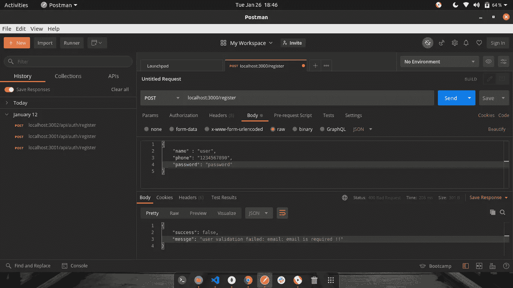
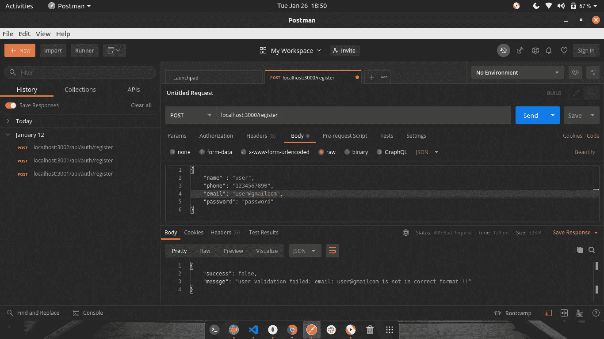
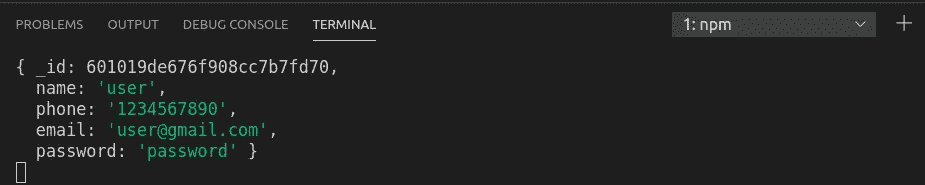
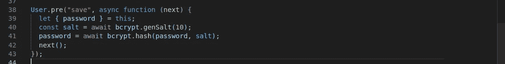
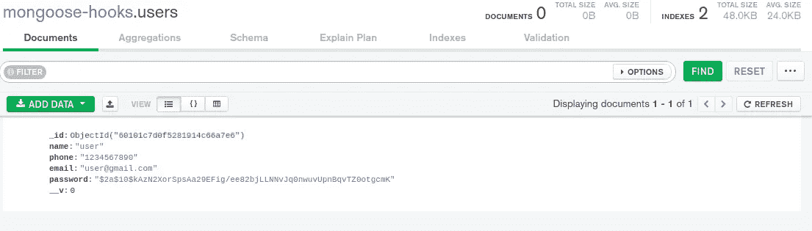

# 猫鼬(验证+挂钩=🔥)

> 原文：<https://javascript.plainenglish.io/mongoose-validation-hooks-652f77b665e2?source=collection_archive---------9----------------------->

## mongoose 内置的验证和钩子有时是多么强大等等


Photo by [Manuel Sardo](https://unsplash.com/@manuelsardo?utm_source=medium&utm_medium=referral) on [Unsplash](https://unsplash.com?utm_source=medium&utm_medium=referral)

Mongoose 是 mongo DB 数据库的一个 **ODM(对象文档建模器)**。它提供了诸如内置转换、查询构建、验证等便利。

# **验证**

您一定已经在 express 中使用了 [joi](https://www.npmjs.com/package/joi) 进行模式验证，但是如果我们可以使用 mongose 进行验证，为什么还要使用 joi 这样的沉重的包呢，现在我们将看到如何使用 mongoose validate 函数来验证模式。

在这里，我创建了一个注册新用户的简单路径:

```
// *NEW USER ROUTEapp.post("/register", async (req, res) => {try {const user = await User.create(req.body);res.json({ success: true, message: "User saved successfuly!!" });} catch (e) {return res.status(400).json({ success: false, messge: e.message });}});
```

*用户型号:*

```
const mongoose = require("mongoose");const bcrypt = require("bcryptjs");const User = new mongoose.Schema({name: {type: String,required: true,},email: {type: String,required: true,unique: true,},phone: {type: String,required: true,
},password: {type: String,required: true},});module.exports = mongoose.model("user", User);
```

*如果您想要自定义错误消息:*

```
....
required: [true, "phone number is required"]
....
```

***注意*** *: unique 不是验证器*

# **添加验证**

Mongoose 使用一个内置的验证函数来验证模式，并返回一条定制消息。

(ps:验证接触长度)

"输入的输入作为参数传递给消息"

```
phone: {type: String,required: [true, "Phone number is required !"],validate: {validator: (v) => {return v.length == 10;},message: (props) => props.value + " Must be 10 digits !",},},
```

**使用正则表达式:**

```
email: {type: String,required: [true, "email is required !!"],unique: true,validate: {validator: (email) => {const pattern = /^[A-Z0-9._%+-]+@([A-Z0-9-]+\.)+[A-Z]{2,4}$/i;return pattern.test(email);},message: (props) => `${props.value} is not in correct format !!`,},},
```

> 现在，在创建一个新用户时，你不必担心验证，mongoose 会相应地处理和抛出验证！！



Postman screenshot

同样，当使用不正确的电子邮件时:



Postman Screenshot

瞧啊。再见，乔伊。

# 下一步:使用猫鼬钩

主要有两种被广泛使用的猫鼬钩:

*   *【pre】*:在保存模型之前做一些事情。
*   *“post”*:保存模型后做一些事情。

**使用钩子/中间件:**

如果我们在 pre hook 中控制台记录这个，我们得到 req.body 或用户输入的内容。



在使用 [bcrypt 库](https://www.npmjs.com/package/bcryptjs)将密码保存到数据库之前，让我们对密码进行哈希运算。



由于 *pre* 是一个中间件，它以 next 作为参数，也可以返回承诺，成功完成后，它调用 next()中间件。

## 让我们看看这是否有效…



*现在我们的密码是 hash，我们没有对控制器做任何更改。*

类似地，post hook 在保存模型后工作。

中间件可以接受的事件:

*   "保存"
*   "移除"
*   "验证"

还有[更有](https://mongoosejs.com/docs/validation.html)。

*最终源代码:* [*链接*](https://github.com/anandpd/mongoose-validation-medium)

如果你已经到达这里，感谢你阅读这篇文章，我希望它清楚的使用 mongoose 验证和中间件/钩子。如果你喜欢，别忘了留下掌声。

谢谢大家！


Photo by [Kelly Sikkema](https://unsplash.com/@kellysikkema?utm_source=medium&utm_medium=referral) on [Unsplash](https://unsplash.com?utm_source=medium&utm_medium=referral)