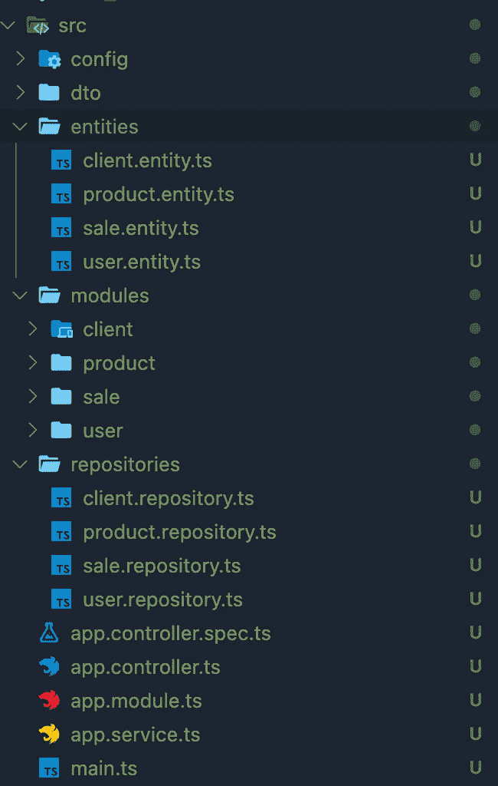
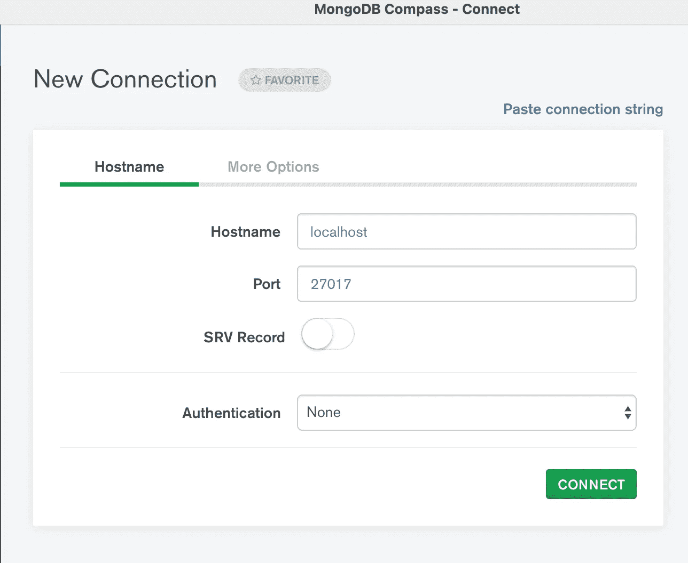

# 有 NestJS 和 MongoDB 的猫鼬

> 原文：<https://javascript.plainenglish.io/mongoose-with-nestjs-mongodb-a211c26d70da?source=collection_archive---------1----------------------->


如何用 NestJS 连接到 MongoDB？

我非常喜欢使用 mongose 和 mongoose nestjs 库的组合。只使用 Nestjs 库的好处是，基本上不需要使用接口，只需要直接使用模式。如果您直接使用 mongoose 来定义模式，那么您需要使用一个接口来创建 MongoDB 中的每个对象。

使用 NestJS 用 Mongoose 创建一个复杂模式在某种程度上可能是一件痛苦的事情，但是一旦你掌握了它，它的工作方式就很酷了。

因此，让我们创建一个管理用户、客户、产品和销售的应用程序。

在第一个视图中，我们基本上需要 4 个模式:

# 如何用 NestJS 在 Mongoose 中定义模式

NestJS 有一个强大的工具@ NestJS/mongose，我们就用它吧。

首先，我们需要创建我们的 NestJs 应用程序，或者可以随意使用我在最后发布的存储库。

```
nest new nestjs-mongodb-app
```


Create our Nestjs Application

[](https://github.com/nestjs/mongoose) [## nestjs/mongose

### 一个渐进式 Node.js 框架，用于构建高效且可伸缩的服务器端应用程序。用于 Nest 的猫鼬模块…

github.com](https://github.com/nestjs/mongoose) 

这是你的 NestJS 应用程序应该有的样子，如果你需要帮助来创建一个 NestJS 应用程序，请访问 NestJS 并开始使用 CLI，这非常简单。

我们将创建 4 个实体，客户、产品、销售和用户。

另外，我们需要 npm 安装 nestjs mongoose 库。

你还需要设置你的本地 MongoDB，你可以下载 MongoDB Compass 社区或者直接用 CLI 安装 Mongo，所以让我来帮你一下。

# **设置 MongoDB**

[](https://www.mongodb.com/try/download/compass) [## MongoDB 指南针下载

### MongoDB Compass 是 MongoDB 的 GUI，是探索和操作数据的最简单的方法。为开发者免费下载…

www.mongodb.com](https://www.mongodb.com/try/download/compass) 

在这里，您可以下载 MongoDB Compass，安装所有东西并打开应用程序来创建您的第一个连接:



如果连接被拒绝，使用以下命令启动 mongo:

```
brew services start mongodb-community
```

一旦连接成功，只需创建一个新的数据库，给它起个名字，让我们使用经典的“测试”并创建一个集合名，例如 users，您可以创建我们的实体将要管理的其他集合，但是 mongoose 无论如何都会完成这项工作。

现在我们需要将我们的数据库连接到我们的 NestJS 应用程序，所以我强烈建议为您的本地 mongodb 创建一个用户名和密码，这样在您的 shell 中(对于 Mac 用户，它只是您终端上的“mongo”)，对于 Windows，您可以使用 MongoDB Compass 上包含的 shell。

```
mongo
use testing
db.createUser({user:'admin', pwd:'strongpassword', roles:[{ role:'readWrite', db:'testing'}]})
```

现在要在我们的 NestJS 应用程序中创建连接，创建一个配置模块和服务:

配置模块


Config.module.ts


您可以看到此存储库中的其余配置:

[](https://github.com/Cfvillarroel/nestjs-mongodb-app) [## cfvillarroel/nestjs-MongoDB-app

### 在 GitHub 上创建一个帐户，为 Cfvillarroel/nestjs-MongoDB-app 开发做贡献。

github.com](https://github.com/Cfvillarroel/nestjs-mongodb-app) 

克隆存储库，创建您的。env 文件，包含我们之前创建的关于 MongoDB 的信息，点击它！

```
npm install
npm run start:dev
```

# 实体！

这就是问题所在，实体是实现这个工作的关键，所以让我们把它们联系起来。这里有一个小图表，其中的模式描述了实体之间的关系。

所以这就是我们要做的:

1-因此，我们将创建一个具有特定角色的用户

2-创建客户端

3-创建产品

4-为一个特定的客户创建一个已创建产品的销售

NestJS 和 mongoose 允许您关联实体，您可以在代码中看到，例如，我们引用销售、客户和产品上的用户模式来注册创建每个事件的用户。

在销售中，我们指的是产品和客户。让我们分析一下这是如何做到的:

```
@Prop({type: MongooseSchema.Types.ObjectId, required: false, ref: Client.name})client: any;
```

type 属性定义了字段的类型，它可以是一个数字，字符串或者在这个例子中是一个 MongooseSchema 对象 Id，我们可以定义它是否是必需的，这意味着如果它被设置为 true，你不能创建一个没有客户的销售。

还有一个独特的属性，这意味着你不能用相同的电子邮件或名称或你定义的任何字段创建两个用户。还有很多，您可以阅读 mongoose 文档来找到符合您需要的属性。


我们有了代码，我们对实体和模式的工作原理有了更好的理解，现在让我们来测试它！

如果你需要更多的信息或者想了解更多关于 MongoDB 的知识，这里有一个关于它的链接:

[](https://docs.mongodb.com/manual/core/databases-and-collections/) [## 数据库和集合- MongoDB 手册

### 在 MongoDB 中，数据库保存一个或多个文档集合。要选择要使用的数据库，在 shell 中发出…

docs.mongodb.com](https://docs.mongodb.com/manual/core/databases-and-collections/) 

# 创造一些收藏！

让我们开始创建一个用户！为此，我们将使用失眠，邮递员也将做这项工作。

您可以在控制器上看到我们可以使用的所有端点，我的应用程序是这样设置的:

NestJS 应用程序基本上与模块、服务和控制器逻辑一起工作。

我还使用了一个存储库文件，这个存储库文件用于 MySQL 的 typeorm 和 entities，我也用于 MongoDB 和我的所有项目，在我看来，它更有序。

我将. service.ts 用于业务逻辑，将存储库用于与数据库或外部 API 的各种类型的连接，这种方式是分离的，例如，如果我更改数据库，我不必更改很多逻辑。

值得一提的是，你将在我的代码中看到，我也使用 dto(数据传输对象)来创建、更新等。因此，d to 与您的实体保持联系是非常重要的。


因此，澄清后，让我们创建我们的第一个用户，我们需要向我们的帖子传递一个姓名、角色和电子邮件:

```
[http://localhost:3000/user/createUser](http://localhost:3000/user/createUser)
```


Creating our User

一旦创建了用户，就像我们在模式中定义的那样，不允许两个用户使用相同的电子邮件，所以如果我们试图再次发送这个请求，我们应该会得到一个错误


不错！工作很好！

**现在让我们创建一个客户端:**

```
[http://localhost:3000/client/createClient](http://localhost:3000/client/createClient)
```

我们需要一个客户名称，一个联系号码，当然还有我们刚刚创建的用户标识


Creating our First Client

一切都好！让我们为我们的**第一个产品做同样的事情！**

```
[http://localhost:3000/product/createProduct](http://localhost:3000/product/createProduct)
```

我们需要为我们的产品命名，还需要我们之前创建的用户 Id


Creating our first Product

完美！现在，我们有了创建客户和产品的用户，是时候创建销售并更新我们的产品状态为“已售出”了。

因此，我们将在这里停下来，分析一下销售是如何进行的。

# 如何创造销售机会？

首先，DTO:


CreateSaleDto

为了创建我们的第一笔销售，我们需要 clientId、我们要销售的 productId 和创建销售的 userId。

此外，销售有一个与之相关的总金额。

我们销售模式看起来像我们以前看到的:


Sale Schema

因此，一旦创建了销售，我们就可以直接从销售中获得所有产品和客户信息，这就是 mongoose 的魔力。

接下来是我们的 SaleService.ts，通过 createSaleDto，我们将获得用户，以便验证其角色，我们还将获得产品并将其传递给 de createSale 方法，一旦创建了销售，我们将更新我们的产品状态为“已售出”


Sale Service: createSale Method

下面是创建销售和更新产品状态的代码:


Sale Repository: createSale Method

最后，当我们的创建成功时，我们可以更新我们的产品状态及其 updatedAt 字段，正如我在使用 service => repository 逻辑之前提到的，这很重要，因此我们需要导入我们的产品服务来更新产品:


Product Repository: updateProduct Method

希望这是明确的，所以让我们现在创造我们的第一次销售！

# **创造销售**

现在更清楚了后端的工作原理，让我们创建我们的第一笔销售:

```
[http://localhost:3000/](http://localhost:3000/sale/createSale)sale/createSale
```

如您所见，我们需要之前创建的 clientId、userId 和 productId


很好！！我们的销售是创造出来的，它把产品、客户和用户联系在一起。我们还更新了我们的产品，所以现在它也有一个关联的客户端，您可以更复杂一些，例如为产品创建一系列客户端等等，这不是强制性的，我们只是在测试关系。

所以，现在我们想获得我们刚刚创建的销售及其所有信息！

为此，我们可以再次使用 mongoose，并将我们创建的字段填充为 MongooseSchema ObjectId


因此，在这里，我们得到了我们的销售，并用产品、客户和用户信息填充它，让我们试试看:


有用！！我们的销售有所有的信息！

我们创建了所有的模式，关联了它们并创建了每个集合，现在我们可以创建与其他实体相关联的销售。

# 结论

正如我们所看到的，mongoose 是一个非常强大的工具，我们可以用 NestJS 创建惊人的应用程序来处理它，即使我们使用的是非关系数据库，如何关联事物也是非常重要的，这非常简单，正如你所看到的，你不需要改变很多东西来关联 2 个集合。

希望你喜欢它，这将是有用的！

# 项目的 Github 资源库

[](https://github.com/Cfvillarroel/nestjs-mongodb-app) [## cfvillarroel/nestjs-MongoDB-app

### 在 GitHub 上创建一个帐户，为 Cfvillarroel/nestjs-MongoDB-app 开发做贡献。

github.com](https://github.com/Cfvillarroel/nestjs-mongodb-app) 

# 关于我

如果可以，请分享这篇文章，并随时通过 LinkedIn 联系我

[](https://www.linkedin.com/in/carlos-villarroel-navarro/) [## Carlos feli PE Villarroel Navarro-IT 经理- Rindegastos | LinkedIn

### 查看 Carlos Felipe Villarroel Navarro 在世界上最大的职业社区 LinkedIn 上的个人资料。卡洛斯·费利佩…

www.linkedin.com](https://www.linkedin.com/in/carlos-villarroel-navarro/) 

我目前在 Rindegastos 担任 IT 经理。我完成了战略领导力文凭和数据科学硕士学位。

对技术充满热情，是 Typescript、Javascript 和 Python 的开发者。我使用 MongoDB 和 MySQL。

目前正在开发后端采用 NestJS 框架，前端采用 Angular 的微服务，支持 Docker 和 AWS。我用 Ionic v5 开发，也用 NestJS 进行无服务器开发。