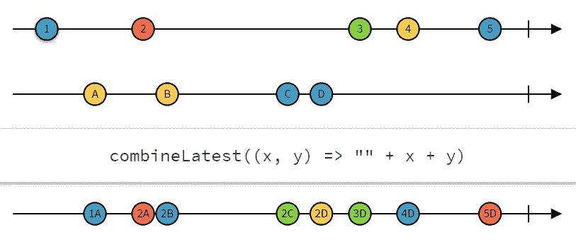
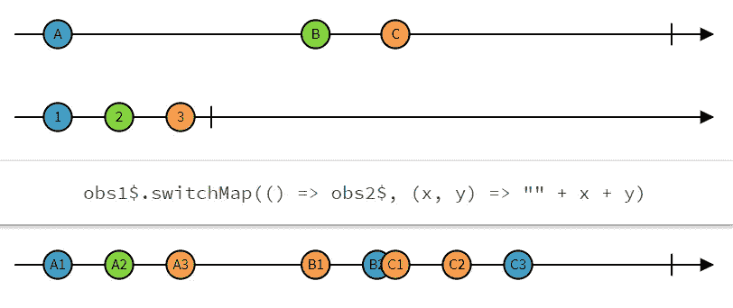
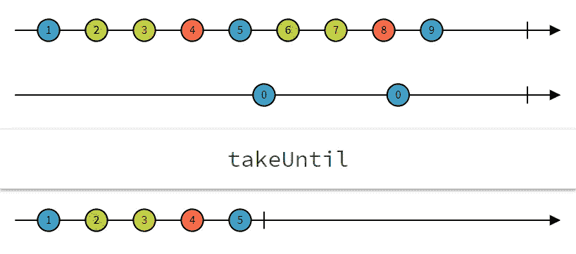

# 最常用的 RxJS 运算符(有用例)

> 原文：<https://javascript.plainenglish.io/most-frequently-used-rxjs-operators-with-use-cases-7645639317fc?source=collection_archive---------2----------------------->

## 反应式编程的须知操作符

习惯于 AJAX 调用承诺的开发人员总是会问同一个问题:承诺工作正常，为什么我们需要 RxJS？

我就反过来问，你知道如何用 ***大数据******高复杂度*** 来 ***管理和扩展*** 应用吗？您在处理复杂的 ***并行或顺序异步调用*** 时遇到过麻烦吗？

为了解决这些问题，我想分享以下 Angular/React 项目中最常用的 RxJS 操作符: ***pipe，of，map，first，combineLatest，switchMap/mergeMap，以及 takeUntil*** 。除了解释之外，我将包括真实用例的示例代码。

Photo by [Matt Bowden](https://unsplash.com/@mattj_bowden?utm_source=medium&utm_medium=referral) on [Unsplash](https://unsplash.com?utm_source=medium&utm_medium=referral)

# 先决条件

RxJS(Reactive Extensions for JavaScript)是微软开发的一组库，用于在反应式编程的基础上编写异步和基于事件的程序[1]。

它是一种声明式编程范式，关注数据流和变化的传播[2]。

如今，反应式编程对于管理和扩展具有大数据量和高复杂性的应用程序至关重要。

除了 JS，它还支持其他语言，如 Java。Net、Scala、Clojure 和 Swift。

在阅读本文之前，您必须了解以下要素:

## ***可观察的***

可观察值是返回一系列值的函数。默认情况下，一个可观察对象是冷的，当第一个订阅者到达时，它会变热，这意味着在第一个订阅完成之前，它不会发出值。如果想了解更多，请在 [***详解***](https://v6.rxjs.dev/guide/observable) 中阅读。

## ***订阅***

订阅代表一个可观察的执行。如前所述，它通过调用方法”将可观察对象变成热对象。订阅”。然后，将为每个发出的值执行该方法中的回调函数。如果想了解更多，请在 [***详细***](https://v6.rxjs.dev/guide/subscription) 中阅读。

与通常只运行一次的承诺代码不同，Observables 可以不断发出值，订阅将接收并处理它们。

下面的例子是一个非常简单的用例:

首先，我们有一个由数字 1、2、3、4、5 和 6 组成的可观测序列。然后我们订阅打印每个发出的数字。

那么我们如何查询那些由可观察对象表示的异步数据流呢？答案是运营商。算子通过变换改变原来的可观测值，返回一个新的可观测值。你可以在这里 找到运营商 [***的完整列表。***](https://v6.rxjs.dev/guide/operators)

强烈推荐你在名为[***rx marbles***](https://rxmarbles.com/)的网站上用交互图玩不同的运营商。

# 最常用的运算符

在这一部分，我将逐一介绍我以前的 Angular / React 项目中最常用的操作符:

## 👉管

从 ***RxJS 5.5*** 开始，管道运算符就成了运算符的正确使用方式。您可以将它视为一个函数，它将一个可观察对象作为输入，用不同的操作符将所有转换聚集在一起，然后返回另一个可观察对象。正如您在下面的示例中看到的，它提高了代码的可读性，并且更适合于树抖动。

## 👉的和映射

的运算符用于在序列中发出值。并且算子映射用于将项目的可观察值转换成不同项目的另一可观察值。以下示例显示了如何将源可观测值的每个值转换为其平方值:

## 👉过滤器

filter 操作符将根据给定的谓词函数过滤来自源可观察值的值。下面的例子允许从源可观测值中过滤偶数。

## 👉第一

如果我们只对满足可观察对象发出的谓词条件的第一项或第一个值感兴趣，我们可以使用这个操作符。

## **用例:** **某 app 的 sing up 页面**

当用户填写完所有信息后，他将点击“验证”按钮提交。因此，我们需要通过名为“userService”的 HttpClient 服务将对象“user”发送到我们的后端 API。但是我们只需要获得第一个 HTTP 结果，以显示一次“成功”消息。第一个操作符是这种情况的完美候选。

## 👉组合测试

该运算符组合多个可观察值来创建一个可观察值，其值通过每个输入可观察值的最新值来计算。每当任何输入可观测值发出一个值时，它使用所有输入的最新值计算一个公式，然后发出该公式的输出[3]。

在下图中，有两个源可观测量，运算符将结合每个可观测量的最新元素生成一个新值。

from [https://rxmarbles.com](https://rxmarbles.com)

## **用例:实时文本过滤器**

我们得到一个产品页面，其中列出了所有产品，并允许用户通过输入文本按类别和颜色进行筛选。以下带有 combienLatest operate 的代码允许 ***在过滤器中实时显示输入类别和国家的产品*** 。为了实现，我们需要两个 BehaviorSubject 来获取类别过滤器和国家过滤器的最后值。每次用户更改这些过滤器输入的值时，产品都将被过滤。

## 👉切换映射/合并映射

运算符 switchMap 将每个源值投影到一个可观测值，该可观测值合并到输出可观测值中，仅从最近投影的可观测值中发出值[4]。换句话说，它 ***将每个值映射到一个可观测值*** ，然后 ***展平*** 所有这些可观测值中唯一输出的可观测值。

from [https://rxmarbles.com](https://rxmarbles.com)

## **用例:产品详情页面**

我们需要使用 ParamMap 从当前路线(例如“/product/123”)获取产品 id，然后通过调用后端 API 获取所获取 id 的产品详细信息:

还有就是 ***mergeMap*** 运算符，两者还是挺像的。不同之处在于，switchMap 取消仍在进行中的先前的 HTTP 请求，而 mergeMap 让它们完成。所以你可以根据你的需要选择其中之一。

## 👉直到

takeUntil 订阅并开始镜像源可观察对象。它还监视您提供的第二个可观察的通知程序。如果通知程序发出一个值，输出可观察对象停止镜像源可观察对象并完成。如果通知程序没有发出任何值并完成，那么 takeUntil 将传递所有值[5]。

在下图中，第一个彩色的可观察对象是源可观察对象，bleu 中的第二个是通知者可观察对象。当通知程序发出第一个值时，源可观察对象的镜像停止。

from [https://rxmarbles.com](https://rxmarbles.com)

## **用例:管理角度组件的取消订阅**

假设当我们的组件被销毁时，我们有两个订阅要取消订阅。我们可以手动取消订阅:

然而，我们可以用 takeUntil 操作符以更好的方式来实现它。为此，我们应该使用一个名为 destroy$的 [RxJS 主题](https://v6.rxjs.dev/guide/subject)(一种特殊类型的多播可观察对象)。时，它会发出一个值。调用 next()方法。当我们在 ngOnDestroy 生命周期挂钩中这样做时，组件中的所有订阅都将终止。

一个巨大的好处是，我们不再需要保存对我们的订阅的引用。

如果您有任何问题或对任何相关话题感兴趣，请随时在下面写下您的评论或通过 [LinkedIn](https://www.linkedin.com/in/zhichuan-jin-baa0168a/) 或 [Twitter](https://twitter.com/Zhichuan_JIN) 联系我！

# 参考

[1]:【https://github.com/Reactive-Extensions/RxJS 

【2】:[https://en.wikipedia.org/wiki/Reactive_programming](https://en.wikipedia.org/wiki/Reactive_programming)

【3】:[https://v6.rxjs.dev/api/index/function/combineLatest](https://v6.rxjs.dev/api/index/function/combineLatest)

[4]:[https://v6.rxjs.dev/api/operators/switchMap](https://v6.rxjs.dev/api/operators/switchMap)

[5]:[https://v6.rxjs.dev/api/operators/takeUntil](https://v6.rxjs.dev/api/operators/takeUntil)

*更多内容看* [***说白了. io***](http://plainenglish.io)