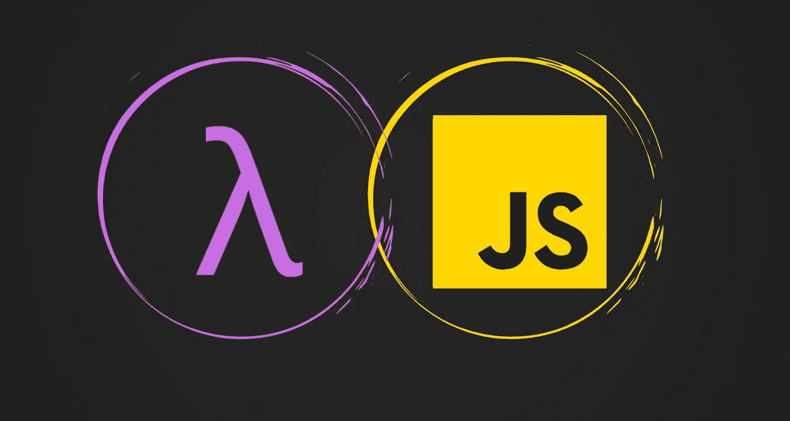

# 编程语言中最重要的特性！

> 原文：<https://javascript.plainenglish.io/most-important-feature-ever-put-in-a-programming-language-5b139e1e170f?source=collection_archive---------21----------------------->

## JavaScript 如何借鉴 Lisp 几十年前的思想

[🖌](https://www.twitter.com/tweetsbysoma)

> 本文是这个系列的第一部分，在这里我们将探索闭包的起源、幕后工作、现实生活中的用法以及与闭包相关的面试问题。

# 介绍

几乎所有编程语言最基本的标准可能是在变量中存储*值的能力，*，以及以后访问或更改这些特性的能力。

如果没有这样的想法，一个程序可以完成某些任务，但是它们会受到很大的限制。在我们的程序中包含变量会引发最有趣的问题，比如这些变量在哪里？换句话说，它们储存在哪里？此外，更重要的是，我们的程序如何在需要时发现它们？

这些调查解决了对一套全面表征的规则的需求，这些规则用于在某个领域中保存变量，并在以后的时间里发现这些变量。我们称这种规则的排列:**范围**

> 变量的作用域是程序源代码中定义变量的区域。变量的作用域是程序中变量可见和可用的部分。

当一个变量被[定义](https://icarus.cs.weber.edu/~dab/cs1410/textbook/1.Basics/definitions.html#definition)在一个块内时，它的作用域被限制在那个块内；也就是说，在块内定义的变量在定义块外是不可见或不可访问的。

让我们利用 JavaScript 中的伪代码来理解上述语句的含义。

Generally wherever you see curly braces is a block scope

上面我们有两个积木，一个在另一个里面。第二个块可以看到它的变量和外部块的变量。第一个块只能看到自己的变量。

我假设现在您已经熟悉了块范围的概念。

现在，让我们对函数做同样的事情。把 ***函数想象成一个简单的块*** 加上一点点 ***额外的机制*** ，这样你就可以在将来调用它，它就可以执行特定的任务了！

我们得到了 ***内部函数*** ，可以看到变量`a`和 `b`，以及 ***外部函数*** ，只能看到变量`a`。

> 这意味着函数中定义的参数和变量在函数外部是不可见的，而函数中任何地方定义的变量在函数中任何地方都是可见的。

我们可以用集合来表示这种关系。

Yellow is the set of variables, the Inner function can see. Purple is the set of variables, the Outer function can see.

我们做的和 block 一样，但是这里我们用内部函数的一组变量来描述这种关系，这些变量包围了外部函数的集合。这种**外函数**的变量从**内函数**的*包围*就是我们所说的*闭包*。

由于作用域的工作方式，这似乎是一个简单的想法——就像上面那样添加嵌套函数，让内部函数**的变量访问外部函数**的变量。****

看似显而易见的关系需要很长时间才能形成。

# 花了多长时间？

你看到了吗？从 Lisp 到 Scheme，我们花了将近 20 年才发现闭包，因为你需要一门有三样东西的语言。

*   词法范围🔗
*   嵌套函数🖇
*   [功能，为一级值](https://developer.mozilla.org/en-US/docs/Glossary/First-class_Function)。🚀

自 20 世纪 60 年代以来，我们有了编程语言，这些语言得到的函数将具有三个中的两个，但直到 ***Scheme*** 我们才得到一个同时具有三个的函数。

Scheme 是麻省理工学院的一项实验，旨在了解 70 岁出头的卡尔·休伊特的[演员模型](https://arxiv.org/vc/arxiv/papers/1008/1008.1459v8.pdf)。实验[不成功](https://web.archive.org/web/20060615225746/http://www.brics.dk/~hosc/local/HOSC-11-4-pp399-404.pdf)，他们无法完全实现演员模型。然而，他们发现了一种新的编程方式，使用**闭包编写代码。**

这种方式 scheme 成为了第一种引入闭包的语言，但是 scheme 并不是第一种将这种思想带入主流的语言。你能猜出是哪种语言吗？

## 果然是 **JavaScript** ！

[🖌](https://www.twitter.com/tweetsbysoma)

其他语言如 Ruby、Python 和 C#紧随其后。

闭包之所以花了这么长时间才出现是因为这个问题:

Pseudocode in JavaScript

所以，我们得到了和以前一样的东西，我们得到了一个内部函数和一个外部函数。但是这一次，内部函数在外部函数执行之后仍然存在，因为外部函数正在返回内部函数。

因此，我们将调用外部函数，它将在堆栈上分配变量`a`。它将返回函数`Inner()`并退出。

现在我们想要调用函数`Inner()`，但是它想要访问变量`a`，而`a`已经不在堆栈上了！

我们花了几十年才想出该怎么做！
*原来解决办法是* ***相当琐碎的*** *！*

# **是什么？**

**我们将在** [**系列的下一篇文章**](/grokking-closure-in-javascript-7e8194924398?sk=0f6e01511d6400590608f10f0ea85017) **中看到，届时我们将** [**探究闭包的概念**](/grokking-closure-in-javascript-7e8194924398?sk=0f6e01511d6400590608f10f0ea85017) **并学习 JavaScript 如何在内部实现闭包。**

# 本系列的下一篇文章再见。😊

## [1。编程语言中最重要的特性](/most-important-feature-ever-put-in-a-programming-language-5b139e1e170f?sk=baff3bd18de9be10a66bb27eb2d265d4)

## [2。在 JavaScript 中寻找闭包](/grokking-closure-in-javascript-7e8194924398?sk=0f6e01511d6400590608f10f0ea85017)

## [3。闭包的实际用法](/practical-usage-of-closures-in-javascript-b3203770ba2?sk=dc404a83106d791c943d16b6b389e26c)

## [4。终极 JavaScript 面试问题—结束](/ultimate-interview-questions-on-javascript-closures-8dd12a210677?sk=4d15f7e3756b76a9e2886b97515975b1)