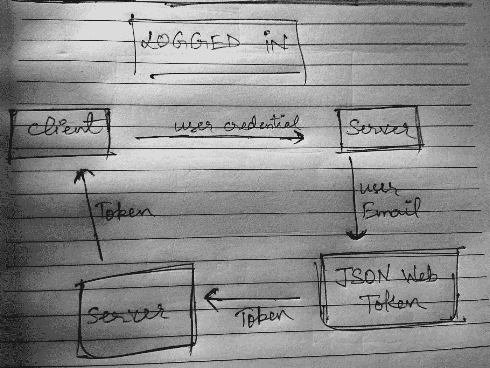
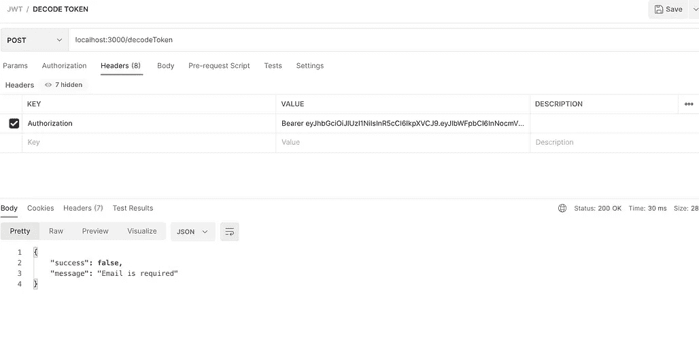
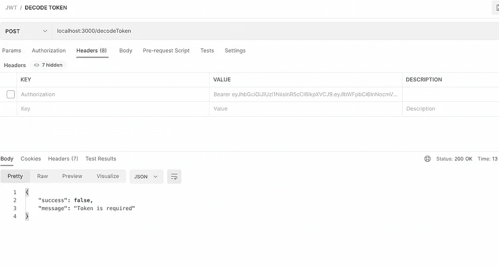
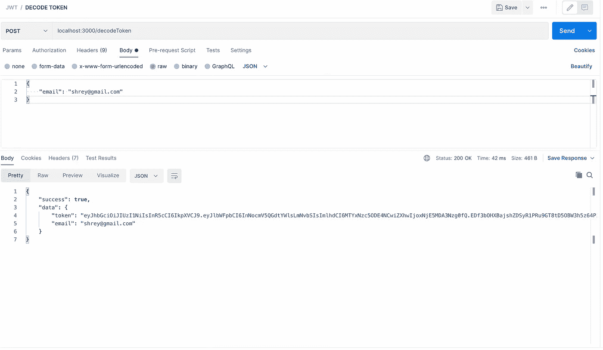

# 通过 JSON Web 令牌进行安全认证(JWT)

> 原文：<https://javascript.plainenglish.io/most-secured-authentication-via-json-web-token-a45ae52a76df?source=collection_archive---------2----------------------->

## 使用具有三层保护的 JSON web 令牌创建身份验证过程


Photo by [Markus Winkler](https://unsplash.com/@markuswinkler?utm_source=medium&utm_medium=referral) on [Unsplash](https://unsplash.com?utm_source=medium&utm_medium=referral)

JSON Web Token 是两层受保护的令牌，使用三个连续的进程联合在一起生成，这三个进程是 JSON Web Token 的组成部分，如下所示

*   **报头**——报头部分定义了用于创建令牌的算法
*   **签名** -通过签名解码令牌并描述其真实性的部分。
*   **Payload** —顾名思义，以 64base 编码的安全形式封装任何需要通过 token 发送的数据。

有关如何创建令牌的更多参考和深入说明，请参考下面的链接。

```
[https://jwt.io/introduction](https://jwt.io/introduction)
```

# 概观

这个博客背后的想法是提供一个如何在后台与 JWT 工作的概述，并创建一个认证用户的过程。

*   我将为我们应用程序的用户创建**注册**、**登录**和**解码**端点。
*   用户创建或登录成功后，向用户提供使用用户电子邮件创建的 JWT 令牌。
*   每个生成的令牌在其相应的有效负载中都有过期时间和用户数据。
*   一旦用户登录，对我们服务器的所有其他请求都应该在头中使用这个令牌。
*   一旦在另一个 API 的头中收到令牌，我们将对其进行解码，以描述其真实性。
*   最后，一旦符合的令牌是有效的令牌，用户将被允许向我们的服务器发出请求。



Overview Flow Chart

# 编写代码

我将从使用 express 设置一个基本存储库开始。继续安装我们将使用的所有必需的软件包。

```
yarn add express, body-parser, cors, nodemon, axiox, jsonwebtoken
```

添加包后，在 **authRoutes.js** 文件内的 routes 文件夹中创建一个登录和注册的基本路径。

Basic routes of logged in and signup

通过重定向到端点/登录和/注册本地主机端口 3000 来测试路由。

# 正在创建令牌

在生成安全的 JWT 令牌时，其基本思想是使用密钥和用户电子邮件对令牌进行签名。

–我们将使用的密钥是我们手动添加的密钥，电子邮件将是 API 请求中提供的用户电子邮件 id。

–我们将使用 JWT 的 **sign** 方法来签署和生成我们的令牌。

```
jwt.sign({ email: email},process.env.JWTSecretKey,{expiresIn:'14d'})
```

–我们使用电子邮件来签署令牌，因为每个用户都有一个唯一的电子邮件 id 来登录我们的服务器。没有两个用户会有相同的电子邮件 id。

–我们的令牌是使用用户**电子邮件 id** 和**密钥生成的。这里的键是 JWTSecretKey——请注意，这个键应该添加到 env 文件中。**

–使用 dotenv npm 包访问环境文件常量

–添加 dotenv npm 包并运行根 server.js 中的`**dotenv.config()**`

```
// Terminal 
  **yarn add dotenv**// server.js
 **const dotenv = require('dotenv'); 
 dotenv.config();**
```

–使用 **process.env** 方法，您可以从**中获取所有常量。env** 文件。

# 发送签名令牌

我们将向用户发送令牌以响应**/登录**端点。我们还可以检查用户发送的电子邮件的常规快递，并在电子邮件格式错误时返回一个错误。

login.js

在 API 的响应对象中，我们将发送使用 JWT.sign()方法生成的令牌。请将这个令牌存储在前端或后端的数据库中，因为我们确实需要这个令牌向我们的服务器发出 API 请求。

# 解码令牌

–为了解码令牌的真实性，我们再次需要用户电子邮件和令牌。

–JWT 本身提供了一个名为 verify 的方法，该方法接受发送的令牌和来自`env`文件的 JWTSecretKey 作为参数。

–为了向您的令牌添加额外的安全层，我们已经使用相应用户的电子邮件注销了令牌，因此我们现在将检查该电子邮件是否存在于令牌中，然后将该电子邮件与 API 请求中发送的用户电子邮件进行交叉检查。

–在这种方法中，我们遵循以下步骤—

*   我们首先分别检查请求正文和标题中的电子邮件和标题。
*   然后使用 **jwt.verify()** 方法检查令牌的有效性
*   另一层保护是检查解码的令牌有效负载是否包含用户电子邮件，并与请求正文中发送的电子邮件交叉检查该值。

–这样，我们可以通过令牌检查用户的真实性，一旦用户是有效令牌，我们将允许用户访问我们的服务器和应用程序。

–以下是 [Postman](https://www.postman.com /) 桌面应用程序在 **/decodeToken** 端点所有阶段的截图。



The left image is when no email is added and the right image is when no headers are given in request



[Postman](https://www.postman.com/) screenshot from the desktop.

# 结论

这是最安全的方式来检查用户的真实性，让他/她访问我们的服务器。JWT 本身是一个非常安全的方式使用 2 层安全，我们增加了一个第三层使用 JWT 的有效载荷中的数据，以提供一个更安全的方式到我们的服务器。最后，您可以直接将这些 JWT 令牌保存在浏览器的 cookie 中，或者从 Cookie 中的 API 发送令牌。这个过程有一个优点，我们只需在浏览器中检查 cookie，并在前端应用程序中检查其有效性，以便允许用户访问受保护的路由。如果你想知道更多关于如何在前端使用令牌的细节，我在下面的文章中添加了链接。

```
[https://medium.com/p/c60db33f1921?source=post_stats_page-------------------------------------](https://medium.com/p/c60db33f1921?source=post_stats_page-------------------------------------)
```

直到下一次。祝大家愉快。

```
Code => [https://github.com/shreyvijayvargiya/iHateReadingLogs/tree/main/TechLogsBackend/GettingStartedWithJWT](https://github.com/shreyvijayvargiya/iHateReadingLogs/tree/main/TechLogsBackend/GettingStartedWithJWT)
```

*更多内容请看*[***plain English . io***](https://plainenglish.io/)