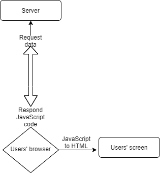
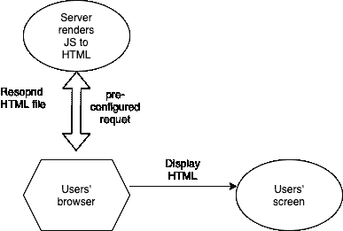

# 为什么您应该从 React Already 继续前进

> 原文：<https://javascript.plainenglish.io/move-on-from-react-already-1496384e36db?source=collection_archive---------8----------------------->

## 对 React 开发人员的职业生涯至关重要的建议

所以首先对吓人的标题(和图片)表示抱歉。我真的不想你就这么放弃反应。我必须引起您的注意，因为这篇文章对您作为 React 开发人员的职业生涯至关重要。

我是 React 库的忠实粉丝，对我来说，大多数前端开发者都选择用 React 开发他们的应用/网站(从 Vue 或 Angular 中选择)。

React 确实是市面上最有名的库。例如，22%的开发工作(！)在英国都有相关的反应。

你注意到我把 React 叫做图书馆了吗？但是 React 不就是一个框架吗？

在本文中，我们将解释为什么 React 被称为库而不是框架，但是此外，我将向您展示如何将 React 库提升到两个令人惊叹的框架之一——Gatsby . js 或 Next.js。这将真正提高您的 React 技能！

# React 是一个库

当你进入 Reacts 网站时，你会看到以下 React 的简明解释:

> 用于构建用户界面的 JavaScript 库

好，所以 React 绝对是库。但是为什么呢？React 与它的两个主要竞争对手——Vue 和 Angular 从定义上来说都是框架——有什么不同？

答案其实就在上面 React 团队的简短引用中。React 是一个用于构建用户界面的库。这意味着 React 只告诉你如何做一件事——构建用户界面。

关于你想在应用中做的其他事情——比如创建表单、运行自动化测试、发出网络请求等等——React 并没有告诉你如何去做！您可以选择想要创建这些功能的第三方库。

像 Vue 和 Angular 这样的框架就不是这样了——它们已经为你准备好了开箱即用的一切。还有另一个术语——React 是“*unpinionated*”(你可以选择在你的应用中使用什么第三方库)，而 Vue 和 Angular 是“ *opinionated* ”。

# 有时候没有观点更好

所以听起来 React 处理起来很麻烦。我的意思是，每次你设置 React 应用程序时，你都需要安装所有这些第三方软件包。

好消息是你可以，有时你应该使用 React 作为一个框架，从 React 的一个框架开始你的 React 项目——Next 或 Gatsby。我们将在下一节中看到这一点。

我想指出 React“仅仅”是一个库的一大优势。这一事实使得 Reacts 的第三方库与开发者的注意力竞争。众所周知，有竞争的地方质量就会提高。

例如，如果你想让一个库处理 React 中的表单，你有:React-hook-form、Formik、KendoReact form、React final form 等等。他们都很棒(我个人更喜欢使用 React-hook-form)，而且由于那场比赛，他们一直在变得更好！

我个人认为这是 React 如此受欢迎的原因之一——它非常灵活，拥有海量的第三方库。

# 有时候你只需要有自己的观点

好吧，那真是太好了。React 有很多第三方库，你可以选择最适合你的库。

但是有时你需要的不仅仅是添加“一些”库。有时你需要遵循一系列严格的规则来产生你想要的结果。有时候你需要一个有观点的框架。

在我解释 Reacts 的“框架”之前，我想从 Reacts 的团队网站上复制粘贴一下他们的观点:

> React 团队主要推荐这些解决方案:
> 
> 如果你正在学习 React 或者创建一个新的[单页](https://reactjs.org/docs/glossary.html#single-page-application)应用，使用[创建 React 应用](https://reactjs.org/docs/create-a-new-react-app.html#create-react-app)。
> 
> 如果你正在用 Node.js 构建一个服务器渲染的网站，试试 [Next.js](https://reactjs.org/docs/create-a-new-react-app.html#nextjs) 。
> 
> 如果你正在建立一个静态的面向内容的网站，试试 [Gatsby](https://reactjs.org/docs/create-a-new-react-app.html#gatsby) 。

你能看见吗？React 团队自己明确告诉我们:将 React 用作库并不总是符合您的需求。

准确地说，如果你是一名 web 开发人员，仅仅将 React 作为一个库来使用，在大多数时候并不能满足你的需求。

让我们试着打破 Reacts 团队在上面引述中告诉我们的东西:

*   Reacts 的团队建议我们将 React 用作一个库，原因有二——要么你正在学习 React，要么你正在创建一个单页应用程序。现在，我想澄清第二部分。在这种情况下，单页面应用程序并不意味着您的某个页面不会重新加载多个路由。这意味着你真的在构建一个单页的应用程序，或者你正在将一个应用程序集成到你的网站中。在这两种情况下，你最好使用 React 作为一个库，因为如前所述，它更灵活。
*   如果你正在构建一个服务器渲染的网站，reactions 的团队建议我们使用 Next.js。我们将在下一节深入讨论 Next.js，但同时，我们只想说，如果你正在构建一个全栈网站，那么你应该使用 Next.js 作为框架。
*   最后，Reacts 的团队告诉我们，如果你正在构建一个静态的面向内容的网站，可以使用 Gatsby 作为框架。为了简化，我们将给出面向静态内容的网站的例子:登陆页面、博客、电子商务、作品集。现在我希望这一点很清楚——上面的例子都是静态网站，意思是它们都是按照存储在服务器上的方式交付给用户的 web 浏览器的。面向内容仅仅意味着网站上的内容是灵活的，你可以很容易地改变它。我们将在盖茨比部分更详细地解释这一切。

# React 生产框架

为了理解使用 Next.js 作为框架的巨大好处，我们需要首先解释什么是服务器端渲染。

您可能已经知道，React 使用了一个叫做虚拟 DOM 的概念来在屏幕上呈现 HTML 页面。它的意思仅仅意味着用户从服务器获取的大部分是 JavaScript 代码。然后，用户的浏览器将 JavaScript 代码插入 HTML，在屏幕上呈现 UI。让我们看看下图:

添加替代文本

这个过程有几个问题。最主要的一点是，将 JavaScript 转换成 HTML 的过程对于用户的 CPU 来说是非常低效的。至少对于页面的第一次加载是如此。

这就是 SSR(服务器端渲染)的用武之地。服务器将把 JS 转换成 HTML 的繁重工作交给自己，并返回给用户一个易于处理的 HTML 页面。它看起来像这样:

添加替代文本

除了这个惊人的特性(SSR)之外，Next.js 还提供了更多的功能！我们不会涵盖所有内容，因为这不是 Next.js 课程，但让我们提到其中的一些:内置 CSS 支持、图像优化、字体优化、快速刷新路由支持等等！我真的鼓励你从 Next.js 的官方文档中了解这一切。

# 网络中最难的部分，变得简单。

Gatsby 使用了与 Next 略有不同的概念来呈现页面。顾名思义，Gatsby 被称为静态站点生成器。这与服务器端呈现的工作方式非常相似，唯一的区别是 Gatsby 在构建时呈现页面，因此每个用户都获得相同的输出。它看起来像这样:

添加替代文本

如你所见，唯一的区别是盖茨比在构建时渲染。这就是为什么《盖茨比》对我们之前提到的网站类型如此重要:登陆页面、博客、电子商务、作品集。它们都向输入它们的每个用户提供相同的数据。

但是盖茨比不仅仅是一个静态站点生成器。事实上，Next 也有能力充当静态端发生器。那么我们为什么要用盖茨比呢？

首先，Gatsby 真的是为了服务静态文件而优化的。如果你曾经进入一个由 Gatsby 创建的网站，你会被它的加载速度震惊。但除此之外，盖茨比有一个非常棒的插件生态系统。这意味着你可以通过简单的配置将你的网站插入到各种 API 中。我再一次鼓励你深入研究盖茨比的文档并了解它的全部内容。

# 摘要

在本文中，我向您展示了作为一名 web 开发人员，为了使用 React，您必须学习 React 的框架。我们看到了非常适合呈现动态内容的 Next.js 和非常适合呈现静态内容的 Gatsby。

在某些用例中，您可能希望坚持将 React 仅作为一个库。这些情况可能是:

*   你还在学习反应。
*   你只是用 React 实现了网站中的一些功能。
*   您计划将您的应用程序用作单页应用程序，并希望能够轻松地将其转换为 Android 应用程序(使用 React native)。

我希望我成功地鼓励你继续学习 React 的框架——Gatsby 和 Next.js。我认为你会真正喜欢使用它们，并且它将提升你作为 React 开发人员的职业生涯。

*更多内容看*[***plain English . io***](http://plainenglish.io/)