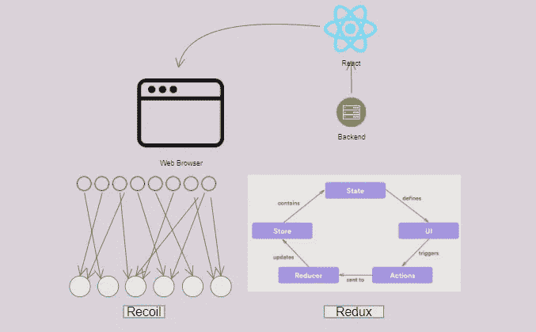

# Redux 与反冲:为什么我从 Redux 转向反冲来进行状态管理

> 原文：<https://javascript.plainenglish.io/moving-from-redux-to-recoil-42aa9d9cfaad?source=collection_archive---------0----------------------->

Recoil.js VS Redux.jS

这篇博客解释了为什么 React 开发者需要从 [Redux](https://redux.js.org/) 转移到[反冲](https://recoiljs.org/)。

# 介绍

管理应用程序状态总是一项困难的任务。React 直到最近才拥有自己的状态管理工具。React 开发人员添加了一个新的状态管理 API，称为 Context API。它有很多限制，并且只存储一个值。如果我们需要有多个状态，那么我们需要有多个`context providers`。这使得 React 组件树相互嵌套。这使得代码难以阅读。对于开发人员来说，使用上下文 API 管理复杂的状态也是一项困难的任务。

使用第三方状态管理库，像 Redux 有一定的局限性。设置 Redux 的样板文件很复杂。用 Redux 设置 React 需要写很多东西。使用 Redux 管理具有巨大状态的复杂应用程序也很困难。

反冲(React.js 的新状态管理库)解决了这些问题。这是很容易和最少的设置。它认为状态是原子。原子可以用在任何反应组分中。

为了用 Redux 区分反冲，我用两个库创建了同一个 app。林挺的反冲需要多达 56 行代码，而 Redux 的相同应用需要多达 100 行代码。

# 什么是后坐力？

反冲是一个 React 的状态管理库。

*   很容易设置。
*   它像 React 一样工作和思考。
*   它使用钩子来检索状态和更新状态。
*   它使用纯函数来查询异步数据。

# 原子

它储存了真理的来源(状态)。它可以是任何 JavaScript 类型，比如对象、数组或简单的数字。

*   通过将带有**键**和**默认** *属性*的对象传递给`atom`函数来定义原子。

Recoil atom

*   状态(存储在原子中)可以在任何反应组件中使用。

using Recoil value

*   状态(存储在 atoms 中)可以更新！注意，我们使用了`useRecoilState`钩子来代替`useRecoilValue`。

updating Recoil state

# 反冲根

为了使用使用反冲值的`UsersList`组件，我们需要将它包装在反冲库中的`RecoilRoot`组件中。

# 结论

作为一名 React 开发人员，我转向反冲，因为它非常容易使用。设置状态管理不需要复杂的样板文件。它使用钩子来读取或更新组件内部的状态。值得一试。

还有更多关于反冲的问题需要解决，比如`selectors`(衍生状态)。要找到更多关于后坐力的信息，请访问[后坐力官方文档](https://recoiljs.org/docs/introduction/motivation)，其中涵盖了更多概念。

*更多内容尽在*[***plain English . io***](http://plainenglish.io/)