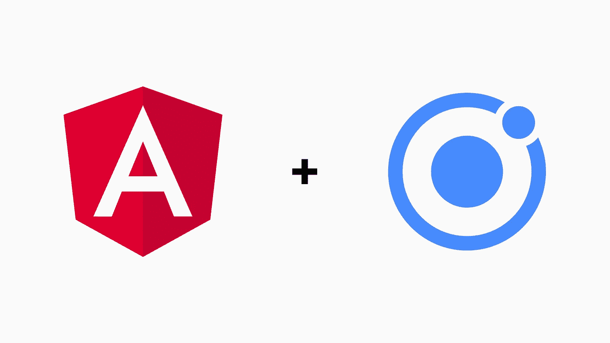

# 角度和离子应用的多项目设置

> 原文：<https://javascript.plainenglish.io/multi-projects-setup-for-angular-and-ionic-applications-70bc1d918758?source=collection_archive---------8----------------------->



Image by Author

# **简介**

您是否曾想过如何创建一个 Angular workspace，其中包含尽可能多的 Angular 和 Ionic 应用程序，这些应用程序使用通用的`angular.json`、`package.json`、`tsconfig.json`和`node_modules`文件和文件夹？

## **好处**

首先，让我们来看看使用这种方式来构建你的下一个基于角度和离子的项目会有什么好处:

*   所有项目的单一存储库。
*   在相关应用程序之间共享库的更简单的方法。
*   更容易重构项目。
*   由于只有一个`node_modules`，安装更容易。不需要一遍又一遍地安装相同的软件包。

## 文件夹结构

为了重用`angular.json`、`package.json`、`tsconfig.json`和`node_modules`文件和文件夹，我们的文件夹结构应该是这样的:

```
📁 node_modules
📂 projects
  - 📂 angular-app1
  - 📂 angular-app2
  - 📂 angular-app3

  - 📂 ionic-app1
  - 📂 ionic-app2

  - 📂 library1
  - 📂 library2
📂 www
📂 resources
📂 platforms
📄 angular.json
📄 config.xml
📄 ionic.config.json
📄 package.json
📄 tsconfig.json
📄 tslint.json
```

# **实施**

首先，我们需要创建一个空的角度工作空间。
包含选项— createApplication=false 以避免在工作区文件夹中从头创建应用程序非常重要。

**第一步。**让我们创建角度工作空间

```
ng new angular-multi-projects --createApplication=false
```

**第二步。**让我们创建第一个角度应用程序

```
ng generate application angular-app1
```

***注意*** :你可以使用上面提供的相同命令创建其他角度应用。所有的应用程序都将在`projects folder`下创建，它们也将被添加到`angular.json`文件中，这个文件可以在根文件夹中找到。

**第三步。创建 Ionic 应用程序**

## **走错了路**

为了创建 Ionic 应用程序，我们不会使用`ionic start ionic-app1`命令。该命令将创建一个新项目，包含新角度项目的所有默认文件(`angular.json`、`package.json`等)。)在工作区文件夹(我们在步骤 1 中创建的根文件夹)中。
另外，如果你想保持上面的结构，把当前的工作目录改变到项目文件夹(`cd projects`)并在那里使用(`ionic start ionic-app1`)创建 Ionic 应用程序并不是一个好主意。这将创建我上面提到的 Ionic 应用程序，但是在这种情况下，它们将在项目文件夹下创建。

## 正确的方式

如果我们想让 Ionic 应用程序与简单的 Angular 应用程序和谐共存，我们需要在基本的 Angular 应用程序上使用 Ionic。
也就是说，Ionic 应用程序将使用我们用于创建基本角度应用程序的相同命令来创建。

```
ng generate application ionic-app1
```

现在我们有两个选择:

**选项 1** :使用命令为角度应用添加离子。

```
ng add @ionic/angular
```

小心，这种方法可能不会像你一开始期望的那样起作用。

*   它会自动在你的 app 的`src folder`里面创建`theme folder` `variables.scss`。

现在这取决于你创建的所有东西的顺序，尽管`ng add`应该添加到`angular.json`里面的`defaultProject`，我已经意识到实际上不会是这样的。所以最好检查以下情况:

1.  如果在这一步只创建了一个角度应用程序，那么一切都创建正确。
2.  如果在运行`ng add @ionic/angular`之前已经创建了多个角度应用程序，该命令可能会将离子样式、离子图标和/或构建任务附加到另一个角度应用程序。如果是这种情况，您必须按照下面提到的例子手动将所有内容移动到`angular.json`中的正确应用程序。

**选项 2** :手动将离子安装至角度应用

首先，您必须安装或检查您是否已经安装了以下软件包:

```
npm install @ionic/angularnpm install @ionic/angular-toolkit
```

您必须使用 Ionic 的链接(在下面的参考资料部分提供),并从每个链接中复制高亮显示的代码`angular.json`,以将您想要的应用程序转换为 Ionic 应用程序。在`styles`下添加样式，在`assets`下添加 ionicons，并在`angular.json`中的`e2e`之后立即构建任务。确保将`${projectName}`替换为构建任务的角度应用的实际项目名称。
您还必须自己在项目下创建带有`variables.scss`的`theme folder`和`global.scss`。

***注意*** :无论你从上面的选项中选择什么，对于每一个 Ionic App，在`angular.json`中你都应该有一个类似上面呈现的结构。