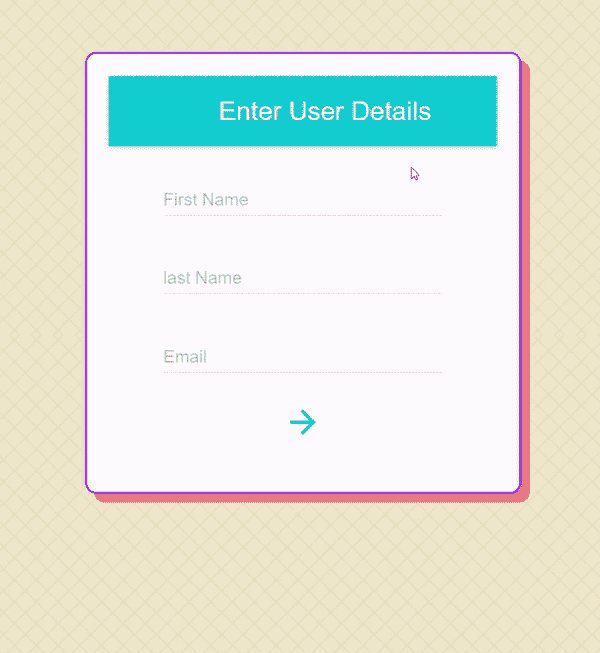
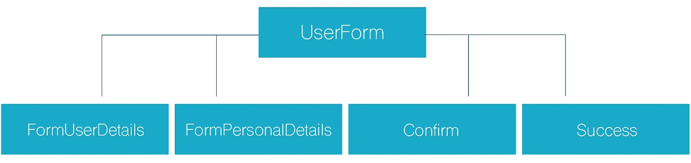
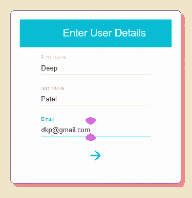
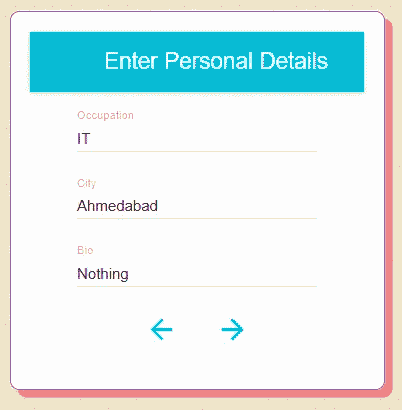
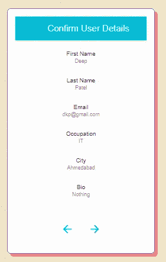
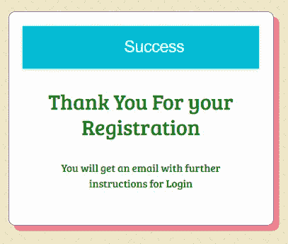

# 使用 React 和 Material-UI 的多步表单

> 原文：<https://javascript.plainenglish.io/multi-step-form-using-react-and-material-ui-29ff7f7cf049?source=collection_archive---------4----------------------->



[**Multi-Step-Form**](https://deep-0301.github.io/multi-step-form/)

# 简介:

表单是任何应用程序最重要的部分之一。我将使用最流行的 web 应用程序框架构建一个多步骤表单，[](https://reactjs.org/)****和[**Material-UI**](https://material-ui.com/)**。**在 React 应用程序中处理和管理表单很难，可能是一个难题，尤其是对于多步表单。****

****表单的第一步要求提供基本信息(名、姓和电子邮件)。第二步要求他们输入他们的城市、职业、简历，最后一步要求他们确认用户的详细信息。Material-UI 用于 React 组件，以实现更快更简单的 web 开发。建立自己的设计体系，或者从材料设计开始。****

****[点击此处](https://github.com/deep-0301/multi-step-form)获取代码。[点击此处](https://deep-0301.github.io/multi-step-form/)观看现场演示。****

# ******安装 React 和 Material-UI******

****在开始之前，让我们先创建一个 React 应用程序。为了信息的准确性，我在写这篇文章时使用了一个新的 React 应用程序。所以你和我一起踏上了这段旅程！****

****要安装基础项目，请在终端中运行以下命令:****

```
**npx create-react-app multi-step-form**
```

****创建 react app 后，在 VS 代码中打开这个文件夹，安装 Material-UI 依赖项。****

******Material-UI** 作为一个 npm 包提供。要安装并保存在您的`package.json`依赖项中，请运行:****

```
**// with npm
npm install @material-ui/core**
```

******Material-UI 图标**:这个包提供了 Google Material 图标，打包成一组 React 组件。在您的项目目录中安装软件包，包含:****

```
**// with npm
npm install @material-ui/icons**
```

# ****流程图:****

********

****FlowChart****

****多步骤表单我们构建主要的用户表单组件，这是渲染次要的四个组件 FormUserDetails。表单个人详细信息，确认，成功。****

******用户表单:**用户表单包含一个带有其他四个组件的开关盒。它还具有一些箭头功能。****

******form user details:**form user details 用于名、姓和电子邮件等主要数据。****

****FormPersonalDetails: 它包含城市、职业、简历等个人信息。和下一步按钮。****

******确认:**该组件显示用户在表单中提交的用户数据，请求权限表单确认。****

******成功:**显示“感谢注册”信息。****

# ******步骤 1:用户表单组件******

****UserForm 组件使用开关大小写来决定显示哪些组件。****

******说明:******

****从州开始，名、姓、电子邮件、职业、城市、简历的初始值设置为 null。并且步长值是 1。****

****continues =(*e*)*=>continues 箭头功能增加下一步的步长值。*****

****后退= ( *e* ) *= >后退箭头功能将前一步的步长值减 1。*****

****handle change =(*input*)*=>*(*e*)*=>该函数针对输入字段值，用 e . target . value 保存状态。*****

****开关(步进)随着步进值而改变。假设步长值为 1，则情况 1 返回。****

******案例 1:** 是返回带有一些 props 值的表单用户细节组件。****

******案例二:**是返回表单用户个人详细信息组件。****

******案例 3:** 是返回带有一些 props 值的表单确认组件。****

******案例四:**是返回成功消息。****

# ****步骤 2: FormUserDetails 组件****

****FormUserDetails 用于名、姓和电子邮件等主要数据。****

******解释:******

********

****首先，我们支持值 handleChange，从前面的组件继续。我们从 material-UI 导入了 MuiThemeProvider，它为 React 应用程序设置了主题。****

****AppBar 显示标题。TextField 包含 onChange 函数。箭头代表窗体的下一步。****

# ****步骤 3: FormUserPersonalDetails 组件****

******form user details:**form user details 用于名、姓和电子邮件等主要数据。****

******说明:******

********

****在这个组件中，有三个不同的文本字段职业、城市、简历。****

****这个组件是上下两个箭头。点击时，*箭头返回图标*按钮返回。****

****点击图标时继续调用*箭头前进图标*按钮。****

# ****步骤 4:确认组件****

****该组件显示用户在表单中提交的用户数据，并请求权限表单确认。****

******解释:******

********

****确认组件显示名字、姓氏、电子邮件、职业、城市等值。****

****我们用列表标签显示这个项目。ListItem 根据属性中的列表值显示列表。****

****primaryText 显示 ListItem 的标签，secondaryText 显示用户输入的文本字段名称。****

# ****步骤 5: **成功**组件****

****它显示注册的感谢信息。****

********

> ****[*点击此处*](https://github.com/deep-0301/multi-step-form) *为代码。* [*点击这里*](https://deep-0301.github.io/multi-step-form/) *进行现场演示。*****

****感谢你阅读这篇博客。如果你喜欢这个博客，或者它对你有任何帮助，请随意鼓掌并与他人分享。****

****就是这样！希望这篇文章对你有用。****

## ****进一步阅读****

****[](https://bit.cloud/blog/how-to-build-material-ui-components-with-bit-l3isiibs) [## 如何用 Bit 构建 React 材质 UI 组件

### Material UI 是一个流行的开源()UI 组件库，它将材质设计与 React 结合在一起。材料 UI 是…

比特云](https://bit.cloud/blog/how-to-build-material-ui-components-with-bit-l3isiibs) 

*更多内容请看*[***plain English . io***](https://plainenglish.io/)*。报名参加我们的* [***免费周报***](http://newsletter.plainenglish.io/) *。关注我们关于*[***Twitter***](https://twitter.com/inPlainEngHQ)[***LinkedIn***](https://www.linkedin.com/company/inplainenglish/)*[***YouTube***](https://www.youtube.com/channel/UCtipWUghju290NWcn8jhyAw)***，以及****[***不和***](https://discord.gg/GtDtUAvyhW) *对成长黑客感兴趣？检查* [***电路***](https://circuit.ooo/) ***。*********