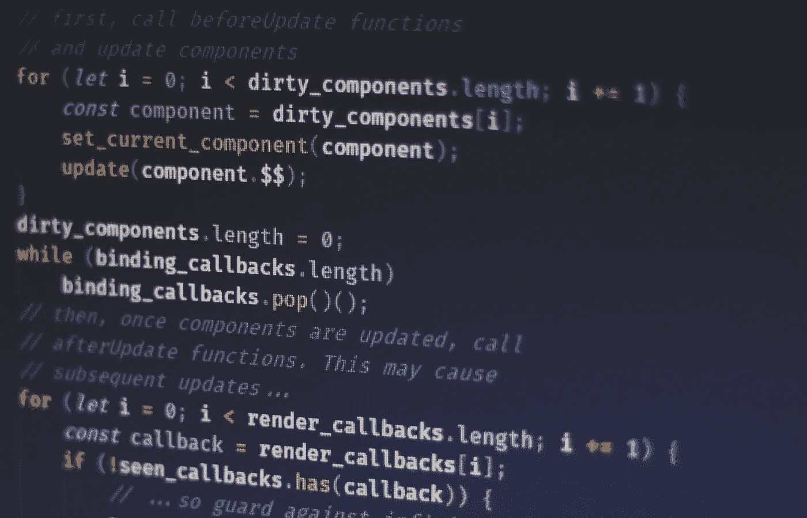

# 在 JavaScript 中创建循环的多种方法

> 原文：<https://javascript.plainenglish.io/multiple-ways-to-create-loops-in-javascript-d0e2c19d5b7a?source=collection_archive---------14----------------------->



Photo by [Ferenc Almasi](https://unsplash.com/@flowforfrank?utm_source=unsplash&utm_medium=referral&utm_content=creditCopyText) on [Unsplash](https://unsplash.com/s/photos/javascript?utm_source=unsplash&utm_medium=referral&utm_content=creditCopyText)

JavaScript 中使用循环来根据条件执行重复的任务。分析时，条件通常会返回`true`或`false`。一个循环通常会继续运行，直到定义的条件返回`false`。

JavaScript 支持不同类型的循环，通常有:

1.  for —在代码块中循环多次。
2.  for/in —遍历对象的属性。
3.  for/of-循环遍历可迭代对象的值。
4.  while —当指定的条件为真时，循环通过代码块。
5.  do/while —当指定的条件为真时，循环通过代码块。

虽然它们都做类似的事情，但在特定情况下，一些循环可能是更好的选择。这取决于您的用例。

我还将讨论两种常用的额外循环方法，它们是:

1.  forEach()
2.  地图()

附注:变量在这里用`var`关键字声明，因为这是最广为人知的，也是通常要学的第一件事。你可以在合适的地方用`let`或`const`来代替它。

我们开始解释吧！

# 1.For 循环

语法:

```
for ([initialization]); [condition]; [final-expression]) {// statement (code block to be executed)}
```

这个循环由 3 个表达式和一个语句组成:

1.  初始化(在执行代码块之前执行一次)—用起始值初始化循环变量。这个表达式通常用于定义计数器和变量。这里是你通常定义循环的起点，循环变量。例如，您可以使用*初始化表达式*来定义一个值为 0 的计数器。这意味着循环将从“0”开始。您可以为此计数器使用任何名称。
    当你想定义一些变量和计数器时，你可以用逗号分隔它们和计数器:`let counter = 0, let myVar = 5`。您可以使用任意多的变量。
    这里创建的变量的作用范围是循环。一旦循环执行完毕，它们就会被销毁。
2.  条件(定义执行代码块的条件)-在每次迭代执行之前检查的表达式。如果省略，该表达式的计算结果为*真*。如果计算结果为 true，则执行循环语句。如果计算结果为 false，则循环停止。
3.  最终表达式(在代码块执行后(每次)执行)—在每次迭代后运行的表达式。通常用于递增计数器。但是它也可以用于递减计数器。
4.  语句—要在循环中重复的代码

3 个表达式中的任何一个都可以省略。您也可以创建一个没有任何表达式的空头 For 循环。需要记住的一点是，当你决定省略一些表达式时，你仍然需要添加分号。换句话说，不管有多少个表达式，For 循环总是包含两个分号。For 循环通常用于计算重复一条语句的迭代次数。在条件表达式计算为 false 之前，使用`break`语句退出循环。

具有增量条件的 For 循环示例:

```
/*
* A simple for loop to iterate up to 5
* The “i” is the counter, starting point of the loop. Starts from 0 in this case.
* The “i < 6” condition says that the loop will run as long as the counter’s value is smaller than 6.
* The “i++” says that the counter will be incremented by 1 at the end of each iteration
*/for (var i = 0; i < 6; i++) {
  // log the current value of “i” counter
  console.log(i);
}// Output:
0
1
2
3
4
5
```

具有减量条件的 For 循环示例:

```
/*
* A simple for loop to iterate down to 0
* The “j” is the counter, starting point of the loop. Starts from 5 in this case.
* The “j >= 0” condition says that the loop will run as long as the counter’s value is bigger than 0.
* The “j--” says that the counter will be decremented by 1 at the end of each iteration
*/for (var j = 5; j >= 0; j--) {
  // log the current value of “j” counter
  console.log(j);
}// Output:
5
4
3
2
1
0
```

不带初始化表达式的 For 循环示例:

```
/*
* A simple for loop with no initialization expression
* Semicolon is still included.
*/var k = 0;
for (; k < 3; k++) {
  // log the current value of “k” counter
  console.log(k);
}// Output:
0
1
2
```

不带条件表达式的 For 循环示例:

```
/*
* A simple for loop with no condition expression
* Semicolon is still included.
*/for (var l = 3;; l--) {
  // log the current value of “l” counter
  console.log(l);

  // Terminate the loop when the counter reaches 0
  // If you don’t terminate the loop without condition
  // or with condition that never happens
  // it will create an infinite loop, i.e. the loop will run forever
  if(l === 0) break;
}// Output:
3
2
1
0
```

不带递增/递减表达式的 For 循环示例:

```
/*
* A simple for loop with no increment/decrement expression
* Semicolon is still included.
* This will create an infinite loop because the counter is not updated and will forever run the condition true.
*/for (var m = 0; m < 9999;) {
  // log the current value of “m” counter
  console.log(m);
  // Include m++ here to increase the counter at least
}// Output:
0
0
0
0
.
.
.
… infinite loop (always 0)
```

**常见陷阱**

-超出数组的界限

当对一个数组进行多次索引时，很容易超出数组的界限(例如，尝试引用一个 3 元素数组的第 4 个元素)。

```
// This will cause an error.
// The bound of the array will be exceeded.var arr = [ 1, 2, 3 ];
for (var i = 0; i <= arr.length; i++) {
  console.log(arr[i]);
}// output:
1
2
3
undefined
```

**修复** : `i < arr.length`或`i <= arr.length-1`或在条件表达式为假之前中断循环，如使用`break` 语句在到达第 4 个元素之前中断。

# 2.对于…在循环中

这个循环通常用于对象。

它以任意顺序遍历对象的可枚举属性。

它以`for`关键字开始，后面是包含一个变量的括号、`in`关键字和要迭代的对象的名称。循环继续，直到对象的所有属性都通过。

语法:

```
for (variable in object) {
  // statement(s)
}
```

示例:

```
var user = {
  firstName: ‘Mark’,
  lastName: ‘Zuck’,
  age: 42
}for (var property in user) {
  console.log(`Key: ${property}, Value: ${user[property]}.`);
}// Output:
Key: firstName, Value: Mark.
Key: lastName, Value: Zuck.
Key: age, Value: 42.
```

如果它遍历一个数组，这里的变量就是索引。所以为了得到值，使用*对象【变量】*。

示例:

```
var alp = [‘a’,’b’,’c’];
for (var property in alp) {
  console.log(`Key: ${property}, Value: ${alp[property]}.`);
}// Output:
Key: 0, Value: a.
Key: 1, Value: b.
Key: 2, Value: c.
```

# 3.For…of 循环

这类似于 For…in 循环。

这就创建了一个遍历可迭代对象(包括数组、映射、集合、字符串等等)的循环，调用一个定制的迭代钩子，为每个不同的属性值执行语句。

注意“iterable object”和“object”不一样。对象就是对象，有属性的“东西”，键值对。可迭代对象是数组、映射、集合、节点列表、字符串等。

对于变量，在每次迭代中，该数组中的一个项(例如)将被分配给您在' *of'* 关键字之前指定的变量。与 For…in 循环相同，它将继续循环，直到没有需要迭代的项。

语法:

```
for (variable of object) {
  // Statement(s)
}
```

数组示例:

```
let arr = [ "mark", "zuck", "bob" ];
for (var i of arr) {
  console.log(i);
}// Output:
mark
zuck
bob
```

地图示例:

```
var m = new Map();
m.set(1, "black");
m.set(2, "red");for (var n of m) {
  console.log(n);
}// Output:
[1,”black”]
[2,”red”]
```

另一种方式的地图示例:

```
var m = new Map();
m.set(1, "black");
m.set(2, "red");for (var [key, value] of m) {
  console.log(key);
  console.log(value);
}// Output:
1
black
2
red
```

集合示例:

```
var s = new Set();
s.add(1);
s.add("red");for (var n of s) {
  console.log(n);
}// Output:
1
red
```

字符串示例:

```
var str = ‘Mark’;for (var s of str) {
  console.log(s);
}// Output:
M
a
r
k
```

# 4.While 循环

这个循环可能更容易记住，因为语法看起来简单多了。与原始的 For 循环相比，这一点尤其正确。

此循环从评估条件开始。如果条件为真，则执行语句。否则，语句将被/不被执行。

语法:

```
while (condition)
{
  statement(s);
}
```

*   *语句*:只要条件为真，就可以执行代码。
*   *条件*:每次循环前计算的布尔表达式。如果此条件的计算结果为真，则执行语句。当它的计算结果为 false 时，将在 while 循环之后继续执行该语句。

示例:

```
/*
* Condition: i < 10
* Counter: i starting from 1
*/var i = 1;
while (i < 10) {
  console.log(i);
  // Needs to increment the counter so that it will meet the condition and terminate
  // Otherwise, infinite loop will be created
  i++; // i=i+1 same thing
}// Output:
1
2
3
4
5
6
7
8
9
```

而只要条件成立，循环就会一遍又一遍地进行。没有结束条件的运行将导致它运行一个无限循环。

例如，如果以上没有限制 10，它将继续运行，因为变量`i`总是被评估为真，因为它有合法的值。

另一个是当变量`i`没有增量时。在这种情况下，`i`的值总是小于 10，因此它创建了一个无限循环。

# 5.做…当循环

在检查条件是否为真之前，这个循环将执行一次代码块，然后只要条件为真，它就会重复这个循环。

它类似于 While Loop，除了它在检查下一次迭代的条件之前先运行一次。这意味着在 *do* 之后的代码在*之前被评估，而*条件被评估。换句话说，即使*和*循环的条件评估为*假*，代码也总是至少运行一次。

语法:

```
do {
  Statement(s);
} while ([condition]);
```

*   *语句*:在计算条件或布尔表达式之前，至少执行一次可执行代码，并且在每次条件计算为真时重新执行。
*   *条件*:布尔表达式。如果计算结果为真，则再次执行该语句。否则，循环结束。

示例:

```
var i = 0;do {
  i = i + 1;
  console.log(i);
} while (i < 5);// Output:
1
2
3
4
5
```

不要忘记增加条件中使用的变量，否则会有无限循环的风险。

# 6.forEach()

这是一个数组方法，使用回调函数将任何自定义逻辑包含到迭代中。换句话说，它将为每个数组元素执行一次提供的回调函数。

语法:

```
array.forEach(callbackFunc(currentValue [, index [, array]])[, thisArg]);
```

*callbackFunc* 是指一个回调函数，最多可以有 3 个参数:

1.  currentValue —当前元素的数据/值
2.  索引(可选)—当前元素的数组索引
3.  数组(可选)-整个数组对象

*thisArg* (可选)——传递给回调函数的值，该值将被用作其 *this* 值。

您不能使用`break`退出循环。

示例:

```
var totalCost = 0;
var items = [
  {item: ‘one’, cost: 12},
  {item: ‘two’, cost: 14},
  {item: ‘three’, cost: 16}
];items.forEach(function(itemPair, index, theArray){
  this.totalCost += itemPair.cost;
}, this);console.log(totalCost);// If “this” wasn’t included in the argument, this.totalAge will still be 0// Output:
42
```

# 7.地图()

乍一看，map()方法与 forEach()方法非常相似，因为它也将为每个数组元素执行一次所提供的回调函数。唯一的主要区别是 map()方法将根据回调函数的结果创建并返回一组新的数组。

根据文档，如果您没有使用它返回的新创建的数组和/或没有在回调函数中返回值，应该使用 forEach()或 For…of 循环，而不是 map()方法。否则，它将被视为反模式。

语法:

```
var newArray = array.map(callbackFunc(currentValue [, index [, array]]){
  // Return element for the newArray
}[, thisArg]);
```

*callbackFunc* —接受多达 3 个参数的回调函数:

1.  currentValue 当前元素的数据/值
2.  index(可选)—当前元素的数组索引
3.  数组(可选)—整个数组对象

*thisArg* (可选)—传递给回调函数的值，该值将用作其“this”值。

*返回* —基于回调函数返回结果的一组新数组。

您不能中断 map()方法。

示例:

```
var items = [
  {item: ‘one’, cost: 12},
  {item: ‘two’, cost: 14},
  {item: ‘three’, cost: 16}
];var newArray = items.map(function(item, index, itemsArr){
  var newItem = {
    ‘item’: item.item,
    ‘cost’: item.cost * 2
  }; return newItem;
});newArray.forEach(function(newItem, index, newItemsArr){
  console.log(`Cost ${newItem.item}: ${newItem.cost}`);
});// Output:
Cost one: 24
Cost two: 28
Cost three: 32
```

# 额外:无限循环

有时候，一不小心就会发生无限循环。简而言之，无限循环是一个永远不会结束的循环，可能会导致您的计算机死机或浏览器崩溃。

当循环中使用的条件总是评估为*真*而从不评估为*假*时，就会发生这种情况。唯一的解决方法是确保你的循环结束。

这种情况经常发生在“while”循环中。“while”循环很容易忘记设置最终的错误条件。因此，请注意您正在编写的代码，并记住要注意拼写错误。否则，相应地使用其他循环来降低几率。

目前循环就到此为止。希望这篇文章对你有帮助。如果你认为这篇文章是有帮助的，并且可以帮助其他人，请分享给他们阅读。也欢迎你的想法和评论！

*代表*[***plain English . io***](https://plainenglish.io/)*，感谢阅读！*