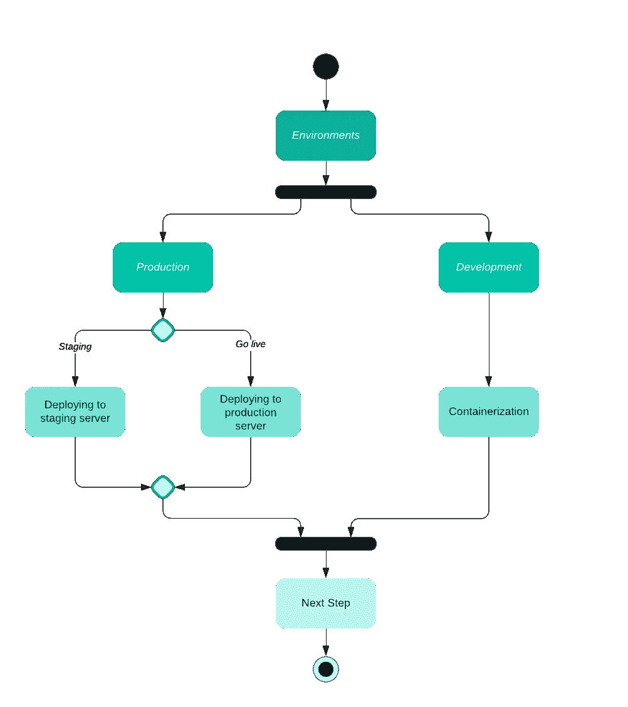
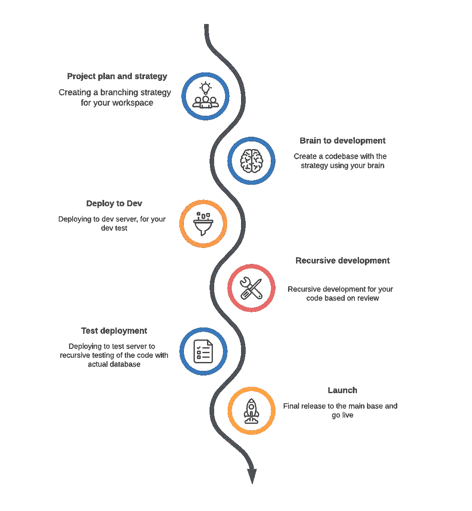

# 必须为任何 Web 应用程序添加 GitHub 操作

> 原文：<https://javascript.plainenglish.io/must-add-github-actions-in-your-web-project-be83fd4c2471?source=collection_archive---------8----------------------->

## web 应用程序的基本 GitHub 操作

Photo by [Roman Synkevych](https://unsplash.com/@synkevych?utm_source=medium&utm_medium=referral) on [Unsplash](https://unsplash.com?utm_source=medium&utm_medium=referral)

# 介绍

GitHub 动作是处理 CI-CD 作品的更酷的方式，在整个行业的 DevOps 过程中被广泛使用。如果你不知道 GitHub 的动作是什么，那么我会推荐你阅读[这篇文章](https://docs.github.com/en/actions)来开始。

今天，我们将讨论在你的 web 项目中必须使用的动作，我认为这些动作对你的 web 应用程序是必要的。

# 环境

在任何 web 应用程序中，我们通常知道的组件有后端、前端、数据库、任何中间缓存服务器，以及您的服务器实用程序，如负载平衡器、容器等。

现在，让我们合并这个组件以适应环境。您可能不需要每个环境中的每个组件，就像您在开发环境中不需要缓存或实用程序，但是在生产环境中您需要这些。在这里，您可以找到一个与开发和其他环境不同的示例方法

这两种环境之间最常见的区别是部署，为了项目管理，您可能希望将代码部署在不同的服务器上

# 分支策略

让我们假设您的项目有以下需求

*   发展
*   脚手架
*   生产

并且您需要一台服务器用于您的试运行和生产环境。现在，我们假设您正计划采用这种分支策略

*   `dev`用于开发
*   `staging`用于暂存
*   `main`用于生产

下面是一个通用应用程序的分支策略。你可以在这里回顾一下

# 设置

现在你有了一个策略。您可以轻松地开始构建 ci cd 管道。假设您计划将您的代码部署到每个环境中，那么这里是您的每个版本的 yml

*   `deploy.yml`
*   `deploy-staging.yml`
*   `deploy-dev.yml`

让我们再往前走一步，现在你不仅希望你的代码在服务器上准备好，而且你还希望在每次拉请求的迭代中执行几组程序块。您可能希望在 PR 或代码评审步骤中执行的几个示例步骤

*   线头
*   试验
*   新闻报道
*   压缩覆盖率
*   断开的链接

然后你可以在你的基础上增加一个 yml 作为`pull-request.yml`

GitHub 操作的更新版本

*   `deploy.yml`
*   `deploy-staging.yml`
*   `deploy-dev.yml`
*   `pull-request.yml`

现在，在最后一步，您可能想要手动部署您的代码。让我们假设一些复杂的分支被卡住了，你不想把它合并到`dev`分支，而是需要部署在某个服务器上。所以这里又多了一个 yml 作为`manual-deploy-dev.yml`出现，这将帮助您在特定的服务器或选择的类型上手动部署您的代码

您的 GitHub 操作的更新版本是

*   `deploy.yml`
*   `deploy-staging.yml`
*   `deploy-dev.yml`
*   `pull-request.yml`
*   `manual-deploy-dev.yml`

# 结论

您可以在此桶中添加更多项目，并根据您的流程创建干净的基础架构。这是我对任何典型 web 部署的个人看法。你可能想做你的后端和前端应用程序相同的系统，所以你会复制这些变化，如果你想做管理应用程序，然后将有一套副本

希望这篇小文章能帮助你找到你需要的东西。我们改天再聊别的话题吧，到时候保重。

*更多内容请看*[***plain English . io***](http://plainenglish.io)