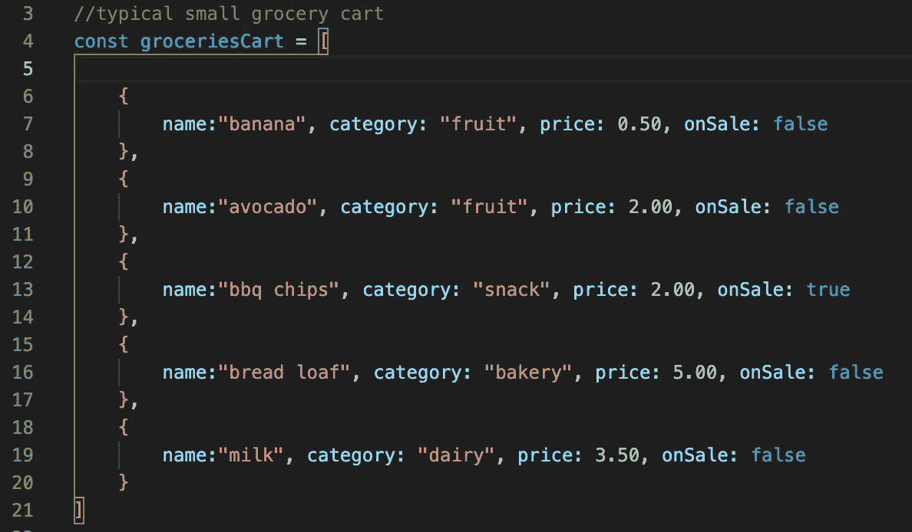
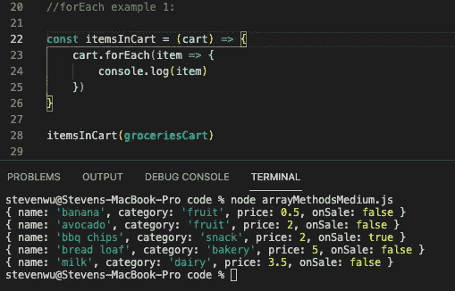
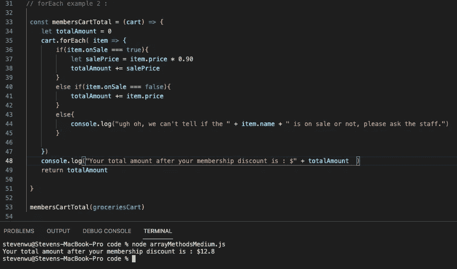
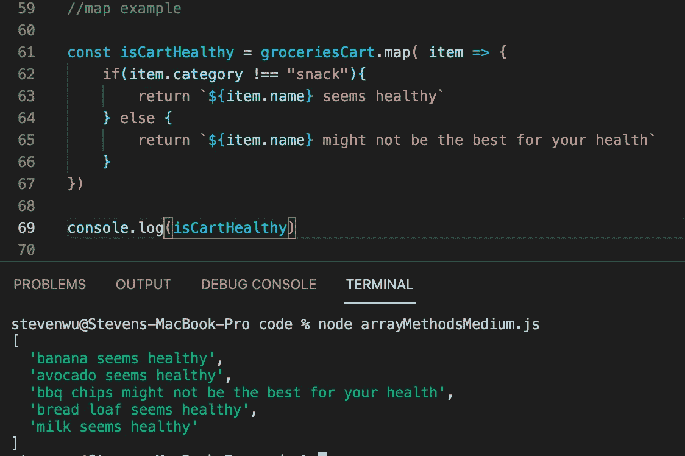
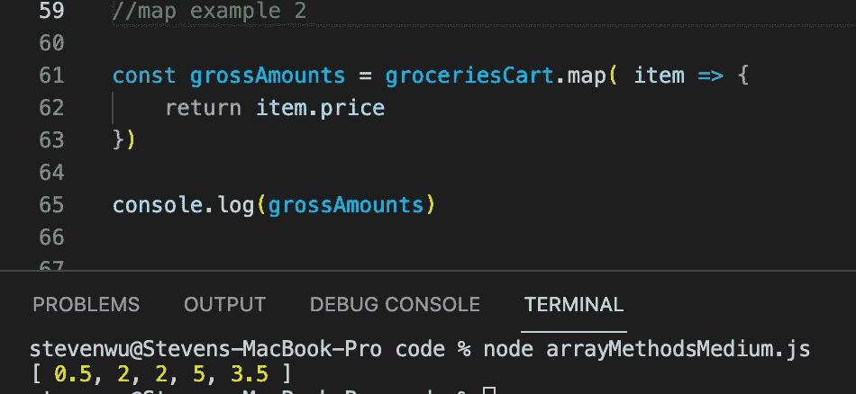
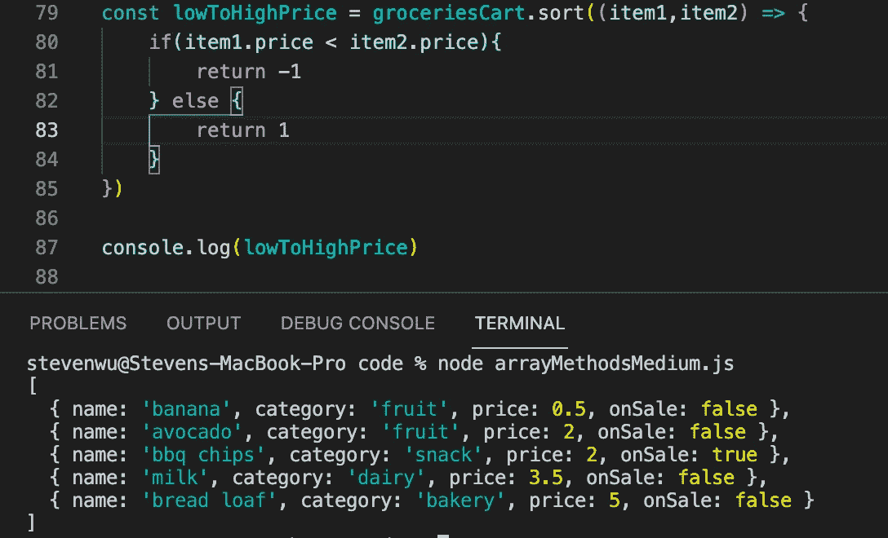
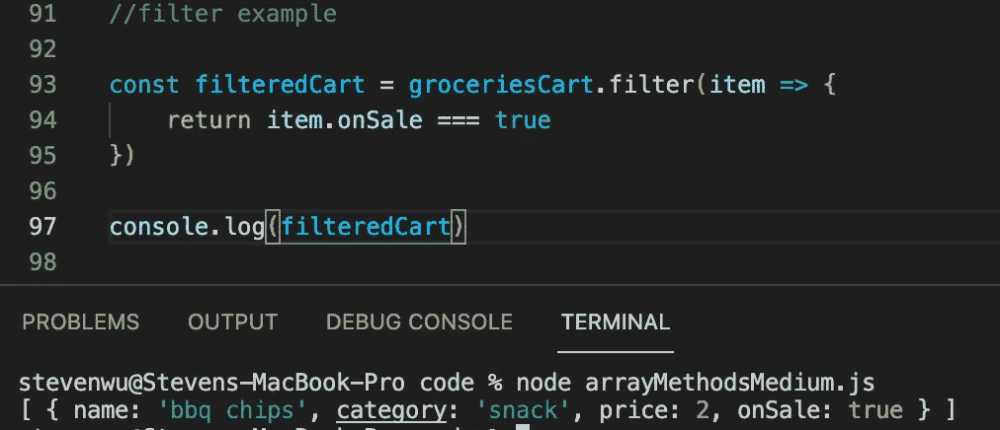
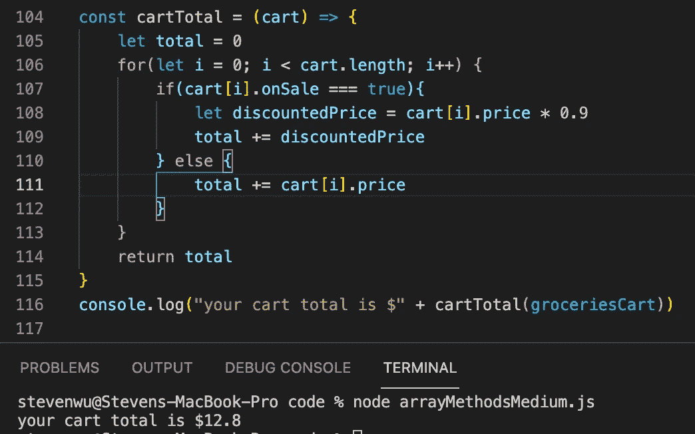
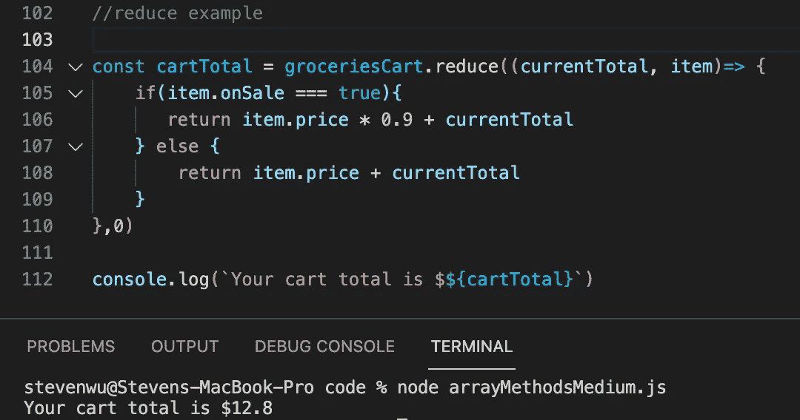

# 必须知道 JavaScript 中的数组方法

> 原文：<https://javascript.plainenglish.io/must-know-array-methods-in-javascript-464aa8ae1836?source=collection_archive---------5----------------------->

## JavaScript 高阶数组函数指南

Photo by [Fotis Fotopoulos](https://unsplash.com/@ffstop?utm_source=unsplash&utm_medium=referral&utm_content=creditCopyText) on [Unsplash](https://unsplash.com/s/photos/programming?utm_source=unsplash&utm_medium=referral&utm_content=creditCopyText)

我今天喜欢 JavaScript (JS)的一个主要原因是，自从 2015 年推出 ECMAScript 6(ES6)以来，已经包含了一些非常有用的数组方法。当我第一次在中学习 JS 的时候，我几乎只使用 forEach 循环来完成大部分的例子，所以今天我将向你们展示如何使用这些令人惊奇的内置数组方法来节省你用 JS 编码的时间和资源。

让我们想象一下，一位客户在您当地的超市购买一些杂货，您被雇来对收银机进行编程，以处理客户购物车中的一些数据。

使用这个场景，我将提供一些如何以及何时使用这些数组方法的例子。

下面是今天的购物车阵列示例，包含:

*   香蕉|价格:0.50 美元，类别:水果，出售:假
*   鳄梨|价格:2.00 美元，类别:水果，出售:假
*   烧烤薯条|价格:2.00 美元，类别:零食，特卖:真
*   面包|价格:5.00 美元，类别:面包店，销售:假
*   牛奶|价格:0.50 美元，类别:乳制品，销售:假

# 。为每一个

从今天最基本的方法开始， ***forEach*** 方法非常简单易用。当收银员给顾客的商品打电话，收银机需要在顾客付款前将每件商品显示给顾客确认时，非常适合使用。

下面是如何使用 ***forEach*** 循环的另一个例子。假设该客户是您公司的会员，您需要为每件打折商品申请折扣。

membersCartTotal 函数将获取一个购物车，并遍历购物车中的每件商品，以检查该商品是否在促销，如果该商品在促销，该函数将应用折扣，然后将新的销售价格添加到总额中。如果商品不打折，那么普通商品的价格将被加到总金额中。我还写了一个 else 语句，以防出现错误，因为该商品没有销售参数。

# 。地图

bad example of .map usage

***map*** 方法类似于 forEach 循环，它使用一个数组并遍历每一项来做一些事情，但是 ***map*** 方法专门用于创建新数组。上面的例子将是“伟大的”如果让我们说，你的公司希望促进健康的生活方式，并希望您的收银机显示一个客户的购物车健康物品的小列表，上面的例子功能将是非常低效的，因为数组的消息将留在内存中后，显示给客户。

虽然 ***map*** 和 ***forEach*** 在行为上是相似的，但是程序员需要考虑到时间和空间的复杂性来编码，所以我实际上不会对上面的例子使用 ***map*** 方法，因为消息数组将停留在内存中，只是为了向客户显示快速消息。

下面是. map 的一个更好的用法。假设您的公司需要跟踪它销售的每件商品和价格，以便纳税。我会用。map 来创建一个新的每一项的总价格数组，然后我将它发送给税务部门。

good example of .map usage

# 。分类

***排序*** 方法用于当然排序。这个 JS 方法使用两个参数创建一个新的排序数组，每个参数代表您正在比较和排序的项目。在上面的例子中，我构建了一个函数来获取 groceriesCart 以对其进行排序，检查每个商品的价格，看第一个商品的价格是否低于第二个商品的价格，以及价格是否低于它的第一个价格，或者说在数组的索引上是-1。

# 。过滤器

***filter*** 方法接受一个数组，遍历每一项，并根据特定条件返回该项。假设您的公司喜欢您编写销售税解决方案的方式，现在他们希望您构建一种方法来筛选出年度销售列表，以查看有多少商品打折。因此，对于上面的例子，我创建了一个函数，该函数接收 groceriesCart 并仅在商品打折时过滤掉，从而仅正确返回 bbq chips。

如果您已经有了一些数据，并且需要基于某些条件生成一个新的列表，那么这是一个很好的方法。 ***滤镜*** 方法绝对是我最喜欢的方法之一，因为它非常强大而且易于使用。

# **。减少**

在我们进入 ***reduce*** 方法之前，让我们看看上面的例子，看看我们如何使用基本的 ***for*** 循环来获得购物车总数。我们将起始总数设置为 0，并迭代购物车中的每个商品，将商品价格添加到总数中，此外，我们还检查该商品是否也在打折，并返回正确的总数。

虽然这段代码没有任何问题，但是为这样简单的函数编写完整的索引 for 循环却很麻烦。让我们用。反而减少。

老实说， ***reduce*** 方法一开始对我来说有点困惑，但是一旦你掌握了语法，使用起来就会很容易。让我们分解一下，这个方法有三个参数:

*   行:104 | current total——这就是我们所说的总数
*   Line: 104 |item-简单地表示 groceriesCart 中的每个数据条目
*   Line: 110 |0 —设置 currentTotal 的初始值

currentTotal 的初始值从值 0 开始，然后。reduce 方法遍历每个条目，检查商品是否在打折，然后返回 currentTotal 和商品价格。

# 结论

我们走吧！我们使用了 ***reduce*** 方法并节省了几行代码，这看起来并不多，但是你的工作并不仅仅是构建一个函数。所以，如果你考虑一下，学习这些方法肯定会让你成为一个更快更高效的编码者。

希望你喜欢这篇 JavaScript 文章！如果你这样做了，请留下评论，并关注更多的编码指南。

*更多内容尽在*[***plain English . io***](http://plainenglish.io)