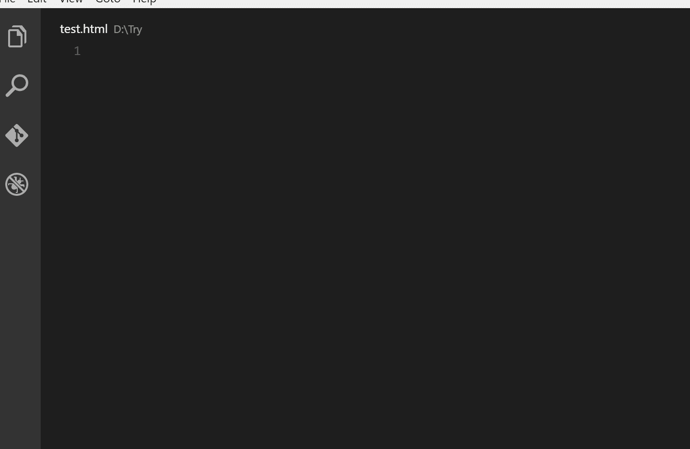

# 我最喜欢的 10 个 React VS 代码扩展

> 原文：<https://javascript.plainenglish.io/my-10-favorite-extensions-for-vs-code-react-edition-b46b3446b534?source=collection_archive---------5----------------------->

Photo by [Christopher Gower](https://unsplash.com/@cgower?utm_source=unsplash&utm_medium=referral&utm_content=creditCopyText) on [Unsplash](https://unsplash.com/s/photos/coding?utm_source=unsplash&utm_medium=referral&utm_content=creditCopyText)

有几个我非常喜欢扩展，在用 VS 代码编写 React 应用程序时非常有用。我们直接去找他们吧。

# 1.自动关闭标签

名字说明了一切。这个扩展自动添加 HTML/XML 结束标签。

# 2.自动重命名标签

此外，这个标签的名字说明了它的作用——自动重命名成对的 HTML/XML 标签。

# 3.ES7 React/Redux/graph QL/React-本机代码片段

这个扩展为你提供了 ES7 中的 JavaScript 和 React/Redux 代码片段，以及 VS 代码的 Babel 插件特性。这其实是**用的最多的一个**(对我来说)。每当我需要创建一个新的组件时，我只需编写`rce`(类组件)或`rfce or rfc`(功能组件)，其余的由扩展完成。这里有很多更有用的片段在 [**和**](https://marketplace.visualstudio.com/items?itemName=dsznajder.es7-react-js-snippets) 中解释。

# 4.埃斯林特

这是一个可配置的 linter 工具，可以识别和报告 JS 中的模式。这个扩展发现的任何问题都可以自动修复。这些修复是语法感知的，所以不会有传统的查找和替换算法引入的错误。

# 5.GitLens — Git 增压

GitLens 增强了 Visual Studio 代码中内置的 Git 功能。这是我一直用的*也是*。每次提交都要经过这个扩展。在 Git 存储库和分支中导航很容易。我对这个没意见。

# 6.更漂亮—代码格式化程序

谁有时间格式化代码？为什么不直接按 Ctrl+S，漂亮的会变魔术。我听起来像个推销员，但我真的很喜欢一切自动排列的方式。[更漂亮](https://prettier.io/)是一个固执己见的代码格式化程序。它通过解析您的代码并根据自己的规则(考虑到最大行长度，必要时换行)重新打印代码来强制执行一致的风格。

# 7.彩虹括号

编写箭头函数表达式并将其括号配对有时是一场噩梦，尤其是如果一个在另一个中。没有必要强调这一点，因为这种扩展给配对括号着色。

# 8.材料图标主题

我想每个人都知道这一点。它是在 VS 代码中自定义图标的扩展。没什么好说的，只是说安装后在项目中导航要容易得多。

# 9.更好的评论

更好的注释扩展将帮助您在代码中创建更加人性化的注释。有了这个扩展，你可以将你的注释分类为:提醒、查询、待办事项、高亮显示或者任何你想在设置中指定的评论风格。此外，注释掉的代码也可以被样式化，以清楚地表明代码不应该在那里。

# 10.原子一黑暗主题

这不是一个帮助你写代码的扩展，因为它是一个主题，但是，我已经用它们中的几个做了实验，这是目前为止我最喜欢的。很长一段时间我使用东京夜风暴(蓝色的)，但这是我现在更喜欢的一个。

Example of the theme.