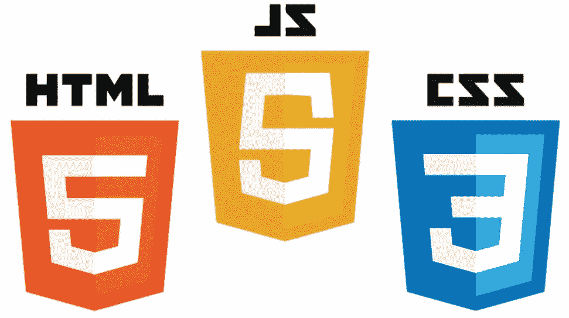

# 我作为一名自学程序员的经历——经验教训

> 原文：<https://javascript.plainenglish.io/my-experience-as-a-self-taught-programmer-lessons-learned-1652481bfa5b?source=collection_archive---------17----------------------->

学习一项新技能可能是一项艰巨的任务，但它对我们的职业和智力发展至关重要。编程是我认为每个人都应该学习的高回报技能之一。3 个月前，我开始自学如何编写代码。我不知道成为一名自学成才的程序员的道路是多么不确定。没有直线或简单的方法。

编程可能很难，尤其是如果你来自非技术背景。概念可能很难掌握，退出率很高。我遇到过许多训练营/CS 毕业生，他们最终都没有找到工作或成为成功的程序员。自学更加困难，因为每天坚持学习需要高度的自律和自我激励。你不会得到训练营学生所能得到的支持和指导。

# 关于我

我没有计算机科学或软件工程的学位。我学的是电子工程，在大学里只学了非常基础的 C++。大学毕业后，我在世界上最大的电子商务公司担任运营经理。我在工作中做得很好。我在三年内被提升了三次。在高峰期，我管理着一个由 100 名员工和 2-3 名助理经理组成的团队。在这份工作中，我学到了很多管理和领导技能。似乎我的职业生涯已经确定了。我可以继续工作，爬上领导的阶梯。

在这份工作的第三年，我决定是时候学习一项新技能了。我决定学习 Web 开发，因为我想要构建的任何东西都需要某种 Web 开发知识。这个决定既快又简单。

# 主要经验教训

在这篇文章中，我将讨论到目前为止我在旅途中学到的三个关键教训。这些是我希望在开始学习如何编码时就知道的教训。我希望这些课程能帮助你成为一名更好的程序员。

# 1.了解计划，完成计划

在进入编码世界之前，知道你到底想学什么是很重要的。有 100 多种技术。有许多职业道路，包括前端、后端、分布式计算、数据科学等。对我来说，研究这些职业道路是一件令人不知所措和筋疲力尽的事情。一位 YouTube 大师推荐 Python，但另一位说 JavaScript 才是主流。我该听哪个？几个小时后，我发现自己陷入了教程地狱，不知道从哪里开始。很多初学自学的程序员都会发现自己也是这种情况。

逃离教程地狱的最佳解决方案是选择一个学习轨道，坚持下去，不要跳来跳去。如果你发现很难选择一条学习路线，那就和导师谈谈，或者看看自己的优势。例如，如果你在刚刚通过的大学课程中有一些 HTML 和 CSS 的经验，那么 Web 开发是自然的选择。或者，如果你有很强的数据挖掘技能，那么 Python 的数据科学可能是一个很好的方向。这里的关键是选择一个轨道，并坚持至少 6 个月。

# 2.学习基础知识——HTML、CSS 和 JavaScript

这座建筑的高度取决于地基的坚固程度。

2020 年 4 月，我休假 2 周。我决定利用这段时间学习编程。当我开始学习编程时，我尝试学习的第一项技术是 React，这是我最大的错误。不是因为 React 是一项不好学的技术，事实上它是 2021 年最流行的 web 框架，也是最容易学的框架之一。但是因为我从来没有学习过 React 的基础技术——HTML，CSS，JavaScript。不了解基础知识会使学习编程变得比实际更难。

在花了两天时间试图阅读和理解 React.js 文档之后，我没有取得太大的进展。然后我决定在 YouTube 上看一些教程。也许 YouTube 编码大师可以更好地解释它。它仍然没有意义。此时我开始考虑辞职。我想这对我来说太难了。在与 React 斗争了一周后，我真的放弃了。

在学习 React、Angular 或 Node.js 这样复杂的 Web 技术之前，熟练掌握 HTML、CSS 和 JavaScript 很重要。大多数编码训练营在引入任何框架之前，会花前 4 周时间教授 HTML、CSS 和 JavaScript。在开始任何高级 Web 技术的课程之前，了解先决条件是至关重要的。这将使生活变得更容易，并加快你的学习曲线。

# 3.找一个导师

学习如何编码的主要挑战之一是不知道你是否在学习正确的东西，或者你是否在成为程序员的旅程中取得了足够的进步。幸运的是，我有一些成熟的开发人员朋友，当我向他们寻求指导时，他们提供了宝贵的反馈。

我的公司拥有世界上最大的技术部门之一和一些最好的程序员。我向他们中的一些人寻求指导，他们很乐意帮忙。我很快和我的导师们安排了两周一次的电话会议来回顾我的进步。有一个导师让我通过设定现实的和可实现的目标来保持动力。

导师可以帮助你找到职业道路，向你介绍软件行业的文化，让你为工作面试做好准备等等。有很多资源可以找到导师。我建议接近你的朋友或家人，他们是程序员。Reddit、Meetups、Codementor.io 都是常见的在线导师平台。有一个强有力的导师会在你成为自学程序员的道路上节省你几个月的时间。

# 资源

下面是我最喜欢的资源列表，适合希望学习 Web 开发的初学者。

1.  [MDN 网络文档](https://developer.mozilla.org/en-US/)
2.  [血癌](https://stackademic.com)
3.  [JavaScript.info](https://javascript.info/)
4.  [FreeCodeCamp](https://www.freecodecamp.org/)