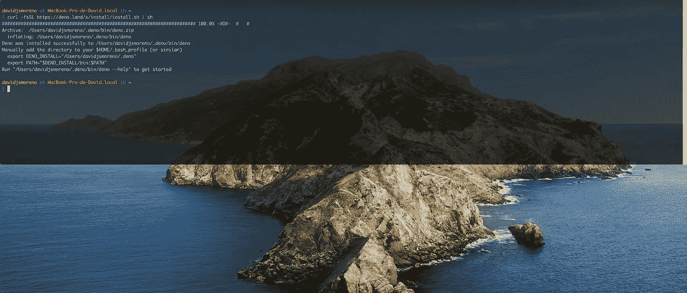
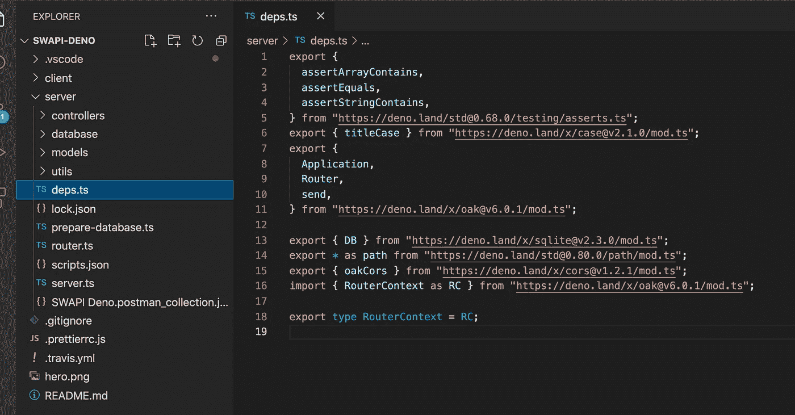
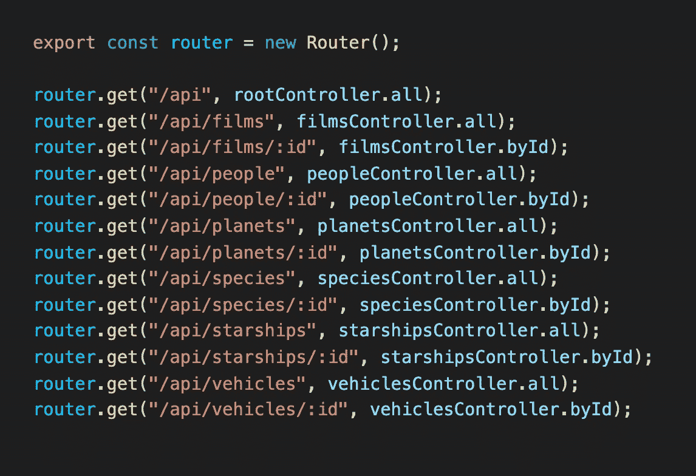

# 我在 2021 年使用 Deno、Svelte 和 Tailwind 的经验

> 原文：<https://javascript.plainenglish.io/my-experience-using-deno-svelte-and-tailwind-in-2021-59ca5c057c49?source=collection_archive---------1----------------------->

“对知识的投资总是能获得最好的回报。”本杰明·富兰克林。

Photo by [Jamie Street](https://unsplash.com/@jamie452?utm_source=medium&utm_medium=referral) on [Unsplash](https://unsplash.com?utm_source=medium&utm_medium=referral)

使用前面的短语[实用程序员](https://www.amazon.com/-/es/Thomas-David-ebook/dp/B07VRS84D1/)这本书在章节“*你的知识组合*”开始，这本书鼓励你定期投资知识作为一种习惯。

读完这篇文章后，我问自己:我投资够了吗？接下来的几周我该学什么？:像 Flutter，Python，或者 Laravel 这样的低风险投资？或者(可能)像 Deno 或 Svelte 这样的高风险选项？。

我决定选择后者，因为这些技术的新鲜感似乎对我更有吸引力，所以我创建了一个宠物项目只是为了好玩:流行的 [SWAPI API](https://swapi.dev/) 的(部分)克隆。这篇文章不是关于我是如何做到的，而是关于我在学习和实施过程中的经验，如果你对这个项目更感兴趣，请访问 GitHub repo。

# [Deno](https://deno.land/)

> *Deno 是一个简单、现代和安全的 JavaScript 和 TypeScript 运行时，使用 V8 并内置于 Rust 中。*

## **Deno 入门**

这是让我爱上 Deno 的那些事情之一:流畅的安装过程和令人惊叹的 [Visual Studio 代码集成](https://marketplace.visualstudio.com/items?itemName=denoland.vscode-deno)，虽然 Deno 为其他 ide 提供了集成，但一些功能是[格式化](https://deno.land/manual/tools/formatter)(不需要更漂亮)[林挺](https://deno.land/manual/tools/linter)(不需要 eslint)，智能感知(感谢 typescript)等。

Installing Deno from the command line

尽管 Deno 没有包管理器，但是处理依赖关系非常简单:惯例是创建一个 deps.ts 并直接从 URL 导入每个依赖关系，你可以使用一个公共库(比如 CDN)或者一个私有库。

dept.ts file is where we should put all the dependencies.

关于前一个截图的一些事情:我在 URL 中指定了要获取的确切版本，这并不是绝对必要的，因为使用*[*—lock = lock . JSON*](https://deno.land/manual@v1.8.1/linking_to_external_code/integrity_checking)标志运行 Deno 将创建一个 [lock.json](https://deno.land/manual@v1.8.1/linking_to_external_code/integrity_checking) 文件，这在目的上类似于*yarn.lock/package-lock.json*例如，**有效地锁定您的依赖关系并使您免于依赖地狱。***

*尽管从长远来看，使用虚拟环境(如 [NVM](https://github.com/nvm-sh/nvm) for Nodejs)来管理不同版本的 Deno 是理想的，但 Deno 世界中还没有这样的东西:所以这是你(我们)创造类似东西或为围绕的少数[提案](https://github.com/asdf-community/asdf-deno) [做出贡献的机会。](https://github.com/MarkTiedemann/deno.mk)*

***2021 年 4 月 3 日更新**:也可以查看 [dvm](https://github.com/justjavac/dvm) ，感谢 [Mayur](https://medium.com/@borsemayur2/there-is-a-deno-module-dvm-nvm-alternative-for-managing-different-deno-installations-2d18a4c29610) 的建议:-)。*

**

*But maybe it’s not needed because we can choose which Deno’s version to install*

## ***单元测试***

*Deno 提供了一个漂亮整洁的[测试框架](https://deno.land/manual@v1.8.1/testing)，也许它不像 Jasmine 那样广泛，但我认为它非常适合完成任务。*

## ***橡树就像家一样***

*我们可以把 Deno 分为[标准库](https://deno.land/std@0.91.0)和[第三方模块](https://deno.land/x)其中 [Oak](https://deno.land/x/oak@v6.5.0) 脱颖而出。*

*Oak 有一个类似于 Express 的 API，所以在创建 REST APIs、使用中间件、处理内容协商等时，你会有宾至如归的感觉，对我来说，这真的很酷，因为使用 Nodejs 开发人员之间已经建立的约定减少了上下文切换(因为他们可能是 Deno 的目标受众)。*

**

*Defining routes using MVC*

## *ORM？*

*[当](https://github.com/davidjsalazarmoreno/swapi-deno/commit/f68e2e68f6f7298a00a07b66669eeb5e89074cb7)我开始这个项目的时候，我找不到一个成熟的 [ORM](https://en.wikipedia.org/wiki/Object%E2%80%93relational_mapping) 选项，但是过了一段时间后我完成了(一如既往的懒惰和拖延),所以也许现在应该有一个[合适的选项](https://deno.land/x?query=orm),但是老实告诉你:我用了 [SQLite](https://deno.land/x/sqlite@v2.3.2) ,效果很好，也许将来我会把它更新到 Postgres 或 MySQL，只是为了好玩。*

## *权限无处不在*

*这是 Deno 的[标志](https://deno.land/manual/getting_started/permissions)之一，这意味着 Deno 默认情况下不能访问网络、读/写磁盘，甚至不能访问环境变量，因此如果您正在开发一个 shell 脚本，可能只允许读/写磁盘访问而不允许访问网络是有意义的，或者对于 REST API 来说反之亦然。*

## *升级 Deno 版本*

*感谢 Typescript 的另一个好的体验是，当你更新你的依赖项并且有一个 API 改变时，当你编译时事情会突然中断，促进了定位要更新的代码的工作。*

# *[苗条的](https://svelte.dev/)*

> **Svelte 是构建用户界面的一种全新方法。尽管 React 和 Vue 等传统框架在浏览器中完成大部分工作，但 Svelte 将这些工作转变为编译步骤，在构建应用程序时进行。**

## *尽可能简单，但不能更简单。*

*如果你已经知道 Angular、React 或 Vue，你会很快学会 Svelte，因为它使用了许多在其他框架中实现的相同原则(尽管 Svelte 更像是一个编译器而不是一个框架),但它尊重它的座右铭:你真的写了一个更简洁的代码，所以我不觉得我在学习完全不同的东西，而是以一种简单的方式应用相同的思想。*

**

*A component in Svelte, please ignore the Comic Sans :-)*

*这意味着我们可以使用[道具](https://svelte.dev/examples#declaring-props)、[模板语法](https://svelte.dev/examples#if-blocks)用于[事件处理程序、](https://svelte.dev/examples#dom-events)组件[生命周期](https://svelte.dev/examples#onmount)，甚至更完整的 API，如[上下文](https://svelte.dev/examples#context-api)(类似的 React 上下文)、[存储](https://svelte.dev/examples#writable-stores)，以及[反应机制](https://svelte.dev/examples#reactive-assignments)。*

**

*I loved how resource={resource} was simplified into {resource}, using something very similar to the ES6 [Object Property Value Shorthand](https://alligator.io/js/object-property-shorthand-es6/)*

## *路由？*

*因为我只克隆了 SWAPI home，所以我不需要路由机制，很高兴知道您可以使用 svelte-navigator 包来处理这个问题，请在 [Svelte playground](https://svelte.dev/repl/c81d8f3dff584065a82b2d3ea7cd4aee?version=3.35.0) 中尝试一下。*

# *[**顺风**](https://tailwindcss.com/)*

> *不用离开你的 HTML 就能快速建立现代网站。*

## *我的 CSS 在哪里？！*

*在过去的几年里，我一直在使用 Bootstrap、Material IU、Metronic 等框架，但一位同事在 2018 年告诉我关于 Tailwind 的事情，我的第一个想法是“*这是一种什么样的亵渎？，我的 CSS 呢？！“我大错特错了。**

*随着时间的推移，Tailwind 变得越来越受欢迎，我最终发现了一种创建 ui 的非常声明性的方法，根本不用编写 CSS(几乎),但因为许多 Tailwind 实用程序类类似于原始的 CSS，表示:**您必须了解 CSS，** [将您的注意力从工具转移到材料上](http://www.youtube.com/watch?v=nCDWzV9wzW4&t=4m18s)。*

*此外，如果需要的话，用自己的实用程序类来扩展它是非常简单的，我确信这一点。*

**

*Playing around with the utility classes*

## *顺风整合*

*对于顺风整合，我遵循了[这个](https://dev.to/swyx/how-to-set-up-svelte-with-tailwind-css-4fg5)教程，它并不太复杂，对于一个宠物项目来说还可以，但是对于一个真正的生产应用来说，你可能需要寻找一个更好的方法来完成它，根据这篇文章的作者:*

> *上面列出的这个方法运行起来很简单，但最终确实会通过 Svelte 编译器运行成千上万行 Tailwind 的 CSS。这可能会导致性能问题(主要是在每次更改入口点文件时)*

*也许用的是[工兵](https://sapper.svelte.dev/)？*

# *最后的想法*

*学习这些技术很有意思，但我觉得自己只是触及了表面，尤其是在 svelote 中，我并没有使用布线或创建更复杂的组件之类的东西，具有讽刺意味的是，我在 Tailwind 或 svelote 上投入的时间更少，但也许更多的机会是在[找到一份学习这些技术的工作？。](https://trends.google.com/trends/explore?q=deno,svelte,tailwind)*

*Deno 是一个很好的工具，我非常喜欢这个开发体验，如果我必须使用 shell 脚本，我很可能会建议使用 Deno，但除此之外，我认为 Nodejs 将是我新 web 项目的第一选择，Nodejs 世界中存在的大量经过考验的包在 Deno 中是尚不存在的。*

*但未来有可能使用 NPM 软件包在 Deno 使用其[节点兼容性模块](https://deno.land/std@0.91.0/node)，所以谁知道呢？*

*无论如何:继续用你的知识投资组合，无论是高风险还是低风险的工具或材料，经常创建(和完成)一个新的宠物项目，这样你在学习新东西或预演所学东西的时候就会保持你的技能敏锐，你会面临要解决的新问题，这将丰富你的经验，最重要的是:**你会为你的简历建立一个很好的展示平台。***

*继续编码！:-)*

*[1]:我这里指的是比较最流行的几种技术[找到工作的可能性](https://medium.com/r?url=https%3A%2F%2Ftrends.google.com%2Ftrends%2Fexplore%3Fq%3Ddeno%2Csvelte%2Ctailwind)，而不是技术风险。*

**西班牙有高等教育机构，咨询机构* [*扩大机构*](https://davidjsmoreno.medium.com/mi-experiencia-con-deno-svelte-y-tailwind-este-2021-287db48a7e7b) *。**