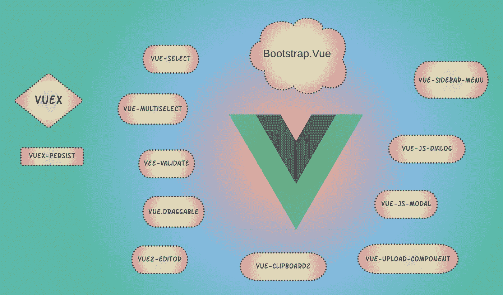

# 我最喜欢的 Vue 组件

> 原文：<https://javascript.plainenglish.io/my-favorite-vue-components-d22b7959dc4e?source=collection_archive---------11----------------------->

## WEB 应用程序开发

## 重复使用零部件，以加快起飞速度！

Vue.js 是 web 应用前端开发的一个优雅的框架。然而，Vue 本身只是提供了构建组件的框架。它没有提供现成的 UI 组件集合。在 Vue 生态系统中，有许多伟大的开源项目提供了有用的 Vue 组件(或组件库)。在这篇文章中，我讨论了几个我最喜欢的。

Graphic by author

在继续之前，让我提一下 [awesome-vue](https://github.com/vuejs/awesome-vue) 是一个包含所有关于 vue 的优秀资源的列表。它有一个广泛的组件和组件库、实用工具、使用 Vue 的开源项目、教程、书籍、博客文章、课程等列表。和 Vue 有关。因此，如果你在寻找某种特定的东西，而且它确实存在，你很可能会在[的《真棒-vue](https://github.com/vuejs/awesome-vue) 中找到它。现在，让我们开始吧。

## 引导程序

开发前端应用程序时要解决的第一个问题是为开发响应迅速、移动优先的网站选择合适的 CSS 框架。我个人的选择是 [Boostrap](https://getbootstrap.com/) 。 [BootstrapVue](https://bootstrap-vue.org/) 是 Vue.js 的一个很棒的 Bootstrap 绑定，这个组件库包含了各种各样的组件(基于相应的 Bootstrap 组件)。一些最常用的包括警告、徽章、面包屑、按钮、日历、卡片、传送带、对话框、下拉菜单、表格、图像、大屏幕、表格、标签、祝酒词和工具提示。

使用构建在 [flexbox](https://developer.mozilla.org/en-US/docs/Web/CSS/CSS_Flexible_Box_Layout/Basic_Concepts_of_Flexbox) 之上的[引导网格系统](https://getbootstrap.com/docs/4.0/layout/grid/)完成基本的 UI 布局。BootstrapVue 中用于布局的关键部件有< b-container >、< b-row >和< b-col >。详见[布局和网格系统](https://bootstrap-vue.org/docs/components/layout)。然而，我发现 CSS 网格布局有时对于更高级的布局效果更好。更多信息见[示例网格](https://gridbyexample.com/)。

表单对于收集用户输入至关重要。BootstrapVue 窗体控件功能丰富，对开发人员友好。更多信息见[此处](https://bootstrap-vue.org/docs/components/form)。可用的表单控件包括 input、textarea、select、radio、checkbox、file、datepicker、spinbutton、tags、timepicker、rating、form groups。此外，它还包括各种各样的[按钮](https://bootstrap-vue.org/docs/components/button)。

[b 表](https://bootstrap-vue.org/docs/components/table)成分超级丰富。它完全是数据驱动的(使用来自组件的数据)。它包括排序，过滤，悬停，条纹，分页，粘性头等。作为内置功能。查看它的[文档](https://bootstrap-vue.org/docs/components/table)可以看到各种各样的例子。

b-breadcrumb 让创建数据驱动的 breadcrumb 变得简单明了。您可以轻松地处理 *$route.path* 变量，将路径转换成面包屑数组。

[Navbar](https://bootstrap-vue.org/docs/components/navbar) 非常适合构建导航菜单(通常在网页顶部)。你可以包括链接(到你的单页应用程序的不同部分)，徽章，下拉菜单，搜索框，图标等等。

这里有几个教程可以让你熟悉 BootstrapVue。

*   【BootstrapVue 入门
*   [使用 Bootstrap-Vue 将 Bootstrap 与 Vue.js 集成](https://www.sitepoint.com/bootstrap-vue-js-bootstrap-vue/)
*   [布局和网格系统](https://bootstrap-vue.org/docs/components/layout)
*   在 Vue 中建立响应转盘。有 BootstrapVue 的 js
*   [BootstrapVue —大屏幕和布局](https://codeburst.io/bootstrapvue-jumbotrons-and-layouts-e0ccbfd78394)
*   [BootstrapVue —选项卡](https://levelup.gitconnected.com/bootstrapvue-tabs-f10b99380c4d)
*   [BootstrapVue —工具提示和弹出指令](https://medium.com/dev-genius/bootstrapvue-tooltips-and-popover-directives-c364ec549b22)

## 更多布局

侧边栏是富应用程序中的常见功能。你可以在分层次的菜单中，或者在侧边栏中放一些摘要信息。vue-sidebar-menu 是我最喜欢的实现层次菜单的解决方案。你可以按区域组织菜单，在单个菜单项中设置多级层次结构，给菜单项添加图标，折叠和展开侧边栏，甚至有现成的暗/亮主题。在这里看演示。

## 对话

模态对话框是大型应用程序 UI 流程的重要组成部分。您可以将它们用于简单的警告、提示和确认。通常，关于某个实体的详细信息会显示在弹出对话框中。虽然 BootstrapVue 包含了一个对话框组件，但我觉得用起来很笨拙。对于简单的提醒和确认， [vuejs-dialog](https://github.com/Godofbrowser/vuejs-dialog#readme) 就相当不错了。对于更高级的用例，我建议使用 [vue-js-modal](https://github.com/euvl/vue-js-modal) 。它支持带有用户定义组件的可调整大小、自适应、可拖动的对话框。

## 公用事业

虽然 BootstrapVue 包含了各种各样的表单输入组件，但是它的输入验证功能有些有限且不灵活。为了更加灵活，您可以使用 [vee-validate](https://github.com/logaretm/vee-validate) 。内置了许多规则，这些规则对可接受的输入施加约束:字母、字母破折号、字母数字、值范围之间、仅数字、电子邮件、图像、最大值、最小值、数字、正则表达式匹配、必需值、排除值、允许值等。规则可以在模板中指定，并且可以很容易地链接起来。自定义规则可以很容易地定义并与库集成。在这里见文档[。](https://vee-validate.logaretm.com/v3/guide/basics.html)

拖放是 web 应用程序中的常见功能。SortableJS 是一个流行的 JavaScript 库，用于可重新排序的拖放列表。它支持许多框架，包括 Vue。它的 Vue 插件被称为 [Vue。可拖动](https://github.com/SortableJS/Vue.Draggable)。你可以看到许多基于 Vue 的例子。可拖动[这里](https://sortablejs.github.io/Vue.Draggable/)。您可以使用 CSS 自定义样式。如果你胆子大一点，可以研究一下 [vue-sidebar-menu.scss](https://github.com/yaminncco/vue-sidebar-menu/blob/master/src/scss/vue-sidebar-menu.scss) 中组件的 [SASS](https://sass-lang.com/) 样式表，完全更改/覆盖它。

单选和多选是常见的输入机制。准系统 HTML <select>元素非常有限。高级用户界面试图通过提供许多附加功能来简化选择，例如，单选/多选、标记、过滤、搜索、异步选择、AJAX 支持和 Vuex 支持。这里有两个非常好的组件。vue-选择和vue-多选。</select>

有时，您希望让用户将某些特定组件中的一些文本复制到他们的系统剪贴板中。 [clipboard.js](https://clipboardjs.com/) 提供的 JavaScript 让它变得超级简单。 [vue-clipboard2](https://github.com/Inndy/vue-clipboard2) 是一个用于 vue 应用的简单绑定。

文件上传很难。尤其是当您需要高级功能时，如多文件上传、目录上传、拖放上传、同时上传多个文件的能力、上传前预览图像、使用 POST 和 PUT 端点、通过 AJAX 请求上传、对输入文件类型的高级检查、可能解析上传的文件头以在上传前验证一些事实。 [vue-upload-component](https://github.com/lian-yue/vue-upload-component) 是解决所有这些问题的一站式解决方案。这里有一些很好的例子。虽然它的 [put-action](https://lian-yue.github.io/vue-upload-component/#/documents#options-props-put-action) 和 [post-action](https://lian-yue.github.io/vue-upload-component/#/documents#options-props-post-action) 回调非常适合与 put 和 post 端点集成，但我特别喜欢[自定义操作](https://lian-yue.github.io/vue-upload-component/#/documents#options-props-custom-action)回调选项，因为它允许我在实际的文件上传过程中做额外的预处理和后处理。

如果您想要丰富的文本编辑功能，一个好的解决方案是 [Quill](https://quilljs.com/) 。这是一个完全可定制的编辑器，具有广泛的[格式](https://quilljs.com/docs/formats/)支持和[模块化](https://quilljs.com/docs/modules/)功能，如剪贴板、历史和键盘支持。附加模块可以很容易地注册。 [vue2-editor](https://github.com/davidroyer/vue2-editor) 是一个包装器组件，它以无缝的方式为 vue2 应用程序带来了 Quill 功能。

## 组件间通信

组件间通信的推荐方法是 [Vuex](https://vuex.vuejs.org/) 。Vuex 是 Vue.js 应用程序的状态管理模式+库。它管理应用程序的全局和分层状态，所有 Vue 组件都可以访问该状态。

但是，有时候，可能会矫枉过正。您所需要的只是一个简单的发布-订阅设计模式，其中一个组件发布某个事件，而对该事件感兴趣的其他组件订阅该事件。事实证明，Vue 可以很容易地用作事件总线。这里有一些关于这个主题的文章:

*   [Vue 作为活动巴士——生活更快乐](https://medium.com/easyread/vue-as-event-bus-life-is-happier-7a04fe5231e1)
*   [使用 Vue.js 中的事件总线在组件之间传递数据](https://blog.logrocket.com/using-event-bus-in-vue-js-to-pass-data-between-components/)
*   [用 Vue.js 创建全球事件总线](https://www.digitalocean.com/community/tutorials/vuejs-global-event-bus)

顺便说一下， [vuex-persist](https://github.com/championswimmer/vuex-persist) 是一个有用的插件，可以在浏览器的本地存储器中缓存你的 vuex 状态。这样，每当应用程序重新加载时，它都可以重用以前保存的状态。例如，如果您有一个分页的表，您可能希望在 Vuex 中保留当前的页码。每当应用程序重新加载时，它可能会将用户带到同一个页码。

## **临别赠言**

目前，两个版本的 Vue 正在流行。 [Vue 2](https://vuejs.org/v2/guide/) 为当前稳定版本， [Vue 3](https://v3.vuejs.org/) 为即将发布的新版本。请确保您正在使用的库与您正在使用的 Vue 版本兼容。我只使用 Vue 2。

只要有可能，尽量将 NPM 的组件作为包依赖项安装到您的项目中。web 应用程序的加载时间取决于包含的代码量。你添加的依赖越多，你的网站加载和运行就越慢。因此，在添加更多依赖项之前，请小心谨慎。如果两个库有重叠的功能，选择其中一个。有时，您可以只研究组件的实现，并在您自己的代码库中实现一个满足您特定需求的精简版本。树摇动有助于确保你的网站代码的生产版本删除你的依赖关系中没有真正被使用的部分。

让我在评论中知道一些你最喜欢的组件。我会试着把它们包含在更新中。

## 参考

*   [Vue JS](https://vuejs.org/)
*   [助推器](https://getbootstrap.com/)
*   [BoostrapVue](https://bootstrap-vue.org/)
*   [自举网格系统](https://getbootstrap.com/docs/4.0/layout/grid/)
*   [网格示例](https://gridbyexample.com/)
*   [view-sidebar-menu](https://github.com/yaminncco/vue-sidebar-menu)
*   [视图选择(T3)](https://github.com/sagalbot/vue-select)
*   [view-multiselect(T5)](https://github.com/shentao/vue-multiselect)
*   [出口(T7)](http://sortablejs.github.io/Sortable/)
*   [视觉 Draggable(T9)](https://github.com/SortableJS/Vue.Draggable)
*   [vistajs-datepicker](https://www.npmjs.com/package/vuejs-datepicker)
*   [vistajs-dialog](https://github.com/Godofbrowser/vuejs-dialog)
*   [visux-persist(T15)](https://github.com/championswimmer/vuex-persist)
*   (T16) vee-validate (T17)
*   [clipboard.js (T19)](https://clipboardjs.com/)
*   [view-clipboard2](https://github.com/Inndy/vue-clipboard2)
*   [view-upload-component (T23)](https://github.com/lian-yue/vue-upload-component)
*   (T24) Quill (T25)
*   [view2-editor](https://github.com/davidroyer/vue2-editor)

*More content at* [***plainenglish.io***](http://plainenglish.io/)