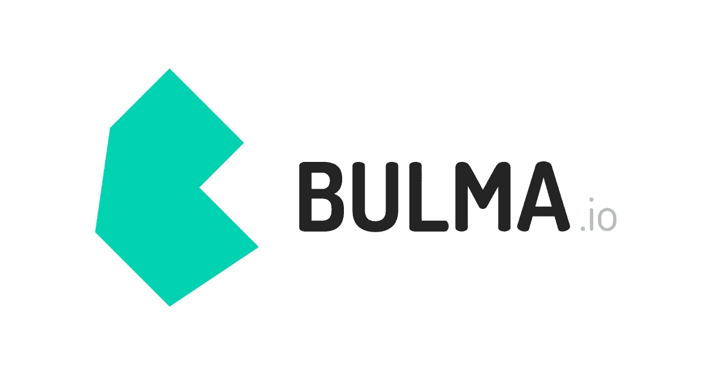
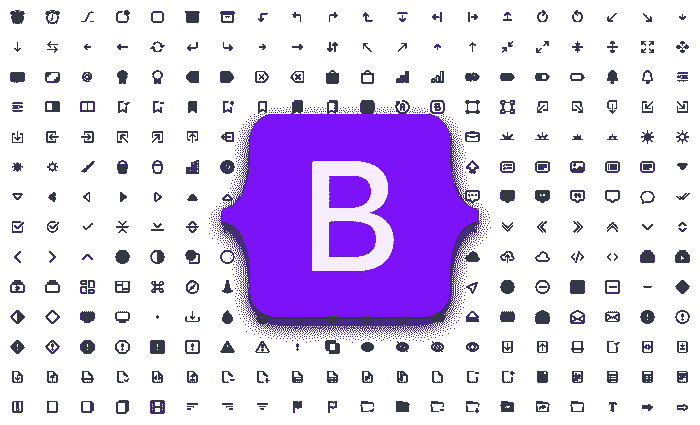
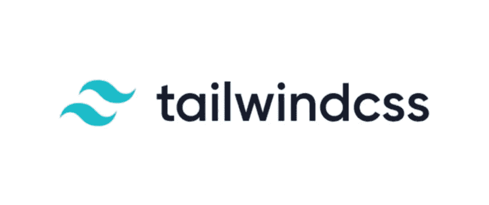
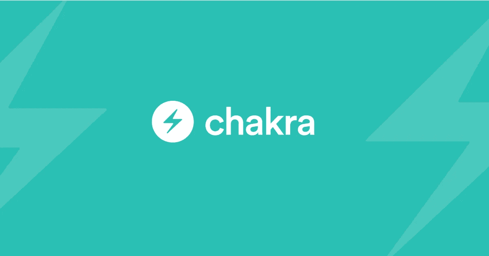
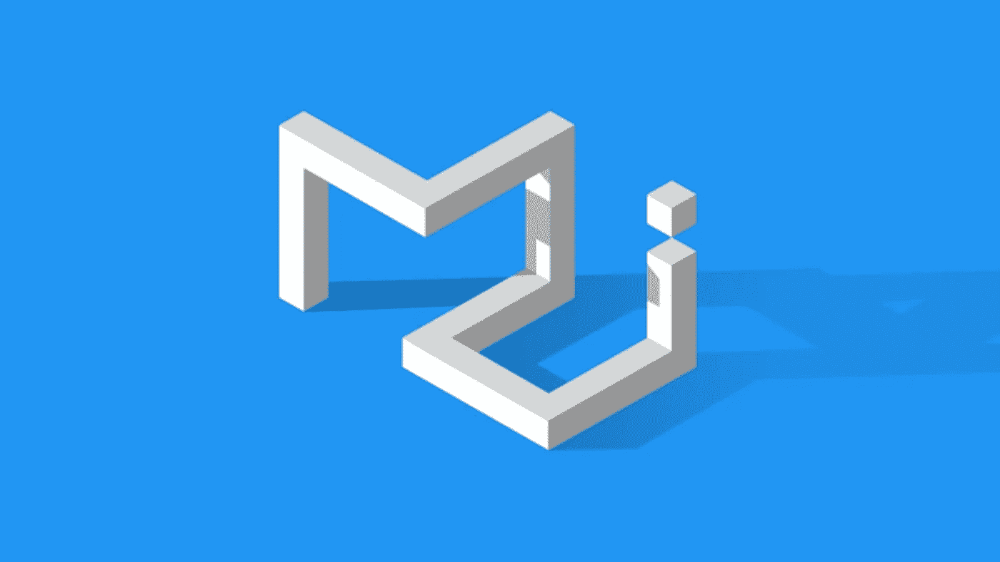
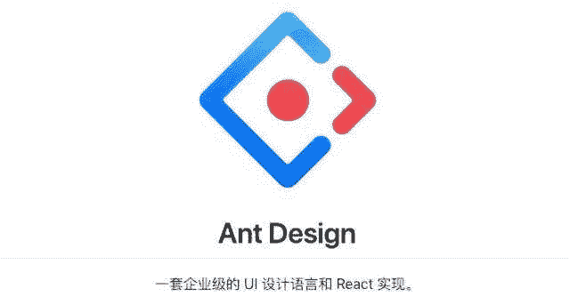

# 我最喜欢的 React 用户界面库

> 原文：<https://javascript.plainenglish.io/my-favourite-ui-libraries-for-react-70cc7ee8cb7?source=collection_archive---------16----------------------->

## 回顾我迄今为止用过的最喜欢的 React UI 库！

作为 React 开发人员，我们经常花费大量时间为应用程序的最终用户构建用户界面(UI)。随着应用程序的增长，创建新组件(如按钮、菜单、页眉、页脚等)的复杂性也在增加！

最近，我读了 [Caelin Sutch](https://medium.com/u/f580c817199e?source=post_page-----70cc7ee8cb7--------------------------------) 的[的文章](/chakra-the-react-component-library-you-need-7e383a105a90)关于他如何爱上 React 应用的 Chakra UI。Chakra 也是我最喜欢的库之一，在这篇文章中，我将介绍一些我最喜欢的库。

# 布尔玛 CSS

[布尔玛](https://bulma.io/)是一个基于 Flexbox 的开源框架，已经获得了超过 20 万开发者的广泛关注。

我选择布尔玛的一个重要原因是它简单而美丽。它附带了几个 UI 组件，这些组件设计得非常好，重点是移动响应能力。

GitHub Stars: 43.9k

# 引导程序

说到 CSS 框架，我们不能忽视曾经流行的 [Bootstrap](https://getbootstrap.com/) (在 GitHub 上吹嘘超过 152k 星！！).这绝对是一个令人惊叹的框架，但是说实话，它已经变得有点无聊了。随着许多网站使用 Bootstrap，风格和组件似乎单调。然而，对于那些已经熟悉 Bootstrap 的人来说，Bootstrap 是一个不错的选择，它也有一个非常值得信赖的开发人员社区来提供支持。

GitHub Stars: 152k

# 顺风 CSS

顺风社是目前的热门话题。Tailwind 允许你在不离开 HTML 代码的情况下设计任何东西。有一个 CSS 类可以处理所有的东西——颜色、大小、字体、阴影等等。我个人不喜欢代码中有太多的 CSS 类。我喜欢基于组件级 CSS 来分离和模块化我的代码。也就是说，对于喜欢框架提供的自由的开发人员来说，Tailwind CSS 可能是一个很好的解决方案。

到目前为止，我们已经看了 CSS 框架，它们不知道我们是否使用 React、Vue、Angular 等。在我们的应用中。接下来，让我们看看一些专门为 React 应用程序创建的库。

GitHub Stars: 44.9k

# Chakra UI

[Chakra UI](https://chakra-ui.com/) 将自己描述为一个简单的、模块化的、可访问的组件库。我最近才有机会利用查克拉，哇，我必须说这是相当惊人的！

作为一名开发人员，我发现 Chakra 的概念和设计语言非常直观。从基于 Flexbox 的组件到复杂的网格，再到表单和列表，一切似乎都很简单，每样东西都有一个组件。

就像 [Caelin Sutch](https://medium.com/u/f580c817199e?source=post_page-----70cc7ee8cb7--------------------------------) 在他的[文章](/chakra-the-react-component-library-you-need-7e383a105a90)中提到的，提到的一些优势是:

1.  容易被覆盖的风格道具
2.  简单的 API 和文档
3.  组件的直观组合
4.  关注可及性
5.  与主题整合
6.  命名道具的一致性

当然，它还自动支持亮/暗模式！

查克拉 UI 绝对是后起之秀！

GitHub Stars: 19.5k

# 材料用户界面

[Material UI](https://material-ui.com/) 最初是谷歌为 Angular 和 React 应用开发的。它有一套漂亮的组件和布局，都是基于谷歌的材料设计。我个人在我的一些 React 项目中使用过它，它使用起来非常简单。

然而，并不是每个人都是材料设计的粉丝。它是一种非常特殊的设计语言，有时，它感觉无处不在，因为你在任何地方都能看到它(尤其是在 Android 应用上)。

如果你热衷于尝试一下，塞巴斯蒂安·埃施韦勒在这里写了一个详细的教程。

GitHub Stars: 69.9k

# 蚂蚁设计

[Ant Design](https://ant.design/) 称自己是第二流行的 React UI 库，它用自己的[设计语言](https://ant.design/docs/spec/values)与 Material UI 的组件竞争。这个库是由蚂蚁金服集团发起并维护的，它源于抽象复杂性以创建高度可重用和稳定的组件的努力。

我真的很喜欢 Ant Design 的详细文档，根据我的经验，它非常适合定制。社区很富裕，图书馆维护得很好。

GitHub Stars: 73.3k

# 结论

还有 React-Bootstrap、语义 UI 等更多库。然而，上面的库是我最喜欢的！我亲自与它们中的每一个一起工作过，我推荐它们，因为它们给我带来了开发人员友好的体验。我目前最喜欢的是 Chakra UI，我相信我会在未来的项目中更多地使用它。

请在下面留下你最喜欢的评论！

编码快乐！💻

*更多内容看*[***plain English . io***](http://plainenglish.io/)