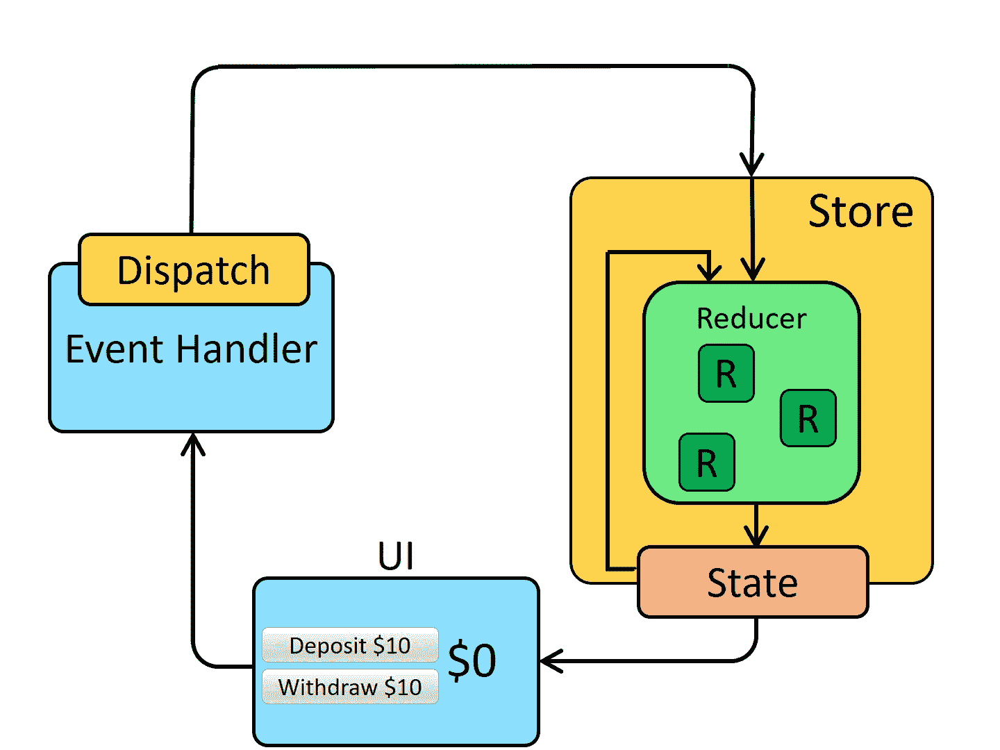

# 我在 Redux Hooked 应用中的第一次集成测试

> 原文：<https://javascript.plainenglish.io/my-first-integration-test-in-a-redux-hooked-app-3b189addd46e?source=collection_archive---------19----------------------->

## 因为我不喜欢嘲笑，所以我用了这个应用的真实商店


各位，你们今天过得怎么样？这是我关于轻松测试 React 应用[和愉悦测试](/testing-a-local-react-npm-package-with-ease-7d0668676ddb)[系列的另一篇文章。记住，轻松愉快地编写代码的秘诀是一步一步来。](/looking-forward-to-testing-react-components-with-joy-5bb3f86c21d7)

在安装和设置 Enzyme 与 Jest 在`[redux-chess](https://github.com/programarivm/redux-chess)`一起工作后，接下来要做的是对应用程序的真实商店进行一些首次集成测试，而不是模仿它。

目标是模拟和自动化用户如何与 UI 交互，因此这篇文章的标题是关于集成测试的。

> 使用 Redux，应用程序的整个状态都保存在商店中，商店与应用程序的其他部分保持分离。

由于我有一些为真实数据库编写集成测试的经验，我认为测试真实的 Redux 存储也是有意义的。我能想到的最简单的用例包括一个常规的同步动作，如下图所示，符合 [Redux docs](https://redux.js.org/tutorials/fundamentals/part-2-concepts-data-flow#redux-application-data-flow) 。



翻转棋盘是一个很好的例子，展示了同步应用程序数据流如何在 Redux 中工作。


从上面的 GIF 中可以看到，当用户从**邀请好友**菜单中选择**翻板**选项时，`flip`在`board`减速器中从`w`设置为`b`。然后棋盘(React 术语中的 UI 组件)检查状态中是否有任何变化，并相应地进行渲染。

事情是这样的，我想出了一个基于[testing-library/React-Hooks-testing-library](https://github.com/testing-library/react-hooks-testing-library)的变通办法，以克服用 Jest 测试 [React Hooks](https://reactjs.org/docs/hooks-intro.html) 的恼人问题。

> 不变违例:钩子只能在函数组件的主体内部被调用。

解决方法是编写一个`SyncDispatcher`钩子，允许在 Jest 测试中将 sync Redux 动作分派给真实的商店。

说到这里，翻板的用例用 Jest 和 Enzyme 翻译成下面的测试。

重要的是要注意，这个定制钩子必须被呈现，以便按预期工作。

```
const action = { type: boardActionTypes.FLIP };const { result } = renderHook(() => SyncDispatcher(action), { wrapper });
```

这样，就很容易自动化多个简单的基于浏览器的任务，比如打开**邀请朋友**对话框，如下图所示。


这将`createInvitationDialog`减速器中的`open`设置为`true`，并转化为以下测试。

下面是整个`[src/__tests__/components/Chess.test.js](https://github.com/programarivm/redux-chess/blob/master/src/__tests__/components/Chess.test.js)`文件目前的样子。

简而言之，这种测试方案允许在 Jest 测试中向真实存储分派同步操作，而不是模仿，同时在 Enzyme 的帮助下检查 React 组件中的相应变化。

[](/looking-forward-to-testing-react-components-with-joy-5bb3f86c21d7) [## 愉快地测试反应元件

### 快乐来自于意识到我正在放松

javascript.plainenglish.io](/looking-forward-to-testing-react-components-with-joy-5bb3f86c21d7) 

## 您可能还对以下内容感兴趣:

*   [在不破坏其他任何东西的情况下，将类添加到坚实的代码库中](https://medium.com/geekculture/adding-classes-to-a-solid-codebase-without-breaking-anything-else-99e6c5a5f3e4)
*   [一个反作用棋盘，棋盘上有几行圈圈和钩子](https://medium.com/geekculture/a-react-chessboard-with-redux-and-hooks-in-few-lines-6009cb724bb)
*   [轻松测试本地 React Npm 包](https://programarivm.medium.com/testing-a-local-react-npm-package-with-ease-7d0668676ddb)
*   [t 用 Jest 最简单的方式添加 React 应用](https://medium.com/geekculture/tdding-a-react-app-with-jest-the-easy-way-8ddb64aeaba6)

*更多内容看* [***说白了. io***](http://plainenglish.io)