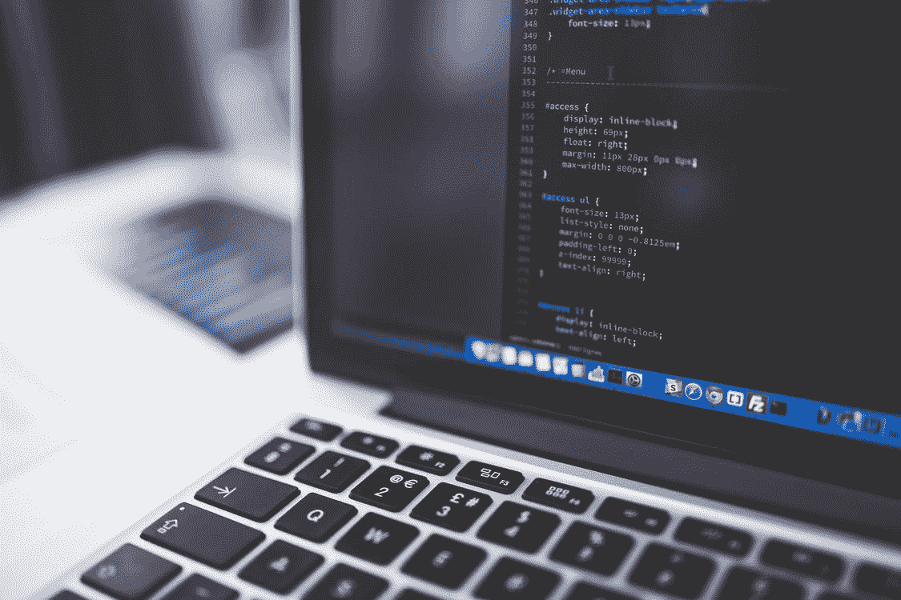

# 我作为程序员的 2022 年目标

> 原文：<https://javascript.plainenglish.io/my-goals-for-2022-as-a-programmer-5ac7d6a31e3a?source=collection_archive---------9----------------------->

## 创建 2022 年的实际计划

[PEXELS](https://www.pexels.com/photo/gray-laptop-computer-showing-html-codes-in-shallow-focus-photography-160107/)

毫无疑问，我度过了美好的一年，这一年即将结束。我仍然不敢相信 2021 年过得这么快，距离 2022 年只有几天了。作为一名普通的程序员，我确实有一个让我的 2022 年更有成效、更成功的计划。

我已经为 2022 年设定了几个目标，我会尽最大努力实现它们。作为人类的一种倾向，我们只是试图遵循一个计划，结果却毁了它。但是，我会尽我所能去完成我的目标。

成为一名程序员很容易，但作为一名程序员生存和升级对许多人来说是一项艰巨的任务。我相信许多读者已经准备好以积极的态度开始他们的 2022 年，并尽他们最大的努力去实现他们已经希望的成功。

我很高兴我最终确定了我的目标，我将尽最大努力在 2022 年完成，并有一个成功的一年。最重要的是，我会在新的一年的前三个月记录我的精神健康和能量水平，这将帮助我做一些相应的改变。

在开始这篇文章之前，我想让你知道，现在你可以通过电子邮件与我联系。别担心，我只会给你发送与技术相关的文章，让你在整个 2022 年都保持更新。点击这里并添加您的电子邮件。看，这很容易。 (我保证不会给你的收件箱发垃圾邮件)

**以下是我 2022 年生活中的三个主要目标:**

## 1.知识

作为程序员，提升自己的知识是必须考虑的最必要的方面。对我来说，提升技能将是 2022 年最重要的部分。我确信，我将能够为我已经决定要学习的技能建立一个学习轨道。

我决定学习和提高的 3 项重要技能

*   **全栈开发**
*   **软件测试**
*   **云计算**

毫无疑问，2022 年对我来说将是重要的一年，因为我将学习这些新技能，提高我对这些技能的认识将是新的一年最重要的任务。

老实说，我计划遵循的唯一关键方面是“**知识就是力量**”，我相信我能够相应地掌握这些领域。除此之外，我还会尽我最大的努力获得一些重要的认证，如 AWS 或 Azure。

除此之外，我还会专注于提高我预先定义的编程技能，比如解决问题。这将帮助我对生活的不同方面进行分析性思考。我也会为一个项目学习一些深度学习的概念。

## 2.净值

正如我已经提到的，2022 年将是一个巨大的年份，我将尽我所能尽可能地增加我的净资产。作为内容创作者，新的一年必将为有价值的内容生产带来巨大的可能性。

许多平台正在接受内容创作者很重要的事实，并相应地做出必要的改变。说到我的净资产，我指的是我打算在新的一年里购买的所有资产。

答案是否定的…如果你认为我会买一部新手机或一台新的笔记本电脑。我会瞄准那些不会随时间贬值的资产。

因此，很明显，我会更加专注于创作与**技术**、**编程**、**区块链**、**加密货币**和**投资**相关的主题内容。我会试着根据我在旅途中获得的经验来创作关于这个主题的高质量内容。

我也非常有兴趣观察 Web 3.0 中的新模式，并试图分析趋势，看看什么最适合我。毫无疑问，我会密切关注多边形，它肯定有潜力在未来取代以太坊。

## 3.增加互动

作为一个内容创作者，我的消费者对我来说比这个星球上的任何东西都重要。因此，我会积极关注不同的趋势，看看我的读者想要什么，我会提供什么。

我将尽我所能提高我的内容质量，并尽我所能在新兴技术领域为我的读者生活增加一些价值。除了我的内容质量不断提高之外，我还将努力在 2022 年发表更多不同领域的文章，以针对不同的受众。

毫无疑问，对于像我这样的内容创作者来说，新的一年将是一个祝福，技术的爆发和 Web 3.0 的兴起将为内容创作者和投资者提供新的可能性，为他们的投资组合增加一些有价值的资产，并使他们的净值最大化

除了密切关注我的读者，我还会关注当前数字时代的不同趋势。我将使用免费工具，如**谷歌趋势**来分析全球发生的不同趋势。

此外，我还没有计划，但我会尝试写一些关于自我提升和个人理财的话题。我不确定我是否会进入不同的领域，但如果我发现有价值的东西可以写，我不会只关注技术领域。

总结所有要点，我将主要关注自我提升，并相应地设定我的目标，毫无疑问，2022 年对我们每个人来说都将是美好而令人敬畏的一年。我们都将尽最大努力在 2022 年取得成功，并在生活的不同领域提升自己。我们努力与周围的人建立良好的关系，寻找新的朋友，充分利用网上的资源。

我希望你的新的一年将是你生活中的一个伟大的契合，这一新的篇章将向你展示成功的巨大可能性。坚持每天为自己努力，努力充分利用新的一年。

离新年只有几天了，我希望你们都很兴奋。我很确定在读完这篇文章后你会尝试你的目标，你会为你的生活增加更多的价值。祝你有一个非常光明和成功的 2022 年，祝你新年快乐！

 [## 通过我的推荐链接加入 Medium-Aniket

### 作为一个媒体会员，你的会员费的一部分会给你阅读的作家，你可以完全接触到每一个故事…

aniketz.medium.com](https://aniketz.medium.com/membership) 

*更多内容看* [*说白了. io*](http://plainenglish.io/) *。报名参加我们的* [*免费每周简讯*](http://newsletter.plainenglish.io/) *。在我们的* [*社区*](https://discord.gg/GtDtUAvyhW) *获得独家写作机会和建议。*