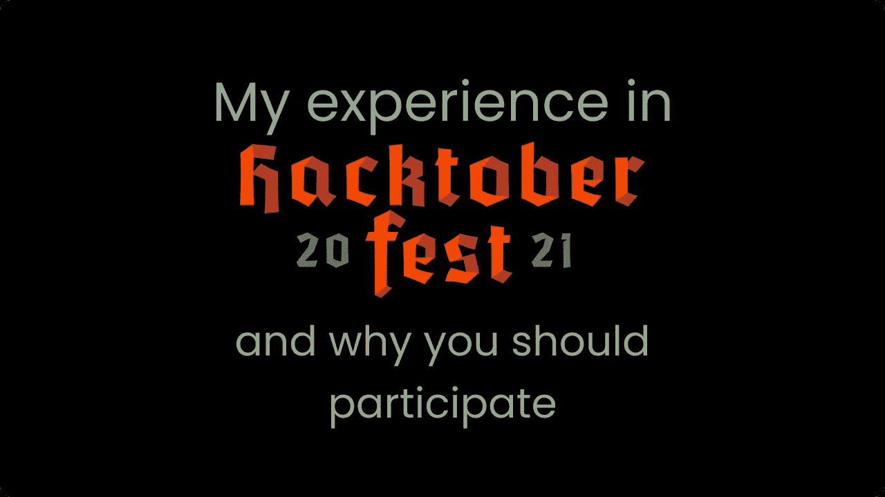

# 我在 2021 年 Hacktoberfest 的旅程以及为什么你也应该参加

> 原文：<https://javascript.plainenglish.io/my-journey-in-hacktoberfest-2021-and-why-you-should-also-participate-9cfbda29ae1b?source=collection_archive---------15----------------------->

# 什么是 Hacktoberfest？

T2 啤酒节在每年的十月举行。这一切都是为了让人们对开源项目做出高质量的贡献(T4)。那些提出 4 个有效的拉动请求并被合并的人将获得一些赠品(t 恤、贴纸)。

我对今年的啤酒节感到非常兴奋，因为这是我第一年参加它。2021 年的 Hacktoberfest 将会给我一个机会提出许多高质量的拉动式请求。现在，这并不意味着你应该只在 Hacktoberfest 期间做出贡献，你应该在任何有机会的时候做出贡献。

# 显著的贡献

# 迁移到 Firebase v9 JS SDK

我从处理[开始，这是一个标记为](https://github.com/avneesh0612/voyagger/issues/12) `[hacktoberfest](https://github.com/avneesh0612/voyagger/issues/12)`的问题(这是你应该寻找的那种问题)。我以前从未使用过 Firebase v9 JS SDK，但这是我体验 SDK 新的模块化本质的绝佳机会。在这个问题上，我学到了很多。在我完成了所有的迁移和测试之后，我打开了[一个拉请求](https://github.com/avneesh0612/voyagger/pull/15)，过了一段时间，它被合并了，我再一次感到高兴。你可以在这里读到为开源[做贡献的快乐。](https://blog.anishde.dev/the-joy-of-contributing-to-open-source)

# 改变风格，融入 Hacktoberfest 2021 颜色

[Usman Sabuwala](https://twitter.com/MaxProgramming1) 做了[一个惊人的项目](https://github.com/max-programming/hacktoberfest-projects)让任何人都可以寻找 Hacktoberfest 项目来贡献。一个问题是，网站中使用的配色方案类似于 Hacktoberfest 2020 的配色方案。我决定改变配色方案并做一些修改，然后提交[一个拉请求](https://github.com/max-programming/hacktoberfest-projects)。我学到了很多关于 DaisyUI(一个顺风 CSS 插件)和如何设计网站滚动条的知识。

参加 Hacktoberfest 不是为了得到奖品，而是为了做出高质量的贡献并从中学习。你将有机会从解决问题中学到很多东西。在 Hacktoberfest 期间，许多社区会组织一些活动，讨论如何为开源做贡献以及如何开始。简单地说，参加 Hacktoberfest 来熟悉开源，然后只要有机会就为开源做贡献。

Hacktoberfest 2021 仍然没有结束，你在 10 月 31 日之前还有时间，如果你在那之前不能完成 4 个质量拉请求，不要担心，仅仅做出质量贡献就意味着很多，并且让你开始为开源做出贡献。

你可以看看我的文章，关于开源在日常生活中的重要性，以及为什么我们应该为开源做贡献。我在我的[上一篇文章](https://blog.anishde.dev/the-joy-of-contributing-to-open-source)中也谈到了为开源做出贡献的喜悦。

这篇文章到此为止，欢迎在下面评论你在开源社区的想法和成就，你也可以通过 [Twitter](https://twitter.com/anishde12020) 联系我。下一集再见！！！

*最初发布于*[*https://blog . anishde . dev*](https://blog.anishde.dev/my-journey-in-hacktoberfest-2021-and-why-you-should-also-participate)*。*

*更多内容看* [***说白了. io***](http://plainenglish.io/)