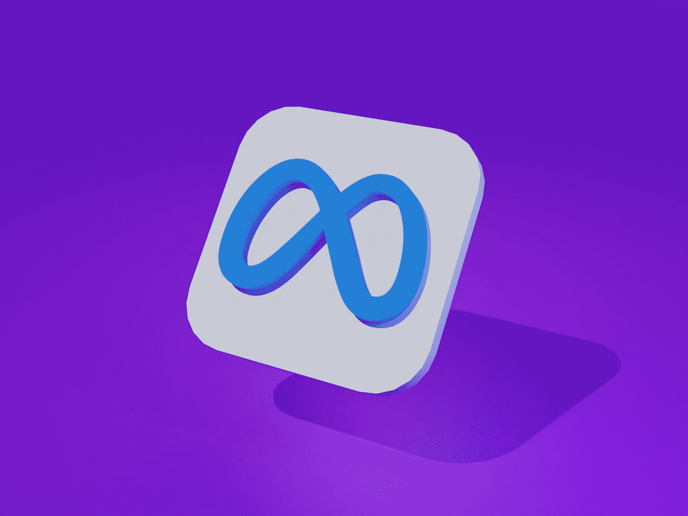

# 我在 Meta 找工作的旅程

> 原文：<https://javascript.plainenglish.io/my-journey-to-meta-a431663763f9?source=collection_archive---------1----------------------->

## 给我和大家的采访笔记。

Photo by [Muhammad Asyfaul](https://unsplash.com/@asyfaul?utm_source=medium&utm_medium=referral) on [Unsplash](https://unsplash.com?utm_source=medium&utm_medium=referral)

故事开始于 2020 年 2 月左右。

一位招聘人员给我发信息，问我是否想去脸书试试。我答应了，并很快接受了筛选面试。招聘人员第二天给我发了电子邮件，说我干得相当不错。然而，几个星期后，我没有收到他的回信，后来我发现他们因为我的 J 签证而无法前进。

对于那些没有听说过这种签证的人来说，J 签证要求持有人在 J 签证到期后回国服务，对我来说是 2 年，除非我获得豁免，而我在那年晚些时候才获得豁免。我明白这对招聘公司来说是一个风险，所以不要难过。

大约在同一时间，我也参加了谷歌的面试，并进入了招聘委员会的最后一轮。我仍然记得当我接到招聘人员的电话时，我是如此的紧张，以至于我不得不走出车外去接电话(那时我正坐在去上班的火车上)。以防我听到结果时情绪过于激动！后来我才发现这是个坏消息😮‍💨。按照他们的说法，是因为我没有表现出“强大的编码能力”。嗯，那很可能是真的！😂

快进到 2021 年 4 月，招聘人员再次检查我是否想再试一次。但这一次，我想尽我所能，这样我就能有更好的机会。所以我告诉他们我想在十月左右做。也是在那个时候，多亏了之前的公司，我才拿到了 H1B 签证。我仍然非常感谢他们做了两次申请才最终实现！

在面试之前，我做得最多的就是打字。基本上，只要我有空，不管是下班后还是周末，我都会去做。由于我在上一份工作中在家工作，有时我在家里很快就感到无聊，所以我也去咖啡店，这确实使我很容易专注于算法问题，我发现这非常有效和富有成效。我听到很多声音说 LeetCode 不好什么的，但对我来说，更多的是一个机会。因为我也从很多人那里听说 LeetCode 帮助他们得到了梦寐以求的工作机会。

因此，我获得了一年的会员资格，并发现对我来说最有价值的功能是，它允许我整理我感兴趣的公司最常被问到的问题。我试图完全理解每家公司的前 100 个常见问题。我发现的另一个有用的特性是，我可以获取其他人针对每个问题提交的最佳解决方案，并将其与我的进行比较。就我个人而言，我认为仅仅通过阅读别人的代码，我就提高了我的编码技能💪。另一个好处是，一些问题(至少是想法)在大公司中相当普遍，所以我差不多是一次为所有这些问题做好了准备。

此外，我发现脸书(和其他公司)有一个系统设计回合，所以我买了一个在线课程(它被称为*“探索系统设计面试”*)。为了更好地理解系统设计的大部分内容，比如分片、缓存、负载平衡、一致性散列等，我试着将所有的问题和主题复习了 3 到 5 遍。然而，我发现偶尔我需要做一些谷歌搜索来更好地理解一个特定的术语，因为课程假设我已经知道它们了(但是我没有，🤷)所以它没有足够详细地解释这些术语。

(Btw，在准备期间，我还得到了亚马逊、Audible 和 Dropbox 的面试机会。)

终于，十月来了。我开始一个接一个地做采访。还有，因为 covid，所有的采访都是虚拟的。

我面试的第一家公司是谷歌。招聘人员提到我可以直接进入现场面试，因为我上次做得不太差，所以这为我省了一些麻烦。我仍然清楚地记得其中一次采访。面试官分享了这个问题，并提到我们会尝试用 3 个步骤来解决它。所以我按照他的指示，第一个和第二个很简单，但是对于第三个，我无法找到解决方案，因为它依赖于前两个步骤，而我正朝着一个完全错误的方向前进😨。面试结束后，我马上意识到，如果我把它建模成一个图形问题，我会很容易地解决所有问题，但为时已晚😞。最后，尽管我认为我在其他面试中表现得很好，以谷歌的标准来看，我再次失败是意料之中的。

第二个是亚马逊。我需要先通过在线评估，我做到了，然后去现场面试。我做得不错，但不像出色的表现。他们确实给了我一个 offer，但是出乎意料的是，是入门级的 offer，所以我没有接受。在现场面试之前，招聘人员确实为面试者组织了一次扩大会议，解释如何为最后的面试做适当的准备。我从那次会议中得到的最重要的信息是，他们更看重你如何回答行为问题，而不是技术问题，这意味着如果你在行为问题上比技术问题上表现得更好，你就更有可能获得聘用。

第三次是可以听到的。因为它属于亚马逊，所以我不用再做在线评估了。在现场面试中，面试官很友好(不知何故，这让我感觉很放松；希望大家都能遇到这样的面试官)。我和他们所有人都聊得很开心。我知道我做得很好，并得到了他们的聘用，正如我所料😃。

然后是脸书。我不得不再次进行电话筛选，因为距离我上次这样做已经过去一年多了。我做了电话筛选，然后去现场面试。我想提到的一件事是，当我做现场采访时，脸书有 7 个小时的停机时间，我有点恐慌，因为所有采访的链接都无法访问。幸运的是，我仍然从视频中与他们取得了联系，我用一个我发现非常容易使用的绘图工具(whimsical.com)进行了系统设计。我的表现介于亚马逊和 Audible 之间。有人告诉我，我做得非常好，他们也给了我一份工作。😂

最后一个是 Dropbox。老实说，这是最难的一个，因为他们更关注多线程和数据库事务类型的问题。我没有多少多线程的经验，所以我没有得到邀请，这是意料之中的🙃。

在比较了每家公司的福利和待遇后，我选择了脸书(现在的 Meta)。

总之，下面是我在旅途中学到的几点，希望它们对那些在面试过程中挣扎的人有用。

1.  我从失败的谷歌面试中学到，我需要首先**关注(接近)最优解**或，如果它可以转化为我真正熟悉的东西，这确实帮助我在接下来的面试中表现良好。因为一旦我的想法是正确的，我就有很大的机会按时完成。相反，如果我只是在花了一半的时间后才意识到自己的想法是错误的，我就不太可能在有限的时间和不可避免的精神压力下完成它。
2.  **平静下来**帮我完成了一次面试。我被要求实现发布-订阅模式，当我听到时，我一点头绪都没有，几乎惊慌失措。此外，你不会在 LeetCode 上发现类似的问题，因为它更多的是一个设计模式问题，而不是算法问题。幸运的是，我做了几次深呼吸，意识到大约 2 年前，我和我的同事讨论过这个话题，我抓住了它😌。
3.  我试着**询问关于问题需求的确认**，以确保我们正在试图解决相同的问题。有人告诉我，如果你不确认要求，一些面试官会认为这是一个严重的危险信号。所以总是这样做是个好主意。
4.  还建议**大声说出自己的思维过程**，因为不然面试官就不知道你是否卡住了。我试着尽可能地去了解它。有时，如果我说了一些不一定是正确方向的话，一些面试官会友好地给我一些反馈，这样我就可以回到正轨。
5.  由于亚马逊非常重视行为问题，我**为每个领导原则提前**准备了具体的例子。因为我不认为我能当场想出最好的例子，所以我必须这样做。因为每次面试他们会问 2 到 3 个行为问题，我建议至少准备 10 个左右的例子。
6.  **Big-O 符号**也很重要，因为有很多次，在每次面试快结束时，面试官都会让我用这个分析来总结我的解决方案。据我所知，这将向面试官展示你了解自己的东西。
7.  另一件事是，如果出于某种原因，你不想一天参加 4 或 5 场面试，你可以**把面试分成两天**，这样压力会小一些(我相信大多数招聘人员会很乐意帮你安排)。我和脸书就是这么做的。
8.  只要有可能，我就坚持做一些运动，比如在中央公园跑步或者打篮球。我喜欢做运动，因为有时，我的大脑在做了太多的运动后会卡住，在一些运动后，我可以很快恢复精神并充满能量。

最后但同样重要的是，我希望每个人都能找到理想的工作。继续努力。我相信每个人都能做到。另外，如果你对任何话题有任何问题，请告诉我。我会尽力回答。

*更多内容看* [***说白了。报名参加我们的***](https://plainenglish.io/) **[***免费周报***](http://newsletter.plainenglish.io/) *。关注我们关于*[***Twitter***](https://twitter.com/inPlainEngHQ)*和*[***LinkedIn***](https://www.linkedin.com/company/inplainenglish/)*。加入我们的* [***社区***](https://discord.gg/GtDtUAvyhW) *。***