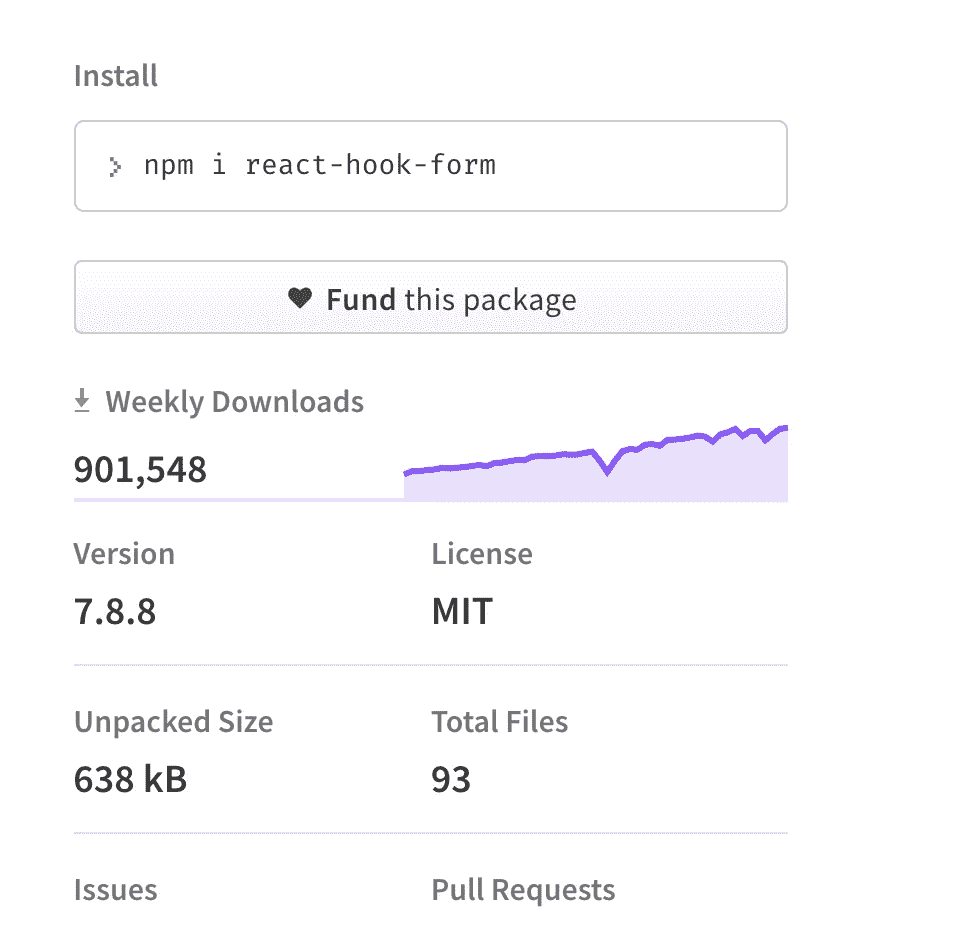
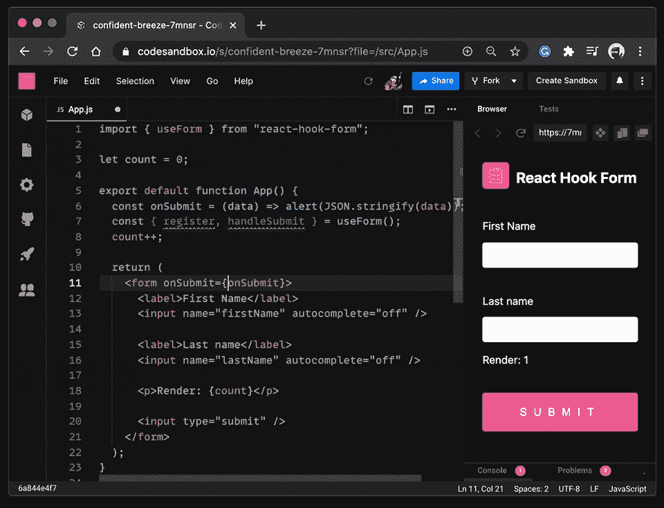
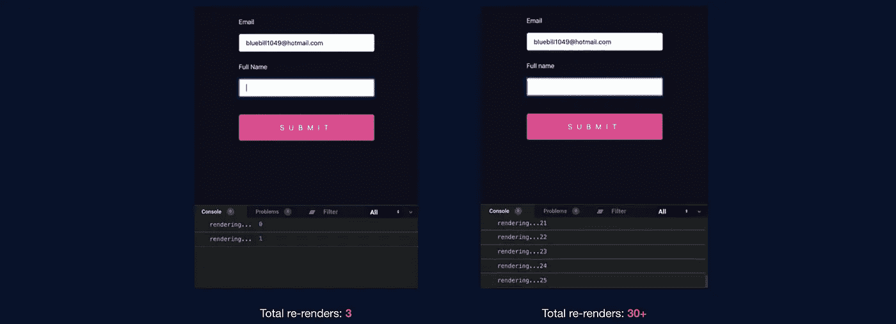

# 我在 React 中处理表单的首选方式

> 原文：<https://javascript.plainenglish.io/my-preferred-way-of-working-with-forms-in-react-4014afad865c?source=collection_archive---------7----------------------->


Photo by [Romain Dancre](https://unsplash.com/@romaindancre?utm_source=medium&utm_medium=referral) on [Unsplash](https://unsplash.com?utm_source=medium&utm_medium=referral)

在我的日常工作中，我一直在大量使用一些前端框架和库。使用 React 与使用 Angular 之类的东西不同，至少在两个框架处理表单的方式上不同。

在 Angular 中，对于简单的表单类型，您可以获得模板驱动的表单，对于具有不同值和复杂验证等的更复杂的表单，您可以获得反应式表单。

使用 React 时，首先我们应该明白它只是应用程序视图部分的一个库，其他实现如状态管理(“Context API 在那里”)、路由和表单处理等。

# 实现表单的不同方式:

最简单的方法是对某种状态(组件状态或全局状态解决方案)使用 handle change，但我不喜欢这样做，而且考虑到我处理的表单类型可能有 5 到 30 个字段，用 if-else 子句创建自定义验证对我来说不是很直观，我很快就厌倦了这样做。

另一个解决方案是类似于 **Formik** 的东西，这是许多人的首选，但我最近发现它很慢，我有一个用户注册页面，要求有近 15 个字段。**UI 突然变得很慢，我已经编写了验证程序。**

我的救星和转变是瞬间的。

## 我处理表单的方式:

我使用一个名为 react-hook-forms 的库。



npm react-hook-from



Courtesty of React-hook-form team

这不是一个新的东西，相反，它在社区中非常受欢迎，并且不断上升。

该库非常直观，并且具有最小数量的模板。

有一个名为 useForm 的钩子，它提供了一些属性，比如 handleSubmit、getValues、register。

Register 是最重要的一个，因为它可以确保你的表单域注册到钩子表单，绑定也完成了，所以你现在可以很容易地做验证和其他事情。不需要创建一个 handleChange 和所有的事情。

我处理大多数字段的方式是创建一个自定义组件:

```
 const FormField = ({ *name*, *label*, *register, required* }) => {
let type="text";switch (*name*) {
  case 'password':
    type = 'password';
  default:
    type = 'text';
}return (
<label>{*label*}</label>
<input *type*={type} {...register(name,{
                     required
                   })}>
</input>
<ErrorMsg inputName={name} />
)} const ErrorMsg = ({ inputName }) => (
    <>
      {errors[inputName] && (
        <small className="text-sm text-red-400 font-medium block mt-1 px-4">
          {
            errors[inputName]['message'] ?
            errors[inputName]['message'] :
            errors[inputName]['type'] === 'allowed' ?
            `invalid username` :
            `${inputName} is required`
          }
        </small>
      )}
    </>
  )
```

现在使用这个:

```
<form onSubmit={handleSubmit}>
 <FormField name="userName" register={register} label="User Name*" required/>
 <FormField name="password" register={register} label="Password *"/>
</form>
```

使用这个名字，我们也可以编写不同种类的验证，这非常简单，我也使用了 Yup 验证和其他不同的内置验证。

除了直观之外，我更喜欢这个库，因为它的性能优势，同样的表单，15 到 25 个字段的钩子表单感觉非常快。

对于其他库和自定义实现，当您添加复杂的错误处理时，每次击键时所有字段的重新呈现次数都会增加，但 hook form 团队在这方面做得很好。

如截图所示，重新渲染的次数非常少。

欲了解更多统计数据，请访问网站:

【https://react-hook-form.com/ 



## 结论

我强烈建议您亲自尝试一下，如果您使用 react，您也会喜欢使用 hook 表单，很高兴看到一个更成熟、更实用的库，但不太为人所知。

但是在离开之前，我想强调一点，就像任何其他库一样，注意突发的变化并相应地工作，因为这可能会导致最后一分钟的恐慌。

快乐编码，并作为软件工程师关注更多真实世界的问题及其解决方案。

## 进一步阅读

[](/how-to-build-your-own-surveys-extend-them-with-custom-javascript-b4c7eb5648c4) [## 如何构建自己的调查并使用定制的 JavaScript 扩展它们

### 这是一本关于如何使用自己的 JS 函数来扩充 SurveyJS 附带的条件逻辑和验证器的入门书。

javascript.plainenglish.io](/how-to-build-your-own-surveys-extend-them-with-custom-javascript-b4c7eb5648c4) 

*更多内容请看*[***plain English . io***](https://plainenglish.io/)*。报名参加我们的* [***免费周报***](http://newsletter.plainenglish.io/) *。关注我们关于*[***Twitter***](https://twitter.com/inPlainEngHQ)[***LinkedIn***](https://www.linkedin.com/company/inplainenglish/)*[***YouTube***](https://www.youtube.com/channel/UCtipWUghju290NWcn8jhyAw)*[***不和***](https://discord.gg/GtDtUAvyhW) *。***