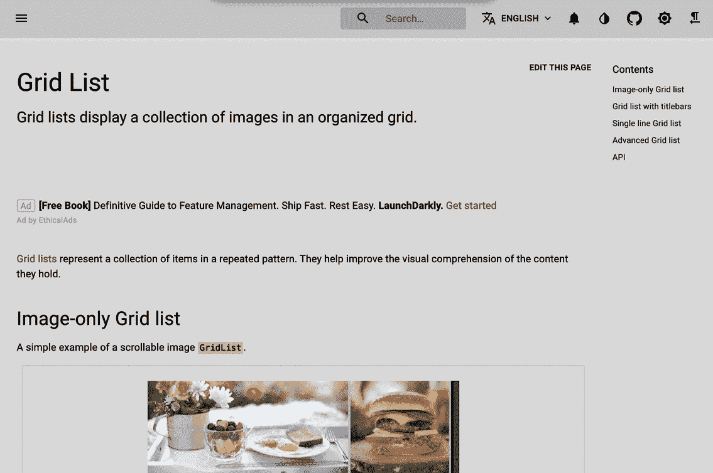
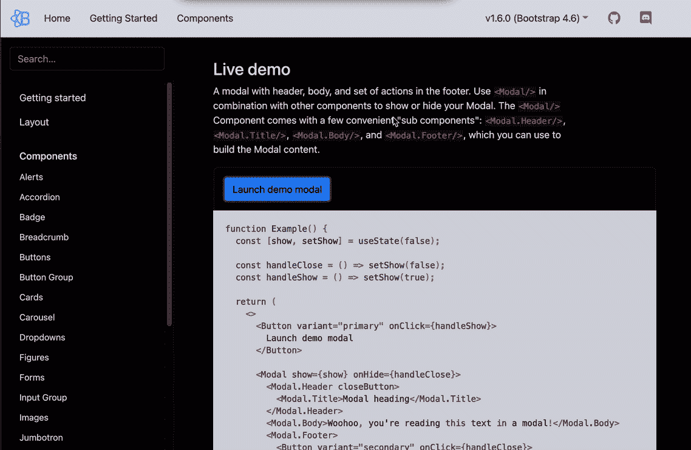
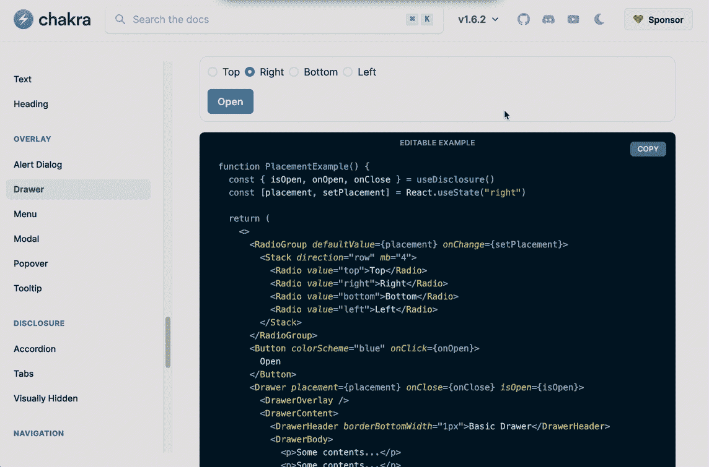
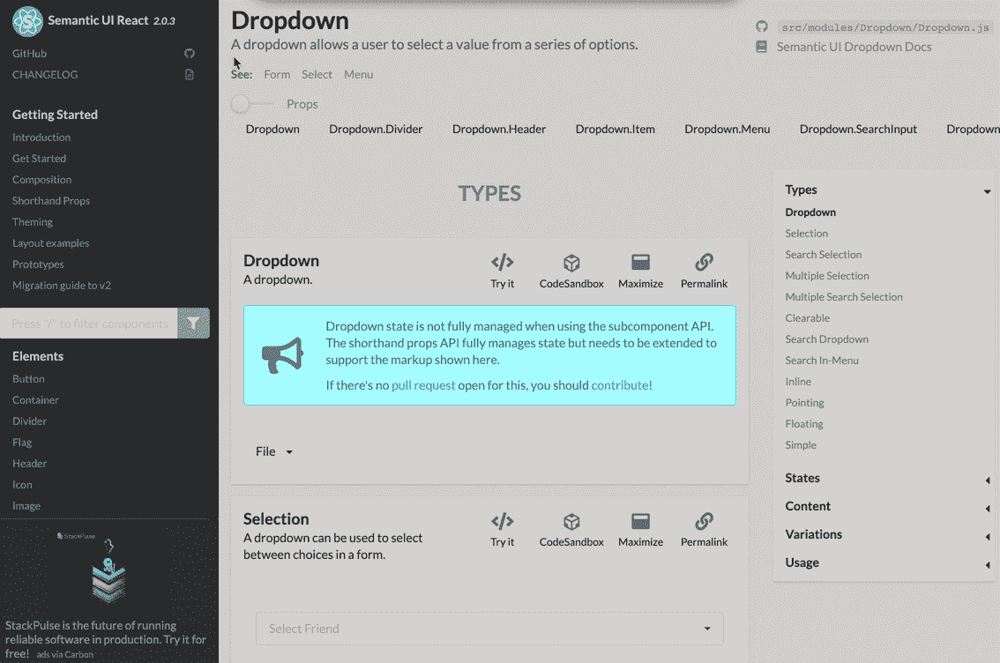
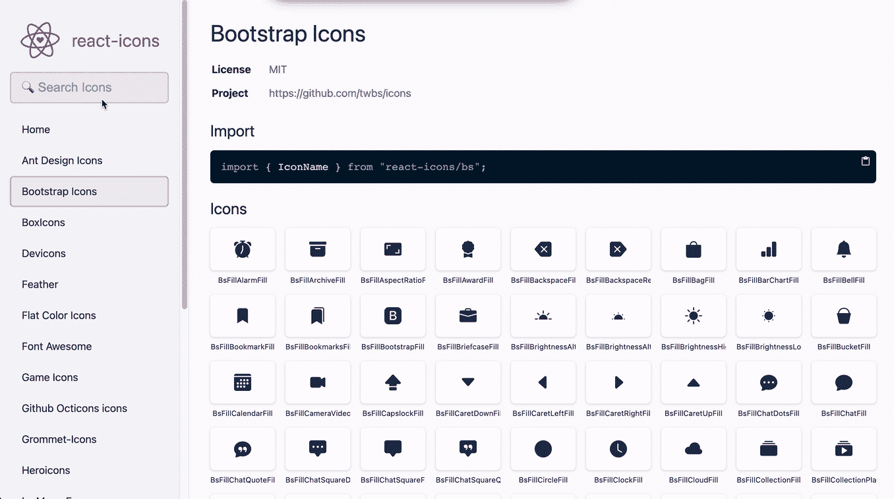
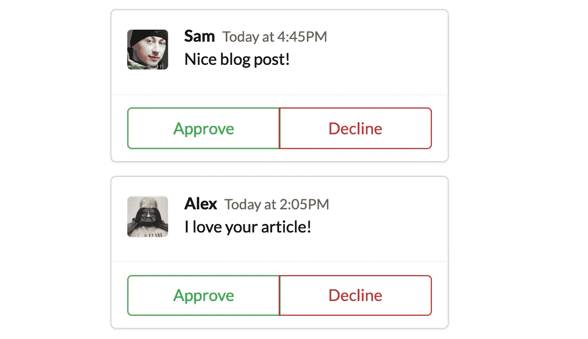
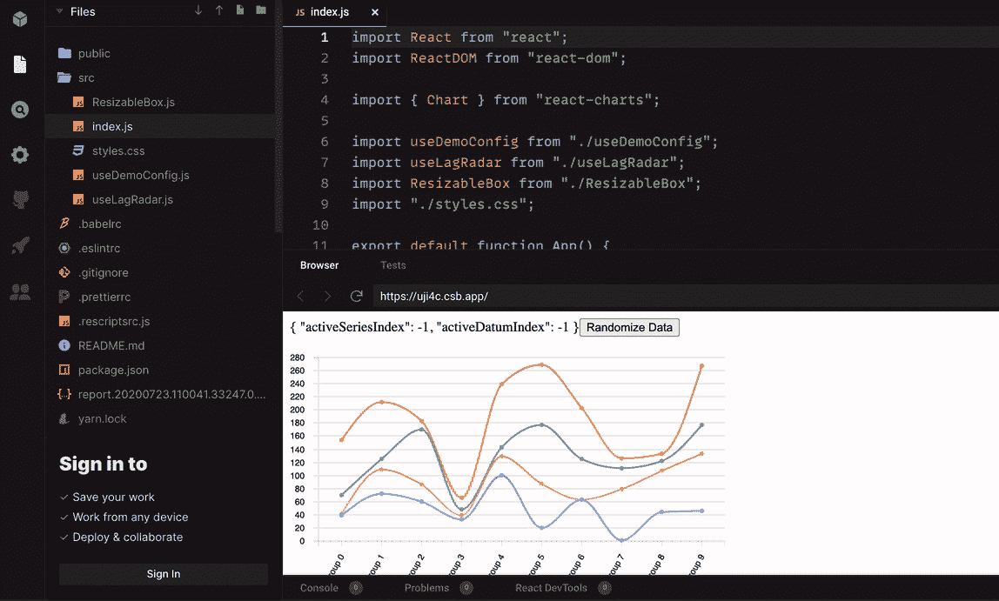
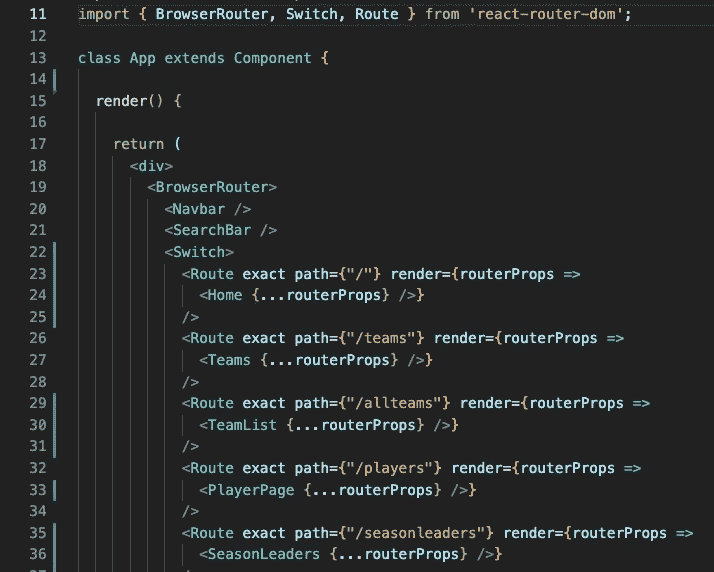
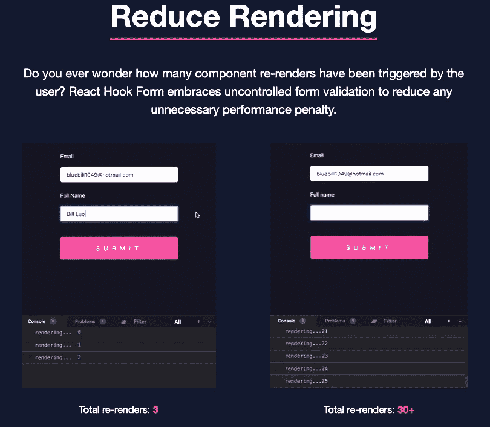

# 2021 年前 10 名必须有 React 库

> 原文：<https://javascript.plainenglish.io/my-top-10-must-have-react-libraries-in-2021-6e22cce4b592?source=collection_archive---------8----------------------->

没有这些 React 组件库，项目就不会一样。我不知道没有他们我该怎么办！有这么多，每次我遇到一个新的，使我的开发时间更有效，我的项目更时尚的，我都很兴奋。以下是我在 2021 年迄今为止使用过的最喜欢的必备 React 库！

# 1.材料用户界面

Material UI 是最流行的 React UI 组件库之一，如果不是开发人员最喜欢的话。它是用谷歌的材料设计建造的，有大量预建的 React 组件，其元素设计时尚简单。它让您可以轻松地在我们的 React 应用程序中集成高质量的外观。如果你想让你的应用快速启动并运行，而不需要花太多时间设计单个组件，它们也有预建的主题。

**GitHub ⭐️: 68.4k
文档:** [素材-UI](https://material-ui.com/) **安装(NPM):**NPM install @ material-ui/core

# 2.反应引导

Bootstrap 是最顶级的 UI 库之一，React Bootstrap 是一个专门用于使用 React 的引导组件的库。有大量预建的 React 组件，去掉了如果只使用 Bootstrap 可能不需要的第三方库。web 和移动应用程序都有大量的元素，为您提供了许多可响应的 web 组件。

**GitHub ⭐️: 19.4k
文档:** [React 引导](https://react-bootstrap.github.io/) **安装:** npm 安装 react-引导

# 3.Chakra UI

如果我有困难，Chakra UI 是我的首选库，因为它比其他库更容易使用和浏览文档。它的模块化和可访问的用户界面组件允许轻松的风格。非常适合初学者！

**GitHub ⭐️: 18.2k
文档:**[chakra-ui](https://chakra-ui.com/) **安装:**转[此处](https://chakra-ui.com/docs/getting-started)获取安装

# 4.语义反应用户界面

语义反应 UI 是另一个很棒的样式元素库。这个库没有语义 UI 所具有的 jQuery 等第三方库，因此更适合 React 应用程序。您可以使用可定制的元素轻松创建具有风格和响应性的 web 设计。

**GitHub ⭐️: 18.2k
文档:** [**语义-UI 反应**](https://react.semantic-ui.com/) **安装:** npm 安装语义-ui-反应语义-ui-css

# 5.反应图标

这是我寻找图标的地方。有这么大一个不同风格的库，介于自举图标，材质设计图标，字体牛逼等等。超级容易使用，你可以很容易地通过他们的简单布局搜索图书馆，而不必导航到不同的页面。

**GitHub ⭐️: 6.3k
文档:**[react-icons](https://react-icons.github.io/react-icons/) **安装:**使用以上链接

# 6.卷轴动画(AOS)

当您滚动页面时，动画显示页面上的元素。您可以控制持续时间、滚动方向、延迟动画等等。

**GitHub ⭐️: 16.6k
文档:** [AOS](https://michalsnik.github.io/aos/) **安装:**使用以上链接

# 7.faker.js

Faker 对于开发者来说是一个非常方便的工具。faker 可以帮助为你的应用程序提供所有需要的假数据，而不是花费时间手动尝试为你的应用程序的数据库提供电子邮件、地址、公司名称，甚至电子商务商店的图像或产品。只需查看他们的文档，了解您可以使用的不同类型的数据和 API 方法。下面，我选择 fakers 头像显示在一篇博文评论中。

**GitHub ⭐️: 32.1k
文档:**t29】faker . js **安装:** npm 安装 faker

# 8.反应图表

当您需要在项目中添加图表和图形时，这是一个很好的资源。它们是灵活的，你可以自定义它们，它允许你动态地显示你的数据。

**github ⭐️: 1.4k**
**文档:** [React 图表](https://react-charts.tanstack.com/)
**安装:**点击[此处](https://react-charts.tanstack.com/docs/installation)获取安装指南

# 9.反应-路由器-Dom

当您需要 React 中的声明性路由时，这显然是项目中的必备组件。

**github ⭐️: 43.2k**
**文档:** [React 路由器 Dom](https://reactrouter.com/web/guides/quick-start)
**安装:** npm 安装 react-router-dom

# 10.反应钩形

如果表单在 React 应用程序中一直是一个难题，那么 React hook form 就是一个救星。这个库有助于制作带有正确错误消息的启用验证的表单，您可以编写更少的代码，删除不必要的重新呈现，并且一切运行得更快。为什么在我的期末项目中我不知道这些？！！表格是我的噩梦！超级酷的演示在他们的网站上，比较了反作用钩子表单和受控表单。见下面一个。

**GitHub ⭐️: 20.9k**
**文档:** [React 钩子形式](https://react-hook-form.com/) **安装:** npm 安装 react-hook-form

source: react-hook-form.com

# 结论

有大量的 React 库和框架非常棒，非常强大。这不是一个完整的列表，只是我目前为止亲自尝试过的。你最喜欢的 React 库有哪些？有什么新的令人兴奋的我应该去看看的吗？请在评论中告诉我！👇🏻编码快乐！

*更多内容请看*[***plain English . io***](http://plainenglish.io)