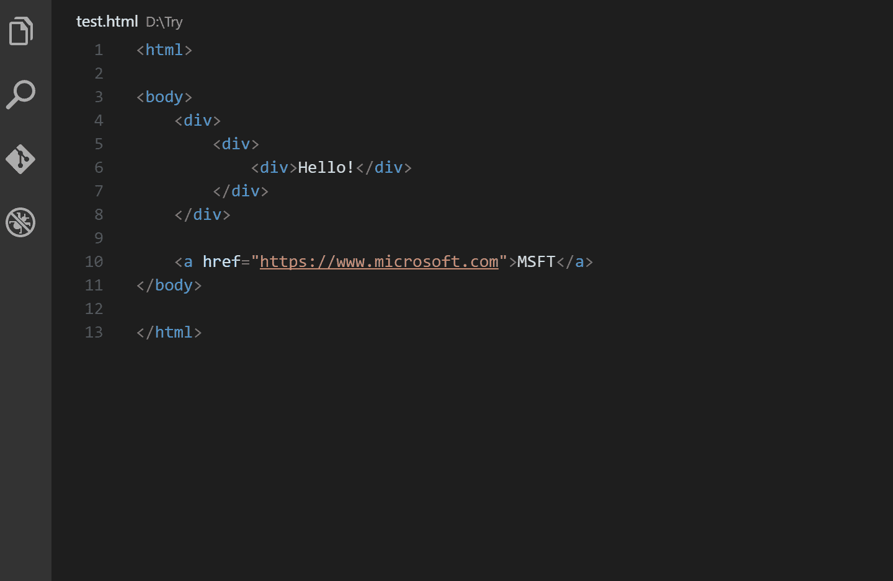
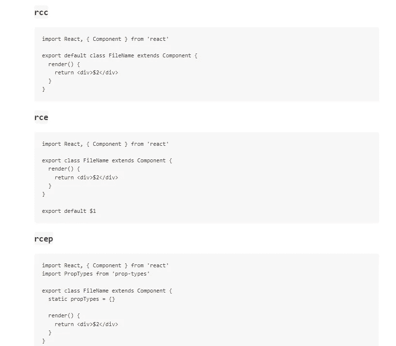
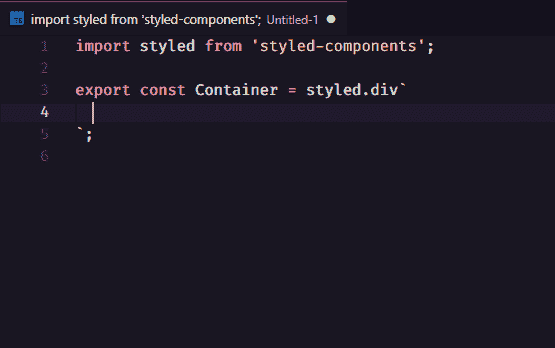
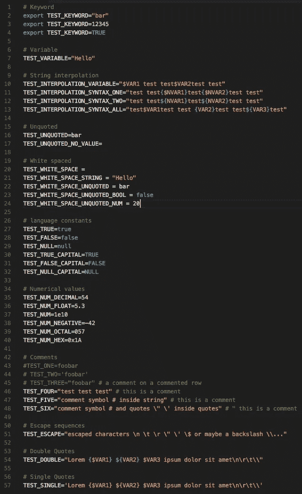
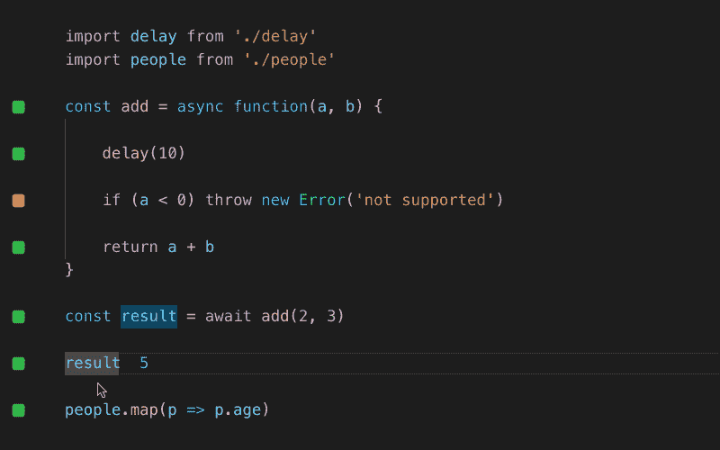

# 我的 VSCode 设置&没有它我无法编码的插件

> 原文：<https://javascript.plainenglish.io/my-vscode-setup-plugin-i-cant-code-without-cdc5cb677cb4?source=collection_archive---------3----------------------->

## 拥有合适的环境和工具可以改变游戏！


By FAM

有几次，我在 VSCode 上编码时体验到一些 *wow* 效果。不是因为我的编码技能(他们很普通，hihihi)而是因为我的工具和我的 VS 代码是如何配置的。

这篇文章讲的是我离不开的 VS 代码插件！

让故事开始！

# 自动重命名标签

自动重命名成对的 HTML/XML 标签。

[](https://marketplace.visualstudio.com/items?itemName=formulahendry.auto-rename-tag) [## 自动重命名标记- Visual Studio 市场

### Visual Studio 代码扩展-自动重命名成对的 HTML/XML 标记

marketplace.visualstudio.com](https://marketplace.visualstudio.com/items?itemName=formulahendry.auto-rename-tag) 

## 它将如何改变您的编码:



[vs code](https://marketplace.visualstudio.com/items?itemName=formulahendry.auto-rename-tag)

# 括号对着色机

这一扩展取得了它的创造者做梦也想不到的巨大成功。这是一个可定制的扩展，用于给匹配的括号着色。不用再搜索哪个括号对应哪个。

> [更新]:正如 [Teekka](https://medium.com/u/cb6045fea93a?source=post_page-----cdc5cb677cb4--------------------------------) 反馈所说，括号对着色功能从现在开始是最新的 VSCode 中的一个内置功能。

这解释了这个插件在❤开发者中是多么的成功

这个扩展将允许你看到匹配的括号和颜色。

[](https://marketplace.visualstudio.com/items?itemName=CoenraadS.bracket-pair-colorizer) [## 括号对着色程序- Visual Studio 市场

### settings . JSON { " editor . bracketpaircolorization . enabled ":true，" editor . guides . bracketpairs ":" active " }此扩展…

marketplace.visualstudio.com](https://marketplace.visualstudio.com/items?itemName=CoenraadS.bracket-pair-colorizer) 

## 这将如何改变您的代码:


[vs code](https://marketplace.visualstudio.com/items?itemName=formulahendry.auto-rename-tag)

# ES7 React/Redux/graph QL/React-本机代码片段

如果您是 React 开发人员，这个扩展是必备的。

[](https://marketplace.visualstudio.com/items?itemName=dsznajder.es7-react-js-snippets) [## ES7 React/Redux/graph QL/React-本机代码片段- Visual Studio 市场

### ES7+中的 JavaScript 和 React/Redux 片段，带有针对 VS 代码发布的 Babel 插件功能快速打开:粘贴…

marketplace.visualstudio.com](https://marketplace.visualstudio.com/items?itemName=dsznajder.es7-react-js-snippets) 

它为您的日常任务提供了方便的代码片段。

## 这将如何改变您的代码:



[vs code](https://marketplace.visualstudio.com/items?itemName=formulahendry.auto-rename-tag)

如果您使用 React with JS，您可能希望保留 Emmet 片段。如果是这种情况，下面是这样做的配置。

```
"emmet.includeLanguages": {
    "javascript": "javascriptreact"
  },
```

# 缩进-彩虹

简单而强大。这个扩展使得缩进更具可读性。

[](https://marketplace.visualstudio.com/items?itemName=oderwat.indent-rainbow) [## 缩进-彩虹- Visual Studio 市场

### 如果你经常使用这个插件，请考虑捐赠:这个扩展将你的…

marketplace.visualstudio.com](https://marketplace.visualstudio.com/items?itemName=oderwat.indent-rainbow) 

## 这将如何改变您的代码:


[vs code](https://marketplace.visualstudio.com/items?itemName=formulahendry.auto-rename-tag)

# 实时服务器

我想你们大多数人都已经熟悉这个神奇的扩展了。它启动一个本地开发服务器，为静态和动态页面提供实时重新加载功能。像魔术一样！

[](https://marketplace.visualstudio.com/items?itemName=ritwickdey.LiveServer) [## 实时服务器- Visual Studio 市场

### 对不起，但是我现在非常忙。如果你想成为项目的维护者，欢迎随时联系我！你已经…

marketplace.visualstudio.com](https://marketplace.visualstudio.com/items?itemName=ritwickdey.LiveServer) 

## 这将如何改变您的代码:


[vs code](https://marketplace.visualstudio.com/items?itemName=formulahendry.auto-rename-tag)

# MDX

对于 MDX 爱好者来说。这个扩展为 MDX(Markdown 中的 JSX)文件提供了语法高亮和括号匹配。

[](https://marketplace.visualstudio.com/items?itemName=silvenon.mdx) [## MDX - Visual Studio 市场

### 添加对 MDX 的语言支持。您可以从市场安装此扩展。默认情况下，MDX 语言是…

marketplace.visualstudio.com](https://marketplace.visualstudio.com/items?itemName=silvenon.mdx) 

# Vscode 样式的组件

对于风格化组件的用户和爱好者。该扩展是样式化组件的语法高亮器。

[](https://marketplace.visualstudio.com/items?itemName=diegolincoln.vscode-styled-components) [## vscode 样式的组件- Visual Studio 市场

### Visual Studio 代码的扩展-样式化组件的语法突出显示

marketplace.visualstudio.com](https://marketplace.visualstudio.com/items?itemName=diegolincoln.vscode-styled-components) 

## 这将如何改变您的代码:



[vscode](https://marketplace.visualstudio.com/items?itemName=diegolincoln.vscode-styled-components)

# DotENV

如果您在项目中使用 dotnv，您可能会对支持 dotnv 文件语法的扩展感兴趣。

[](https://marketplace.visualstudio.com/items?itemName=mikestead.dotenv) [## DotENV - Visual Studio 市场

### Visual Studio 代码的扩展-支持 dotenv 文件语法

marketplace.visualstudio.com](https://marketplace.visualstudio.com/items?itemName=mikestead.dotenv) 

## 这将如何更改您的代码:



[vs code](https://marketplace.visualstudio.com/items?itemName=formulahendry.auto-rename-tag)

如果你不知道我在说什么:

[](https://levelup.gitconnected.com/how-to-create-node-global-variables-to-use-in-react-app-9df1514a4eb7) [## 如何创建在反应应用程序中使用的节点全局变量

### 修复返回未定义的 process.env.VARIABLE_NAME

levelup.gitconnected.com](https://levelup.gitconnected.com/how-to-create-node-global-variables-to-use-in-react-app-9df1514a4eb7) 

# 更漂亮—代码格式化程序

著名的更漂亮，我认为这是不言自明的，广泛使用😉

```
"editor.formatOnPaste": true,
"editor.formatOnSave": true,
```

# Quokka.js

一个用于快速 JavaScript / TypeScript 原型制作的生产力工具。运行时值会在您键入代码时更新并显示在您的 IDE 中。

[](https://marketplace.visualstudio.com/items?itemName=WallabyJs.quokka-vscode) [## Visual Studio 市场

### Visual Studio 代码的扩展-编辑器中的 JavaScript 和 TypeScript 游乐场。

marketplace.visualstudio.com](https://marketplace.visualstudio.com/items?itemName=WallabyJs.quokka-vscode) 

## 这将如何更改您的代码:



# 奖金

不幸的是，我没有时间去学习和发现 Svelte，但是基于数据和统计数据，它受到了开发者的喜爱，并在几家公司中使用。我已经安装了它的 VS 代码扩展，但是还没有发现它们:

## 苗条的

对 VS 代码的轻量级语言支持

## 苗条的 3 个片段

VS 代码的精简 3 段代码

## Svelte Intellisense

为数据、事件、插槽等提供智能感知。，在组件中。

> 我今天的故事到此结束，我希望你喜欢它，并从中学习❤

如果我的作品感动了你，如果你喜欢 T4，如果你觉得值得，请成为付费会员支持我。您的部分费用将寄给我。

> 对我来说，这意味着这个世界，我的触摸在这个世界上创造了一个有价值的小东西……谢谢你，❤

对我来说，这意味着这个世界，我的触摸在这个世界上创造了一个有价值的小东西……谢谢你，❤

[如果你喜欢阅读我的文章……并且想收到我的文章(我不会每天发表，以免给你发垃圾邮件。您可以随时取消订阅，没有问题)♥️](https://famzil.medium.com/subscribe)

[](https://famzil.medium.com/subscribe) [## 如果你喜欢读我的文章… ♥️

### 如果你喜欢读我的文章……♥️，当我的任何文章发表时，欢迎你第一个得到通知……

famzil.medium.com](https://famzil.medium.com/subscribe) 

亲爱的读者，感谢你在我生命中的存在。让我们在 [**上**取得联系****](https://medium.com/@famzil/)**[**Linkedin**](https://www.linkedin.com/in/fatima-amzil-9031ba95/)**[**脸书**](https://www.facebook.com/The-Front-End-World)**[**insta gram**](https://www.instagram.com/the_frontend_world/)**[**YouTube**](https://www.youtube.com/channel/UCaxr-f9r6P1u7Y7SKFHi12g)**或**[](https://twitter.com/FatimaAMZIL9)********

******参见我的关于网络要素和一般文化的电子书。******

*******更多内容请看*[***plain English . io***](http://plainenglish.io/)***。*** *报名参加我们的* [***免费周报在这里***](http://newsletter.plainenglish.io/) ***。*********