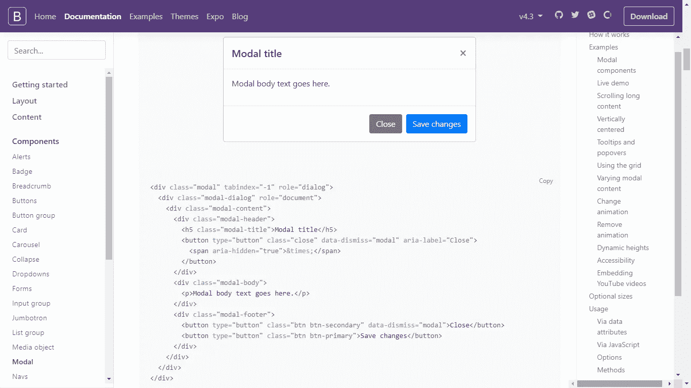
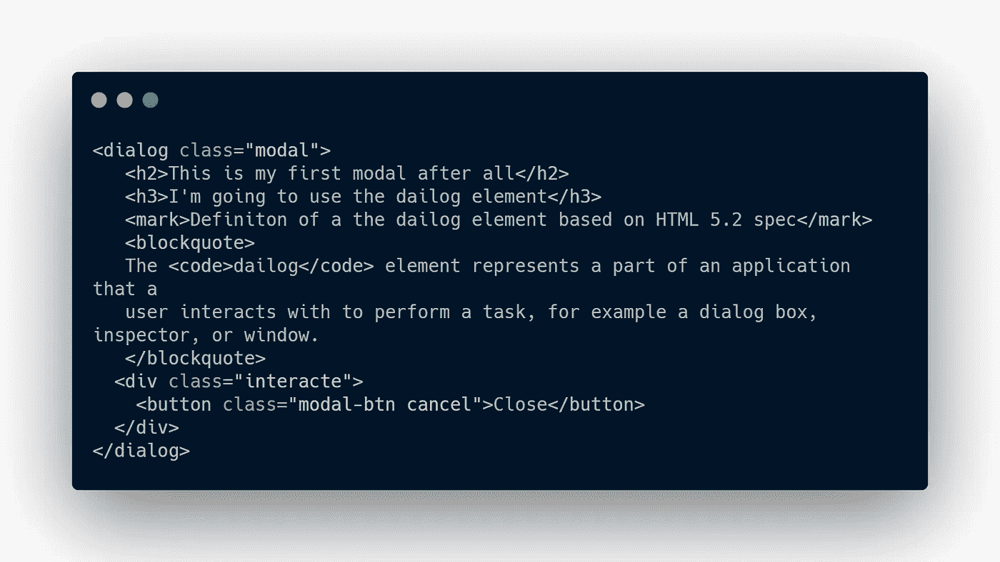
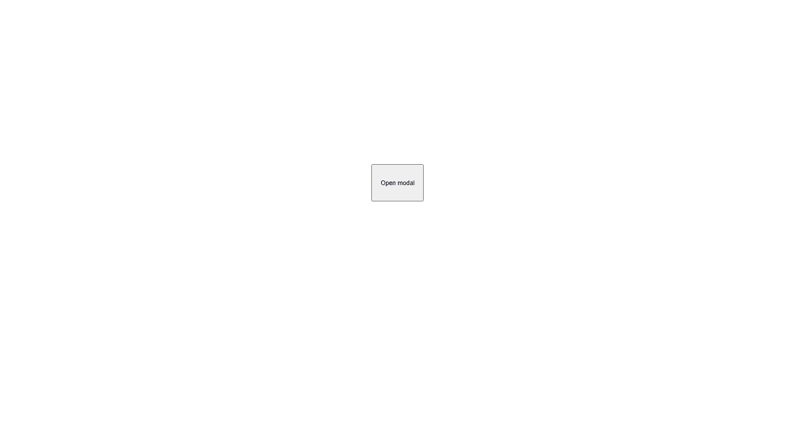
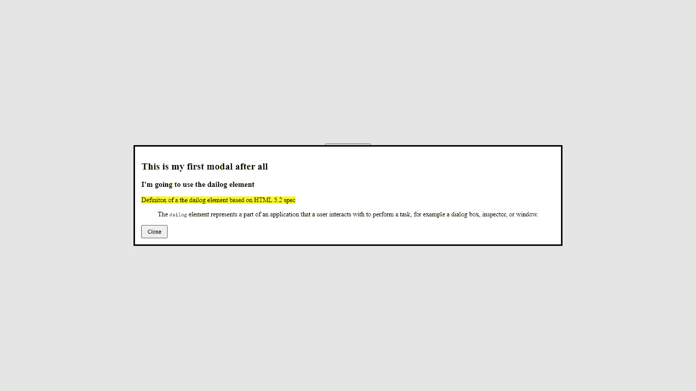

# 用例子在 HTML 中创建本地模态。

> 原文：<https://javascript.plainenglish.io/native-modals-in-html-with-example-e280a91d3d3a?source=collection_archive---------7----------------------->

## 第 1 部分:对话框元素介绍。

Photo by [Florian Olivo](https://unsplash.com/@florianolv?utm_source=medium&utm_medium=referral) on [Unsplash](https://unsplash.com?utm_source=medium&utm_medium=referral)

确认或模态是吸引用户注意力的最好方法之一。事实上，它们不仅有助于吸引他们的注意力，而且我们可以阻止他们与网站的互动，直到他们认可这个模型本身。

任何现代的 web 应用程序都应该使用模态来通知用户重要的信息。然而，很难说服 web 开发人员使用模态或通知。他们中的大多数人仍然认为他们是为移动平台服务的。

# 警报和通知

模态是警报的一部分，尽管你可能认为它们是通知的一部分。警报和通知之间有一点小小的区别。因此，您需要了解何时使用警报，何时使用通知。

当一些重要的事情发生时，你需要确保用户意识到这一点。当模式或警告弹出时，您可以通过从用户那里获得一条信息来进一步移动。

对于通知，人们可以把它看作是一件已经发生的事情，但是它还没有重要到阻止用户直到他们与它交互。

# HTML 中的本地模态

在 HTML 中使用模态不是一件容易的事情。这需要做很多工作——从用 HTML 构建结构到用 CSS 设计样式，再到用 JavaScript 控制行为。

许多库和框架介绍了一些在 web 应用程序中使用模态的简便方法，例如 Bootstrap。

Photo from the official website of bootstrap

自举模式很好。几个 div 元素，几个类，你就有了一个可以在你的网站上使用的漂亮的模型。然而，并不是每个人都想在他们的网站中使用外部库。另一方面，没有人愿意仅仅为了增加一个元素来改善 UX 而对 HTML、CSS 和 JavaScript 做一些额外的工作。

HTML 5.2 规范通过引入<dialog>元素解决了这个问题，他们将其定义为应用程序的一部分，用户可以与之交互来执行任务。例如，对话框、检查器或窗口，如下所示。</dialog>

上图的代码很清楚。除了对话框元素之外，它不包含任何新元素。在浏览器中打开这个基本标记，您会看到一个空白页。要打开对话框元素，我们需要在等式中添加 JavaScript 代码。下面你会发现对话框元素的完整用法。

别害怕。这段代码并不复杂。让我们从标记开始。首先，我们有一个包含按钮的分部，很明显，我们将使用这个按钮打开模态。其次，我们有对话框标签，里面的内容代表了模态中的信息。

Photo by the Author

点击此按钮后，会弹出模态。这就是 JavaScript 的用武之地。对话框元素有两个方法， *showModal()* 打开模态， *close()* 关闭模态。要使用它们，您需要用类、id 或任何允许您与 DOM 交互的东西来引用 modal。

Photo by the Author

我们使用了 *addEventListener()* 方法来处理模式的关闭或打开。剩下的代码是为 CSS 编写的。我们没有做任何样式，我们只是把按钮放在中间，并给它一个特定的大小。

# 最后

在本文中，我们讨论了一些关于模态的内容，以及它们是如何属于警报的。我们讨论了通知和警报之间的区别，然后我们使用对话框元素构建了一个简单的模型。

实话实说吧。上面的例子很难看，没有很好地使用模态和对话框元素。因此，在下一篇文章中，我们将学习如何设计我们的模态。简而言之，我们会给它一个漂亮的外观。

*更多内容请看*[***plain English . io***](http://plainenglish.io/)