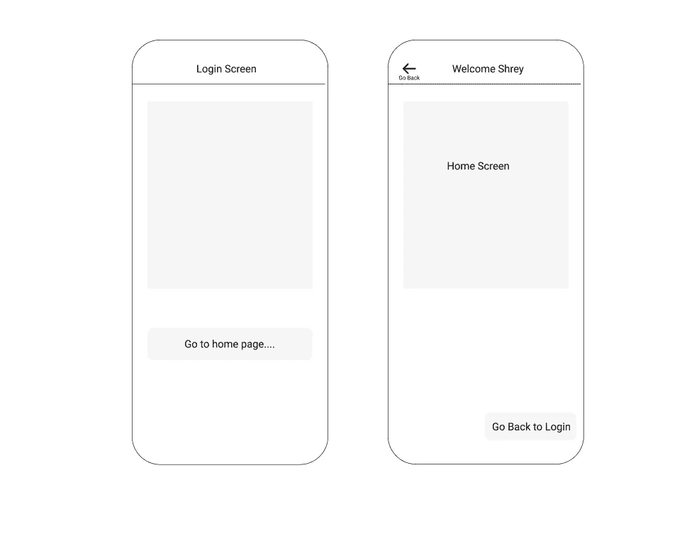
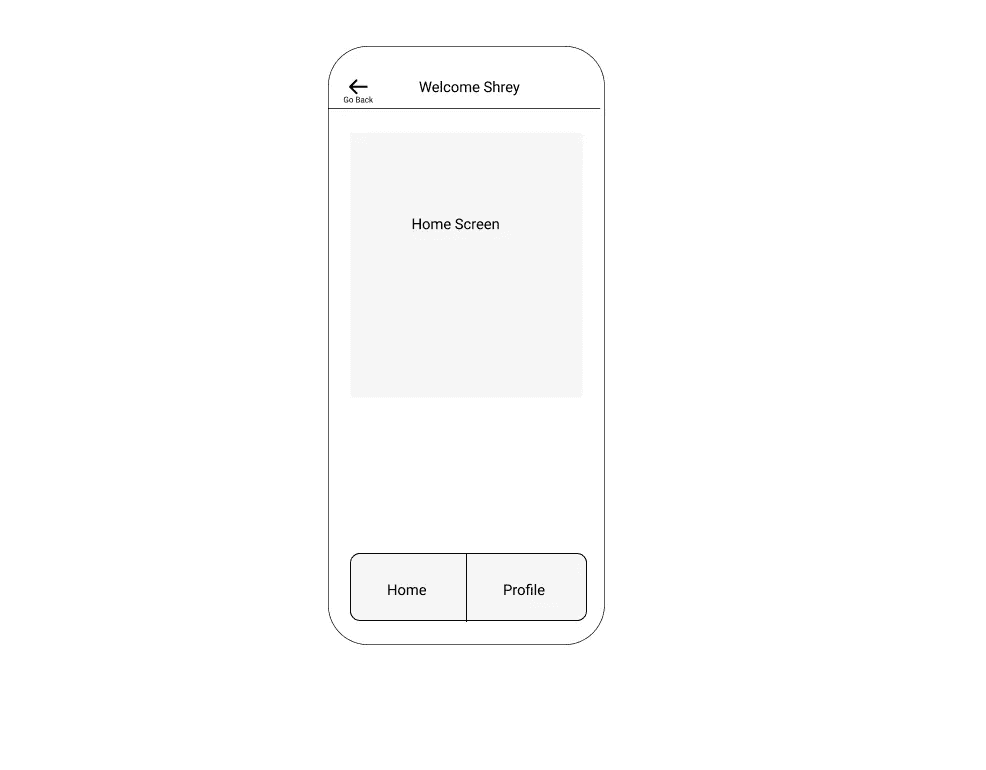

# 如何在 React Native 中实现导航

> 原文：<https://javascript.plainenglish.io/navigation-in-react-native-4dfdd2c3ff22?source=collection_archive---------18----------------------->

使用 React Navigation，React Native 中唯一完美的导航库。


Photo by [Mick Haupt](https://unsplash.com/@rocinante_11?utm_source=medium&utm_medium=referral) on [Unsplash](https://unsplash.com?utm_source=medium&utm_medium=referral)

## 在后台

故事从我们的产品需要导航一个 React 本地应用开始。对于是选择内置库还是创建自定义选项卡导航，我们感到非常困惑。如果你阅读 React 原生文档，你会发现 React 原生导航比任何其他或定制的 UI 库都更受欢迎。

## 概观

所以在今天的故事中，我们将在 react 原生项目中安装 react-navigation，并创建一个样板文件。

以下是我们为自己创建基本样板文件的步骤——

*   创建基本的 react-native 项目。
*   安装 react-native-导航库。
*   安装所有必需的 react-native-navigation 依赖项。
*   开发基本的堆栈导航页面和底部选项卡导航。

按照上面的步骤，我们的样板文件就准备好了。

## 编写代码

不浪费任何时间，让我们通过创建一个 react-native 基本项目来继续这个故事。您可以使用下面的命令创建基本的 react-native 存储库。

```
npx react-native init AwesomeProject
```

这将为您创建 react-native 样板文件，从而节省大量手动创建的时间。接下来的步骤是下载 react-native-navigation 及其对等依赖项。

```
yarn add @react-navigation/native
```

它的对等依赖项可以使用下面的命令下载。

```
yarn add react-native-gesture-handler react-native-reanimated react-native-screens react-native-safe-area-context @react-native-community/masked-view
```

我知道有很多包实际上反应了本地导航需要手势处理器，屏蔽视图和安全区域作为一个包来提供点击事件，幻灯片和屏蔽和标签事件。[点击此处](https://reactnavigation.org/docs/getting-started)可了解更多详情。

## React 本机导航的核心概念

React Native Navigation 将应用程序的每个屏幕都存储在一个堆栈数据结构中，这意味着最后出现的将首先出现。这意味着如果我们从屏幕 A 移动到屏幕 B，那么我们在导航堆栈中推动屏幕 A，然后推动屏幕 B。

在这种情况下，我们的导航堆栈将首先移除屏幕 B 以返回到屏幕 A，这发生在用户单击屏幕 B 上的后退按钮(硬件或 UI 后退)以到达屏幕 A 时。

理解这个概念有助于你编写在屏幕间导航的代码。这个概念是 react-navigation 的核心用例，[你可以从这个链接了解更多。](https://reactnavigation.org/docs/navigating)

## 创建第一个导航堆栈

因为我们知道堆栈和屏幕是如何协同工作的。我们可以通过创建两个屏幕并将其添加到导航堆栈，然后在屏幕之间导航来了解更多信息。

React Native Navigation 提供了简单的导航 HOC(高阶组件),并创建了堆栈导航器方法，分别用使用堆栈导航器方法开发的所有堆栈屏幕来包装我们的 mobile 父组件。



The Login and Home screen Flow

为了简单起见，我给你看一下代码。我们有两个屏幕，例如，登录屏幕和主屏幕，在这种情况下，当然，我们将在有效的身份验证过程后从登录屏幕导航到主屏幕。

因此，我们的双栈屏幕将是登录和主屏幕，我们需要通过 react-native 导航将它包装在导航容器和 HOC 提供程序中，因此我们的代码将如下所示

```
import { LoginScreen, HomeScreen } from './screens'; 
import { NavigationContainer,  createStackNavigator } from '@react-navitation/native';const App = () => { const Stack = createStackNavigator();
   return (
       <NavigationContainer>
         <Stack.Screen name="Login" component={LoginScreen} />   
         <Stack.Screen name="Home" component={HomeScreen}
       </NavigationContainer>
   );
};
export default App;
```

如果你仍然觉得这段代码很难，那么你应该再读一遍这个概念，所以继续读一遍如何创建堆栈和添加屏幕的概念。

## 在屏幕间导航

下一步是我们将如何在我们的登录和主屏幕之间导航。嗯，如果你看到我们为登录和主屏幕创建的堆栈，我们已经添加了一个名为 name 的属性。name prop 将定义导航到哪个屏幕，或者在我们的导航堆栈上显示或推送哪个屏幕。并且对应于名称本身的组件将被显示或呈现。

例如，如果您使用 react-native-navigation 提供的导航方法导航到登录堆栈，在这种情况下，您实际上是告诉我们的应用程序呈现 **LoginScreen** 组件，并将其显示为活动屏幕。类似地，在 Home 栈的情况下，导航到 Home 这个名称会将我们的主屏幕显示为一个活动屏幕或组件。

我们通常用来在屏幕间导航的方法被称为“**导航”。**这是 NavgiationContainer 中包装的所有堆栈屏幕的道具。这意味着我们的登录屏幕和主屏幕将会有导航作为道具**。**

导航属性有一个名为 navigate 的方法，它接受第一个参数作为要导航的屏幕的名称。在我们的例子中，由于我们最初将在登录屏幕中，所以我们希望导航到我们的主屏幕，因此我们将提供堆栈屏幕的名称作为第一个参数。

```
// When you are inside Login screen and want to navigate to Home screennavgiation.navigate("Home")// We will call this method when onPress is triggered inside our Login screen
```

同样，如果您在主屏幕上，那么我们可以使用 navigation.navigate 函数返回登录屏幕，或者我们可以简单地使用 navigation.goBack 方法返回上一个屏幕。

## 添加底部选项卡导航

添加底部标签导航可能看起来有点棘手，但实际上，它也很容易。让我解释给你听。。

将底部选项卡屏幕视为包含底部选项卡和嵌套屏幕的单个屏幕。例如，在我们的例子中，我们的主屏幕上有两个底部标签，如下所示。



Our Home screen a bottom tabs showing 2 screens

在我们的例子中，我们有两个屏幕，一个是主屏幕，另一个是下一个选项卡屏幕，称为个人资料屏幕。

React 导航提供了一种方法来声明所有屏幕将成为底部选项卡屏幕的一部分。使用 createBottomTabNavigator，我们将实际上向导航堆栈声明选项卡屏幕。

```
import { LoginScreen, HomeScreen } from './screens'; 
import { NavigationContainer,  createStackNavigator } from '@react-navitation/native';
import { createBottomTabNavigator } from '@react-navigation/bottom-tabs';const App = () => {
  const Tab = createBottomTabNavigator();
  const Stack = createStackNavigator();
   return (
       <Tab.Navigator>
        <Tab.Screen *name*="Home" *component*={HomeScreen} />
        <Tab.Screen *name*="Profile" *component*={ProfileScreen} />  </Tab.Navigator> );
};export default App;
```

在底部选项卡中，我们不需要添加任何印刷机导航步骤。React 导航将自动理解并创建一个底部标签，并添加新闻属性到我们的底部标签。

## 最终产品

无论哪个屏幕是单个屏幕，都将注册为堆栈屏幕，无论哪个屏幕是底部选项卡的一部分，都将注册为选项卡屏幕。请记住，需要将每个屏幕(tab 和 stack screen)包装在 NavigationContainer HOC 中，如下所示。

## 结论

我们已经开发了大量这种具有完美架构的样板文件，可以在下面的链接中找到。此外，如果你对我要开发的样板文件有任何个人要求，请在评论区告诉我。

```
Our complete boilerplates library - [**iHateReading Boilerplates**](www.ihatereading.in/repos)
```

## 更多阅读——

[](https://medium.com/nerd-for-tech/basic-imperative-underrated-node-js-packages-c02deb8c3ecc) [## 基本、必要和被低估的节点 JS 包。

### 在专业开发中广泛使用的 API 开发有用包。

medium.com](https://medium.com/nerd-for-tech/basic-imperative-underrated-node-js-packages-c02deb8c3ecc) [](/creating-your-own-boilerplate-f28725568018) [## 如何用一个函数创建整个前端样板文件？

### 自动化创建前端样板文件的重复过程。

javascript.plainenglish.io](/creating-your-own-boilerplate-f28725568018) [](/adding-splashscreen-to-react-native-app-f688b664e6e9) [## 如何向 React 本机应用程序添加闪屏

### 添加闪屏，显示徽标，并在后台读取必要的数据，同时显示闪屏给…

javascript.plainenglish.io](/adding-splashscreen-to-react-native-app-f688b664e6e9) 

*更多内容尽在*[*plain English . io*](http://plainenglish.io/)