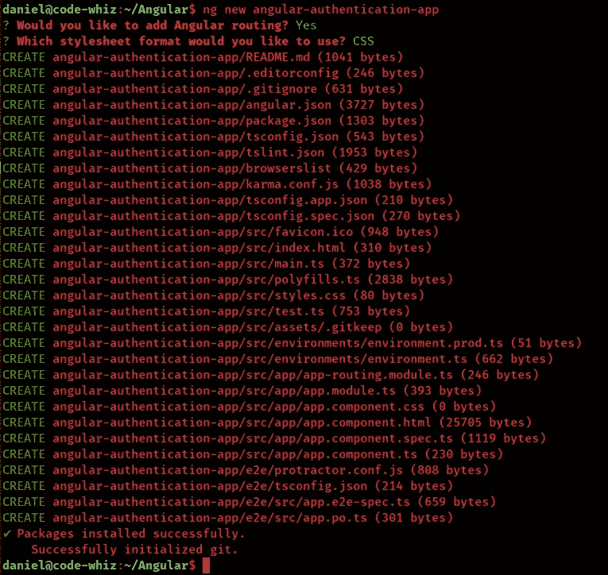
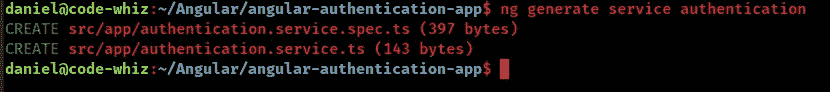
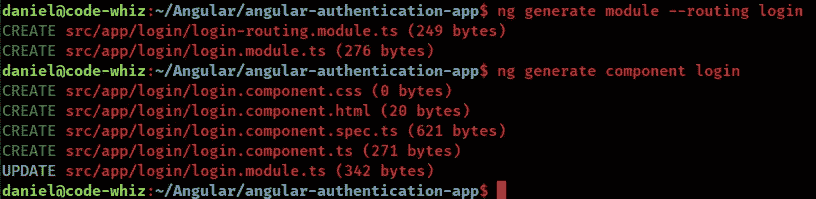
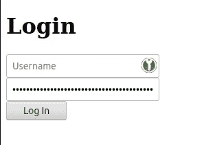
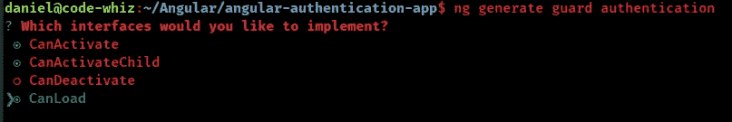

# 需要在 Angular 应用程序中添加身份验证吗？

> 原文：<https://javascript.plainenglish.io/need-to-add-authentication-to-your-angular-application-912c2397f30a?source=collection_archive---------7----------------------->

## 这是用 Angular 设置登录表单和认证的完整指南。


Photo by [Markus Spiske](https://unsplash.com/@markusspiske?utm_source=medium&utm_medium=referral) on [Unsplash](https://unsplash.com?utm_source=medium&utm_medium=referral)

棱角分明。

认证。

和授权。

你是怎么做到的？

如何将登录表单添加到 Angular 应用程序中？

您如何确保未登录的用户自动看到您的登录页面？登录(经过身份验证)的用户会看到仪表板或其他东西吗？

在本指南中，我将向您展示如何向 Angular 应用程序添加身份验证。

为什么？

因为我想让你成为一个更好的角度开发者。

如果你能在 Angular 应用程序中快速添加身份验证功能，你会有什么感觉？或者拼凑一个漂亮的登录表单？或者快速决定你的 Angular app 哪些部分需要认证，哪些部分不需要认证？

这就像我们给我们的角度应用添加了一扇门。或者一个密室。只有有钥匙的人才能进去。


那么，我们开始吧。

# 创建我们的角度应用

在这个演示中，我将创建一个新的 Angular 应用程序来演示登录和身份验证功能。

但是，如果你已经有一个角度的应用，然后跳到下一步。我将向您展示如何将登录内容添加到新的 Angular 应用程序或现有的应用程序中。没关系。

因此，为了创建演示，我们将打开一个终端并使用[Angular CLI](https://danielk.tech/home/how-to-install-and-use-the-angular-cli)开始。下面是命令。

```
ng new angular-authentication-app
```



这是我们全新的角度应用！

在我们开始之前，我们需要清理`app.component.html`文件，并删除 CLI 生成的所有模板内容。因此，从`app.component.html`文件中删除除这一行之外的所有内容。

```
<router-outlet></router-outlet>
```

仅此而已。

卷起你的袖子…拿起你的枪…让我们揉揉脑细胞，给这个棱角分明的应用程序添加登录和认证功能！

# 身份验证服务(Typescript)

那么我们从哪里开始呢？

我们将从认证服务开始。该认证服务将用于处理登录调用、认证状态以及注销功能。有些人可能会认为使用服务来处理身份验证状态是个坏主意。我们应该使用像 [NgRx](https://ngrx.io/) 这样的状态管理解决方案。

我听到了——他们确实有道理。

载物台管理为您的角度应用带来诸多好处。但是不要忘记，它会使您的生产应用程序变得更大。还增加了很多代码。

因此，为了使我们的 Angular 应用程序更小，我们将使用认证服务来处理登录功能和状态。

下面是我们将用来创建身份验证服务的命令。

```
ng generate service authentication
```



我们的认证服务需要有 3 个函数来处理 3 个基本的认证功能。

*   登录——一个处理登录信息的功能。
*   注销——一个处理注销的功能。
*   用户是否登录—检查用户是否登录的功能。

这是我们完成后的身份验证服务的外观。

如果你很聪明，我相信你是，你会注意到我们嘲笑了登录功能。这是因为…嗯…因为我很懒，不想为这个演示设置认证服务器，因为我们关注的是如何将认证添加到我们的 Angular 应用程序中。

也就是说，它仍然返回一个可观察值。因此，您需要做的就是用对服务器的 HTTP 调用来替换它。🥳 🥳 🥳

# 登录模块

身份验证服务完成并等待使用后，我们就可以开始登录模块了。

登录模块将是一个惰性加载的模块，显示我们的 Angular 应用程序的登录表单。你可以把它看作是我们角度应用的大门。


下面是您需要运行的命令。

```
ng generate module --routing login 
ng generate component login
```



现在，我们需要将路由连接到我们的登录组件，所以将路由添加到`login-routing.module.ts`文件中。

然后我们必须配置`app-routing.module.ts`来路由到我们的登录模块。。

将 [ReactiveFormsModule](https://angular.io/api/forms/ReactiveFormsModule) 导入我们的`login.module.ts`文件。

将登录表单的表单组添加到`login.component.ts`文件中。

最后，使用一些基本的 HTML 创建一个登录表单。

如果你打开 Angular 应用程序，进入[http://localhost:4200/log in](http://localhost:4200/login)，你会看到一个超级简单的登录界面。



丑？

是的，我知道…

…但是坐好伙计。这不是一篇关于 UX 或奇特设计原则的文章。

# 路线守卫

还和我在一起吗？那你很酷！😎

那么，我们如何保护应用程序的其他部分免受未经授权的访问呢？


这就是[路线守卫](https://angular.io/guide/router#preventing-unauthorized-access)的作用。

因此，再次使用 Angular CLI，为您的 Angular 应用程序创建一个路由保护。

```
ng generate guard authentication-guard
```

你会被要求实现什么接口。推荐的选择见下面的截图。



现在，登录我们的路线守卫。我们将注入我们的`AuthenticationService`以及 Angular 的[路由器](https://angular.io/guide/router)服务。并且还添加了一个私有的`authenticate()`函数，我们的接口会调用它。

这是调味汁。

说，你还和我在一起吗？迷茫？

太好了，这意味着你在学习。

我们刚才做了什么？我们创建了一个 route guard，它使用我们的身份验证服务来确保用户在浏览器中存储了令牌。如果没有，我们会将他们重定向到登录模块，并要求他们输入用户名和密码。

仅此而已。

除了…

我们还有多一行代码要处理…

并使这个有角度的应用嗡嗡作响。

打开`app-routing.module.ts`文件，添加 [canActivate](https://angular.io/api/router/CanActivate) 设置。

这就完成了设置身份验证路由保护的部分。

总而言之，我们创建了一个路由守卫，当有人试图访问一条路径时，它会被调用。当然，随着您的 Angular 应用程序的增长，您将添加更多的路径来路由到其他模块和组件。

# 最后一步，连接我们的角度应用的各个部分。

现在，让我们向我们的演示应用程序添加另一个模块，称为仪表板模块。

这纯粹是为了展示路线卫士的威力。

```
ng generate module --routing dashboard 
ng generate component dashboard
```

然后，我们将更新我们的`app-routing.module.ts`文件，并使仪表板模块成为我们的默认路由。

如果我尝试加载应用程序，我会立即被重定向到登录页面。我可以用假凭证登录，然后我会看到新的仪表板页面。

# 我们如何注销？

在我们的`dashboard.component.ts`文件中，我们将添加一个注销函数，这个函数可以被我们的注销按钮调用。

当注销函数被调用时，我们从本地存储中删除令牌并重定向到登录页面。

如果他们按下浏览器中的 back 按钮返回仪表板，route guards 将拦截该请求并重定向到登录页面。

简单认证演示？

当然啦！

为什么要复杂？

# 如何基于服务器响应重定向到登录页面？

我的朋友，这需要一个 [HTTP 拦截器](https://angular.io/guide/http#intercepting-requests-and-responses)。

我们将创建一个新的 HTTP 拦截器来拦截 HTTP 请求和响应。如果服务器返回 401 或 403，我们将重定向到登录页面。

因此，使用 Angular CLI 来生成一个空白的 HTTP 拦截器。

```
ng generate interceptor authentication
```

打开`app.module.ts`文件，添加新的 HTTP 拦截器作为提供者。

最后但同样重要的是，这是我们的`AuthenticationInterceptor`的代码。

# 结论

朋友，这就是 Angular 的完整登录演示。

我们创建了一个模块来处理登录表单。处理登录和注销功能的认证服务。以及一个路由守卫来决定用户是否可以访问我们的仪表板。

现在，在我离开之前，我必须说一句话来结束这篇关于角度认证的文章:

【Angular 应用程序中的身份验证不会取代后端的身份验证。您的 API 服务器或其他后端服务也必须实现正确的身份验证和授权，因为这是最安全的地方。

[](https://school.danielk.tech/course/unleash-your-angular-testing-skills?utm_source=medium&utm_medium=banner&utm_campaign=unleash_testing_skills)

**如果你喜欢这篇文章，并发现它有用，请点击👏按钮，关注我，获取更多类似本文的精彩文章。**

**关注我:** [GitHub](https://github.com/dkreider) ，[中型](https://dkreider.medium.com/)，[个人博客](https://danielk.tech)


*最初发布于*[*https://danielk . tech*](https://danielk.tech/home/angular-login-page-and-complete-authentication-demo)*。*

*更多内容请看*[*plain English . io*](http://plainenglish.io/)