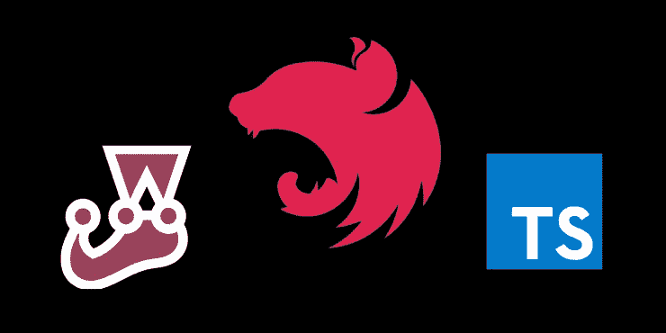
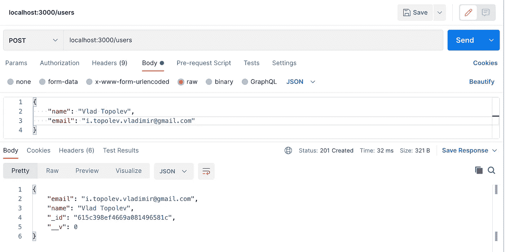
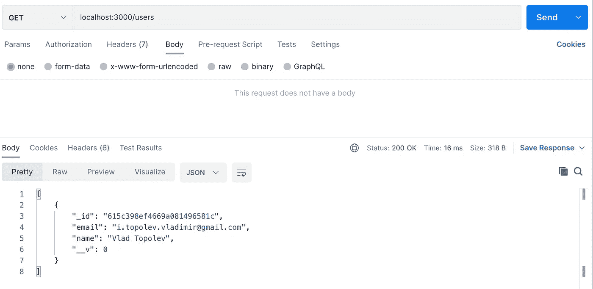

# NestJS:路由的集成测试

> 原文：<https://javascript.plainenglish.io/nestjs-integration-tests-of-routes-95986cb14e00?source=collection_archive---------2----------------------->



NestJS 是一个令人惊奇的工具，它允许构建企业级可伸缩的服务器端应用程序。这是一个灵活的框架，有许多内置特性，可以大大简化开发过程。

尽管 NestJS 有写得很好的文档，但我注意到，对于这个框架中的新手来说，将所有部分粘合起来以实现路由的集成测试并不容易。在这里，我们将把所有部分聚集在一起。

在继续之前，这里是我们将要开发的所有代码在 GitHub 中的链接: [GitHub link](https://github.com/vladimirtopolev/nestjs-user-module-with-e2e-example) 。

# 安装项目

```
npm i -g @nestjs/cli
nest new integration-test-example
```

将使用`/src`和`/test`文件夹中的样板文件创建`integration-test-example`目录。

# 为用户实体实现 RESTfull API

让我们为用户实体实现一些 CRUD 操作的路线。在这个项目中，我们将使用 MongoDB 和 Mongoose。NestJS 有专门的`@nestjs/mongoose`模块。首先安装所需的依赖项:

```
npm install --save @nestjs/mongoose mongoose
```

让我们把这个模块导入到根目录`AppModule`:

/src/app.module.ts

请注意，在生产代码中，您不应该硬编码 MongoDB URI，它应该通过配置变量进行适当设置。例如，您可以使用这个包: [config](https://www.npmjs.com/package/config) 。

首先，我们需要创建一个用户实体的模型。为了简洁起见，我们将创建一个包含几个字段的模型，这有助于将重点放在文章的主要目的上。

/src/modules/users/user.schema.ts

这里，我们为一个具有两个字段的用户实体声明模式，并添加一些验证。

接下来就是`UserService`的实施。在`UserService`中，我们要求 NestJS 通过依赖注入机制传递一个用户模型，UserService 本身应该是可注入的，因为它将在我们稍后创建的控制器中使用:

src/modules/users/user.service.ts

请注意，在这里的构造函数中，我们通过`@nestjs/mongoose`模块的特殊装饰器`@InjectModel`注入`userModel`。

下一步是 CRUD 操作的实现路线，我们需要创建`UserController`并在那里注入已经实现的`UserService`:

src/modules/users/user.controller.ts

在构造函数中，我们通过 DI 注入`UserService`并为 CRUD 操作定义一些路径。

让我们将所有实现的部分收集到一个单独的应用程序模块中，然后:

src/modules/users/user.module.ts

这里我们包括实现的`UserController`和`UserService`，这些组件将可用于注入。此外，我们声明在这个模块中应该使用哪个确切的 MongoDB 模型。

最后一步是将`UserModule`模块包含在`AppModule`中:

就是这样。我们完成了，我们可以通过 Postman 运行应用程序并测试开发的路线:

```
npm run start
```



POST /users



GET /users

# 机械综合测试

你可能已经问过他们的第一个问题是我们要用 MongoDB 做什么。有几个选项:
1 —模拟 Mongoose 库方法
2 —对本地运行的 MongoDB 进行测试

第一个选项需要大量的工作来模拟所使用的 Mongoose 库的所有方法，第二个选项依赖于强制旋转的本地 MongoDB。

我更喜欢使用轻量级 MongoDB 内存服务器模拟 MongoDB。从字面上看，这意味着我们甚至可以在不运行真正的 MongoDB 的情况下进行开发。好吧，让我们安装它:

```
npm i -D mongodb-memory-server
```

让我们在 MongooseModule 中实现一个将 MongoDB 集成到内存中的测试助手:

test/utils/mongodb-in-memory.ts

让我们开始为我们的用户路由实现测试用例，并导入测试模块 MongoDB-In-Memory 和测试用户模块:

在这里，通过 DI，我们将 MongoDB-In-Memory 和`UserModule`注入，我们也从`TestModule`获得一个引用到`UserModel`，它直接访问 DB，在任何测试之前，我们可以用我们想要的方式填充 DB。此外，我们创建了`app`，它将与`supertest`库一起用于路由测试。

好了，让我们为 *GET* 请求编写测试。为了正确地测试它，在请求路由之前，我们需要用一些用户填充用户集合:

我们在 DB 中填充了 10 个用户，因此在测试用例中，我们可以检查有多少用户获得了请求返回:

让我们也为 POST 请求实现一个测试。在这里，我们创建用户实体，检查它是否返回响应，并再次检查它是否已保存在数据库中:

就是这样。希望这对你有用。你可以在这里找到完整的代码库: [GitHub 链接](https://github.com/vladimirtopolev/nestjs-user-module-with-e2e-example)

*更多内容看* [***说白了. io***](http://plainenglish.io/)