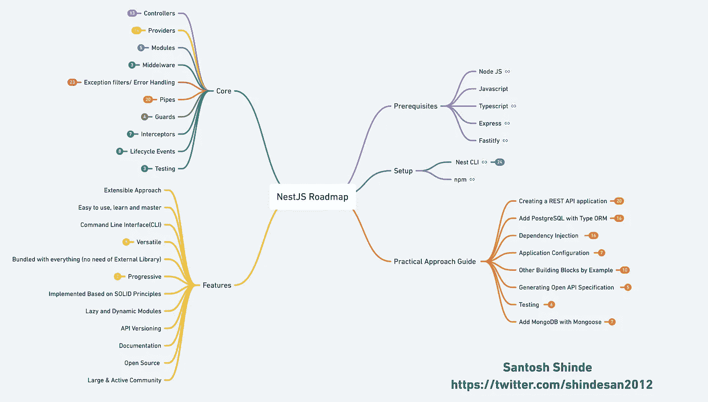
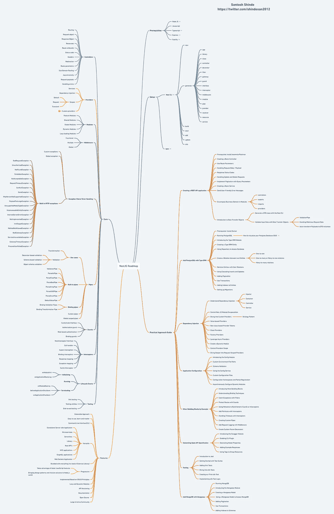
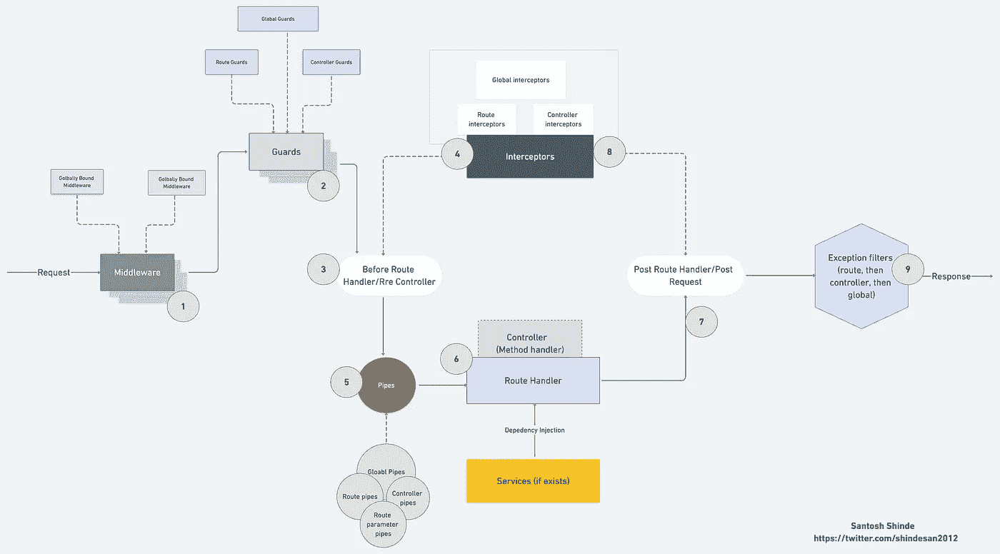

# 面向初学者的 NestJS 路线图

> 原文：<https://javascript.plainenglish.io/nestjs-roadmap-for-beginners-4fee5be251b?source=collection_archive---------0----------------------->

## NestJS 入门——初学者教程。

# 介绍

Nest (NestJS)是一个用于构建高效、可伸缩的服务器端应用程序的框架。它使用渐进式 JavaScript，由[类型脚本](http://www.typescriptlang.org/)构建并完全支持(但仍然允许开发人员用纯 JavaScript 编码)，并结合了 OOP(面向对象编程)、FP(函数式编程)和 FRP(函数式反应编程)的元素。

Building a platform: Nest from the ground up [Kamil Mysliwiec](https://twitter.com/kammysliwiec)
[JSPoland](https://js-poland.pl/) Warsaw 2018

# 为什么要用 NestJS？

Nest 在这些公共 Node.js 框架(Express/Fastify)之上提供了一个抽象层次，但也直接向开发人员公开了它们的 API。这使得开发人员可以自由地使用底层平台可用的无数第三方模块。

对于 Node(和服务器端 JavaScript)来说，有很多优秀的库、助手和工具，但没有一个能有效地解决“T4”架构的主要问题。

Nest 提供了开箱即用的应用程序架构，允许开发人员和团队创建高度可测试、可伸缩、松散耦合且易于维护的应用程序。该建筑的灵感很大程度上来自于棱角分明的。

NestJS Overview

**nestj 的特点**

*   可扩展方法
*   易于使用、学习和掌握
*   命令行界面(CLI)
*   多才多艺的
*   进步分子
*   基于坚实的原则实施
*   懒惰和动态模块
*   API 版本控制
*   证明文件
*   开放源码
*   大型且活跃的社区

# NestJS 路线图

每个 Nest 开发人员都应该知道的几个核心主题:

*   控制器
*   提供者
*   模块
*   中间件
*   异常和错误处理
*   管道
*   护卫队
*   截击机

Nest JS Roadmap (v1)

 [## GitHub-Santosh shinde 2012/nestjs-思维导图:总结 nestjs 概念的思维导图

### 总结 nestjs 概念的思维导图。通过创建一个……

github.com](https://github.com/santoshshinde2012/nestjs-mindmaps) 

NestJS 拥有一个巨大的生态系统，其中包含大量的库。了解每一个库是没有意义的，但是至少了解最常用的库会增加价值。

请查看 NestJS 的官方文档，因为他们有每个组件的详细文档。

 [## 文档| NestJS——一个渐进的 Node.js 框架

### Nest 是一个用于构建高效、可伸缩的 Node.js 服务器端应用程序的框架。它使用渐进式 JavaScript…

docs.nestjs.com](https://docs.nestjs.com/) 

# NestJS 请求和响应生命周期

嵌套应用程序按照我们称之为请求生命周期的顺序处理请求并产生响应。

随着中间件、管道、防护和拦截器的使用，在请求生命周期中跟踪特定代码段在哪里执行是一个挑战，特别是当全局、控制器级和路由级组件开始起作用时。

一般而言，请求通过中间件流向 guards，然后流向拦截器，再流向管道，最后返回到返回路径上的拦截器(在生成响应时)。

Nest JS Request & Response Lifecycle

如果这个博客给你的学习增加了价值，请分享你的评论并鼓掌。

NestJS V8

*更内容于* [***通俗地说就是***](http://plainenglish.io/)