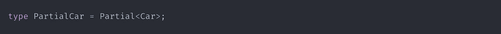

# 永远不要再被对象更新(RxJS 模式)所困扰

> 原文：<https://javascript.plainenglish.io/never-get-stuck-again-with-object-updates-rxjs-e8806b0a1a96?source=collection_archive---------1----------------------->

## 使用 RxJS 发现更好的代码模式

你好。能不能看看下面的代码，真实的回答一下？

*   下面的代码和你的相似吗？
*   你仍然以这种方式更新对象吗？
*   你有没有想过有没有更好的方法可以做到这一点？

如果你的答案是肯定的，那么你来对地方了！本文将发现一种更好的模式用于对象更新。

# 你想跟着去吗？

最终版本可以在 [GitHub](https://github.com/obaranovskyi/update-pattern-rxjs) 上找到。移除`src/index.ts`中的所有东西，你就可以开始了。

否则，您可能要从头开始建立一个新的 TypeScript 项目。

# #我们要解决什么难题？

1.  通常，我们不想同时更新所有字段。
2.  只有一些属性必须设置为默认值。
3.  每当我们想要修改一个特定的部分时，传递整个对象是没有必要的。
4.  我们想去掉一个额外的对象引用，它的任务是从表单中收集数据。最好一劳永逸。我们的使命是 SRP(单一责任原则)。

# #那么解决方案是什么？

解决方案是结合使用`scan`操作符和`Partial`实用程序类型。请看看下面的代码。它解决了什么是需要的。此外，没有任何复杂性就没有什么非凡之处。

基本上，`scan`操作符可以用来管理状态。在建立初始值之后，它将累加器应用于来自源的每个值。您可以在[文档](https://rxjs.dev/api/operators/scan)中找到更多信息。

当我们有一个带有必填字段的接口或类型时，一个`Partial`内置类型可以帮助我们从已经存在的部分实现中创建一个新的类型。

如果您想进一步熟悉实用程序类型，请访问下面的这篇文章。

 [## TypeScript:了解内置/实用程序类型

### 如今打字稿变得越来越受欢迎。许多人出于不同的目的使用它，而不仅仅是为了…

obaranovskyi.medium.com](https://obaranovskyi.medium.com/typescript-understand-built-in-utility-types-5aa9ea44fe45) 

现在让我们将我们的解决方案应用到现有的代码中。

好吧，看来我们成功了。到目前为止，我们可以将部分对象传递到`BehaviorSubject`，因此只有必要的属性才会有预定义的值。因为我们不需要传递整个对象来只更新修改过的属性，所以不需要额外的对象引用。

# #让它变得可重复使用

为了使它可重用，我们需要提取我们的`scan`操作符，以便我们能够在其他地方使用它。

这里有一个关于这种策略的小案例:

# #让我们添加验证

最有可能的是，您会将这种策略与表单一起使用。这意味着您将有一个提交按钮。因此，这自然会引导我们进行表单验证。让我们添加一个，看看它是如何工作的:

现在，我们一切就绪。您可能做的唯一更新是将`Partial<Car>`提取到一个新的类型中，如下所示:

差不多就是这样。

# #进一步阅读

如果你对 RxJS 感兴趣，这里有更多可能让你着迷的文章:

 [## 这是使用 RxJS 重新加载数据的最简单的方法

### 大多数时候，我们必须从服务器加载数据。为了执行操作，客户端通常会发送请求以及…

obaranovskyi.medium.com](https://obaranovskyi.medium.com/rxjs-data-reload-pattern-with-custom-operators-factory-functions-b929a2103dd8)  [## 微前端:与单 Spa 和 RxJS 的跨应用程序通信

### 在上一篇文章“用单 Spa 框架连接微前端”中。一步一步引导。”，我们是…

obaranovskyi.medium.com](https://obaranovskyi.medium.com/micro-frontends-cross-application-communication-with-single-spa-and-rxjs-aa55084bf344) 

# #结论

有趣的事实是——你知道吗，你可以按下“拍手”按钮，而不是多次点击。我相信你知道👻👻👻

我希望你和我一样喜欢它。如果你喜欢这篇文章，或者你学到了新的东西，请点赞并订阅。

*更多内容看* [***说白了. io***](http://plainenglish.io/) ***。*** *报名参加我们的**[***免费每周简讯点击这里***](http://newsletter.plainenglish.io/) ***。****