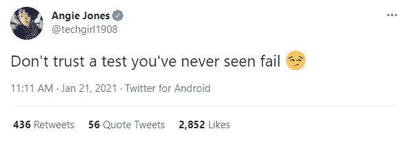

# 为什么你不应该相信一个永远不会失败的测试

> 原文：<https://javascript.plainenglish.io/never-trust-a-test-that-doesnt-fail-32e7e711680d?source=collection_archive---------8----------------------->

## 通过考试并不总是一件好事。

Photo by [the blowup](https://unsplash.com/@theblowup?utm_source=medium&utm_medium=referral) on [Unsplash](https://unsplash.com?utm_source=medium&utm_medium=referral)

在测试片中寻找根源可能是一个艰难和令人沮丧的经历。盯着代码行试图确定失败发生在哪里或为什么会发生，这是一种精神负担。我个人已经成为为了修复一组古怪的测试而进行的长达数小时的调试会议的受害者。

但是，一个**永远不会**失败的测试呢？

比它古怪的表亲更阴险的是，永远不会失败的测试总是那美丽的绿色阴影，它告诉你一切都很好。事实上，从一次从未失败的测试中散发出一种平静的信心。几乎好像它写得太好了，只有大规模的应用程序剧变才会导致失败。无需进一步检查，您的代码的这个特定部分运行得非常好，因为这个测试写得非常好。

如果这个假设是错误的呢？

来自 [Applitools](https://applitools.com/) 和[测试自动化大学](https://testautomationu.applitools.com/)的 Angie Jones 最近写了一条推特，引起了我的共鸣:

Have you seen your tests fail? (Source: Twitter)

安吉·琼斯对从不失败的测试的有效性提出质疑是正确的。最明显的原因是测试可能会提供假阴性。这篇文章试图回答为什么一个从不失败的测试是危险的，如何用“失败第一”的心态编写测试，以及当你怀疑你的回归套件中有假阴性时应该做什么。

# 100%通过的神话

在测试社区中有一种信念(特别是关于自动化),一致的 100%通过率不仅是可以获得的，也是工程师应该努力争取的。我想告诉你那是**不是真的**。

持续的 100%通过率告诉我两件事:

1.  您的应用程序处于维护模式，不再接收持续更新。
2.  你很可能有假阴性。

由于 bug 和应用程序缺陷的性质，正在接收更新的应用程序**不会**始终通过回归测试。澄清一下:手工和本地化的自动化测试只能做这么多。一个缺陷一定会找到它进入你的 CI 管道的途径，并使你的回归套件变红。

这是**不是**坏事。事实上，这表明您的 CI 管道和回归套件正在完成它们的工作。我个人会担心 CI 渠道连续几周显示全绿，尽管有定期更新周期。这告诉我，回归套件可能有假阴性。

# 假阴性

假阴性是指无论应用程序状态如何，总是返回通过的测试。我在为 TransLoc 的表单提交设计测试时亲身经历了这一点。从前端的角度来看，只要提供了有效的输入，表单就会一直提交。如果提交没有通过后端验证，控制台中将会出现一个错误。

我的印象是后端故障会被提交到表单中，从而向用户显示一条错误消息。我假设所有其他表单错误都是这样处理的(验证、空输入等)。).

我编写了一个使用有效输入的测试，并使用前端提交了表单。然而，我明显忽略了实际提交表单数据的 API 调用。我心不在焉地创建了一个假阴性:一个不会**失败的测试，因为表单总是能够在前端提交。**

为什么这如此危险？

假设表单提交了，但是由于应用程序逻辑的问题，后端返回了一个`400 Bad Request` 。您的回归测试总是会通过的，因为您只是测试前端提交，而不是后端响应。

这就是像 Cypress 这样的框架派上用场的地方。Cypress 允许拦截 API 调用，然后可以断言这些调用。为了强化这个测试，您可以截取后端调用，并期望它等于`200 OK`作为您的测试断言的一部分。

我们可以更进一步，设计一个考虑到失败的测试。

# 一点点失败是件好事

是的，测试失败绝对是一件好事。事实上，它是测试驱动开发的基石之一；随着开发时间的推移，测试从红色慢慢变成绿色的概念。在编写新的自动化时，您应该遵循相同的概念:接受失败的测试并使其通过。

考虑上面的测试。我们有一个表单提交与后端响应应该是`200 OK`应该一切顺利。我们精心设计了测试，不仅检查提交是否成功，还拦截后端调用并检查成功的响应。

我们如何编写一个失败的测试呢？

使用 Cypress，我将为后端调用构建一个拦截，并用一个错误的请求模拟它。这样，对端点的每个调用将返回一个`400 Bad Request`，而不是一个`200 OK`。然后，我们可以像往常一样写出测试，并预期它会失败。一旦我们看到测试失败，我们可以移除模拟，并期待通过。如果测试继续失败，我们将进一步排除故障，以使测试通过。

这可能看起来很初级，有点适得其反，但是这是确保你不会在测试中写下假阴性的最好方法之一。不要犯和我一样的错误。

# 根除假阴性

我们知道如何用“失败优先”的方法编写测试。我们用一套预先存在的回归测试做什么？

您应该做的第一件事是审核您的回归套件中属于您团队职责范围的测试模块。在 Pendo，我们有 2000 多项自动化测试。每个工程团队负责这些测试的一个子集。了解哪些测试属于您的团队非常重要，这样您就可以对它们采取行动。

一旦你有了你的测试模块子集，你应该和你的团队一起决定哪些模块比其他模块更优先。创建优先级列表后，您可以开始审核流程。

当使用像 Cypress Dashboard 这样的工具时，审计变得更加容易，因为它提供了给定模块中每个测试的通过/失败历史。⁴:你应该优先考虑在最后 x 次运行中没有失败的测试。我个人选择审核那些通过了最后 10-15 次运行的，尽管 Cypress 将显示最后 20 次运行。

打开您的测试模块，在 headful 模式下运行测试。观察测试中的错误。如果有任何异常，请使用以下方法之一隔离测试，以供以后审查:

1.  读取-评估-打印循环。
2.  像`cy.pause()`这样的方法。

以上两种方法都允许您在代码运行时逐句通过代码，从而保证对测试进行缓慢而有条理的审计。一旦你完成了给定模块中的所有测试，你就可以把它从你的列表中划掉，继续下一个模块。

# 摘要

接受定期更新的应用程序并不总是 100%通过自动化测试。如果应用程序一直通过，检查你的测试是否有假阴性。为了从一开始就根除假阴性，用“失败第一”的心态编写测试。

# 资源

1.  琼斯安吉。"不要相信你从未见过失败的测试。"*推特*，推特，2021 年 1 月 21 日，[twitter.com/techgirl1908/status/1352287793272270851](http://twitter.com/techgirl1908/status/1352287793272270851)。
2.  索非亚帕拉马丘克。"如何在测试自动化中避免假阳性和假阴性:Abstracta . " *Abstracta 软件测试服务*，2020 年 2 月 25 日[abstract a . us/blog/test-automation/avoid-false-positives-false-negative-test-automation/](http://abstracta.us/blog/test-automation/avoid-false-positives-false-negatives-test-automation/)。
3.  “拦截。” *Cypress 文档*，2021 年 3 月 5 日[docs . Cypress . io/API/commands/intercept . html # Comparison-to-cy-route](http://docs.cypress.io/api/commands/intercept.html#Comparison-to-cy-route)。
4.  "使用 Cypress 仪表板测试和调试速度更快." *JavaScript 端到端测试框架| Cypress.io* ，【www.cypress.io/dashboard/.】T2

**Jonathan Thompson** 是 Pendo.io 的高级质量工程师，专攻测试自动化。他目前和妻子以及一只名叫温斯顿的金毛猩猩住在北卡罗来纳州的罗利。你可以在 [LinkedIn](https://www.linkedin.com/in/jonathanmnthompson/) 上与他联系，或者在 [Twitter](https://twitter.com/jacks_elsewhere) 或 [Github](http://github.com/ThompsonJonM) 上关注他。

*更多内容请看*[*plain English . io*](http://plainenglish.io/)