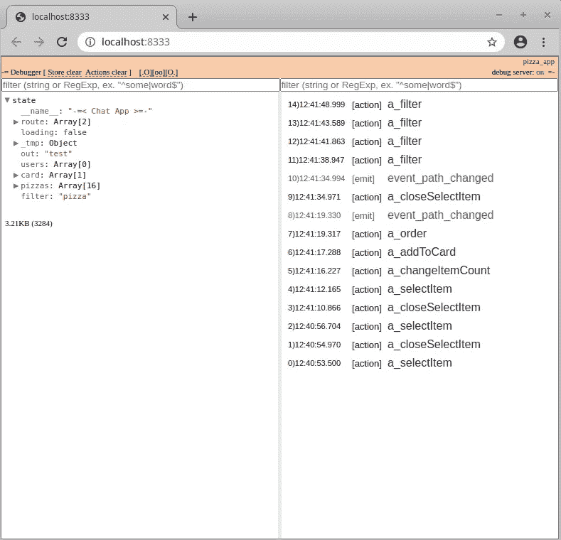

# React 的 Redux 的新替代方案——用于更快、更轻的 Web 开发

> 原文：<https://javascript.plainenglish.io/new-alternative-of-redux-for-react-de0b420c0c60?source=collection_archive---------3----------------------->

我提醒您注意 React，Preact 的状态管理[库](https://github.com/rubender/redoor)(仅重 4.8 Kb)。该库仍在开发中，但您已经可以尝试一下了。

先说一个大家最喜欢的 TODO 组织者的例子。 [Github](https://github.com/rubender/redoor_todo_example) 上的源代码。首先，让我们创建主要组件 main.js。


```
// main.js
import React, { createElement, Component, createContext } from 'react';
import ReactDOM from 'react-dom';
import {Connect, Provider} from './store'
import Input from './InputComp'
import TodoList from './TodoList'
import LoadingComp from './LoadingComp'

const Main = () => (
  <Provider>
    <h1>Todo:</h1>
    <LoadingComp>
      <TodoList/>
    </LoadingComp>
    <hr/>
    <Input/>
  </Provider>
)

ReactDOM.render(<Main />, document.getElementById("app"));
```

接下来，存储。我们需要存储来初始化库，并且在这里我们指定了所有必需的文件和动作。在我们的示例中，这是 actions.js 和 actionsSetup。

```
// store.js

import React, { createElement, Component, createContext } from 'react';
import createStoreFactory from 'redoor';

// Exporting all functions from actions.js и actionsSetup.js
import * as actions from './actions'
import * as actionsSetup from './actionsSetup'

// here we specify the necessary functions of the React library
const createStore = createStoreFactory({
  Component, 
  createContext, 
  createElement
});

// creating a store as a parameter, you must specify an array of objects
// of all used action functions
const { Provider, Connect } = createStore([
  actions,
  actionsSetup
]);

export { Provider, Connect };
```

提交我们的行动和项目状态

```
// actions.js

// each local state can contain its own set of variables
// redoor will automatically add them to the global store
// initState is a reserved variable it can be either an object,
// or a function that returns an object with a state
export const initState = {
    todos:[],
    value:'',
} // adding a new task to the array
// the state variable contains the global state
// the args variable depends on the values passed from the component
// the function returns new state variables
export const a_enter = ({state,args}) => {
  let {value,todos} = state;
  todos.push({
    id:(Math.random()+"").substr(2),
    value:value,
    done:false
  });
  return {
    value:'',
    todos
  }
}

export const a_done = ({state,args}) => {
  let {todos} = state;
  let id = args.id;
  todos = todos.map(it=>(it.id === id ? (it.done = !it.done, it) : it))
  return {
    todos
  }
}

export const a_delete = ({state,args}) => {
  let {todos} = state;
  let id = args.id;
  todos = todos.filter(it=>it.id !== id)
  return {
    todos
  }
}
```

视图的组件

```
// InputComp.js
import React from 'react';
import {Connect} from './store'

// redoor adds the cxRun function and all variables to the props
// globally store
const Input = ({cxRun, value})=><label className="input">
  Todo:

// here we can change the store directly from the component
  <input onChange={e=>cxRun({value:e.target.value})} 
					value={value} 
					type="text" 
  />

// by clicking, we call the action a_enter from actions.js
  <button onClick={e=>cxRun('a_enter')} disabled={!value.length}>
		ok
	</button>
</label>

// соеденяем с redoor наш компонент и экспортируем 
export default Connect(Input);
```

cxRun 可以在两种模式下运行。第一种方法是直接更改存储的内容，例如使用字符串参数或从 actions.js 文件中调用操作。

以及输出待办事项列表本身的最后一个组件。

```
// TodoList.js
import React from 'react';
import {Connect} from './store'

const Item = ({cxRun, it, v})=><div className="item">
  // we call the a_done action, where we specify as a parameter
  // array element in the asense this variable will be called args
  <div className="item_txt" onClick={e=>cxRun('a_done',it)}>
    {v+1}) {it.done ? <s>{it.value}</s> : <b>{it.value}</b>}
  </div>
  <div className="item_del" onClick={e=>cxRun('a_delete',it)}>
    &times;
  </div>
</div>

const TodoList = ({cxRun, todos})=><div className="todos">
  {
    todos.map((it,v)=><Item key={v} cxRun={cxRun} it={it} v={v}/>)
  }
</div>

export default Connect(TodoList);
```

在我们的项目中，全局存储中只有两个变量，value 和 todos。它们由 actions.js 文件中的 initState 初始化。initState 可以是一个对象，也可以是一个函数，它应该返回一个带有状态的对象。这里，理解动作文件中的所有状态都放在一个对象中是很重要的，每个动作都可以访问任何状态变量。

动作是必须以前缀“a_”或“action”开头的函数。调用 cxRun 时，操作函数的名称将被指定为第一个参数。输入参数将是一个带有 state 和 args 变量的对象。

状态——这是项目的整体状态

args 是 cxRun 函数调用的第二个参数。在我们的项目中，当你点击 delete 时，我们调用 cxRun('a_delete '，it)，其中第一个参数是动作函数的名称，第二个是元素本身，这是我们在 args 中得到的。

该操作应该返回状态的新状态，这将自动重新绘制连接到存储的组件。

动作异步工作怎么办？为此，我们需要使用 bindStateMethods 函数将 setState 方法连接到 actions file.js 的局部变量。

```
//actions.js
let __setState;
let __getState;

// connecting the methods of working with the state
export const bindStateMethods = (getState, setState) => {
  __getState = getState;
  __setState = setState;
};

export const a_setup = async ({state,args}) => {
  __setState({loading:true});
  let data = await loading();
  __setState({
    loading:false,
    todos:data
  })
}
```

现在调用“a_load”动作时，下载开始前会出现下载图标，数据加载后，数据数组会更新，下载图标会被禁用。如果需要获取异步函数内部的全局状态，可以调用 __getState，它返回该状态的当前状态。

# 调试器

对于调试，有一个 redoor-devtool 工具。调试器是一种服务器，它侦听来自 redoor 库的数据，并将其传递给 localhost:8333 中的单个页面。

因此，调试器不仅可以位于另一个浏览器中，也可以位于另一台机器上。这在为移动设备开发时尤其有用。



安装重做程序-devtool:

```
yarn add redoor-devtool
```

在单独的控制台中，运行控制台调试服务器

```
npx redoor-devtool -o
```

“-o”键将在调试器所在的 [http://localhost:8333](http://localhost:8333) 处打开 chrome。

## 结论

就我自己而言，我可以分享我已经使用这个库完成了几个项目。使用套接字处理项目非常方便。

当然有使用功能。例如，您需要记住，所有动作在所有模块中都是“可见的”。如果您有一个清晰的命名动作结构，这就不会成为问题。在我的项目中，我使用这个命名“a_moduleName_actionName”。

现在就这些了。如果你感兴趣，我会试着写一篇更详细的评论。

*更内容于* [***通俗地说就是***](http://plainenglish.io/)