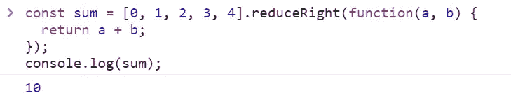

# 10 个新的 JavaScript 原生数组方法

> 原文：<https://javascript.plainenglish.io/new-javascript-native-array-methods-aae9a2648c3a?source=collection_archive---------9----------------------->

## 2021 年你可以使用的十种有用的方法


您可能已经知道，JavaScript 数组是一个表示元素集合的对象。本文解释了如何使用 JavaScript 中包含的新方法来处理数组。

希望你觉得有用。

开始吧！

# 1.Array.prototype.reduceRight()

reduceRight()方法对数组中的每个元素执行一次回调函数，接收四个参数:初始值(或来自上一次回调调用的值)、当前元素的值、当前索引和正在进行迭代的数组。

## 句法

```
arr.reduceRight(callback(accumulator, currentValue[, index[, array]])[, initialValue])
```

## 例子

求和数组值:

```
const sum = [0, 1, 2, 3, 4].reduceRight(function(a, b) {
  return a + b;
});console.log(sum);
```



Result of executes the code in Google Chrome console.

展平数组的数组:

```
const newArray = [[2, 3], [4, 5]].reduceRight(function(a, b) {
    return a.concat(b);
}, []);console.log(newArray);
```


Result of executes the code in Google Chrome console.

# 2.Array.prototype.copyWithin()

copyWithin()方法将数组的一部分复制到同一个数组中，并在不修改其长度的情况下返回该数组。

## 句法

```
arr.copyWithin(target[, start[, end]])
```

## 例子

```
const array = ['a', 'b', 'c', 'd', 'e', 'f'];//1.
console.log(array.copyWithin(0, 3, 5));
```

1.  我们将索引 3 和 5 之间的元素放在索引位置 0。


Result of executes the code in Google Chrome console.

```
const array = ['a', 'b', 'c', 'd', 'e', 'f'];//1.
console.log(array.copyWithin(3));
```

1.  我们将在索引位置 3 放置索引 0 和 2 之间的元素。


Result of executes the code in Google Chrome console.

# 3.Array.prototype.unshift()

unshift()方法将一个或多个元素添加到数组的开头，并返回它的新长度。

## 句法

```
arr.unshift(element1[, ...[, elementN]])
```

## 例子

```
const array = [1, 2, 3, 4];console.log(array.unshift(5, 6, 7));
console.log(array);
```


Result of executes the code in Google Chrome console.

# 4.Array.prototype.shift()

shift()方法从数组中移除第一个元素，并返回被移除的元素，改变数组的长度。

## 句法

```
arr.shift()
```

## 例子

```
const array = [1, 2, 3];const firstElement = array.shift();console.log(array);
```


Result of executes the code in Google Chrome console.

# 5.Array.prototype.every()

every()方法测试数组中的所有元素是否都通过了由提供的函数实现的测试。

## 句法

```
arr.every(callback(element[, index[, array]])[, thisArg])
```

## 例子

```
const isExpensive= (value) => value>  500 ;const phonePrices= [150, 100, 450, 1200, 700];console.log(phonePrices.every(isExpensive));
```


Result of executes the code in Google Chrome console.

# 6.Array.prototype .反转()

reverse()方法(和类型化数组的 TypedArray.reverse()方法)就地反转数组。第一个数组元素成为最后一个，最后一个数组元素成为第一个。

此方法对数组进行变异，并返回对数组的引用。

## 句法

```
arr.reverse()
```

## 例子

```
const array = [1, 2, 3, 4, 5, 6, 7];array.reverse();array;
```


Result of executes the code in Google Chrome console.

# 7.Array.prototype.sort()

sort()方法对数组中的元素进行排序，并返回排序后的数组(相同的数组，但排序后)。

## 句法

```
arr.sort([compareFunction])
```

## 例子

```
const alphabet = ['a', 'z', 'b', 'd', 'g', 't'];
alphabet.sort();console.log(alphabet);
```


Result of executes the code in Google Chrome console.

**默认的**顺序是升序，建立在将元素**转换成字符串**的基础上，然后比较它们的 UTF-16 代码单元值序列。

这里，当我们用默认排序对 array1 进行排序时，所有的值都被转换成字符串，然后按升序排序。所以如果我们想对一组数字进行排序，方法是创建我们的比较函数。sort()方法也可以接受一个参数:

```
function compareFunction(a, b){
  if (a < b){return -1;}
  if (a > b){return 1;}
  if (a === b){return 0;}
}const array1 = [1, 2, 25, 16];
console.log(array1.sort());const array2 = [1, 2, 25, 16];
console.log(array1.sort(compareFunction));
```


Result of executes the code in Google Chrome console.

# 8.Array.prototype.toLocaleString()

toLocaleString()方法返回一个表示数组元素的字符串。使用它们的 toLocaleString 方法将元素转换为字符串，这些字符串由特定于区域设置的字符串(如逗号“，”)分隔。

## 句法

```
arr.toLocaleString([locales[, options]]);
```

## 例子

```
const array1 = ['The date is:',' (En locale) ', new Date('21 Dec 1997 14:12:00 UTC')];
const localeStringEn = array1.toLocaleString('en', { timeZone: 'UTC' });console.log(localeStringEn);
```


Result of executes the code in Google Chrome console.

# 9.Array.prototype.findIndex()

findIndex()方法返回满足所提供的测试函数的数组中第一项的索引；否则，它返回-1，表示没有元素通过测试。findIndex()方法对数组中的每一项执行一次函数。

## 句法

```
arr.findIndex(callback( element[, index[, array]] )[, thisArg])
```

## 例子

```
const array = [5, 12, 8, 130, 200];const condition = (element) => element > 100;console.log(array.findIndex(condition));
```


Result of executes the code in Google Chrome console.

# 10.Array.prototype.concat()

concat()方法用于合并两个或多个数组，并返回该数组与其他数组合并后的新数组。这个方法不改变现有的数组，而是返回一个新的数组。

## 句法

```
const new_array = old_array.concat([value1[, value2[, …[, valueN]]]])
```

## 例子

```
const array1 = [1, 2];const array2 = ['a', 'b', 'c'];const array = array1.concat(array2);console.log(array);
```


Result of executes the code in Google Chrome console.

希望你觉得这些方法有用！

保重。