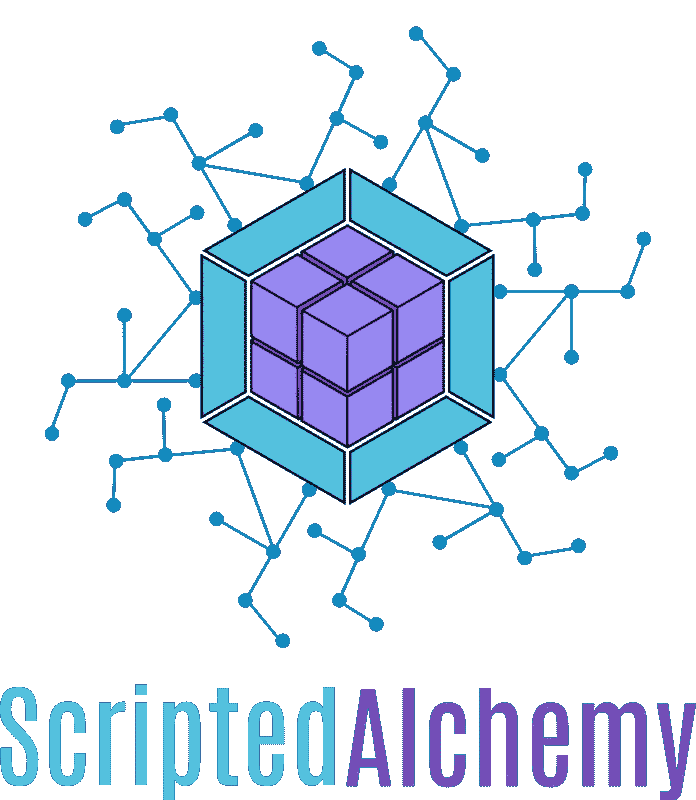
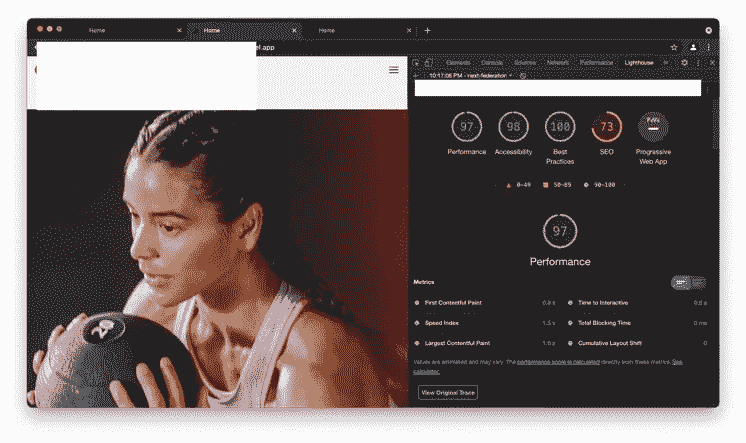

# Next.js 11、模块联盟和 SSR——一个勇敢的新世界

> 原文：<https://javascript.plainenglish.io/next-js-11-module-federation-and-ssr-a-whole-new-world-6da7641a25b4?source=collection_archive---------0----------------------->

下一个 11 和模块联盟的服务器端渲染已经准备好了！额外收获:我们在联邦应用程序上实现了“热”(实时)重载！

在 next.js 应用程序中实现模块联合是一条漫长而痛苦的道路——但我们最终能够消除大部分痛苦。

这是我第一次可以自信地说，我们已经能够在 Next.js 中实现全面的模块联合——不仅是客户端，还有服务器端！

几个月前，我们演示了代码流的概念，想法是让 Node 像浏览器一样工作，下载远程块，并在其进程下执行它们。这是无缝和简单的，但带来了一些安全问题，在 next.js 的情况下，我们无法“热重新加载”生产，这些所需的块会被“卡住”,您的主机应用程序需要重新启动，以便重新获取更新的新远程块。


# 向多服务器渲染问好！

模块联盟小组想出了一个更容易接受的解决方案来解决联盟 SSR 问题。我们的解决方案不仅仅适用于 Next.js 应用程序——但本文将重点关注在 one Next.js 上下文中利用我们的新系统

Jacob 概述了底层架构的更多细节

[](https://www.ebey.me/blog/webpack-federation-ssr) [## Webpack 联盟 SSR | ebey.me

### Webpack 模块联盟已经成为微前端领域的游戏规则改变者，允许多个 SPA 作为一个整体运行…

www.ebey.me](https://www.ebey.me/blog/webpack-federation-ssr) 

> 巨大的功劳，大声喊出来[雅各布·伊比。](https://medium.com/u/bada389d427c?source=post_page-----6da7641a25b4--------------------------------)这一架构背后的关键部分和策划者

多服务器渲染就像它听起来的那样，远程接受来自主机应用程序的道具，并在它们的原点执行渲染，发送回预渲染的 HTML。整个过程非常快，如果你把它放在 CDN 后面，速度会更快。因为渲染一个组件只需要大约 10 毫秒到 20 毫秒，我们的解析器在更大的有效负载上只增加了 5 到 7 毫秒的开销。

一旦我们从远程源获得标记，我们的解析器将 HTML 转换回 React，如果您在远程组件中传递主机源的子组件，这些子组件将重新连接到主机渲染树和渲染上下文。因此，他们仍然能够参与渲染周期中发生的任何特定于应用程序的上下文。

需要注意的重要一点是，我们能够在任何远程组件的起点同时异步呈现这些组件，因此 RTT 瀑布不会开始形成，响应时间与最慢的响应一样快——就像`Promise.all`

```
import {
  getOrCreateFederatedComponentCtx,
  federatedComponentsContext,
  federatedComponent,
} from "nextjs-shared";

import remotes from "../remotes";

const Header = federatedComponent("home", "./header");

function MyApp({ Component, pageProps, federatedComponentsCtx, shellData }) {
  return (
    <federatedComponentsContext.Provider
      value={getOrCreateFederatedComponentCtx(
        { remotes },
        federatedComponentsCtx
      )}
    >
      <Header items={shellData.header.menu} />
      <Component {...pageProps} />
    </federatedComponentsContext.Provider>
  );
}
```

## 水合作用和避免闪烁

用户体验需要无缝，所以我们不能在水合过程中发生任何闪烁。为了实现这一点，我们利用了一种类似于 react-lazy-hydration 的机制，其中我们只在启动时将部分来自 HTML 的 react 树合并到交互式 react 中。这保留了现有的标记，并抑制了任何可能发生的水合作用问题。一旦 Webpack 启动并且联邦代码被执行，SSR 的远程模块就被合并成一个联邦 react 组件。

我广泛使用反应-惰性-水合来提高性能，卸载昂贵的组件，这样它们只在达到 TTI 或即将滚动到交叉点观察器的视图中时才被水合。所以对联邦 SSR 应用类似的策略对我来说是完全可以接受的，而且非常有效。

## 模块联合和区块刷新又回来了！

来自社区的一个很大的要求是，像 react-loadable 或 loadable-components 这样的包不能“清洗”和呈现所使用的联合 Javascript 标签和样式表。当远程容器启动时，会导致额外的 RTT，并且必须立即下载这些额外的 JS 块。

我们的新解决方案解决了这个问题，在我们最新的架构设计下，服务器端呈现的联邦模块也清除了它们的 JS 和 CSS 块。世界秩序已经恢复了！



虽然其他第三方不支持联合块刷新，但当使用我们的“fetchFederatedComponent”函数时，刷新将按预期发生，并且我们独立处理联合块的刷新。如果您使用代码分割，请继续为您的内部块使用可加载组件，但是您将能够使用我们的联邦函数在 SSR 期间将那些关键资产呈现给 DOM。

我们将 CSS 和 js 块放入 next.js 上下文中，这样 next 就一直知道这些额外的脚本——确保在再水合过程中没有闪烁，没有额外的 RTT 来减缓您的加载时间。

## 让 Module Federation 和 Next.js 玩得开心

Next.js 不支持开箱即用的模块联合，您需要依赖来自提供支持的模块联合组的[插件](https://app.privjs.com/buy/packageDetail?pkg=@module-federation/nextjs-mf)。据我所知，近期没有计划看到 Next.js 支持模块联盟开箱即用，当它到来时，SSR 支持将变得可用的可能性很小。在撰写本文时，我相信 MF Group 是唯一拥有在 Next 平台上提供“无限制”功能的技术的组织。

[nextjs-mf](https://app.privjs.com/buy/packageDetail?pkg=@module-federation/nextjs-mf) 插件启用了**客户端**上的模块联合，无论 SSR 如何，你都需要它来使联合工作。

 [## PRIVJS |将您的代码货币化

### 使用 create-react-app 创建的网站

app.privjs.com](https://app.privjs.com/buy/packageDetail?pkg=@module-federation/nextjs-mf) 

# Next.js 应用程序上的模块联合案例

Next.js 不是模块化的，它非常单一，主要关注更快的单一构建。但这种模式是不可持续的，Next Zones 试图接近一个更加模块化的设置，但你仍然被锁定在页面垂直方向，并且在切换区域时无法逃脱整个页面的重新加载。

联邦使我们能够使 Next.js 高度模块化。您可以开发一个 MegaNav，它可以独立于应用程序的其余部分进行部署，或者以一种更细粒度和自治的方式来划分团队。团队可以拥有组件，并且不被链接到一个页面，这些组件可以很容易地跨其他页面分布，而不需要重新部署整个 Next.js 实例或多个实例。你不必依赖 npm 包作为分发共享代码的方式，也不必依赖第三方供应商的 ESI 等模式来获得某种模块化。

随着服务器端渲染的解决，利用模块联合来更有效地驯服和扩展 Next.js 没有任何缺点。

## 没有页面重新加载！！

Next Zones 的想法是正确的，但现在是时候告别在应用程序之间跳转时的页面重载了，取而代之的是欢迎联合页面路由。



And the 97 lighthouse score speaks for itself

这里的核心概念是，您留在宿主应用程序上，而不是将页面联合到该应用程序中，而不是重新加载，并从另一个应用程序中 SSR 另一个页面。SSR 是要花钱的，它避免了页面刷新，相反，利用客户端路由简单地从另一个应用程序中提取页面更快、更便宜，而且用户体验更好。

为了使这成为可能，我们利用了模块联合的机制，next.js 是一个无所不包的路由。

我们在 Github 上有一个全向分布式路由的原始例子。

[](https://github.com/module-federation/module-federation-examples/tree/master/nextjs) [## 主模块-联合/模块-联合-示例处的模块-联合-示例/nextjs

### Next.js 中的模块联合依赖于@module-federation/nextjs-mf，除非您可以访问它，否则它不会工作…

github.com](https://github.com/module-federation/module-federation-examples/tree/master/nextjs) 

每个应用程序都通过模块联合来公开一个路由映射，而 CatchAll 页面将所有远程路由映射联合在一起，然后使用一些简单的模式识别来查看当前路径是否与从特定远程路由的任何现有映射匹配，如果匹配，我们调用该远程并获取联合页面—如果我们无法解析路由，或者如果由于任何原因出现 JS 错误， CatchAll route 简单地执行一个`window.location.reload()`,通过您的应用程序基础设施将用户弹回，或者将他们带到另一个没有映射的 SSR 路由、外部 URL 或 404 页面。

这种机制以及我们为 Next.js 设计的联邦插件确保了即使联邦页面有错误，Next.js 路径也不会有错误，保证了页面之间的导航总是有效的，并且在最坏的情况下退回到页面重新加载。

```
// [...slug].js
import { createFederatedCatchAll } from "nextjs-shared"; export default createFederatedCatchAll(["checkout", "home"]);
```

以及 createFederatedCatchAll 背后的魔力

```
export function createFederatedCatchAll(remotes) {
  const FederatedCatchAll = (initialProps) => {
    const [lazyProps, setProps] = React.useState({});

    const { FederatedPage, render404, renderError, needsReload, ...props } = {
      ...lazyProps,
      ...initialProps,
    };

    React.useEffect(async () => {
      if (needsReload) {
        const federatedProps = await FederatedCatchAll.getInitialProps(props);
        setProps(federatedProps);
      }
    }, []);

    if (render404) {
      // *TODO: Render 404 page* return React.createElement("h1", {}, "404 Not Found");
    }
    if (renderError) {
      // *TODO: Render error page* return React.createElement("h1", {}, "Oops, something went wrong.");
    }

    if (FederatedPage) {
      return React.createElement(FederatedPage, props);
    }

    return null;
  };

  FederatedCatchAll.getInitialProps = async (ctx) => {
    const { err, req, res, AppTree, ...props } = ctx;

    if (err) {
      // *TODO: Run getInitialProps for error page* return { renderError: true, ...props };
    }

    if (!***process***.browser) {
      return { needsReload: true, ...props };
    }

    try {
      const matchedPage = await matchFederatedPage(remotes, ctx.asPath);

      const remote = matchedPage?.value?.remote;
      const mod = matchedPage?.value?.module;

      if (!remote || !mod) {
        // *TODO: Run getInitialProps for 404 page* return { render404: true, ...props };
      }

      ***console***.log("loading exposed module", mod, "from remote", remote);
      try {
        if (!***window***[remote].__initialized) {
          ***window***[remote].__initialized = true;
          await ***window***[remote].init(__webpack_share_scopes__.default);
        }
      } catch (initErr) {
        ***console***.log("initErr", initErr);
      }

      const FederatedPage = await ***window***[remote]
        .get(mod)
        .then((factory) => factory().default);
      ***console***.log("FederatedPage", FederatedPage);
      if (!FederatedPage) {
        // *TODO: Run getInitialProps for 404 page* return { render404: true, ...props };
      }

      const modifiedContext = {
        ...ctx,
        query: matchedPage.params,
      };
      const federatedPageProps =
        (await FederatedPage.getInitialProps?.(modifiedContext)) || {};
      return { ...federatedPageProps, FederatedPage };
    } catch (err) {
      ***console***.log("err", err);
      // *TODO: Run getInitialProps for error page* return { renderError: true, ...props };
    }
  };

  return FederatedCatchAll;
}
```

# 对联邦 SSR 感兴趣？联系我们！

我们的 SSR 实现不是开源的，并且花费了大量的时间和精力来开发，对于任何对利用我们的技术感兴趣的公司，我们很乐意举办研讨会或咨询，模块联盟组接受客户。我们是模块联邦的创造者

你可以联系:[zackary.l.jackson@gmail.com](mailto:Zackary.l.jackson@gmail.com)，或者通过 Twitter[ScriptedAlchemy](https://twitter.com/ScriptedAlchemy)/[ebey _ Jacob](https://twitter.com/ebey_jacob)，或者直接预订一个研讨会:

[](https://calendly.com/scripted-alchemy/next-js-federated-ssr-workshop) [## Next.js 联合 SSR 研讨会- Zack Jackson

### Workshop plus 对源代码的私人访问，该源代码包含 Next.js - 8 上的联合 SSR 的参考架构…

calendly.com](https://calendly.com/scripted-alchemy/next-js-federated-ssr-workshop) 

## 进一步阅读

[](https://plainenglish.io/blog/which-database-should-you-use-for-your-next-js-app) [## Next.js 应用程序应该使用什么数据库？

### 如果你在 2022 年要开发一个全栈应用，选择流行的 Next.js 会让你有 95%的机会…

简明英语. io](https://plainenglish.io/blog/which-database-should-you-use-for-your-next-js-app) 

*更多内容看* [***说白了。报名参加我们的***](https://plainenglish.io/) **[***免费周报***](http://newsletter.plainenglish.io/) *。关注我们关于* [***推特***](https://twitter.com/inPlainEngHQ) ，[***LinkedIn***](https://www.linkedin.com/company/inplainenglish/)*，*[***YouTube***](https://www.youtube.com/channel/UCtipWUghju290NWcn8jhyAw)*，* [***不和***](https://discord.gg/GtDtUAvyhW) *。对增长黑客感兴趣？检查* [***电路***](https://circuit.ooo/) *。***