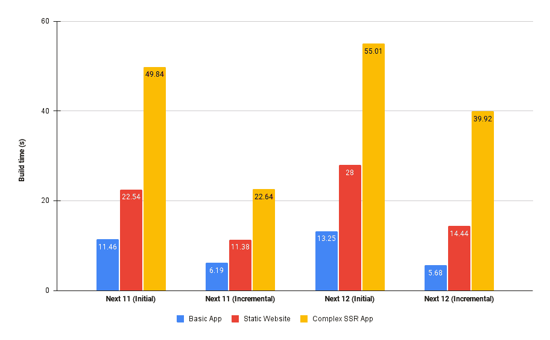

# js 12 性能测试:构建似乎更慢，而不是更快

> 原文：<https://javascript.plainenglish.io/next-js-12-performance-test-builds-appear-to-be-slower-not-faster-9d3406362169?source=collection_archive---------6----------------------->


Photo by [Dynamic Wang](https://unsplash.com/@dynamicwang?utm_source=medium&utm_medium=referral) on [Unsplash](https://unsplash.com?utm_source=medium&utm_medium=referral)

本周，Vercel [在](https://nextjs.org/blog/next-12) [Next.js conf](https://nextjs.org/conf) 上宣布了 Next.js 12 的发布，让所有人感到惊讶，鉴于今年 6 月发布版本 11 以来的时间跨度相对较短。

作为一个框架，Next.js 旨在为构建适合大多数(如果不是全部)用例的 Jamstack 应用程序提供一个完整的解决方案。这有点像编写一个 React 应用程序，而不必在 SEO 上妥协，下载几 MB 的 JavaScript 来加载任何页面等。请注意，这确实有它自己的警告。

作为公告的一部分，Vercel 推出了一系列令人兴奋的新功能。这些新特性包括一个用 Rust 编写的原生编译器(篡夺巴别塔！)、中间件支持、URL 导入(像 [Deno](https://deno.land/) ！)，React 18 和服务器组件 API 支持等等。

我不想像很多人已经做的那样，去经历所有这些令人惊叹的新事物，而是想深入了解这次更新中影响最广泛的差异制造者:Rust 编译器。使用 Next.js 构建的每个应用程序都会利用这一点，因此了解这将产生什么样的现实影响非常重要。

# 感觉有点生疏

据报道，新的 Rust 编译器建立在“speedy web 编译器”的基础上，这是一种基于 Rust 的 JavaScript/TypeScript 编译器，旨在提供本机级别的性能，将集成到 web 工具链中。最大的影响是取代 Babel，这是最久经考验的 transpilers 之一，用于大多数现代 web 应用程序，当然是任何利用现代 JS 功能的应用程序，以便提供与尽可能多的浏览器的兼容性。随着更多本地代码驱动的工具链的建立，看看 Babel 项目将走向何方将会很有趣。

以下是性能对比，来源于发布公告，在此处找到:


That’s *a lot faster*. But how much faster in practice?

现在，这是一个发布公告，而不是一篇技术论文，所以我不打算批评那个数据演示。它看起来的确令人印象深刻，但缺乏内容和深度。这当然不是进行这种转换的真实世界里程的指标。我可以理解整个行业的工程经理对从像 Babel 这样成熟的东西转移到新的构建堆栈的疑虑，特别是如果他们没有更好地表明现实世界投资回报的深入数据(现在升级的风险回报更多)。

# 测试策略

我想为真实世界的用例提供一个合适的构建性能比较，以及一个“控制”，所以我选择了 3 个测试用例，在 Next.js 11.1 和 Next.js 12 之间进行测试:

*   一个全新的`create-next-app`应用，有一个非常简单的主页(我们的控制)。
*   一个静态网站使用 SSG 和 ISR，以图像，博客帖子等为特色。(其实我的网站，[tpjnorton.com](https://tpjnorton.com))。
*   使用 SSR、Next API routes 等的复杂 web 应用程序。

选择这三个例子是为了提供一些常见用例的有意义的数字。

## 方法学

很容易有意义地度量构建时间的改进，因为它们被很好地报道(刚刚脱离构建)并且容易重现。然而，获取用于快速更新的数据很难做到精确，以一种真正客观地传达改进的方式获得结果更难。因此，出于良好科学的目的，我将实际上只收集和报告构建数据。我还会澄清，所有这些应用程序都使用 TypeScript。我在构建期间禁用了`eslint`,以便更加关注实际的构建性能，并测量初始(没有`.next`目录)和增量构建时间。哦，我用的是 Windows 10。

我们走吧！

## 案例 1:入门应用

首先，我们使用以下命令创建一个全新的 next 应用程序:

```
yarn create next-app --typescript
```

这让我们建立了一个非常基本的项目，使用 Next 12。然后，我们可以通过做同样的事情并改变依赖关系来获得下一个 11 版本，以获得与 Next.js 11 相同的启动程序。

## 案例 2:静态网站

首先使用现有的 Next.js 11.1 应用程序执行测试，然后将站点升级到 Next.js 12，并重新运行相同的初始和增量构建测试。

## 案例 3:复杂的 SSR 应用程序

对此，我采用了与静态网站相同的方法。首先使用 Next.js 11 测量初始和增量构建时间，然后在 Next.js 12 上再次测量。

# 结果

哦，孩子，你不会喜欢这个的。

这是一张显示我的结果的图表。栏目按照构建类型分组，每种颜色对应不同的用例(Google Sheet [这里是](https://docs.google.com/spreadsheets/d/1WcFkOcuOMAEzSnaVSjkIu4ypZaHu-JDYaRIuAioLfws/edit?usp=sharing)):



uh-oh…

除了 starter 应用程序之外，所有 Next.js 12 的版本都比 Next 11 慢**。我非常惊讶。对于初学者应用程序，我可以理解有一个较慢的构建过程，因为有很多非代码编译工作要做来完成`next build`。然而，随着我们将静态应用程序全面转移到 SSR 应用程序，这也是转移到代码量越来越大的应用程序(静态应用程序是中小型的，而 SSR 应用程序是大型的)，相对而言，这种开销应该会减少，并且我们应该会看到`swc`的一些健康的性能提升。**

**至少，这是我所期望的。**

**我认为很难做出任何真正的猜测，为什么这可能是，充其量，这就是他们会为我，现在，猜测。我的直觉告诉我,`swc` 要快得多，但是新的工具链是如何被调用/使用的，这让我在实践中感觉迟钝。也许它还没有在视窗系统上测试过——很难确定。**

## **糟糕的科学**

**澄清我的实验不是很严格是很重要的。我主要想得到一个大概的数字，知道构建会有多快，因为我对这个新版本的消息非常兴奋。像往常一样，软件项目(尤其是 Next.js)不断发展，虽然重大变化会带来一些问题，但它们通常会很快得到解决。我还想澄清一下，我对这个也有个人偏见——我是 Next.js 的超级粉丝，并且已经在新的和移植的现有项目中使用过它，这种向本地工具链的转移虽然对我来说还没有结果，但却是网络世界中一个勇敢而强大的创新。所以我很想尽我所能让他们放松一下😄。**

# **包扎**

**我认为很容易跳到像这样的新东西上，写一篇不完整的点击率文章来评论某样东西有多垃圾，因为“它对你不好”。这不是我想在这里做的。虽然我承认这些结果似乎有争议，但我觉得分享它们很重要，因为它给开发人员和经理们上了一堂有意义的课，教他们如何采用闪亮而令人兴奋的新技术——通常最好先等一会儿。**

**谢谢你的阅读！**

**💙**

***多内容于* [***中***](http://plainenglish.io/)**