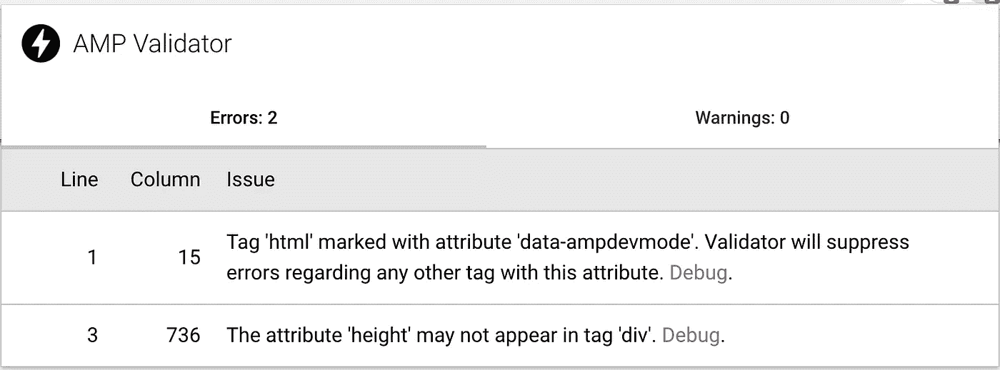
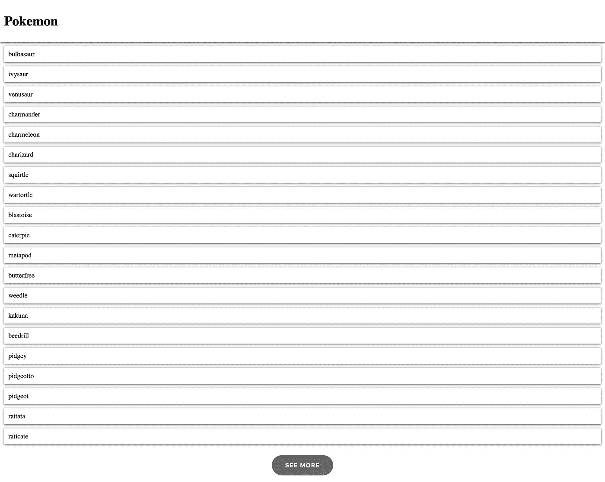

# 使用 Next.js 创建 AMP 页面

> 原文：<https://javascript.plainenglish.io/next-js-amp-list-65b27cef0db6?source=collection_archive---------5----------------------->

现在 web 开发者必须更快的建立 web 负载，提高用户体验和搜索引擎排名，少做跳出率，多做流量。AMP 页面几乎可以立即加载，所以让我们用下一个 Js 试试 AMP 页面。


Photo by [Roman Synkevych](https://unsplash.com/@synkevych?utm_source=medium&utm_medium=referral) on [Unsplash](https://unsplash.com?utm_source=medium&utm_medium=referral)

我使用的是来自[上一篇文章](https://medium.com/javascript-in-plain-english/styled-components-in-next-js-9a4e84278bdb)的现有项目。我们将会使口袋妖怪列表变得更加有趣。你可以在这里克隆[并使用分支风格的组件。](https://github.com/jetlysandita/medium_pokemon)

# 1.启用放大器

要启用 AMP 支持，您必须将此代码添加到页面文件中。例如 **index.js.**

```
export const config = { amp: true }
```

[更多相关信息](https://nextjs.org/docs/api-reference/next/amp)

使用[放大器验证器](https://chrome.google.com/webstore/detail/amp-validator/nmoffdblmcmgeicmolmhobpoocbbmknc?hl=en)检查您的放大器页面工作。



Image By [Jetly Sandita](https://jetlysandita.medium.com/)

或者你可以检查控制台。

```
Powered by AMP ⚡ HTML – Version 2011252111003 [http://localhost:3000/](http://localhost:3000/)
```

如果您看到来自 AMP 验证器的错误，您必须修复它，但这一点。

```
Tag 'html' marked with attribute 'data-ampdevmode'. Validator will suppress errors regarding any other tag with this attribute.
```

您可以忽略它，因为它是在构建后修复的。在我们的情况下，我们必须解决这个问题。

```
The attribute 'height' may not appear in tag 'div'.
```

使用道具时要小心，将**高度**改为**自定义高度。**

# 2.将列表更改为 AMP 列表

在此参见[文档](https://amp.dev/documentation/components/amp-list/?format=websites)。更改文件 **index.js.**

```
import MainLayout from "../layouts/MainLayout";export const config = { amp: true };export default function Home(props) {const { data } = props;return (<MainLayout><amp-state id="localState"><scripttype="application/json"dangerouslySetInnerHTML={{__html: `{"items": ${JSON.stringify(data.results)}}`,}}/></amp-state><amp-listwidth="auto"height="100"layout="fixed-height"src="amp-state:localState"><template type="amp-mustache"><div><a href="{{url}}">{`{{ name }}`}</a></div></template></amp-list></MainLayout>);}export async function getServerSideProps() {// Fetch data from external APIconst res = await fetch(`${process.env.baseUrlApi}pokemon?limit=10`);const data = await res.json();// Pass data to the page via propsreturn { props: { data } };}
```

如果你的 API 有这样的格式，那就更简单了。

```
{
  "items": [...],
  "next": "url"
}
```

# 3.加载更多

如果你的 API 有正确的格式，你只能这样做。

```
<amp-list
  load-more="manual"
  src="url"
  width="400"
  height="800"
  load-more-bookmark="next">  
  ...
</amp-list>
```

如果没有，在文件夹 API 里面创建一个文件 **pokemon.js** 。安装查询字符串

```
yarn add query-string
```

这样写代码 **pokemon.js** 。

```
// Next.js API route support: https://nextjs.org/docs/api-routes/introductionimport queryString from "query-string";async function handle(req, res) {const { query } = req;const urlParam = queryString.stringify(query);try {const resultApi = await fetch(`${process.env.baseUrlApi}pokemon?${urlParam || `limit=5`}`,);const data = await resultApi.json();const oldNext = new URL(data.next);res.statusCode = 200;res.json({items: data.results,next: `/api/pokemon${oldNext.search}`,});} catch (error) {res.statusCode = 500;res.json({ error });}}export default handle;
```

把 **index.js** 也改一下。

```
import MainLayout from "../layouts/MainLayout";export const config = { amp: true };export default function Home() {return (<MainLayout><amp-listload-more="manual"width="auto"height="100"src="/api/pokemon"load-more-bookmark="next"><template type="amp-mustache"><div><a href="{{url}}">{`{{ name }}`}</a></div></template></amp-list></MainLayout>);}
```

我们不需要它。点击按钮**查看更多**我们可以得到另一个口袋妖怪。



Image By [Jetly Sandita](https://jetlysandita.medium.com/)

我修改了样式，所以你可以在这里克隆它。

注意:

如果在 yarn 构建时，在文件**node _ modules/@ amp project/toolbox-optimizer/lib/htmldomhelper . js**中出现错误**无法读取 skipNodeAndChildren** 处 null
的属性‘next sibling’。我不知道这是不是一个错误，但现在，要解决这个问题，你可以在下一个放大器列表中添加放大器布局。

```
import PokemonCard from "../components/PokemonCard";import MainLayout from "../layouts/MainLayout";export const config = { amp: true };export default function Home() {return (<MainLayout><amp-listload-more="manual"width="auto"height="80"src="/api/pokemon"load-more-bookmark="next"><template type="amp-mustache"><PokemonCard url="{{url}}" name="{{name}}" /></template></amp-list><amp-layout layout="responsive" width="0" height="0"></amp-layout></MainLayout>);}
```

接下来，我将分享另一个 AMP 组件，主题，扩展库组件的样式组件，等等。

如果你知道任何其他方法，建议或问题，请在下面评论。谢谢:)