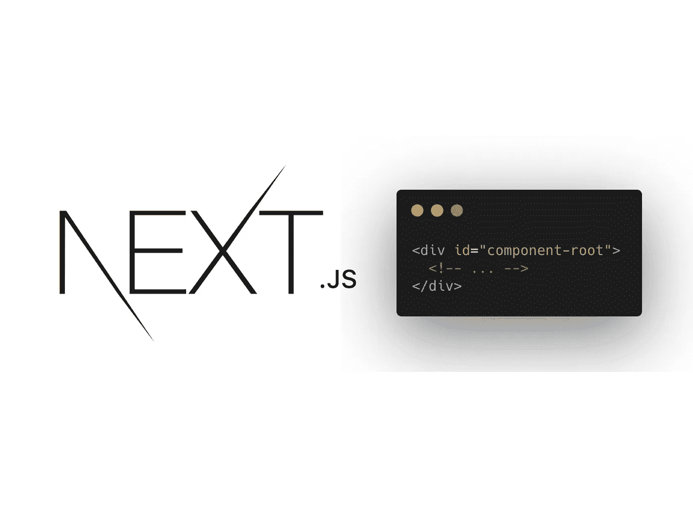
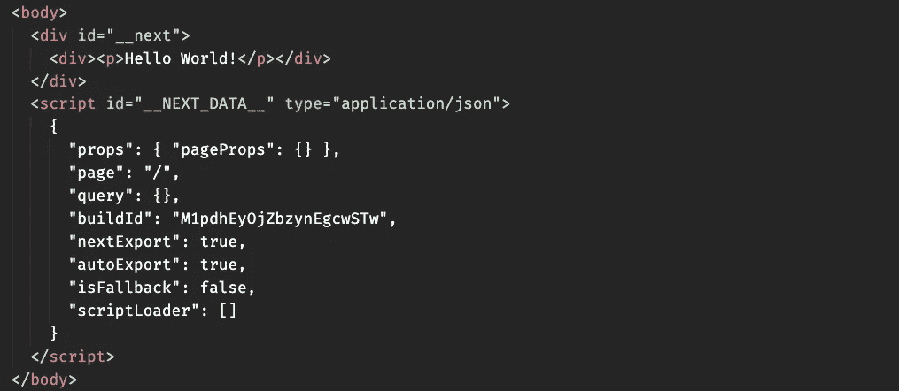
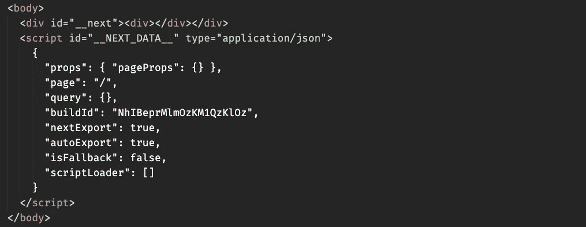

# 如何在 Next.js 中客户端呈现组件

> 原文：<https://javascript.plainenglish.io/next-js-client-side-rendering-56a3cae65148?source=collection_archive---------1----------------------->

## 以及为什么这真的有用



Source: the author

整个 SSR 与 CSR 的讨论感觉就像一个结了的案子。

SSR 赢了，是大多数人的想法。总的来说，我同意这一点。尽管如此，我们仍在清理我们制造的混乱。尽管如此，并不是所有的东西都可以在服务器上呈现。

如果你在阅读这个标题的时候问自己“我为什么想要这个”,那就这样吧。不与 SSR 一起工作的组件是，为什么你会想要这个。

我在 React.js 中遇到了样式和图形库的问题。它们在 Next.js 中不起作用——嗯，只要我们不在 Next 中客户端呈现它们，它们就不起作用。下面是如何做到这一点。

实际上，诀窍很简单:当我们在服务器上呈现某些东西时，`window`对象对我们的代码是不可用的。为什么？嗯，因为`window`对象当然是浏览器专有的。

因为我们可以在 Next.js 中访问这个特殊的对象，所以我们检查我们是否在服务器上。因此，如果服务器端呈现正在发生，我们可以保存在这样的变量中:

```
const SSR = typeof window === 'undefined'
```

如果我们的 JSX 的服务器端渲染正在发生，SSR 为*真*。要仅在客户端呈现某些内容，请使用此变量:

如果我们只是正常地渲染段落，这将是我们的服务器端渲染应用程序发送给我们的 HTML 结构:



当使用上面的代码时，为了只在客户机上呈现该段落，我们收到如下响应:



当然是“你好，世界！”仍然出现在 DOM 中——但这需要一些时间，因为它是通过客户端 JavaScript 呈现的。

这就是我们在 Next.js 中实现客户端渲染的简单方法。

**感谢您的阅读！**
更多关于 Next.js:

[](/next-js-tricks-6dd97ee66c7c) [## 添加到工具箱中的 5 个有用的 Next.js 技巧

### 构建脚本、加载外部 JavaScript、重定向等等。

javascript.plainenglish.io](/next-js-tricks-6dd97ee66c7c) 

*更多内容请看*[***plain English . io***](http://plainenglish.io)