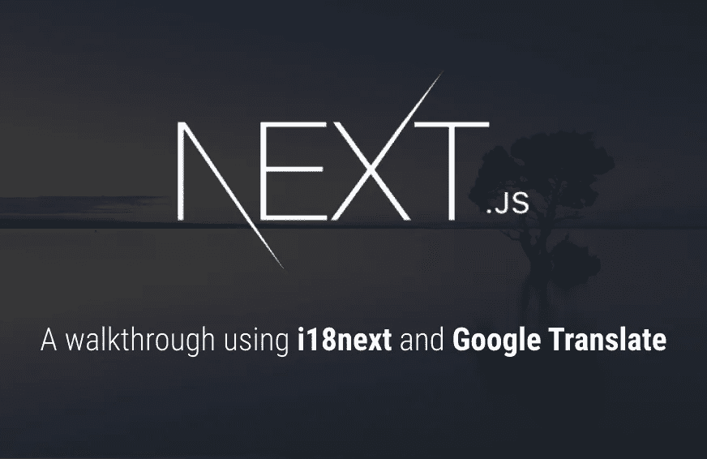
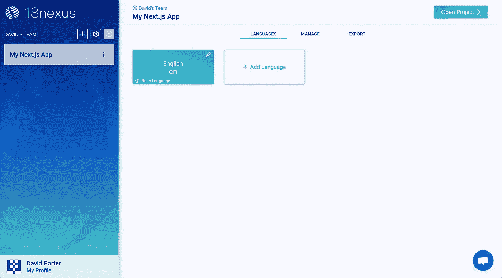
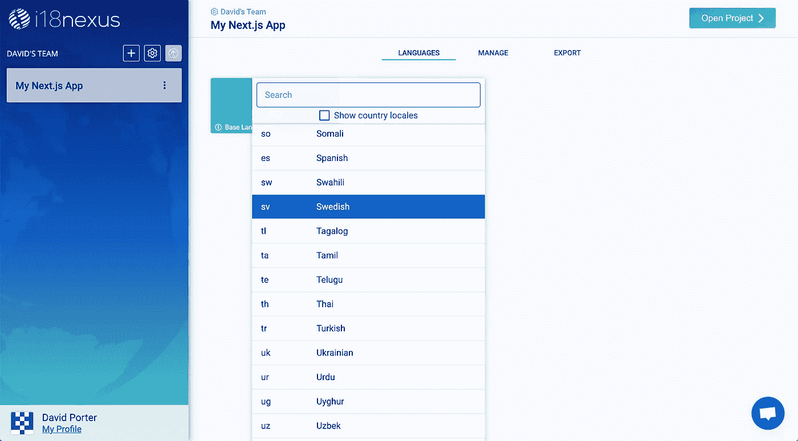
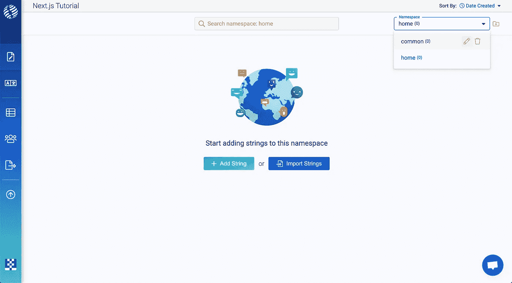
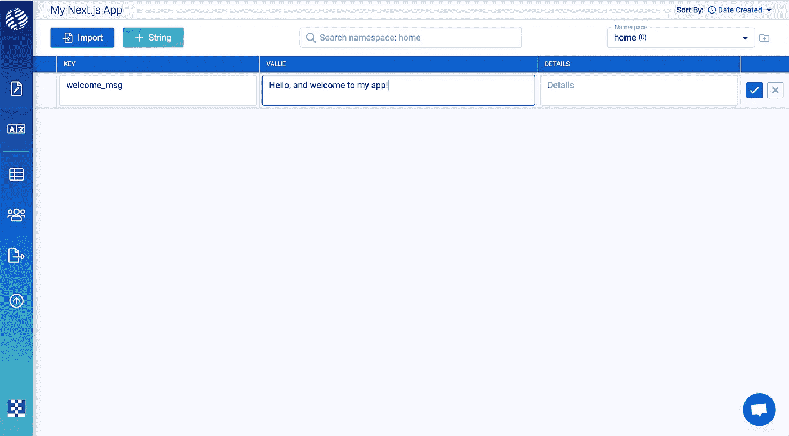
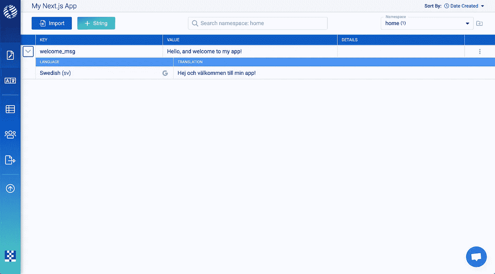
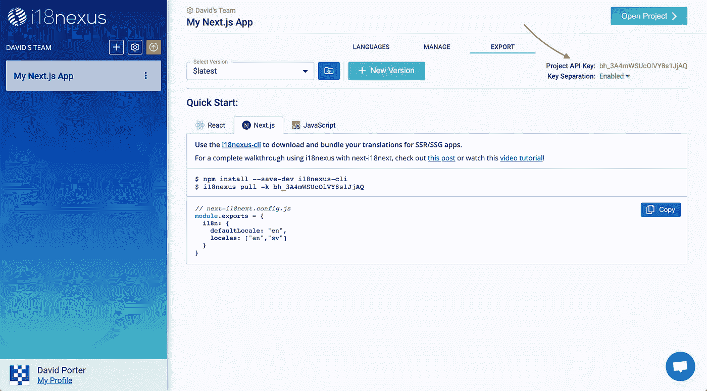
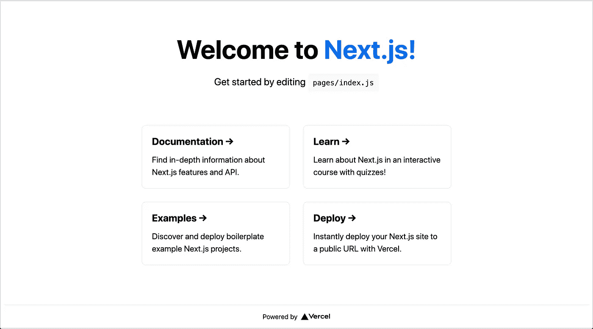

# Next.js —如何设置 i18next 和翻译管理

> 原文：<https://javascript.plainenglish.io/next-js-how-to-set-up-i18next-and-translation-management-26af2fd6829c?source=collection_archive---------5----------------------->



Next.js: A walkthrough using i18next and Google Translate

在本教程中，我们将学习如何使用 [next-i18next](https://github.com/isaachinman/next-i18next) 来国际化 Next.js 应用程序。为了让事情变得更简单，我们将使用 [i18nexus](https://i18nexus.com) 来自动翻译和管理我们的字符串。

**走吧！⚡️**

# 入门指南

让我们使用 [create-next-app](https://nextjs.org/docs/api-reference/create-next-app) 引导一个简单的 Next.js 应用程序:

`npx create-next-app`

在为我们的应用程序键入标题后，我们将`cd`进入应用程序目录并安装 [next-i18next](https://github.com/isaachinman/next-i18next) :

`npm install next-i18next --save`

是时候国际化了！🌐

# 配置

随着 Next.js v10 的发布，我们获得了一个处理国际化路由和区域检测的出色的内置解决方案。`next-i18next`旨在与这种新的国际化支持协同工作。

要使用`next-i18next`，我们需要在名为`next-i18next.config.js`的应用程序的根目录下创建一个 i18next 配置文件。这将定义我们希望我们的应用程序使用的语言。让我们支持英语和瑞典语。

我们需要初始化我们的`defaultLocale`(我们应用程序的默认语言)和`locales`(我们希望我们的应用程序支持的语言列表):

**next-i18next.config.js**

```
module.exports = {
  i18n: {
    defaultLocale: 'en',
    locales: ['en', 'sv']
  },
  reloadOnPrerender: process.env.NODE_ENV === 'development'
}
```

还建议在开发中启用`reloadOnPrerender`选项。启用此选项后，当我们更改翻译文件时，`next-i18next`将重新加载我们的翻译。

接下来，我们需要将`i18n`属性添加到`next.config.js`中，只需从 i18next 配置中导入`i18n`对象:

**next.config.js**

```
const { i18n } = require('./next-i18next.config');

module.exports = {
  i18n,
  reactStrictMode: true
}
```

`next-i18next`库使用 Next 需要的相同的`i18n`配置结构。因此，不需要在两个地方管理相同的设置，我们只需按照 [next-i18next 文档](https://github.com/isaachinman/next-i18next)中的建议，将`next-i18next`配置导入到`next.config.js`中。

**应用翻译**

设置`next-i18next`的最后一步是用`appWithTranslation` HOC(高阶组件)包装我们的应用。这个组件将为我们所有的页面提供 i18next 上下文。我们的`_app.js`文件应该是这样的:

**_app.js**

```
import '../styles/globals.css';
import { appWithTranslation } from 'next-i18next';

const MyApp = ({ Component, pageProps }) => <Component {...pageProps} />

export default appWithTranslation(MyApp);
```

现在我们准备好出发了！🚀

# i18nexus 集成

如果你以前使用过 i18next，但从未在 i18nexus 上使用过，那你就有得吃了。

i18nexus 通过将我们的应用程序文本存储在云中，使管理我们的翻译变得简单了一百万倍。它甚至可以将我们的字符串翻译成我们需要的多种语言。每当我们准备聘请专业翻译时，我们只需邀请他们参加我们的 i18nexus 项目，让他们编辑翻译！

让我们开始吧！

如果你还没有 i18nexus 账户，去[i18nexus.com](https://app.i18nexus.com/sign-up)注册一个免费账户。命名我们的项目后，我们将被定向到我们的语言仪表板:



i18nexus project dashboard

第一个语言块是我们的基本语言，它应该与我们在`next-i18next.config.js`中为`defaultLocale`属性设置的语言相匹配。

接下来，我们将点击**添加语言**来选择我们希望应用程序支持的语言环境。由于我们已经在`next-i18next.config.js`的`locales`列表中添加了`sv`(瑞典语)，我们将选择瑞典语:



Adding Swedish as a supported language

现在，让我们点击右上角的**打开项目**进入字符串管理页面，我们将在这里添加字符串。

**名称空间**

在页面的顶部，有一个标记为**名称空间**的下拉列表，其中包含一个已经为我们创建的名称空间，名为“default”。

按照惯例，应用程序中的每个页面都有一个名称空间，出现在多个页面上的公共字符串也有一个名为“公共”的名称空间。

让我们将“default”名称空间重命名为“ **common** ”，然后创建一个名为“ **home** ”的名称空间，用于我们的主页:



Managing namespaces

**重要提示:**尽管我们不会在本演练中使用“common”命名空间，但这是必需的。我们稍后将讨论原因。🙂

要添加我们的第一个字符串，请点击**添加字符串**。我将在我的“home”名称空间中添加一个字符串，表示“您好，欢迎使用我的应用程序！”：



Adding a new string with key “welcome_msg”

**键**是我们在代码中引用这个字符串的方式。

**值**是将在我们的应用程序中呈现的文本。

**详细信息**字段是可选的。这是为了在我们准备聘请专业翻译时，提供有关字符串上下文的任何额外信息。我们甚至可以在这里添加一张图片来提供更多的背景信息。

添加字符串后，我们可以展开行来查看我们的自动 Google 翻译:



New strings are automatically translated to all of our supported languages

# 连接我们的翻译

我们将使用 [i18nexus CLI](https://www.npmjs.com/package/i18nexus-cli) 在 Next.js 应用程序中导入 i18nexus 翻译:

`npm install i18nexus-cli -g`

如果我们转到 i18nexus 中的**导出**选项卡，我们将能够找到我们的项目 API 密钥:



i18nexus Export tab

在我们的应用程序目录中，我们所要做的就是用我们的 API 键运行`i18nexus pull`,所有我们最新的翻译将被下载到我们的项目目录中！

`$ i18nexus pull --api-key <YOUR_API_KEY>`

现在我们所有的翻译都将在`public/locales`进行，这也是`next-i18next`所期待的。

我们还可以添加我们的 API 键作为一个名为`I18NEXUS_API_KEY`的环境变量，这样我们就可以只使用`i18nexus pull`而不用每次都输入 API 键。

为此，我们只需在包含`I18NEXUS_API_KEY=YOUR_API_KEY.`的应用程序的根目录下创建一个名为`.env`的环境变量文件

**奖励积分:**

如果我们想在每次启动开发服务器或构建应用程序时自动获取最新的翻译，我们只需更新`package.json`中的脚本:

**package.json**

```
...
"scripts": {
   "dev": "i18nexus pull && next dev",
   "build": "i18nexus pull && next build",
   "start": "i18nexus pull && next start"
 }
...
```

如果你这样做，你也应该安装`i18nexus-cli`作为一个开发依赖:

`npm install i18nexus-cli --save-dev`

# 呈现我们的翻译

现在我们的应用程序只是使用样板`create-next-app`主页:



Boilerplate create-next-app

**服务器侧转**

在我们的主页中，我们需要从`next-i18next`导入一个名为`serverSideTranslations`的函数。该功能需要在每个**页面级**组件的`getStaticProps`中运行。它为我们的页面提供翻译和配置选项作为道具。我们将把它添加到我们的`pages/index.js`:

**pages/index.js**

```
import { serverSideTranslations } from 'next-i18next/serverSideTranslations';export async function getStaticProps({ locale }) {
  return {
    props: {
      ...(await serverSideTranslations(locale, ['home'])),
    }
  } 
}...
```

`severSideTranslations`函数接受一个地区作为第一个参数，接受这个页面所需的名称空间作为第二个参数。这确保了我们的应用程序只需要加载页面所需的名称空间。下一步从`getStaticProps`传递`locale`。

**使用翻译**

最后，让我们从`next-i18next`导入`useTranslation`钩子。`useTranslation`钩子包含一个名为`t`的函数，它将一个键作为参数，并呈现正确的翻译。

我将清除掉由`create-next-app`生成的大部分样板文件，只在我的主页上呈现一行文本。这是我的整个主页，使用`useTranslation`来呈现我的`welcome_msg`字符串:

**pages/index.js**

```
import Head from "next/head";
import styles from "../styles/Home.module.css";
import { serverSideTranslations } from "next-i18next/serverSideTranslations";
import { useTranslation } from "next-i18next";export async function getStaticProps({ locale }) {
  return {
    props: {
      ...(await serverSideTranslations(locale, ["home"]))
    }
  };
}export default function Home() {
  const { t } = useTranslation(); return (
    <div className={styles.container}>
      <Head>
        <title>Create Next App</title>
        <link rel="icon" href="/favicon.ico" />
      </Head> <main className={styles.main}>
        <h1 className={styles.title}>{t("home:welcome_msg")}</h1>
      </main>
    </div>
  );
}
```

注意，当我们使用`useTranslation`时，我们需要用关键字指定名称空间，比如:`home:welcome_msg`。

我们唯一不需要在`useTranslation`中指定名称空间的时候是当我们引用的键在我们的**默认名称空间**中的时候。默认情况下，i18next 将我们的默认名称空间设置为“common”。如果您愿意，您可以通过`next-i18next.config.js`中的`defaultNS`配置选项更改您的默认名称空间。

现在让我们运行`npm run dev`，检查一下！

[**http://localhost:3000/**](http://localhost:3000/de)


Rendering English translation

我们做到了！🎉

# 使用其他语言

现在，我们的应用程序正在使用`en`，因为这是我们在`next.config.js`中设置的`defaultLocale`。

如果您还记得，我们将瑞典语(`sv`)添加到了我们的区域列表中。要查看我们的瑞典语应用，我们只需在 URL 末尾添加`/sv`。如果用户的浏览器语言设置为瑞典语，Next 会自动将他们重定向到`/sv`路线。让我们看看我们的应用程序在瑞典语中是什么样子的:

[**http://localhost:3000/SV**](http://localhost:3000/sv)


Rendering Swedish translation

看来我们是国际化专家了！😎

要了解更多关于国际化路由和转换到不同语言的信息，请快速阅读 Next.js 文档[这里的](https://nextjs.org/docs/advanced-features/i18n-routing)。

# 那都是乡亲们！

现在，您已经有了一个完整的 Next.js 应用程序，它具有国际化路由、i18next 集成和使用 i18nexus 的自动化翻译管理！

*更多内容请看*[***plain English . io***](http://plainenglish.io/)