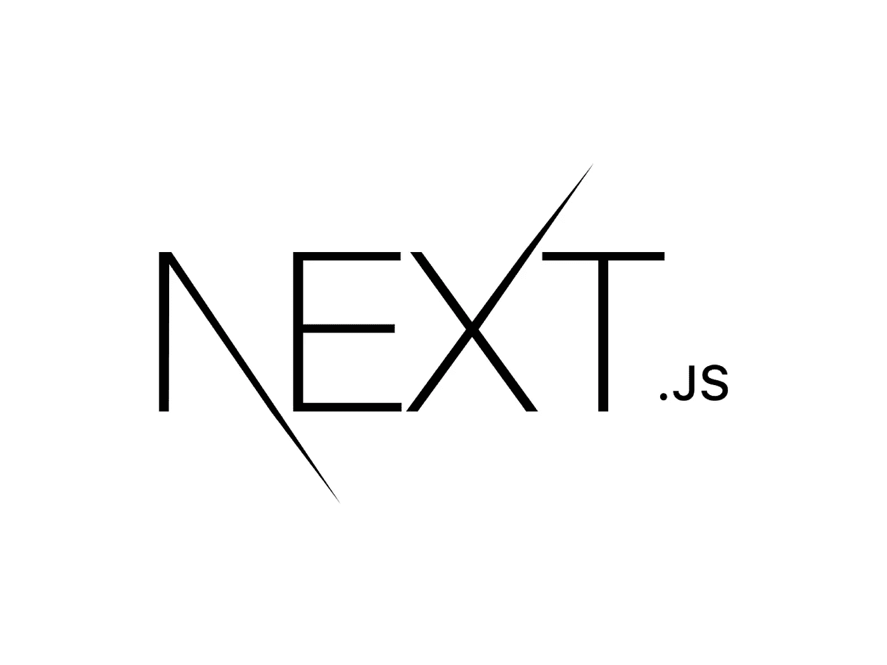

# 如何在 Next.js 中跨页面保持组件状态

> 原文：<https://javascript.plainenglish.io/next-js-keep-state-7eb68984c54e?source=collection_archive---------0----------------------->

## 使用会话存储& useLayoutEffect

Next 使得将我们的应用分成服务器端呈现的页面变得容易。在不同的页面上使用相同的组件也不是问题，但是保持状态是问题。默认情况下，当打开不同的页面时，组件的状态被重置。我们来看一个小例子。

给定这个小按钮组件:

我们将它包含在两个不同的页面中，可通过`next/link`相互访问:

`about.js`基本上是同一个文件，所以我将留给您一个片段。

当把所有的东西放在一起时，我们注意到以下几点:递增按钮工作正常。但是当切换到另一个页面时，状态丢失。在一些应用程序中，这不是我们想要的——相反，我们想要的是以某种方式保持状态。下面是如何轻松做到的。

# 会话存储简介

Web 存储 API 应该在每个开发人员的工具箱中。它包含两个存储数据的特性:第一，更流行的 localStorage，它在浏览器中永久保存一个键值对。第二个是 sessionStorage，它在会话期间保存一个键值对。
会话？让我澄清这一点。

当你打开`youtube.com`，你的会话开始。当您点击按钮并导航至`youtube.com/feed/subscriptions`时，您的会话仍在进行。当您关闭窗口时，会话就完成了。

在会话期间保持状态是一个常见的用例，例如，当您有一个搜索栏，并且希望在用户被导航到的结果站点上保持它的输入时。

**提示:**有针对持久状态优化的库。我只想向您展示持久化状态通常是如何工作的——使用会话存储。在大多数情况下，使用库是更好的选择。

# 代码

当想要跨页面保持状态时，我们需要做两件事:

*   保存当前状态
*   从存储器接收当前状态以将其写入反应状态

两者都是 React 钩子的很好的用例，更准确地说，是`useEffect`钩子。每当当前状态改变时，将当前状态保存到 sessionStorage 是`useEffect`监听单个状态的一个例子。每当我们的计数器状态改变时，我们将这些改变提交给会话存储:

获取会话存储并利用它来调整组件状态是`useEffect`配置的一个例子，它的工作方式类似于`componentDidMount`——一旦组件被挂载。

然而，这将导致每次我们切换页面时出现小的闪烁。为什么？因为`useEffect`中的代码是在我们的组件在屏幕上可见之后执行的。

为了避免这种情况，当 DOM 发生变异时，我们可以使用`useLayoutEffect`作为`useEffect`的替代。除了名字，语法几乎和`useEffect`一样:

如果会话存储键值对已经存在，我们将它的数据复制到状态中。如果会话存储中还不存在这个条目，我们就创建它。

由于不是全黑白的，所以`useLayoutEffect`有一个缺点:相比经典的 useEffect，它的另类延迟了浏览器绘画。然而，在我们的例子中，这不是一个大问题。

将所有这些放在一起:

当我们现在增加按钮并切换页面时，状态将被保留——因为使用了`useLayoutEffect`,这是一个平滑的过渡，在水合状态时没有闪烁。

感谢您的阅读！

关于 Next.js 的更多信息:

 [## 想让你的 Next.js App 更快？启用预先支持(方法如下)

### 如何在你的 Next.js 应用上启用 Preact 支持，并几乎免费节省几千字节。

javascript.plainenglish.io](/next-js-preact-f993c95a3f93)  [## 添加到工具箱中的 5 个有用的 Next.js 技巧

### 构建脚本、加载外部 JavaScript、重定向等等。

javascript.plainenglish.io](/next-js-tricks-6dd97ee66c7c) 

## 进一步阅读

 [## Next.js 13:新的前沿特性实际上是做什么的？

### 你听说过 Next.js 13 是一个游戏改变者，但是为什么？让我们看看有哪些新功能，有哪些变化，以及它们…

blog.bitsrc.io](https://blog.bitsrc.io/next-js-13-what-do-the-new-bleeding-edge-features-actually-do-d3e5fd418563) 

*更多内容看* [***说白了就是 io***](https://plainenglish.io/) *。报名参加我们的* [***免费周报***](http://newsletter.plainenglish.io/) *。关注我们关于*[***Twitter***](https://twitter.com/inPlainEngHQ)，[***LinkedIn***](https://www.linkedin.com/company/inplainenglish/)*，*[***YouTube***](https://www.youtube.com/channel/UCtipWUghju290NWcn8jhyAw)*，* [***不和***](https://discord.gg/GtDtUAvyhW) *。对增长黑客感兴趣？检查* [***电路***](https://circuit.ooo/) *。*